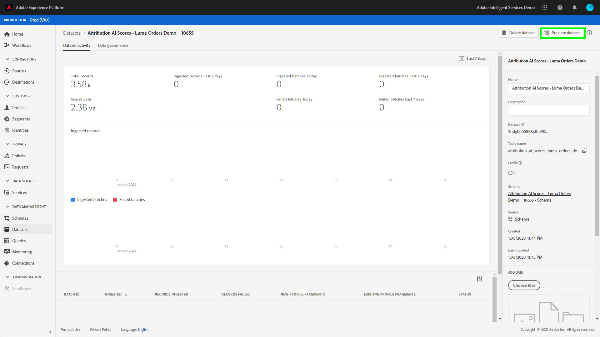

# Analyserar attribueringspoäng med hjälp av frågetjänsten

Varje rad i data representerar en konvertering där information för relaterade kontaktytor lagras som en array med strukturer under `touchpointsDetail` kolumn.

| Kontaktpunktsinformation | Kolumn |
| ---------------------- | ------ |
| Namn på kontaktpunkt | `touchpointsDetail. touchpointName` |
| Pekpunktskanal | `touchpointsDetail.touchPoint.mediaChannel` |
| Algoritmisk poängsättning för Attribution AI vid beröringspunkt | <li>`touchpointsDetail.scores.algorithmicSourced`</li> <li> `touchpointsDetail.scores.algorithmicInfluenced` </li> |

## Söka efter datasökvägar

I användargränssnittet för Adobe Experience Platform väljer du **[!UICONTROL Datasets]** i den vänstra navigeringen. The **[!UICONTROL Datasets]** visas. Välj sedan **[!UICONTROL Browse]** och hitta utdata för dina Attribution AI.


Välj din utdatamängd. Sidan för datauppsättningsaktivitet visas.



På sidan för datauppsättningsaktivitet väljer du **[!UICONTROL Preview dataset]** i det övre högra hörnet om du vill förhandsgranska dina data och se till att de har importerats som förväntat.


När du har förhandsgranskat dina data väljer du schemat i den högra listen. En pover visas med schemanamnet och beskrivningen. Markera hyperlänken för schemanamnet för att omdirigera till bedömningsschemat.


Med hjälp av poängschemat kan du välja eller söka efter ett värde. När du har valt **[!UICONTROL Field properties]** sida vid sida-rail öppnas så att du kan kopiera sökvägen för användning när du skapar frågor.


## Access Query Service

Om du vill få åtkomst till frågetjänsten inifrån plattformsgränssnittet börjar du med att välja **[!UICONTROL Queries]** i den vänstra navigeringen väljer du **[!UICONTROL Browse]** -fliken. En lista över tidigare sparade frågor läses in.


Nästa, välj **[!UICONTROL Create query]** i det övre högra hörnet. Frågeredigeraren läses in. Med frågeredigeraren kan du börja skapa frågor med dina poängdata.


Mer information om Frågeredigeraren finns på [Användarhandbok för Frågeredigeraren](../../query-service/ui/user-guide.md).

## Frågemallar för attribueringspoänganalys

Frågorna nedan kan användas som mall för olika poänganalysscenarier. Du måste ersätta `_tenantId` och `your_score_output_dataset` med rätt värden i ditt resultatschema.

>[!NOTE]
>
> Beroende på hur dina data har importerats, används värdena nedan, till exempel `timestamp` kan ha ett annat format.

### Exempel på validering

**Totalt antal konverteringar per konverteringshändelse (i ett konverteringsfönster)**

```sql
    SELECT conversionName,
           SUM(scores.firstTouch) as total_conversions,
           SUM(scores.algorithmicSourced) as total_attributed_conversions
    FROM
        (SELECT
                _tenantId.your_score_output_dataset.conversionName
                    as conversionName,
                inline(_tenantId.your_score_output_dataset.touchpointsDetail),
                timestamp as conversion_timestamp
         FROM
                your_score_output_dataset
        )
    WHERE
        conversion_timestamp >= '2020-07-16'
      AND
        conversion_timestamp <  '2020-10-14'
    GROUP BY
        conversionName
```

**Totalt antal konverteringshändelser (i ett konverteringsfönster)**

```sql
    SELECT
        _tenantId.your_score_output_dataset.conversionName as conversionName,
        COUNT(1) as convOnly_cnt
    FROM
        your_score_output_dataset
    WHERE
        _tenantId.your_score_output_dataset.touchpointsDetail.touchpointName[0] IS NULL AND
        timestamp >= '2020-07-16' AND
        timestamp <  '2020-10-14'
    GROUP BY
        conversionName
```

### Exempel på trendanalys

**Antal konverteringar per dag**

```sql
    SELECT conversionName,
           DATE(conversion_timestamp) as conversion_date,
           SUM(scores.firstTouch) as convertion_cnt
    FROM
        (SELECT
                _tenantId.your_score_output_dataset.conversionName as conversionName,
                inline(_tenantId.your_score_output_dataset.touchpointsDetail),
                timestamp as conversion_timestamp
         FROM
                your_score_output_dataset
        )
    GROUP BY
        conversionName, DATE(conversion_timestamp)
    ORDER BY
        conversionName, DATE(conversion_timestamp)
    LIMIT 20
```

### Exempel på distributionsanalys

**Mängd kontaktytor på konverteringsbanor efter definierad typ (i ett konverteringsfönster)**

```sql
    SELECT conversionName,
           touchpointName,
           COUNT(1) as tp_count
    FROM
        (SELECT
                _tenantId.your_score_output_dataset.conversionName as conversionName,
                inline(_tenantId.your_score_output_dataset.touchpointsDetail),
                timestamp as conversion_timestamp
         FROM
                your_score_output_dataset
        )
    WHERE
        conversion_timestamp >= '2020-07-16' AND
        conversion_timestamp < '2020-10-14' AND
        touchpointName IS NOT NULL
    GROUP BY
        conversionName, touchpointName
    ORDER BY
        conversionName, tp_count DESC
```

### Exempel på framtagning av insikt

**Inkrementell enhetsuppdelning efter kontaktyta och konverteringsdatum (i ett konverteringsfönster)**

```sql
    SELECT conversionName,
           touchpointName,
           DATE(conversion_timestamp) as conversion_date,
           SUM(scores.algorithmicSourced) as incremental_units
    FROM
        (SELECT
                _tenantId.your_score_output_dataset.conversionName as conversionName,
                inline(_tenantId.your_score_output_dataset.touchpointsDetail),
                timestamp as conversion_timestamp
         FROM
                your_score_output_dataset
        )
    WHERE
        conversion_timestamp >= '2020-07-16' AND
        conversion_timestamp < '2020-10-14'  AND
        touchpointName IS NOT NULL
    GROUP BY
        conversionName, touchpointName, DATE(conversion_timestamp)
    ORDER BY
        conversionName, touchpointName, DATE(conversion_timestamp)
```

**Inkrementell enhetsuppdelning efter kontaktyta och kontaktpunktsdatum (i ett konverteringsfönster)**

```sql
    SELECT conversionName,
           touchpointName,
           DATE(touchpoint.timestamp) as touchpoint_date,
           SUM(scores.algorithmicSourced) as incremental_units
    FROM
        (SELECT
                _tenantId.your_score_output_dataset.conversionName as conversionName,
                inline(_tenantId.your_score_output_dataset.touchpointsDetail),
                timestamp as conversion_timestamp
         FROM
                your_score_output_dataset
        )
    WHERE
        conversion_timestamp >= '2020-07-16' AND
        conversion_timestamp < '2020-10-14'  AND
        touchpointName IS NOT NULL
    GROUP BY
        conversionName, touchpointName, DATE(touchpoint.timestamp)
    ORDER BY
        conversionName, touchpointName, DATE(touchpoint.timestamp)
    LIMIT 20
```

**Sammanlagda poäng för en viss typ av kontaktyta för alla poängmodeller (i ett konverteringsfönster)**

```sql
    SELECT
           conversionName,
           touchpointName,
           SUM(scores.algorithmicSourced) as total_incremental_units,
           SUM(scores.algorithmicInfluenced) as total_influenced_units,
           SUM(scores.uShape) as total_uShape_units,
           SUM(scores.decayUnits) as total_decay_units,
           SUM(scores.linear) as total_linear_units,
           SUM(scores.lastTouch) as total_lastTouch_units,
           SUM(scores.firstTouch) as total_firstTouch_units
    FROM
        (SELECT
                _tenantId.your_score_output_dataset.conversionName as conversionName,
                inline(_tenantId.your_score_output_dataset.touchpointsDetail),
                timestamp as conversion_timestamp
         FROM
                your_score_output_dataset
        )
    WHERE
        conversion_timestamp >= '2020-07-16' AND
        conversion_timestamp < '2020-10-14'  AND
        touchpointName = 'display'
    GROUP BY
        conversionName, touchpointName
    ORDER BY
        conversionName, touchpointName
```

**Avancerat - analys av sökvägslängd**

Hämta en sökväg för varje typ av konverteringshändelse:

```sql
    WITH agg_path AS (
          SELECT
            _tenantId.your_score_output_dataset.conversionName as conversionName,
            sum(size(_tenantId.your_score_output_dataset.touchpointsDetail)) as path_length
          FROM
            your_score_output_dataset
          WHERE
            _tenantId.your_score_output_dataset.touchpointsDetail.touchpointName[0] IS NOT NULL AND
            timestamp >= '2020-07-16' AND
            timestamp <  '2020-10-14'
          GROUP BY
            _tenantId.your_score_output_dataset.conversionName,
            eventMergeId
    )
    SELECT
        conversionName,
        path_length,
        count(1) as conversionPath_count
    FROM
        agg_path
    GROUP BY
        conversionName, path_length
    ORDER BY
        conversionName, path_length
```

**Avancerat - distinkt antal kontaktytor i analys av konverteringsvägar**

Hämta fördelningen för antalet distinkta kontaktytor på en konverteringsbana för varje konverteringshändelsetyp:

```sql
    WITH agg_path AS (
      SELECT
        _tenantId.your_score_output_dataset.conversionName as conversionName,
        size(array_distinct(flatten(collect_list(_tenantId.your_score_output_dataset.touchpointsDetail.touchpointName)))) as num_dist_tp
      FROM
        your_score_output_dataset
      WHERE
        _tenantId.your_score_output_dataset.touchpointsDetail.touchpointName[0] IS NOT NULL AND
        timestamp >= '2020-07-16' AND
        timestamp <  '2020-10-14'
      GROUP BY
        _tenantId.your_score_output_dataset.conversionName,
        eventMergeId
    )
    SELECT
        conversionName,
        num_dist_tp,
        count(1) as conversionPath_count
    FROM
     agg_path
    GROUP BY
        conversionName, num_dist_tp
    ORDER BY
        conversionName, num_dist_tp
```

### Exempel på förenkling och explosion av scheman

Den här frågan förenklar strukturkolumnen i flera enskilda kolumner och utlöser arrayer i flera rader. Detta underlättar när man ska omvandla attribueringspoäng till ett CSV-format. Utdata för den här frågan har en konvertering och en av de kontaktytor som motsvarar konverteringen i varje rad.

>[!TIP]
>
> I det här exemplet måste du ersätta `{COLUMN_NAME}` förutom `_tenantId` och `your_score_output_dataset`. The `COLUMN_NAME` variabeln kan hämta värden för valfria skicka genom kolumnnamn (rapportkolumner) som lades till under konfigureringen av din Attribution AI-instans. Granska ditt resultatschema för att hitta `{COLUMN_NAME}` värden som behövs för att slutföra den här frågan.

```sql
SELECT 
  segmentation,
  conversionName,
  scoreCreatedTime,
  aaid, _id, eventMergeId,
  conversion.eventType as conversion_eventType,
  conversion.quantity as conversion_quantity,
  conversion.eventSource as conversion_eventSource,
  conversion.priceTotal as conversion_priceTotal,
  conversion.timestamp as conversion_timestamp,
  conversion.geo as conversion_geo,
  conversion.receivedTimestamp as conversion_receivedTimestamp,
  conversion.dataSource as conversion_dataSource,
  conversion.productType as conversion_productType,
  conversion.passThrough.{COLUMN_NAME} as conversion_passThru_column,
  conversion.skuId as conversion_skuId,
  conversion.product as conversion_product,
  touchpointName,
  touchPoint.campaignGroup as tp_campaignGroup, 
  touchPoint.mediaType as tp_mediaType,
  touchPoint.campaignTag as tp_campaignTag,
  touchPoint.timestamp as tp_timestamp,
  touchPoint.geo as tp_geo,
  touchPoint.receivedTimestamp as tp_receivedTimestamp,
  touchPoint.passThrough.{COLUMN_NAME} as tp_passThru_column,
  touchPoint.campaignName as tp_campaignName,
  touchPoint.mediaAction as tp_mediaAction,
  touchPoint.mediaChannel as tp_mediaChannel,
  touchPoint.eventid as tp_eventid,
  scores.*
FROM (
  SELECT
        _tenantId.your_score_output_dataset.segmentation,
        _tenantId.your_score_output_dataset.conversionName,
        _tenantId.your_score_output_dataset.scoreCreatedTime,
        _tenantId.your_score_output_dataset.conversion,
        _id,
        eventMergeId,
        map_values(identityMap)[0][0].id as aaid,
        inline(_tenantId.your_score_output_dataset.touchpointsDetail)
  FROM
        your_score_output_dataset
)
```
