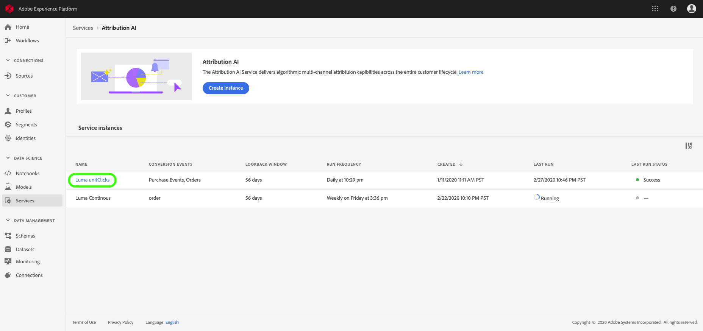
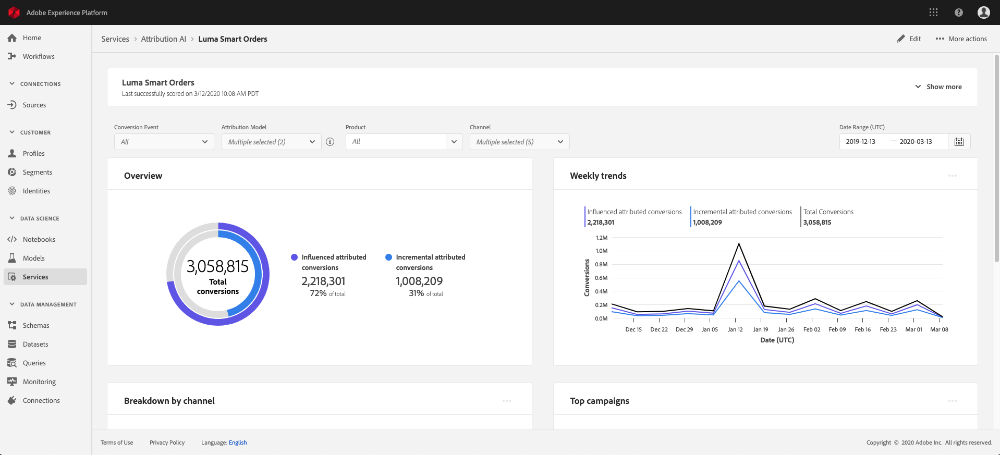
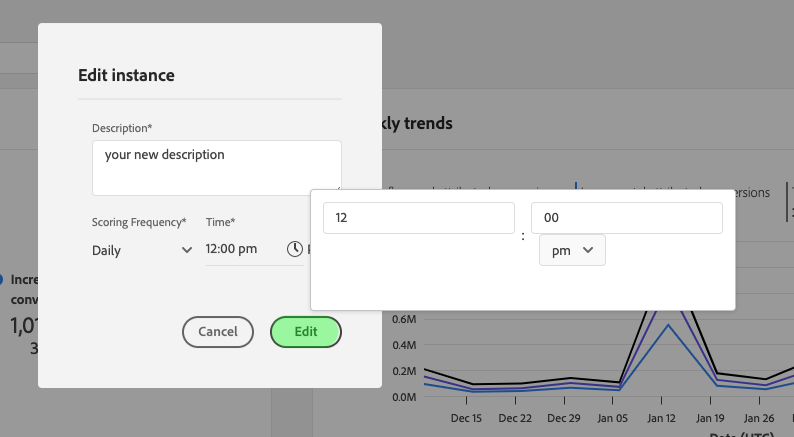
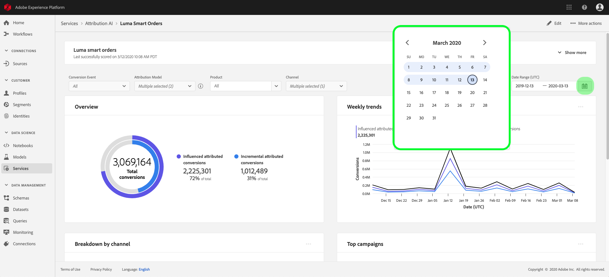
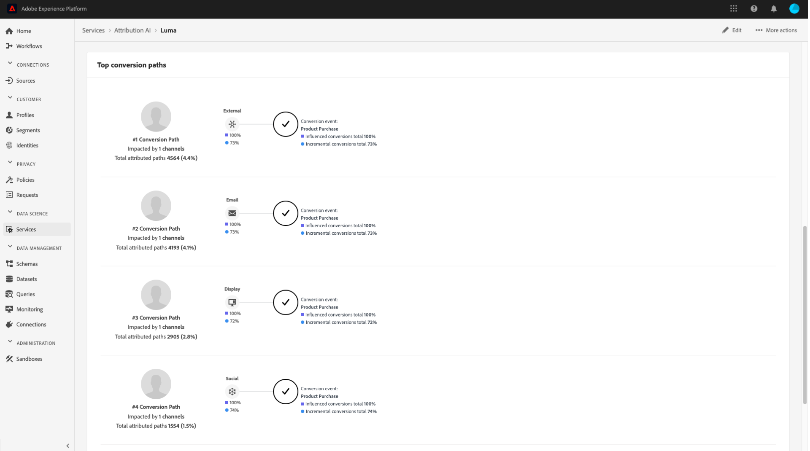

# Upptäck insikter inom Attribution AI

Attribution AI Service-instanser ger insikter som kan användas för att fatta och mäta marknadsföringsbeslut som rör marknadsföringens resultat och avkastningen på investeringen. Genom att välja en tjänstinstans får ni visualiseringar och filter som hjälper er att förstå effekten av varje kundinteraktion i varje fas av kundresan.

Det här dokumentet är en guide för interaktion med Service Instance-insikter i användargränssnittet för Adobe Intelligent Services.

## Komma igång

För att kunna utnyttja insikter om Attribution AI måste du ha en tjänstinstans med statusen lyckad körning tillgänglig. Om du vill skapa en ny tjänstinstans går du till [användargränssnittshandboken för Attribution AI](./user-guide.md). Om du nyligen har skapat en tjänstinstans och den fortfarande håller på att träna och betygsätta, kan du vänta i 24 timmar tills den är klar.

## Översikt över insikter om tjänstinstans

Välj **[!UICONTROL Services]** i det vänstra navigeringsfältet i gränssnittet för [!DNL Adobe Experience Platform]. Webbläsaren **[!UICONTROL Services]** visas och visar tillgängliga Adobe Intelligent Services. I behållaren för Attribution AI väljer du **[!UICONTROL Open]**.

Attribution AI tjänstsida visas. På den här sidan visas tjänstinstanser av Attribution AI och information om dem, inklusive namnet på instansen, konverteringshändelser, hur ofta instansen körs och status för den senaste uppdateringen. Välj ett tjänstinstansnamn som ska börja.

>[!NOTE]
>
>Det går endast att välja tjänstinstanser som har slutfört betygskörningar.

Därefter visas informationssidan för den aktuella tjänstinstansen, där du får visualiseringar och ett antal filter för att interagera med dina data. Visualiseringar och filter förklaras mer ingående i den här guiden.

### Information om tjänstinstans

Om du vill visa mer information om en tjänstinstans väljer du **[!UICONTROL Show more]** i det övre högra hörnet.

En detaljerad lista visas. Mer information om egenskaperna finns i [användarhandboken för Attribution AI](./user-guide.md).

### Redigera en instans

Om du vill redigera en instans väljer du **[!UICONTROL Edit]** i navigeringen längst upp till höger.

Dialogrutan Redigera visas. Du kan redigera instansens namn, beskrivning och bedömningsfrekvens. Om instansstatusen är inaktiverad går det inte att redigera bedömningsfrekvensen. Om du vill bekräfta ändringarna och stänga dialogrutan väljer du **[!UICONTROL Save]** i det nedre högra hörnet.

### Fler åtgärder {#more-actions}

Knappen **[!UICONTROL More actions]** finns i den övre högra navigeringen bredvid **[!UICONTROL Edit]**. Om du väljer **[!UICONTROL More actions]** öppnas en listruta där du kan välja någon av följande åtgärder:

- **[!UICONTROL Clone]**: Klonar instansen.
- **[!UICONTROL Delete]**: Tar bort instansen.
- **[!UICONTROL Download summary data]**: Hämtar en CSV-fil som innehåller sammanfattningsdata.
- **[!UICONTROL Access scores]**: Om du väljer  **[!UICONTROL Access scores]** Omdirigeras du till  [åtkomstpoängen för självstudiekursen](./download-scores.md) om.
- **[!UICONTROL View run history]**: En pover som innehåller en lista över alla poäng som är associerade med tjänstinstansen visas.

## Filtrera data

Med hjälp av Attribution AI kan du filtrera data och automatiskt uppdatera gränssnittets visuella information baserat på dina valda filter.

### Konverteringshändelse

När du skapar en ny instans i Attribution AI är ett av de obligatoriska fälten&quot;Conversion events&quot;. Konverteringshändelser är affärsmål som identifierar effekten av marknadsföringsaktiviteter, som e-handelsorder, butiksköp och webbplatsbesök.

I den här instansen kan du i listrutan **[!UICONTROL Conversion events]** välja någon av de händelser som är definierade för instansen för att filtrera data. Om du väljer specifika händelser ändras visualiseringarna av användargränssnittet så att endast konverteringar som tillhör dessa händelser fylls i.

### Attributionsmodell

Om du väljer **[!UICONTROL Attribution Model]** öppnas en listruta med alla olika attribueringsmodeller tillgängliga. Du kan välja flera modeller för att jämföra resultaten. Mer information om de olika attribueringsmodellerna och hur de fungerar finns i översikten [Attribution AI](./overview.md) som innehåller en tabell med information om varje modell.

### Län

>[!NOTE]
>
>Det här filtret finns bara om du utförde det valfria steget [regionbaserad modellering](./user-guide.md#region-based-modeling-optional) i användargränssnittsguiden för Attribution AI när du skapade tjänstinstansen.

Med det här filtret kan du markera alla områden som du har konfigurerat när du skapar instansen.

### Lägg till filter

Du kan lägga till ytterligare filter genom att välja ikonen **filter** för att öppna **[!UICONTROL Add filters]**-porten. Med **[!UICONTROL Add filters]**-drivrutinen kan du filtrera efter Kanal, Geografi, Medietyp och Produkt. Endast tillämpliga filter för en tjänstinstans fylls i av povern. Om du till exempel inte angav geografiska data eller en medietyp kommer dessa filterattribut inte att vara tillgängliga för din instans.

- **[!UICONTROL Channel]:** Om du väljer kanalattributet kan du filtrera alla tillgängliga marknadsföringskanaler. Du kan välja flera kanaler för att jämföra dem.
- **[!UICONTROL Geography]:** Om du väljer geography-attributet kan du filtrera landskoder baserat på regionsbaserade modeller. Beroende på vilka data du har kan det här filtret finnas eller inte finnas. Landskoderna är två tecken långa. Se den fullständiga landskodslistan [här](https://datahub.io/core/country-list).
- **[!UICONTROL Media type]:** Om du väljer medietypsattribut kan du filtrera alla definierade medietyper.
- **[!UICONTROL Product]:Om du** väljer produktattributet kan du filtrera från alla produkter som ursprungligen var inkapslade när du skapade instansen.

### Datumintervall

Välj kalenderikonen för att öppna datumintervallposeraren. Början- och slutkonverteringshändelsedatumen avgör mängden data som fylls i i användargränssnittet. Du kan välja att begränsa eller utöka datumintervallet för att kunna fokusera eller utöka mängden data som fylls i.

## Översikt över era data

På **[!UICONTROL Overview]**-kortet visas det totala antalet konverteringar per attribueringsmodell. Det totala antalet ändras baserat på hur specifik sökningen är med hjälp av de filter som beskrivs tidigare i det här dokumentet. Om du väljer flera modeller läggs ytterligare cirklar till i översikten, där var och en har en egen färg som motsvarar teckenförklaringen.

## Trender varje vecka

Med **[!UICONTROL Weekly trends]**-kortet delas den totala konverteringen upp i det datumintervall som du anger under filtreringsprocessen.

Om du väljer ellipserna i det övre högra hörnet av **vecktrender**-kortet visas en listruta där du kan välja trender varje dag, vecka eller månad.

När du hovrar över dataraden för en viss attribueringsmodell skapas en pover som visar det totala antalet konverteringar för det datumet.

## Uppdelning efter kanal

**[!UICONTROL Breakdown by channel]**-kortet används för att bestämma det totala antalet konverteringar i relation till varje kanal. Detta kort kan användas för att fatta beslut om varje kanals effektivitet och avkastningen på investeringen.

Om du väljer ellipserna i det övre högra hörnet av **[!UICONTROL Breakdown by channel]**-kortet öppnas en listruta där du kan fylla i data baserat på kontaktytor.

## Populära kampanjer

Kortet **[!UICONTROL Top campaigns]** innehåller en översikt över era kampanjer och hur kampanjen fungerar i varje kanal. Med det här kortet kan ni informera teamet om hur effektiv en viss kampanj är för en viss kanal och ge er insikter om vilka kampanjer ni bör investera i ytterligare.

## Uppdelning efter kontaktytsposition

Om du väljer fliken **[!UICONTROL Path Analysis]** läses diagrammen **[!UICONTROL Breakdown by touchpoint position]** och **[!UICONTROL Top conversion paths]** in.

Diagrammet **[!UICONTROL Breakdown by touchpoint position]** är en fördelning av konverteringar utifrån kontaktytans position jämfört med alla konverteringsbanor. Det här diagrammet hjälper dig att förstå vilka kontaktytor som är mer effektiva i olika faser av konverteringsbanan. Stegen är starter, spelare och närmare.

- **Starter:** Anger att kontaktytan var den första kontakten i en konverteringsbana.
- **Spelare:** Anger att kontaktytan inte var den första eller sista kontakten som ledde till en konvertering.
- **Closer:** Anger att kontaktytan var den sista kontakten före en konvertering.

>!![NOTE]
Summan av procentandelen för en attribueringsmodell för alla kontaktytor och positioner ska vara lika med 100.

## De vanligaste konverteringsbanorna

Diagrammet **[!UICONTROL Top conversion paths]** visar de påverkade och algoritmiska poängen på de översta konverteringsbanorna i de valda områdena. I det här diagrammet kan du se vilka kontaktytor som bidrar till konverteringarna och vad attribueringspoängen är för varje kontaktyta. Du kan använda den här informationen för att visa de mest frekventa banorna i ett visst område och se om det uppstår några mönster mellan de olika uppsättningarna med kontaktytor.

## Pekpunktseffektivitet

Om du väljer fliken **[!UICONTROL Touchpoint Effectiveness]** läses kortet in. **[!UICONTROL Touchpoint effectiveness]** Det här kortet använder Attribution AI datadistribution för att visa information för varje kontaktyta. Data för den här tabellen genereras endast för specifika tidsperioder enligt datumet **[!UICONTROL As of]** i kortets övre högra hörn.

Du kan använda kortinformationen **[!UICONTROL Touchpoint effectiveness]** för att förstå hur en kontaktyta bidrar till en konvertering. Du kan också se hur effektiv varje kontaktyta är med följande prestandamått:

**Perfekta** banor: Det här måttet visar en procentandel av banorna som uppnår eller inte uppnår konvertering för kontaktytan. Du ser högre konverteringar om förhållandet mellan banor (i procent) som uppnår konvertering till banor som inte uppnår konvertering är högt.

**Effektivitetsmått**: Det här måttet visar stjärnor på en skala från ett till fem. Skalan anger den relativa vikten av en kontaktyta för att göra en konvertering.

>[!NOTE]
Högre kontaktytvolym garanterar inte högre effektivitetsmått.

**Total volym**: Det sammanlagda antalet gånger en kontaktyta berördes av en användare. Detta inkluderar alla kontaktytor som visas på en bana som uppnår konvertering samt banor som inte leder till konvertering.

## Nästa steg

När du är klar med filtreringen av data och kan visa lämplig information kan du välja att få åtkomst till poängen. Om du vill ha en fördjupad guide om hur du får tillgång till dina poäng kan du gå till [åtkomstpoängen i självstudiekursen för Attribution AI](./download-scores.md). Dessutom kan du hämta sammanfattningsdata enligt [fler åtgärder](#more-actions). Om du väljer Hämta sammanfattningsdata hämtas sammanfattningsdata som aggregerats efter datum.

## Ytterligare resurser

Följande videofilm är utformad för att hjälpa dig att lära dig hur du använder informationssidan för Attribution AI för att förstå avkastningen på marknadsföringskanaler och kampanjer.

>[!VIDEO](https://video.tv.adobe.com/v/32669?learn=on&quality=12)