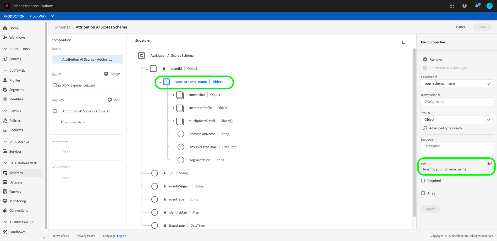

# [!DNL Attribution AI] input och output

Följande dokument visar de olika indata och utdata som används i [!DNL Attribution AI].

## [!DNL Attribution AI] indata

[!DNL Attribution AI] använder [!DNL Consumer Experience Event] data för att beräkna algoritmiska poäng. Mer information [!DNL Consumer Experience Event]finns i [Förbered data för användning i dokumentationen](../data-preparation.md)för intelligenta tjänster.

Alla kolumner i [!DNL Consumer Experience Event] CEE-schemat är inte obligatoriska för Attribution AI.

>[!NOTE]
>
> Följande nio kolumner är obligatoriska, ytterligare kolumner är valfria men rekommenderas/nödvändiga om du vill använda samma data för andra Adobe-lösningar som [!DNL Customer AI] och [!DNL Journey AI].

| Obligatoriska kolumner | Behövs för |
| --- | --- |
| Primärt identitetsfält | Pekpunkt/konvertering |
| Tidsstämpel | Pekpunkt/konvertering |
| Kanal._type | Pekpunkt |
| Channel.mediaAction | Pekpunkt |
| Channel.mediaType | Pekpunkt |
| Marketing.trackingCode | Pekpunkt |
| Marketing.campaignname | Pekpunkt |
| Marketing.campaigngroup | Pekpunkt |
| Handel | Konvertering |

Attributen körs vanligtvis på konverteringskolumner som order, inköp och utcheckningar under&quot;handel&quot;. Kolumnerna&quot;channel&quot; och&quot;marketing&quot; rekommenderas i hög grad för att definiera kontaktytor för goda insikter. Du kan dock inkludera ytterligare kolumner tillsammans med kolumnerna ovan om du vill konfigurera dem som en konvertering eller kontaktytpunktsdefinition.

Kolumnerna nedan är inte obligatoriska, men vi rekommenderar att du inkluderar dem i ditt CEE-schema om du har tillgång till informationen.

**Ytterligare rekommenderade kolumner:**
- web.webReferer
- web.webInteraction
- web.webPageDetails
- xdm:productListItems

### Historiska data

>[!IMPORTANT]
>
> Den minsta mängden data som behövs för att Attribution AI ska fungera är följande:
> - Du måste tillhandahålla minst 3 månaders (90 dagar) data för att kunna köra en bra modell.
> - Du behöver minst 1 000 konverteringar.

Attribution AI kräver historiska data som underlag för modellutbildning. Den datalängd som krävs bestäms huvudsakligen av två huvudfaktorer: utbildningsfönster och kontrollfönster. Indata med kortare utbildningsfönster är mer känsliga för aktuella trender, medan längre utbildningsfönster hjälper till att skapa mer stabila och korrekta modeller. Det är viktigt att modellera målet med historiska data som bäst motsvarar era affärsmål.

Konfigurationen [av](./user-guide.md#training-window) utbildningsfönstret filtrerar konverteringshändelser som anges för modellutbildning baserat på förekomsttid. För närvarande är den kortaste utbildningstiden 1 fjärdedel (90 dagar). I [uppslagsfönstret](./user-guide.md#lookback-window) finns en tidsram som anger hur många dagar före konverteringshändelsekontakten som är relaterade till den här konverteringshändelsen ska inkluderas. Dessa två begrepp avgör tillsammans mängden indata (mätt i dagar) som krävs för ett program.

Som standard definierar Attribution AI utbildningsfönstret som de senaste 2 kvartalen (6 månader) och uppslagsfönstret som 56 dagar. Med andra ord kommer modellen att ta hänsyn till alla definierade konverteringshändelser som har inträffat under de senaste två kvartalen och söka efter alla kontaktytor som har inträffat inom 56 dagar före de associerade konverteringshändelserna.

**Formel**:

Minsta längd på data som krävs = utbildningsfönster + uppslagsfönster

>[!TIP]
>
> Den minsta datalängd som krävs för ett program med standardkonfigurationer är: 2 kvartal (180 dagar) + 56 dagar = 236 dagar.

Exempel :

- Du vill attribuera konverteringshändelser som har inträffat under de senaste 90 dagarna (3 månader) och spåra alla kontaktytor som har inträffat inom 4 veckor före konverteringshändelsen. Varaktigheten för indata ska sträcka sig över de senaste 90 dagarna + 28 dagar (4 veckor). Utbildningsfönstret är 90 dagar och uppslagsfönstret är 28 dagar, totalt 118 dagar.

## Attribution AI utdata

Attribution AI ger följande utdata:

- [Rågranulat](#raw-granular-scores)
- [Sammanlagda bakgrundsmusik](#aggregated-attribution-scores)

**Exempel på utdataschema:**

### Rågranulat {#raw-granular-scores}

Attribution AI ger attribueringspoäng på så detaljnivå som möjligt så att du kan segmentera och minska poängen med valfri spalt. Om du vill visa dessa bakgrundsmusik i användargränssnittet läser du avsnittet [Visa sökvägar](#raw-score-path)för råpoängen. Om du vill hämta bakgrundsmusik med API går du till [nedladdningspoängen i Attribution AI](./download-scores.md) -dokumentet.

>[!NOTE]
>
> Du kan bara se önskad rapportkolumn från indatauppsättningen i utdatamängden för bakgrundsmusik om något av följande stämmer:
> - Rapporteringskolumnen inkluderas på konfigurationssidan antingen som en del av konfigurationen av kontaktyta eller konverteringsdefinition.
> - Rapporteringskolumnen ingår i ytterligare spalter för spaltdata.

I följande tabell visas schemafälten i utdata för råpoängsexempel:

| Kolumnnamn (datatyp) | Nullable | Beskrivning |
| --- | --- | --- |
| tidsstämpel (DateTime) | Falskt | Den tid då en konverteringshändelse eller observation inträffade.   **Exempel:** 2020-06-09T00:01:51.000Z |
| identityMap (Map) | True | användarens identityMap liknar CEE XDM-formatet. |
| eventType (String) | True | Den primära händelsetypen för den här tidsserieposten.   **Exempel:** &quot;Order&quot;, &quot;Purchase&quot;, &quot;Visit&quot; |
| eventMergeId (String) | True | Ett ID som korrelerar eller sammanfogar flera [!DNL Experience Events] som i princip är samma händelse eller som ska sammanfogas. Detta ska fyllas i av den som producerar uppgifterna före intag.   **Exempel:** 575525617716-0-edc2ed37-1aab-4750-a820-1c2b3844b8c4 |
| _id (sträng) | Falskt | En unik identifierare för tidsseriehändelsen.   **Exempel:** 4461-edc2ed37-1aab-4750-a820-1c2b3844b8c4 |
| _tenantId (Object) | Falskt | Objektbehållaren på den översta nivån som motsvarar ditt tält-ID.   **Exempel:** _atsdsnrmmsv2 |
| your_schema_name (Object) | Falskt | Poängrad med konverteringshändelse, alla kontaktyteshändelser som är associerade med den och deras metadata.   **Exempel:** Attribution AI - modellnamn__2020 |
| segmentering (sträng) | True | Konverteringssegment, t.ex. geosegmentering, som modellen är byggd mot. Om segment saknas är segmentet detsamma som conversionName.   **Exempel:** ORDER_US |
| conversionName (String) | True | Namnet på konverteringen som konfigurerades under installationen.   **Exempel:** Beställning, lead, besök |
| konvertering (objekt) | Falskt | Konvertera metadatakolumner. |
| dataSource (String) | True | Global unik identifiering av en datakälla.   **Exempel:** Adobe Analytics |
| eventSource (String) | True | Källan när den faktiska händelsen inträffade.   **Exempel:** Adobe.com |
| eventType (String) | True | Den primära händelsetypen för den här tidsserieposten.   **Exempel:** Order |
| geo (String) | True | Den geografiska plats där konverteringen levererades `placeContext.geo.countryCode`.   **Exempel:** USA |
| priceTotal (dubbel) | True | Inkomster som erhållits genom konverteringen   **Exempel:** 99.9 |
| product (String) | True | XDM-identifieraren för själva produkten.   **Exempel:** RX 1080 ti |
| productType (String) | True | Visningsnamnet för produkten som det visas för användaren för den här produktvyn.   **Exempel:** Gpus |
| kvantitet (heltal) | True | Kvantitet som köpts under konverteringen.   **Exempel:** 1 1080 ti |
| receiveTimestamp (DateTime) | True | Tidsstämpel för konverteringen togs emot.   **Exempel:** 2020-06-09T00:01:51.000Z |
| skuId (String) | True | Lagerhållningsenhet (SKU), den unika identifieraren för en produkt som definieras av leverantören.   **Exempel:** MJ-03-XS-Black |
| tidsstämpel (DateTime) | True | Tidsstämpel för konverteringen.   **Exempel:** 2020-06-09T00:01:51.000Z |
| passThrough (Object) | True | Ytterligare kolumner för Score-datamängd som anges av användaren när modellen konfigureras. |
| commerce_order_purchaseCity (String) | True | Kolumn med extra bakgrundsuppsättning.   **Exempel:** city: San Jose |
| customerProfile (Object) | Falskt | Identitetsinformation om användaren som användes för att skapa modellen. |
| identity (Object) | Falskt | Innehåller information om användaren som används för att skapa modellen, till exempel `id` och `namespace`. |
| id (String) | True | Identitets-ID för användaren, t.ex. cookie-ID, AAID eller MCID.   **Exempel:** 17348762725408656344688320891369597404 |
| namespace (String) | True | Identitetsnamnutrymme som används för att skapa sökvägarna och därmed modellen.   **Exempel:** aaid |
| touchPointsDetail (Object Array) | True | Listan med kontaktpunktsinformation som leder till konverteringen som sorteras efter kontaktytpunktsförekomst eller tidsstämpel. |
| touchpointName (String) | True | Namnet på den kontaktyta som konfigurerades under installationen.   **Exempel:** PAID_SEARCH_CLICK |
| bakgrundsmusik (Object) | True | Pekpunktsbidrag till den här konverteringen som poäng. Mer information om poängen som skapas i det här objektet finns i avsnittet [aggregerade attribueringspoäng](#aggregated-attribution-scores) . |
| touchPoint (Object) | True | Kontaktpunktsmetadata. Mer information om bakgrundsmusik i det här objektet finns i avsnittet [aggregerade poäng](#aggregated-scores) . |

### Visa sökvägar för Raw-poäng (UI) {#raw-score-path}

Du kan visa sökvägen till dina bakgrundsmusik i användargränssnittet. Börja med att välja **[!UICONTROL Schemas]** i plattformsgränssnittet och sök sedan efter och välj ditt AI-poängschema för attribuering från **[!UICONTROL Browse]** fliken.

Därefter väljer du ett fält i **[!UICONTROL Structure]** fönstret för användargränssnittet, så öppnas **[!UICONTROL Field properties]** fliken. Inom **[!UICONTROL Field properties]** är det **[!UICONTROL Path]** fält som mappar till dina Raw-resultat.

### Sammanlagda attribueringspoäng {#aggregated-attribution-scores}

Samlade poäng kan hämtas i CSV-format från plattformsgränssnittet om datumintervallet är mindre än 30 dagar.

Attribution AI har stöd för två kategorier av attribueringspoäng, algoritmiska och regelbaserade poäng.

Attribution AI ger två olika typer av algoritmiska poäng, inkrementellt och påverkat. En påverkad poäng är den del av konverteringen som varje kontaktyta för marknadsföring ansvarar för. En inkrementell poäng är mängden marginell påverkan som direkt orsakas av kontaktytan för marknadsföring. Den största skillnaden mellan det stegvisa poängvärdet och det poängvärde som påverkas är att det stegvisa poängvärdet tar baslinjeeffekten i beaktande. Man utgår inte från att en konvertering enbart orsakas av de föregående kontaktytorna.

Här följer ett kort exempel på en Attribution AI-schemautdata från Adobe Experience Platform-gränssnittet:

Se tabellen nedan för mer information om var och en av dessa attribueringspoäng:

| Attributionspoäng | Beskrivning |
| ----- | ----------- |
| Influerad (algoritmisk) | Påverkade poäng är den del av konverteringen som varje kontaktyta för marknadsföring ansvarar för. |
| Inkrementell (algoritmisk) | Inkrementell poäng är mängden marginell påverkan som direkt orsakas av en kontaktyta för marknadsföring. |
| Första beröring | Regelbaserat attribueringspoäng som tilldelar alla krediter till den första kontaktytan på en konverteringsbana. |
| Sista beröring | Regelbaserat attribueringspoäng som tilldelar all kredit till den kontaktyta som ligger närmast konverteringen. |
| Linjär | Regelbaserat attribueringspoäng som tilldelar varje kontaktyta samma poäng på en konverteringsbana. |
| U-formad | Regelbaserat attribueringspoäng som tilldelar 40 % av krediten till den första kontaktytan och 40 % av krediten till den sista kontaktytan, där de andra kontaktytorna delar upp de återstående 20 % jämnt. |
| Tidsminskning | Regelbaserat attribueringspoäng där kontaktytor som ligger närmare konverteringen får mer kredit än kontaktytor som ligger längre bort från konverteringen. |

**Råpoängsreferens (attribueringspoäng)**

Tabellen nedan mappar attribueringspoängen till de obearbetade poängen. Om du vill ladda ned bakgrundsmusik går du till [nedladdningspoängen i Attribution AI](./download-scores.md) dokumentation.

| Attributionspoäng | Referenskolumn för råskala |
| --- | --- |
| Influerad (algoritmisk) | _tenantID.your_schema_name.element.touchpoint.algorithmicInfluenced |
| Inkrementell (algoritmisk) | _tenantID.your_schema_name.touchpointsDetail.element.touchpoint.algorithmicInfluenced |
| Första beröring | _tenantID.your_schema_name.touchpointsDetail.element.touchpoint.firstTouch |
| Sista beröring | _tenantID.your_schema_name.touchpointsDetail.element.touchpoint.lastTouch |
| Linjär | _tenantID.your_schema_name.touchpointsDetail.element.touchpoint.linear |
| U-formad | _tenantID.your_schema_name.touchpointsDetail.element.touchpoint.uShape |
| Tidsminskning | _tenantID.your_schema_name.touchpointsDetail.element.touchpoint.decayUnits |

### Sammanlagda bakgrundsmusik {#aggregated-scores}

Samlade poäng kan hämtas i CSV-format från plattformsgränssnittet om datumintervallet är mindre än 30 dagar. Se tabellen nedan för mer information om var och en av dessa aggregerade kolumner.

| Kolumnnamn | Begränsning | Nullable | Beskrivning |
| --- | --- | --- | --- |
| customer_events_date (DateTime) | Användardefinierat och fast format | Falskt | Kundhändelsedatum i formatet ÅÅÅ-MM-DD.   **Exempel**: 2016-05-02 |
| mediatouchpoints_date (DateTime) | Användardefinierat och fast format | True | Media Touchpoint-datum i formatet ÅÅÅ-MM-DD   **Exempel**: 2017-04-21 |
| segment (String) | Beräknat | Falskt | Konverteringssegment, t.ex. geosegmentering, som modellen är byggd mot. Om segment saknas är segmentet detsamma som conversion_scope.   **Exempel**: ORDER_AMER |
| conversion_scope (String) | Användardefinierad | Falskt | Namnet på konverteringen enligt användarens konfiguration.   **Exempel**: BESTÄLL |
| touchpoint_scope (String) | Användardefinierad | True | Namn på kontaktpunkten enligt användarens inställningar   **Exempel**: PAID_SEARCH_CLICK |
| product (String) | Användardefinierad | True | Produktens XDM-identifierare.   **Exempel**: CC |
| product_type (String) | Användardefinierad | True | Visningsnamnet för produkten som det visas för användaren för den här produktvyn.   **Exempel**: gpus, bärbara datorer |
| geo (String) | Användardefinierad | True | Den geografiska plats där konverteringen levererades (placeContext.geo.countryCode)   **Exempel**: USA |
| event_type (String) | Användardefinierad | True | Den primära händelsetypen för den här tidsserieposten   **Exempel**: Betalkonvertering |
| media_type (String) | ENUM | Falskt | Anger om medietypen är betald, ägd eller förtjänad.   **Exempel**: BETALD, ÄGEN |
| channel (String) | ENUM | Falskt | Den `channel._type` egenskap som används för att tillhandahålla en grov klassificering av kanaler med liknande egenskaper i [!DNL Consumer Experience Event] XDM.   **Exempel**: SÖK |
| action (String) | ENUM | Falskt | Egenskapen `mediaAction` används för att tillhandahålla en typ av åtgärd för upplevelsehändelsemedia.   **Exempel**: KLICKA |
| campaign_group (String) | Användardefinierad | True | Namnet på kampanjgruppen där flera kampanjer grupperas tillsammans, till exempel &quot;50%_DISCOUNT&quot;.   **Exempel**: KOMMERSIELL |
| campaign_name (String) | Användardefinierad | True | Namnet på kampanjen som används för att identifiera marknadsföringskampanjer som 50%_DISCOUNT_USA eller 50%_DISCOUNT_ASIA.   **Exempel**: Thanksgiving Sale |

**Råpoängsreferens (aggregerad)**

Tabellen nedan mappar de aggregerade poängen till de obearbetade poängen. Om du vill ladda ned bakgrundsmusik går du till [nedladdningspoängen i Attribution AI](./download-scores.md) dokumentation. Om du vill visa sökvägar för råpoängen i användargränssnittet går du till avsnittet [Visa sökvägar](#raw-score-path) för råpoängen i det här dokumentet.

| Kolumnnamn | Referenskolumn för Raw-bakgrundsmusik |
| --- | --- |
| customerevents_date | tidsstämpel |
| mediatouchpoints_date | _tenantID.your_schema_name.touchpointsDetail.element.touchpoint.timestamp |
| segment | _tenantID.your_schema_name.segmentation |
| conversion_scope | _tenantID.your_schema_name.conversion.conversionName |
| touchpoint_scope | _tenantID.your_schema_name.touchpointsDetail.element.touchpointName |
| produkt | _tenantID.your_schema_name.conversion.product |
| product_type | _tenantID.your_schema_name.conversion.product_type |
| geo | _tenantID.your_schema_name.conversion.geo |
| event_type | eventType |
| media_type | _tenantID.your_schema_name.touchpointsDetail.element.touchpoint.mediaType |
| kanal | _tenantID.your_schema_name.touchpointsDetail.element.touchpoint.mediaChannel |
| åtgärd | _tenantID.your_schema_name.touchpointsDetail.element.touchpoint.mediaAction |
| campaign_group | _tenantID.your_schema_name.touchpointsDetail.element.touchpoint.campaignGroup |
| campaign_name | _tenantID.your_schema_name.touchpointsDetail.element.touchpoint.campaignName |

## Nästa steg {#next-steps}

När du har förberett dina data och har alla dina autentiseringsuppgifter och scheman på plats börjar du med att följa [användarhandboken](./user-guide.md)för Attribution AI. I den här guiden får du hjälp med att skapa en instans för Attribution AI.