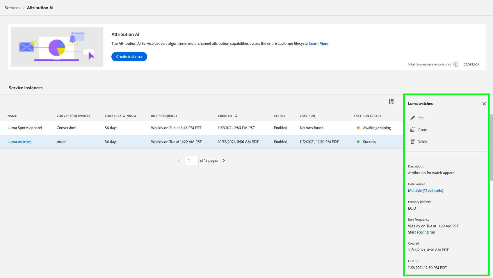
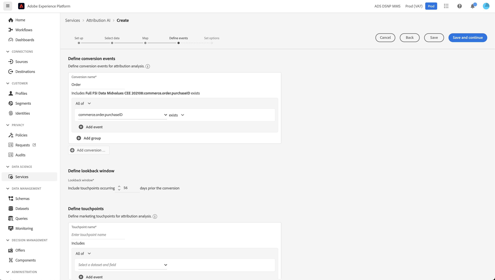

# Användargränssnittshandbok för Attribution AI

Attribution AI, som en del av Intelligent Services är en flerkanalig algoritmisk attribueringstjänst som beräknar påverkan och inkrementell påverkan av kundinteraktioner i förhållande till angivna resultat. Med Attribution AI kan marknadsförarna mäta och optimera marknadsförings- och annonsutgifterna genom att förstå effekten av varje enskild kundinteraktion i varje fas av kundresan.

Det här dokumentet är en guide för interaktion med Attribution AI i användargränssnittet för intelligenta tjänster.

## Skapa en modell

I användargränssnittet för [!DNL Adobe Experience Platform] väljer du **[!UICONTROL Services]** i den vänstra navigeringen. Webbläsaren **[!UICONTROL Services]** visas och tillgängliga smarta Adobe-tjänster visas. Markera **[!UICONTROL Open]** i behållaren för Attribution AI.

Attribution AI tjänstsida visas. På den här sidan visas tjänstmodeller med Attribution AI och information om dem, inklusive modellens namn, konverteringshändelser, hur ofta modellen körs och status för den senaste uppdateringen.

Du hittar måttet **[!UICONTROL Total conversion events scored]** i den nedre högra delen av behållaren **[!UICONTROL Create model]**. Det här måttet spårar det totala antalet konverteringshändelser som har bedömts av Attribution AI för det aktuella kalenderåret, inklusive alla sandlådemiljöer och borttagna servicemodeller.

Tjänstmodeller kan redigeras, klonas och tas bort med kontrollerna till höger i användargränssnittet. Om du vill visa dessa kontroller väljer du en modell från din befintliga **[!UICONTROL Service models]**. Kontrollerna innehåller följande information:

- **[!UICONTROL Edit]**: Om du väljer **[!UICONTROL Edit]** kan du ändra en befintlig tjänstmodell. Du kan redigera namn, beskrivning, status, bedömningsfrekvens för modellen och ytterligare spalter för spaltdata.
- **[!UICONTROL Clone]**: Om du väljer **[!UICONTROL Clone]** kopieras den valda tjänstmodellen. Du kan sedan ändra arbetsflödet för att göra mindre ändringar och byta namn på det som en ny modell.
- **[!UICONTROL Delete]**: Du kan ta bort en tjänstmodell, inklusive historikkörningar. Motsvarande utdatamängd kommer att tas bort från Platform. Poäng som synkroniserades till kundprofilen i realtid tas dock inte bort.
- **[!UICONTROL Data source]**: En länk till datauppsättningen som används. Om mer än en datauppsättning används av Attribution AI visas&quot;Flera&quot; följt av antalet datauppsättningar. När du väljer hyperlänken visas förhandsvisningsdrivrutinen för datauppsättningar.
- **[!UICONTROL Last run details]**: Detta visas bara när en körning misslyckas. Här visas information om varför körningen misslyckades, t.ex. felkoder.

- **[!UICONTROL Conversion events]**: En snabb översikt över konverteringshändelserna som har konfigurerats för den här modellen.
- **[!UICONTROL Lookback window]**: Den tidsram som du definierade anger hur många dagar före konverteringshändelsens kontaktytor som ska tas med.
- **[!UICONTROL Touchpoints]**: En lista med alla kontaktytor som du definierade när du skapade den här modellen.

Välj **[!UICONTROL Create model]** för att börja.

Därefter visas konfigurationssidan för Attribution AI där du kan ange ett namn och en valfri beskrivning för din tjänstmodell.

## Markera data {#select-data}

<!-- https://www.adobe.com/go/aai-select-data -->

Attribution AI kan efter design använda data från Adobe Analytics, Experience Event och Consumer Experience Event för att beräkna attribueringspoäng. När du väljer en datauppsättning visas bara de som är kompatibla med Attribution AI. Om du vill välja en datauppsättning markerar du symbolen (**+**) bredvid datauppsättningsnamnet eller markerar kryssrutan för att lägga till flera datauppsättningar samtidigt. Du kan också använda sökalternativet för att snabbt hitta de datauppsättningar du är intresserad av.

När du har valt de datauppsättningar du vill använda väljer du knappen **[!UICONTROL Add]** för att lägga till datauppsättningarna i förhandsgranskningsfönstret för datauppsättningen.

Om du väljer informationsikonen  bredvid en datauppsättning öppnas förhandsvisningspovern för datauppsättningen.

Förhandsgranskningen av datauppsättningen innehåller data som senaste uppdateringstid, källschema och en förhandsgranskning av de första tio kolumnerna.

Välj **[!UICONTROL Save]** om du vill spara dina utkast när du följer arbetsflödet. Du kan också spara utkastmodellkonfigurationer och gå vidare till nästa steg i arbetsflödet. Använd **[!UICONTROL Save and continue]** för att skapa och spara utkast under modellkonfigurationer. Med den här funktionen kan du skapa och spara utkast av modellkonfigurationen och den är särskilt användbar när du måste definiera många fält i konfigurationsarbetsflödet.

### Fullständighet för datauppsättning {#dataset-completeness}

<!-- https://www.adobe.com/go/aai-dataset-completeness -->

I datauppsättningsförhandsvisningen är ett procentvärde för datauppsättningens fullständighet. Det här värdet ger en snabb ögonblicksbild av hur många kolumner i datauppsättningen som är tomma/null. Om en datauppsättning innehåller många värden som saknas och dessa värden hämtas någon annanstans rekommenderar vi att du inkluderar datauppsättningen som innehåller de värden som saknas.

>[!NOTE]
>
>Datauppsättningens fullständighet beräknas med hjälp av det maximala utbildningsfönstret för Attribution AI (ett år). Detta innebär att data som är äldre än ett år inte beaktas när datamängdens fullständighetsvärde visas.

### Välj en identitet {#identity}

Nu kan du koppla flera datauppsättningar till varandra baserat på identitetskartan (fältet). Du måste välja en identitetstyp (kallas även&quot;id namespace&quot;) och ett identitetsvärde i det namnutrymmet. Om du har tilldelat mer än ett fält som en identitet i ditt schema under samma namnområde, visas alla tilldelade identitetsvärden i den listruta för identitet som föregås av namnutrymmet `EMAIL (personalEmail.address)` eller `EMAIL (workEmail.address)`.

>[!IMPORTANT]
>
>Samma identitetstyp (namnutrymme) måste användas för varje datamängd som du väljer. En grön bock visas bredvid identitetstypen i identitetskolumnen som anger att datauppsättningarna är kompatibla. Om du till exempel använder namnutrymmet Telefon och `mobilePhone.number` som identifierare måste alla identifierare för de återstående datauppsättningarna innehålla och använda namnutrymmet Telefon.

Markera en identitet genom att markera det understrukna värdet i identitetskolumnen. Välj en identitetsleverantör.

Om fler än en identitet är tillgänglig i ett namnutrymme måste du välja rätt identitetsfält för ditt användningsfall. Det finns till exempel två e-postidentiteter tillgängliga i e-postnamnutrymmet, ett arbete och en personlig e-postadress. Beroende på användningsfallet är det troligare att ett personligt e-postmeddelande fylls i och är mer användbart i individuella prognoser. Det innebär att du väljer `EMAIL (personalEmail.address)` som din identitet.

>[!NOTE]
>
> Om det inte finns någon giltig identitetstyp (namnrymd) för en datauppsättning måste du ange en primär identitet och tilldela den till ett identitetsnamnområde med [schemaredigeraren](../../xdm/schema/composition.md#identity). Mer information om namnutrymmen och identiteter finns i dokumentationen för [identitetstjänstens namnutrymmen](../../identity-service/features/namespaces.md).

## Mappa mediekanal- och kampanjfält {#aai-mapping}

<!-- https://www.adobe.com/go/aai-mapping -->

När du har valt och lagt till datauppsättningar visas konfigurationssteget **Karta**. Attribution AI kräver att du mappar mediekanalsfältet för varje datauppsättning som du valde i föregående steg. Detta beror på att utan mediekanalmappningen mellan datauppsättningar kanske insikter som härletts från Attribution AI inte visas korrekt, vilket gör det svårt att tolka insikter. Även om bara mediekanalen krävs rekommenderar vi att du mappar några av de valfria fälten, som Media-åtgärd, Campaign-namn, Campaign-grupp och Campaign-tagg. På så sätt kan Attribution AI få tydligare insikter och optimala resultat.

## Definiera händelser {#define-events}

<!-- https://www.adobe.com/go/aai-define-events -->

Det finns tre olika typer av indata som används för att definiera händelser:

- **Konverteringshändelser:** Affärsmål som identifierar effekten av marknadsföringsaktiviteter, som e-handelsorder, butiksköp och webbplatsbesök.
- **Fönstret för bakåtsökning:** Visar en tidsram som anger hur många dagar före kontaktytorna för konverteringshändelsen som ska inkluderas.
- **Kontaktpunkter:** marknadsföringshändelser på mottagarnivå, individ- och cookie-nivå som används för att utvärdera den numeriska eller intäktsbaserade effekten av konverteringar.

### Definiera konverteringshändelser {#define-conversion-events}

Om du vill definiera en konverteringshändelse måste du ge händelsen ett namn och välja händelsetyp genom att välja datauppsättning och fält i listrutan **Välj en datauppsättning och fält**.

När en händelse har valts visas en ny listruta till höger om händelsen. Den andra listrutan används för att ge ytterligare kontext till händelsen genom att åtgärder används. Standardåtgärden *finns* används för den här konverteringshändelsen.

>[!NOTE]
>
>En sträng under ditt *konverteringsnamn* uppdateras när du definierar händelsen.

Därefter kan du välja en kombinerad datauppsättning som genereras genom att kombinera alla indatauppsättningar i föregående steg. Du kan också välja en kolumn baserad på enskilda datauppsättningar i listrutan **Välj en datauppsättning och fält**.

Knapparna **[!UICONTROL Add event]** och **[!UICONTROL Add Group]** används för att ytterligare definiera din konvertering. Beroende på vilken konvertering du definierar kan du behöva använda knapparna **[!UICONTROL Add event]** och **[!UICONTROL Add group]** för att skapa ytterligare kontext.

Om du väljer **[!UICONTROL Add event]** skapas ytterligare fält som kan fyllas i med samma metod som beskrivs ovan. När du gör det läggs en AND-sats till i strängdefinitionen under konverteringsnamnet. Markera **x** om du vill ta bort en händelse som har lagts till.

Om du väljer **[!UICONTROL Add Group]** kan du skapa ytterligare fält som är åtskilda från originalet. När grupper har lagts till visas en blå *And*-knapp. Om du väljer **And** kan du ändra parametern så att den innehåller &quot;Or&quot;. &quot;Eller&quot; används för att definiera flera lyckade konverteringssökvägar. &quot;And&quot; utökar konverteringssökvägen så att den innehåller ytterligare villkor.

Om du behöver mer än en konvertering väljer du **Lägg till konvertering** för att skapa ett nytt konverteringskort. Du kan upprepa processen ovan om du vill definiera flera konverteringar.

### Definiera uppslagsfönster {#lookback-window}

När du har definierat konverteringen måste du bekräfta uppslagsfönstret. Använd piltangenterna eller genom att välja standardvärdet (56), och ange hur många dagar före konverteringshändelsen du vill ta med kontaktytor från. Pekpunkter definieras i nästa steg.

### Definiera kontaktytor

När du definierar kontaktytor följer du ett arbetsflöde som liknar [definierar konverteringar](#define-conversion-events). Först måste du namnge kontaktytan och välja ett kontaktytpunktsvärde i listrutan *Ange fältnamn*. När du har valt operatorlistrutan visas standardvärdet &quot;exists&quot;. Markera listrutan för att visa en lista med operatorer.

Markera **lika med** för den här kontaktytan.

När en operator för en kontaktyta har valts blir *Ange fältvärde* tillgängligt. Listrutevärdena för *Ange fältvärde* fylls i baserat på operatorn och det kontaktytpunktsvärde som du tidigare valde. Om ett värde inte fylls i i listrutan kan du skriva värdet i manuellt. Markera listrutan och välj **KLICKA**.

>[!NOTE]
>
>Operatorerna &quot;exists&quot; och &quot;not exists&quot; har inga fältvärden kopplade till sig.

Knapparna **Lägg till händelse** och **Lägg till grupp** används för att ytterligare definiera din kontaktyta. På grund av den komplexa beskaffenheten kring kontaktytor är det inte ovanligt att ha flera händelser och grupper för en enda kontaktyta.

När det här alternativet är markerat tillåter **Lägg till händelse** att ytterligare fält läggs till. markera **x** för att ta bort en händelse som har lagts till.

Om du väljer **Lägg till grupp** kan du skapa ytterligare fält som är åtskilda från originalet. När grupper har lagts till visas en blå *And*-knapp. Välj **And** om du vill ändra parametern, används den nya parametern &quot;Or&quot; för att definiera flera lyckade sökvägar. Den här kontaktytan har bara en lyckad bana och därför behövs inte &quot;Eller&quot;.

>[!NOTE]
>
>Använd strängen under *Touchpoint-namn* om du vill få en snabb översikt över din kontaktyta. Observera att strängen matchar namnet på kontaktytan.

Du kan lägga till ytterligare kontaktytor genom att välja **Lägg till kontaktyta** och upprepa processen ovan.

När du har definierat alla nödvändiga kontaktytor rullar du uppåt och väljer **Nästa** i det övre högra hörnet för att fortsätta till det sista steget.

## Avancerad utbildning och poängsättning

Den sista sidan i Attribution AI är sidan **[!UICONTROL Advanced]** som används för att ställa in utbildning och poängsättning.

### Schemalägg utbildning

Med *Schema* kan du välja vilken dag och tid i veckan du vill att poängsättningen ska äga rum.

Välj listrutan under *Betygsningsfrekvens* om du vill välja mellan betygsättning varje dag, vecka och månad. Välj sedan de veckodagar du vill att poängsättningen ska äga rum. Du kan välja flera dagar. Om du väljer samma dag igen avmarkeras den.

Om du vill ändra tiden på dagen som du vill att poängsättningen ska göras väljer du klockikonen. I den nya övertäckning som visas anger du den tid på dagen som du vill att poängsättningen ska göras. Stäng övertäckningen genom att markera den utanför den.

>[!NOTE]
>
>Det kan ta upp till 24 timmar för varje poängprocess att slutföra.

### Kolumner för extra poängdatauppsättning (valfritt)

Som standard skapas en poängdatauppsättning för varje tjänstmodell i ett standardschema. Du kan välja att lägga till ytterligare kolumner baserat på dina Conversion Event- och Touchpoint-konfigurationer i resultatmängden. Börja med att välja kolumner från indatauppsättningen. Du kan sedan dra och släppa dem för att ändra ordningen genom att hålla ned vänster musknapp över hamburgikonen.

### Regionbaserad modellering (valfritt) {#region-based-modeling-optional}

Kundernas beteenden kan skilja sig avsevärt mellan olika länder och geografiska regioner. För globala företag kan användning av landsbaserade eller regionbaserade modeller öka attribueringsnoggrannheten. Varje region som läggs till skapar en ny modell med den regionens data.

Om du vill definiera en ny region börjar du med att välja **[!UICONTROL Add region]**. Ange ett namn för regionen i behållaren som visas. Endast ett värde (&quot;placeContext.geo.countryCode&quot;) fylls i från listrutan **[!UICONTROL Enter Field Name]**. Välj det här värdet.

Välj sedan en operator.

Skriv till sist in landskoden i listrutan **[!UICONTROL Enter Field Value]**.

>[!NOTE]
>
>Landskoderna är två tecken långa. En fullständig lista finns här: [ISO 3166-1 alpha-2](https://datahub.io/core/country-list).

### Utbildningsfönster {#training-window}

För att säkerställa att ni får den mest korrekta modellen är det viktigt att utbilda modellen med historiska data som representerar ert företag. Som standard används två fjärdedelar (6 månader) av konverteringshändelsedata för modellen. Välj listrutan för att ändra standardinställningen. Du kan välja att utbilda med en till fyra fjärdedelar av data (3-12 månader).

>[!NOTE]
>
>Ett kortare utbildningsfönster är mer känsligt för de senaste trenderna, medan ett längre utbildningsfönster skapar en mer robust modell och är mindre känsligt för de senaste trenderna.

När du har valt utbildningsfönstret väljer du **[!UICONTROL Finish]** i det övre högra hörnet. Ge databearbetningen lite tid. När du är klar visas en dialogruta som bekräftar att instansinställningarna är klara. Välj **[!UICONTROL Ok]** om du vill omdirigeras till sidan **[!UICONTROL Service instances]** där du kan se tjänstinstansen.

## Nästa steg

Genom att följa den här självstudiekursen har du skapat en tjänstinstans i Attribution AI. När instansen är klar med poängsättningen (upp till 24 timmar) är du redo att [upptäcka Attribution AI](./discover-insights.md). Om du dessutom vill hämta dina poängresultat går du till dokumentationen för [nedladdning av poäng](./download-scores.md).

## Ytterligare resurser

I följande video visas ett arbetsflöde från början till slut som du kan använda för att skapa en ny instans i Attribution AI.

>[!VIDEO](https://video.tv.adobe.com/v/32668?learn=on&quality=12)
