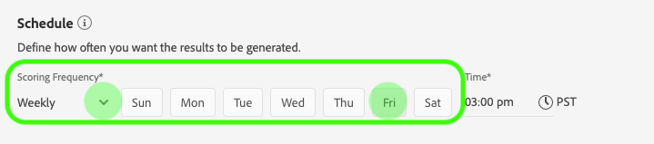

# Användargränssnittshandbok för Attribution AI

Attribution AI, som en del av Intelligent Services är en flerkanalig algoritmisk attribueringstjänst som beräknar påverkan och inkrementell påverkan av kundinteraktioner i förhållande till angivna resultat. Med Attribution AI kan marknadsförarna mäta och optimera marknadsförings- och annonsutgifterna genom att förstå effekten av varje enskild kundinteraktion i varje fas av kundresan.

Det här dokumentet är en guide för interaktion med Attribution AI i användargränssnittet för intelligenta tjänster.

## Skapa en instans

Klicka på **[!UICONTROL Services]** i det vänstra navigeringsfältet i gränssnittet för [!DNL Adobe Experience Platform]. Webbläsaren **[!UICONTROL Services]** visas och visar tillgängliga smarta Adobe-tjänster. Klicka på **[!UICONTROL Open]** i behållaren för Attribution AI.

Attribution AI tjänstsida visas. På den här sidan visas tjänstinstanser av Attribution AI och information om dem, inklusive namnet på instansen, konverteringshändelser, hur ofta instansen körs och status för den senaste uppdateringen.

Du hittar måttet **[!UICONTROL Total conversion events scored]** i den nedre högra delen av **[!UICONTROL Create instance]**-behållaren. Det här måttet spårar det totala antalet konverteringshändelser som har bedömts av Attribution AI för det aktuella kalenderåret, inklusive alla sandlådemiljöer och eventuella borttagna tjänstinstanser.

Tjänstinstanser kan redigeras, klonas och tas bort med kontrollerna till höger i användargränssnittet. Om du vill visa dessa kontroller väljer du en instans från din befintliga **[!UICONTROL Service instances]**. Kontrollerna innehåller följande information:

- **[!UICONTROL Edit]**: Om du väljer  **[!UICONTROL Edit]** det här alternativet kan du ändra en befintlig tjänstinstans. Du kan redigera namn, beskrivning, status och bedömningsfrekvens för instansen.
- **[!UICONTROL Clone]**: Om du väljer  **[!UICONTROL Clone]** det här alternativet kopieras den markerade tjänstinstansen. Du kan sedan ändra arbetsflödet för att göra mindre ändringar och byta namn på det som en ny instans.
- **[!UICONTROL Delete]**: Du kan ta bort en tjänstinstans, inklusive alla tidigare körningar.
- **[!UICONTROL Data source]**: En länk till datauppsättningen som används av den här instansen.
- **[!UICONTROL Last run details]**: Detta visas bara när en körning misslyckas. Här visas information om varför körningen misslyckades, t.ex. felkoder.

- **[!UICONTROL Conversion events]**: En snabb översikt över konverteringshändelserna som konfigurerats för den här instansen.
- **[!UICONTROL Lookback window]**: Den tidsram som du definierade visar hur många dagar före kontaktytorna för konverteringshändelsen som ingår.
- **[!UICONTROL Touchpoints]**: En lista med alla kontaktytor som du definierade när du skapade den här instansen.

Välj **[!UICONTROL Create instance]** för att börja.

Därefter visas konfigurationssidan för Attribution AI, där du kan ange grundläggande information och en datauppsättning för instansen.

### Namnge instansen

Ange ett namn och en valfri beskrivning för tjänstinstansen under **[!UICONTROL Basic information]**.

### Välj en datauppsättning

När du har fyllt i den grundläggande informationen klickar du på listrutan **Välj datauppsättning** och väljer datauppsättning. Datauppsättningen används för att träna modellen och poängsätta efterföljande data som den skapar. När du väljer en datauppsättning i listruteväljaren visas endast de som är kompatibla med Attribution AI och som följer XDM-schemat (Experience Data Model). När du har valt en datauppsättning klickar du på **Nästa** i det övre högra hörnet för att fortsätta till sidan för att definiera händelser.

## Definiera händelser

Det finns tre olika typer av indata som används för att definiera händelser:

- **Konverteringshändelser:** Affärsmål som identifierar effekten av marknadsföringsaktiviteter, som e-handelsorder, butiksköp och webbplatsbesök.
- **Fönster för återsökning:** Anger en tidsram som anger hur många dagar före kontakten för konverteringshändelsen som ska inkluderas.
- **Kontaktpunkter:marknadsföringshändelser på** mottagarnivå, individ- eller cookienivå som används för att utvärdera den numeriska eller intäktsbaserade effekten av konverteringar.

### Definiera konverteringshändelser {#define-conversion-events}

Om du vill definiera en konverteringshändelse måste du ge händelsen ett namn och välja händelsetyp genom att klicka på listrutan **Ange fältnamn**.

När en händelse har valts visas en ny listruta till höger om händelsen. Den andra listrutan används för att ge ytterligare kontext till händelsen genom att åtgärder används. Standardåtgärden *finns* används för den här konverteringshändelsen.

>[!NOTE]
>
>En sträng under ditt *konverteringsnamn* uppdateras när du definierar händelsen.

Knapparna **[!UICONTROL Add event]** och **[!UICONTROL Add Group]** används för att ytterligare definiera konverteringen. Beroende på vilken konvertering du definierar kan du behöva använda knapparna **[!UICONTROL Add event]** och **[!UICONTROL Add group]** för att skapa ytterligare kontext.

Om du klickar på **[!UICONTROL Add event]** skapas ytterligare fält som kan fyllas i med samma metod som beskrivs ovan. När du gör det läggs en AND-sats till i strängdefinitionen under konverteringsnamnet. Klicka på **x** för att ta bort en händelse som har lagts till.

Om du klickar på **[!UICONTROL Add Group]** kan du skapa ytterligare fält som är åtskilda från originalet. När grupper har lagts till visas en blå *And*-knapp. Om du klickar på **And** kan du ändra parametern så att den innehåller &quot;Or&quot;. &quot;Eller&quot; används för att definiera flera lyckade konverteringssökvägar. &quot;And&quot; utökar konverteringssökvägen så att den innehåller ytterligare villkor.

Om du behöver mer än en konvertering klickar du på **Lägg till konvertering** för att skapa ett nytt konverteringskort. Du kan upprepa processen ovan om du vill definiera flera konverteringar.

### Definiera uppslagsfönster {#lookback-window}

När du har definierat konverteringen måste du bekräfta uppslagsfönstret. Ange med piltangenterna eller genom att klicka på standardvärdet (56) hur många dagar före konverteringshändelsen som du vill ta med kontaktytor från. Pekpunkter definieras i nästa steg.

### Definiera kontaktytor

När du definierar kontaktytor följer du ett arbetsflöde som liknar [när du definierar konverteringar](#define-conversion-events). Först måste du namnge kontaktytan och välja ett kontaktytpunktsvärde i listrutan *Ange fältnamn*. När du har valt operatorlistrutan visas standardvärdet &quot;exists&quot;. Klicka på listrutan för att visa en lista med operatorer.

För denna kontaktyta väljer du **lika med**.

När en operator för en kontaktyta har valts är *Ange fältvärde* tillgängligt. Värdena i listrutan för *Ange fältvärde* fylls i baserat på den operator och det kontaktytpunktsvärde som du tidigare valde. Om ett värde inte fylls i i listrutan kan du skriva värdet i manuellt. Klicka på listrutan och välj **KLICKA**.

>[!NOTE]
>
>Operatorerna &quot;exists&quot; och &quot;not exists&quot; har inga fältvärden kopplade till sig.

Knapparna *Lägg till händelse* och *Lägg till grupp* används för att ytterligare definiera din kontaktyta. På grund av den komplexa beskaffenheten kring kontaktytor är det inte ovanligt att ha flera händelser och grupper för en enda kontaktyta.

När du klickar på **Lägg till händelse** kan ytterligare fält läggas till. Klicka på **x** för att ta bort en händelse som har lagts till.

Om du klickar på **Lägg till grupp** kan du skapa ytterligare fält som är åtskilda från originalet. När grupper har lagts till visas en blå *And*-knapp. Klicka på **And** om du vill ändra parametern. Den nya parametern &quot;Or&quot; används för att definiera flera lyckade sökvägar. Den här kontaktytan har bara en lyckad bana och därför behövs inte &quot;Eller&quot;.

>[!NOTE]
>
>Använd strängen under *Touchpoint name* för att få en snabb översikt över din kontaktyta. Observera att strängen matchar namnet på kontaktytan.

Du kan lägga till ytterligare kontaktytor genom att klicka på **Lägg till kontaktyta** och upprepa processen ovan.

När du har definierat alla nödvändiga kontaktytor rullar du uppåt och klickar på **Nästa** i det övre högra hörnet för att fortsätta till det sista steget.

## Avancerad utbildning och poängsättning

Den sista sidan i Attribution AI är den **[!UICONTROL Advanced]**-sida som används för att ställa in utbildning och poängsättning.

### Schemalägg utbildning

Med hjälp av *Schedule* kan du välja vilken dag och tid i veckan du vill att poängsättningen ska äga rum.

Klicka på listrutan under *Betygsfrekvens* för att välja mellan daglig, veckovis och månadsvis bedömning. Välj sedan de veckodagar du vill att poängsättningen ska äga rum. Du kan välja flera dagar. Klicka en dag en gång till för att avmarkera den.

Klicka på klockikonen om du vill ändra den tidpunkt på dagen som du vill att poängsättningen ska göras. I den nya övertäckning som visas anger du den tid på dagen som du vill att poängsättningen ska göras. Klicka utanför övertäckningen för att stänga den.

>[!NOTE]
>
>Det kan ta upp till 24 timmar för varje poängprocess att slutföra.

### Kolumner för extra poängdatauppsättning (valfritt)

Som standard skapas en poängdatauppsättning för varje tjänstinstans i ett standardschema. Du kan välja att lägga till ytterligare kolumner baserat på dina Conversion Event- och Touchpoint-konfigurationer i utdata för poängdatauppsättningen. Börja med att välja kolumner från indatauppsättningen. Du kan sedan dra och släppa dem för att ändra ordningen genom att hålla ned vänster musknapp över hamburgikonen.

### Regionbaserad modellering (valfritt) {#region-based-modeling-optional}

Kundernas beteenden kan skilja sig avsevärt mellan olika länder och geografiska regioner. För globala företag kan användning av landsbaserade eller regionbaserade modeller öka attribueringsnoggrannheten. Varje region som läggs till skapar en ny modell med den regionens data.

Om du vill definiera en ny region börjar du med att klicka på **[!UICONTROL Add region]**. Ange ett namn för regionen i behållaren som visas. Endast ett värde (&quot;placeContext.geo.countryCode&quot;) fylls i från listrutan **[!UICONTROL Enter Field Name]**. Välj det här värdet.

Välj sedan en operator.

Skriv landskoden i listrutan **[!UICONTROL Enter Field Value]**.

>[!NOTE]
>
>Landskoderna är två tecken långa. En fullständig lista finns här [ISO 3166-1 alpha-2](https://datahub.io/core/country-list).

### Utbildningsfönster {#training-window}

För att säkerställa att ni får den mest korrekta modellen är det viktigt att utbilda modellen med historiska data som representerar ert företag. Som standard används två fjärdedelar (6 månader) av konverteringshändelsedata för modellen. Välj listrutan för att ändra standardinställningen. Du kan välja att utbilda med en till fyra fjärdedelar av data (3-12 månader).

>[!NOTE]
>
>Ett kortare utbildningsfönster är mer känsligt för de senaste trenderna, medan ett längre utbildningsfönster skapar en mer robust modell och är mindre känsligt för de senaste trenderna.

När du har valt utbildningsfönstret klickar du på **[!UICONTROL Finish]** i det övre högra hörnet. Ge databearbetningen lite tid. När du är klar visas en dialogruta som bekräftar att instansinställningarna är klara. Klicka på **[!UICONTROL Ok]** om du vill omdirigeras till sidan **[!UICONTROL Service instances]** där du kan se tjänstinstansen.

## Nästa steg

Genom att följa den här självstudiekursen har du skapat en tjänstinstans i Attribution AI. När instansen är klar med poängsättningen (upp till 24 timmar) är du redo att [identifiera insikter om Attribution AI](./discover-insights.md). Om du dessutom vill hämta dina poängresultat går du till [nedladdningsdokumentationen](./download-scores.md).

## Ytterligare resurser

I följande video visas ett arbetsflöde från början till slut som du kan använda för att skapa en ny instans i Attribution AI.

>[!VIDEO](https://video.tv.adobe.com/v/32668?learn=on&quality=12)