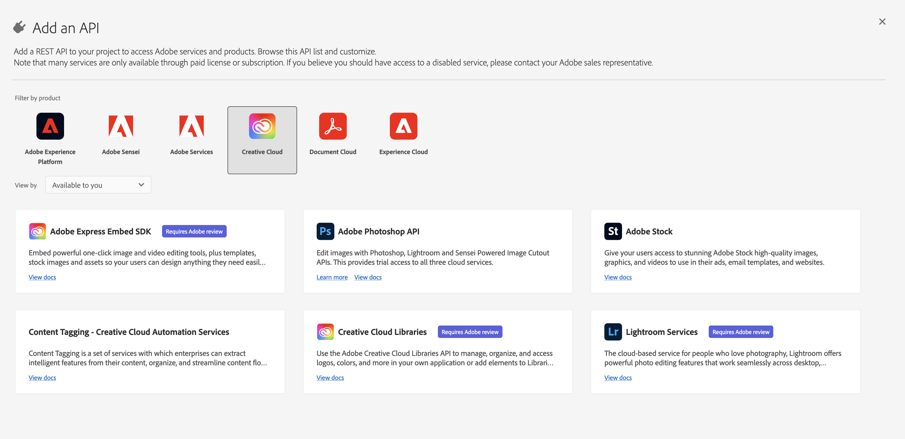

# Komma igång med innehållstaggar

[!DNL Content tagging] använder Adobe I/O API:er. För att kunna ringa anrop till API:er för Adobe I/O och I/O-konsolintegrationen måste du först slutföra [självstudiekurs om autentisering](https://www.adobe.com/go/platform-api-authentication-en).

Men när du kommer till **Lägg till API** API:t finns under Creative Cloud i stället för Adobe Experience Platform, vilket visas i skärmbilden nedan:

När du är klar med självstudiekursen för autentisering visas värdena för var och en av de obligatoriska rubrikerna i alla Adobe I/O API-anrop, vilket visas nedan:

- `Authorization: Bearer {ACCESS_TOKEN}`
- `x-api-key: {API_KEY}`
- `x-gw-ims-org-id: {ORG_ID}`

## Skapa en Postman-miljö (valfritt)

När du har konfigurerat projektet och API:t i Adobe Developer Console kan du välja att hämta en miljöfil för Postman. Under **[!UICONTROL APIs]** till vänster om projektet, välj **[!UICONTROL Content tagging]**. En ny flik öppnas med ett kort med etiketten &quot;[!DNL Try it out]&quot;. Välj **Ladda ned för Postman** för att hämta en JSON-fil som används för att konfigurera din postmanmiljö.

När du har laddat ned filen öppnar du Postman och väljer **kugghjulsikon** överst till höger för att öppna **hantera miljöer** -dialogrutan.

Nästa, välj **Importera** inifrån **Hantera miljöer** -dialogrutan.

Du omdirigeras och uppmanas att välja en miljöfil på datorn. Markera JSON-filen som du hämtade tidigare och välj sedan **Öppna** för att läsa in miljön.

Du omdirigeras tillbaka till *Hantera miljöer* med ett nytt miljönamn ifyllt. Markera miljönamnet för att visa och redigera de variabler som är tillgängliga i Postman. Du måste fortfarande fylla i `JWT_TOKEN` och `ACCESS_TOKEN`. Dessa värden skulle ha erhållits medan [självstudiekurs om autentisering](https://www.adobe.com/go/platform-api-authentication-en).

När du är klar bör variablerna se ut som skärmbilden nedan. Välj **Uppdatera** för att slutföra konfigurationen av miljön.

Nu kan du välja din miljö i listrutan i det övre högra hörnet och automatiskt fylla i sparade värden. Redigera om värdena när du vill för att uppdatera alla API-anrop.

Mer information om hur du arbetar med Adobe I/O API:er med Postman finns i posten Medium på [med Postman för JWT-autentisering på Adobe I/O](https://medium.com/adobetech/using-postman-for-jwt-authentication-on-adobe-i-o-7573428ffe7f).

## Läser exempel-API-anrop

Den här guiden innehåller exempel på API-anrop som visar hur du formaterar dina begäranden. Det kan vara sökvägar, obligatoriska rubriker och korrekt formaterade begärandenyttolaster. Ett exempel på JSON som returneras i API-svar finns också. Information om konventionerna som används i dokumentationen för exempel-API-anrop finns i avsnittet om [läsa exempel-API-anrop](../../landing/troubleshooting.md) i felsökningsguiden för Experience Platform.

## Nästa steg {#next-steps}

När du har alla dina autentiseringsuppgifter är du redo att konfigurera en anpassad arbetare för [!DNL Content tagging]. Följande dokument hjälper till att förstå Extensibility Framework och miljöinställningar.

Om du vill veta mer om Extensibility Framework börjar du med att läsa [introduktion till utbyggbarhet](https://experienceleague.adobe.com/docs/asset-compute/using/extend/understand-extensibility.html) -dokument. I det här dokumentet beskrivs förutsättningarna och etableringskraven.

Mer information om hur du konfigurerar en miljö för [!DNL Content tagging], börja med att läsa guiden för [konfigurera en utvecklarmiljö](https://experienceleague.adobe.com/docs/asset-compute/using/extend/setup-environment.html). Det här dokumentet innehåller konfigurationsinstruktioner som gör att du kan utveckla för tjänsten Asset compute.
