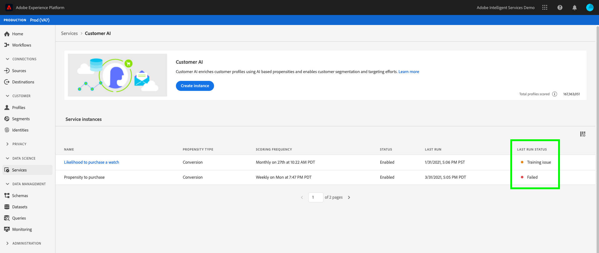

# Felsökning av kund-AI

Kund-AI visar fel när modellutbildning, poängsättning och konfiguration misslyckas. I **[!UICONTROL Service instances]** -sektion, en kolumn för **[!UICONTROL LAST RUN STATUS]** visar ett av följande meddelanden: **[!UICONTROL Success]**, **[!UICONTROL Training issue]** och **[!UICONTROL Failed]**.

Om **[!UICONTROL Failed]** eller **[!UICONTROL Training issue]** visas kan du välja körningsstatus för att öppna en sidopanel. Sidpanelen innehåller **[!UICONTROL Last run status]** och **[!UICONTROL Last run details]**. **[!UICONTROL Last run details]** innehåller information om varför körningen misslyckades. Om kundens AI inte kan ge detaljerad information om felet kontaktar du supporten med den felkod som anges.

 

## Det går inte att komma åt kundens AI i Chrome-inkognito

Det finns inläsningsfel i Google Chrome-läget på grund av uppdateringar i Google Chrome-säkerhetsinställningarna för inkodade lägen. Vi arbetar aktivt med Chrome för att göra experience.adobe.com till en betrodd domän.

 

### Rekommenderad korrigering

För att lösa det här problemet måste du lägga till experience.adobe.com som en webbplats som alltid kan använda cookies. Börja med att navigera till **chrome://settings/cookies**. Bläddra sedan nedåt till **Anpassade beteenden** följt av att välja **Lägg till** intill&quot;webbplatser som alltid kan använda cookies&quot;. Kopiera och klistra in i den pover som visas `[*.]experience.adobe.com` väljer du **Inklusive cookies från tredje part** på den här platsen. När du är klar väljer du **Lägg till** och ladda om kundens AI i inkognito.

## Modellkvaliteten är dålig

Om du får felmeddelandet &quot;[!UICONTROL Model Quality is poor. We recommend creating a new app with the modified configuration]&quot;. Följ de rekommenderade stegen nedan för att felsöka.

 

### Rekommenderad korrigering

&quot;Modellkvaliteten är dålig&quot; betyder att modellens precision inte ligger inom ett acceptabelt intervall. Kundens AI kunde inte skapa en tillförlitlig modell och AUC (område under ROC-kurvan) &lt; 0,65 efter utbildning. För att åtgärda felet rekommenderar vi att du ändrar en av konfigurationsparametrarna och kör kursen igen.

Börja med att kontrollera att era data är korrekta. Det är viktigt att dina data innehåller de fält som behövs för prediktiva resultat.

- Kontrollera om din datauppsättning har de senaste datumen. Kunds-AI antar alltid att data är aktuella när modellen aktiveras.
- Kontrollera om det finns data som saknas i det definierade förutsägelsefönstret och berättigandefönstret. Dina data behöver fyllas i utan luckor. Kontrollera även att datauppsättningen uppfyller [Krav på AI-historik för kunder](./data-requirements.md#data-requirements).
- Kontrollera om det finns data som saknas i e-handel, program, webb och sökning i egenskaperna för schemafält.

Om dina data inte verkar vara problemet kan du försöka ändra villkoren för berättigandepopulation för att begränsa modellen till vissa profiler (till exempel `_experience.analytics.customDimensions.eVars.eVar142` finns under de senaste 56 dagarna). Detta begränsar populationen och storleken på de data som används i utbildningsfönstret.

Om det inte gick att begränsa behörighetspopulationen eller om det inte går, ändrar du förutsägelsefönstret.

- Försök att ändra förutsägelsefönstret till 7 dagar och se om felet kvarstår. Om felet inte längre inträffar indikerar det att du kanske inte har tillräckligt med data för det definierade förutsägelsefönstret.
