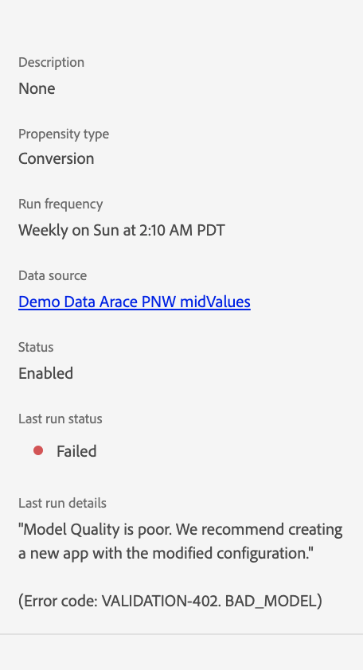

# Felsökning av kund-AI

Kund-AI visar fel när modellutbildning, poängsättning och konfiguration misslyckas. I avsnittet **[!UICONTROL Service instances]** visas ett av följande meddelanden i en kolumn för **[!UICONTROL LAST RUN STATUS]**: **[!UICONTROL Success]**, **[!UICONTROL Training issue]** och **[!UICONTROL Failed]**.

Om **[!UICONTROL Failed]** eller **[!UICONTROL Training issue]** visas kan du välja körningsstatus för att öppna en sidopanel. Sidpanelen innehåller dina **[!UICONTROL Last run status]** och **[!UICONTROL Last run details]**. **[!UICONTROL Last run details]** innehåller information om varför körningen misslyckades. Om kundens AI inte kan ge detaljerad information om felet kontaktar du supporten med den felkod som anges.

 

## Modellkvaliteten är dålig

Om du får felet [!UICONTROL Model Quality is poor. We recommend creating a new app with the modified configuration]. Följ de rekommenderade stegen nedan för att felsöka.

 

### Rekommenderad korrigering

&quot;Modellkvaliteten är dålig&quot; betyder att modellens precision inte ligger inom ett acceptabelt intervall. Kundens AI kunde inte skapa en tillförlitlig modell och AUC (område under ROC-kurvan) &lt; 0,65 efter utbildning. För att åtgärda felet rekommenderar vi att du ändrar en av konfigurationsparametrarna och kör kursen igen.

Börja med att kontrollera att era data är korrekta. Det är viktigt att dina data innehåller de fält som behövs för prediktiva resultat.

- Kontrollera om din datauppsättning har de senaste datumen. Kunds-AI antar alltid att data är aktuella när modellen aktiveras.
- Kontrollera om det finns data som saknas i det definierade förutsägelsefönstret och berättigandefönstret. Dina data behöver fyllas i utan luckor. Kontrollera också att din datauppsättning uppfyller [AI-kraven för kunder](./input-output.md#data-requirements).
- Kontrollera om det finns data som saknas i e-handel, program, webb och sökning i egenskaperna för schemafält.

Om dina data inte verkar vara problemet kan du pröva att ändra villkoren för berättigandepopulation för att begränsa modellen till vissa profiler (t.ex. `_experience.analytics.customDimensions.eVars.eVar142` finns under de senaste 56 dagarna). Detta begränsar populationen och storleken på de data som används i utbildningsfönstret.

Om det inte gick att begränsa behörighetspopulationen eller om det inte går, ändrar du förutsägelsefönstret.

- Försök att ändra förutsägelsefönstret till 7 dagar och se om felet kvarstår. Om felet inte längre inträffar indikerar det att du kanske inte har tillräckligt med data för det definierade förutsägelsefönstret.
