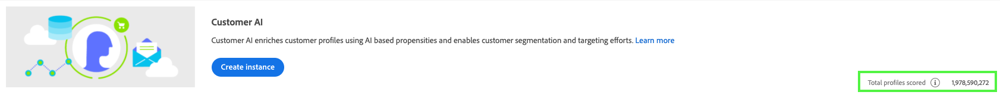

# Konfigurera en AI-instans för kund

Tack vare kundens AI, som ingår i Intelligent Services, kan ni generera anpassade benägenhetspoäng utan att behöva bekymra er om maskininlärning.

Intelligenta tjänster ger kunden artificiell intelligens (AI) som en lättanvänd Adobe Sensei-tjänst som kan konfigureras för olika användningsområden. I följande avsnitt beskrivs hur du konfigurerar en instans av Kundens AI.

## Konfigurera din instans {#set-up-your-instance}

In the Platform UI, select **[!UICONTROL Services]** in the left navigation. Webbläsaren visas och **[!UICONTROL Services]** visar alla tillgängliga tjänster. I behållaren för Kundens AI väljer du **[!UICONTROL Open]**.

Gränssnittet för **kundens AI** visas och visar alla dina tjänstinstanser.

- Du hittar mätvärdena som finns i den nedre högra delen av **[!UICONTROL Total profiles scored]** **[!UICONTROL Create instance]** behållaren. Det här måttet spårar det totala antalet profiler som kunden har bedömt för det aktuella kalenderåret, inklusive alla sandlådemiljöer och eventuella borttagna tjänstinstanser.

Tjänstinstanser kan redigeras, klonas och tas bort med kontrollerna till höger i användargränssnittet. Om du vill visa dessa kontroller väljer du en instans från din befintliga **[!UICONTROL Service instances]**. Kontrollerna innehåller följande:

- **[!UICONTROL Edit]**: Om du väljer **[!UICONTROL Edit]** det här alternativet kan du ändra en befintlig tjänstinstans. Du kan redigera namn, beskrivning och bedömningsfrekvens för instansen.
- **[!UICONTROL Clone]**: Om du väljer **[!UICONTROL Clone]** det här alternativet kopieras den valda tjänstinstansinställningen. Du kan sedan ändra arbetsflödet för att göra mindre ändringar och byta namn på det som en ny instans.
- **[!UICONTROL Delete]**: Du kan ta bort en tjänstinstans, inklusive alla tidigare körningar.
- **[!UICONTROL Data source]**: En länk till den datauppsättning som används av den här instansen.
- **[!UICONTROL Last run details]**: Detta visas bara när en körning misslyckas. Här visas information om varför körningen misslyckades, t.ex. felkoder.
- **[!UICONTROL Score definition]**: En snabb översikt över målet som du konfigurerade för den här instansen.

Om du vill skapa en ny instans väljer du **[!UICONTROL Create instance]**.

Arbetsflödet där instansen skapas visas med början på **[!UICONTROL Setup]** steget.

Nedan finns viktig information om värden som du måste ge instansen:

- Instansens namn används på alla platser där AI-poäng för kunder visas. Namnen bör därför beskriva vad förutsägelsepoängen representerar, till exempel&quot;Sannolikhet för att avbryta tidskriftsprenumeration&quot;.

- Propensitetstypen bestämmer poängsättets och den metriska polaritetens avsikt. Du kan antingen välja **[!UICONTROL Churn]** eller **[!UICONTROL Conversion]**. Se anteckningen under [poängsammanfattning](./discover-insights.md#scoring-summary) i dokumentet om upptäckt av insikter för mer information om hur benägenhetstypen påverkar din instans.

- Datakällan är den plats där data finns. Datauppsättningen är den indatamängd som används för att förutsäga bakgrundsmusik. Kunds-AI använder per design data om kundupplevelsehändelser för att beräkna benägenhetspoängen. När du väljer en datauppsättning i listruteväljaren visas bara de som är kompatibla med kundens AI.

- Som standard genereras benägenhetspoäng för alla profiler såvida inte en stödberättigad population anges. Du kan ange en berättigad population genom att definiera villkor för att inkludera eller exkludera profiler baserat på händelser.

Ange önskade värden och välj sedan **[!UICONTROL Next]**.

### Definiera ett mål {#define-a-goal}

Steget visas och innehåller en interaktiv miljö där du kan definiera ett förutsägelsemål visuellt. **[!UICONTROL Define goal]** Ett mål består av en eller flera händelser, där varje händelses förekomst baseras på det villkor den innehåller. Målet för en kundens AI-instans är att fastställa sannolikheten för att uppnå dess mål inom en viss tidsram.

Om du vill skapa ett mål markerar du **[!UICONTROL Enter Field Name]** och väljer ett fält i listrutan. Markera den andra inmatningen och välj en sats för händelsens villkor och ange sedan målvärdet för att slutföra händelsen. Ytterligare händelser kan konfigureras genom att välja **[!UICONTROL Add event]**. Slutför målet genom att tillämpa en tidsram för förutsägelse i antal dagar och välj sedan **[!UICONTROL Next]**.

#### Kommer att inträffa och kommer inte att inträffa

När du definierar ditt mål kan du välja **[!UICONTROL Will occur]** eller **[!UICONTROL Will not occur]**. Markering **[!UICONTROL Will occur]** innebär att de händelsevillkor du definierar måste uppfyllas för att en kunds händelsedata ska inkluderas i insikterna-gränssnittet.

Om du till exempel vill konfigurera ett program för att förutsäga om en kund kommer att göra ett köp, kan du välja **[!UICONTROL Will occur]** följt av **[!UICONTROL All of]** och sedan ange **commerce.purchase.id** och **existerar** som operator.

Det kan dock finnas fall då du är intresserad av att förutsäga om en händelse inte kommer att inträffa inom en viss tidsperiod. Om du vill konfigurera ett mål med det här alternativet väljer du **[!UICONTROL Will not occur]** i den översta listrutan.

Om du till exempel är intresserad av att förutsäga vilka kunder som blir mindre engagerade och inte besöker inloggningssidan för ditt konto nästa månad. Markera **[!UICONTROL Will not occur]** följt av **[!UICONTROL All of]** och ange sedan **web.webInteraction.URL** och **[!UICONTROL equals]** som operator med **kontoinloggning** som värde.

#### Alla och alla

I vissa fall kanske du vill förutsäga om en kombination av händelser kommer att inträffa och i andra fall kanske du vill förutsäga förekomsten av en händelse från en fördefinierad uppsättning. För att kunna förutsäga om en kund kommer att ha en kombination av händelser väljer du alternativet i den andra listrutan på **[!UICONTROL All of]** **[!UICONTROL Define Goal]** sidan.

Du kanske vill förutsäga om en kund köper en viss produkt. Detta förutsägelsemål definieras av två villkor: a `commerce.order.purchaseID` exists **and the** equals `productListItems.SKU` equals **** some specific value.

För att kunna förutsäga om en kund kommer att ha någon händelse från en viss uppsättning kan du använda **[!UICONTROL Any of]** alternativet.

Du kanske vill förutsäga om en kund besöker en viss URL-adress eller en webbsida med ett visst namn. Detta förutsägelsemål definieras av två villkor: `web.webPageDetails.URL` **börjar med** ett visst värde och `web.webPageDetails.name` börjar **med** ett visst värde.

### Konfigurera ett schema *(valfritt)* {#configure-a-schedule}

Steget **[!UICONTROL Advanced]** visas. Med det här valfria steget kan du konfigurera ett schema för att automatisera prediktionskörningar, definiera undantag för förutsägelser för att filtrera vissa händelser eller välja **[!UICONTROL Finish]** om inget behövs.

Konfigurera ett poängschema genom att konfigurera **[!UICONTROL Scoring Frequency]**. Automatiserade prognoskörningar kan schemaläggas att köras antingen varje vecka eller varje månad.

Under schemakonfigurationen kan du definiera undantag för förutsägelse för att förhindra händelser som uppfyller vissa villkor från att utvärderas när du genererar poäng. Den här funktionen kan användas för att filtrera bort irrelevanta dataindata.

Om du vill utesluta vissa händelser markerar **[!UICONTROL Add exclusion]** och definierar du händelsen på samma sätt som målet definieras. Om du vill ta bort ett undantag markerar du ellipserna (**[!UICONTROL ...]**) längst upp till höger i händelsebehållaren och väljer sedan **[!UICONTROL Remove Container]**.

Uteslut händelser efter behov och välj sedan **[!UICONTROL Finish]** för att skapa instansen.

Om instansen skapas utan fel utlöses en förutsägelsekörning omedelbart och efterföljande körningar utförs enligt ditt definierade schema.

>[!NOTE]
>
>Beroende på storleken på indata kan det ta upp till 24 timmar att slutföra förutsägelser.

Genom att följa det här avsnittet har du konfigurerat en instans av Kundens AI och en förutsägelsekörning utfördes. När körningen är klar fyller poängsatta insikter automatiskt i profiler med förutbestämda poäng. Vänta i upp till 24 timmar innan du fortsätter till nästa avsnitt i den här självstudiekursen.

## Nästa steg {#next-steps}

Genom att följa den här självstudiekursen har du konfigurerat en instans av kundens AI och genererat benägenhetspoäng. Du kan nu välja att använda segmentbyggaren för att [skapa kundsegment med förutbestämda poäng](./create-segment.md) eller [identifiera insikter med kundens AI](./discover-insights.md).

## Ytterligare resurser

Följande video är utformad för att ge dig en bättre förståelse för hur kundens AI kan konfigureras. Dessutom finns bästa praxis och exempel på användningsfall.

>[!VIDEO](https://video.tv.adobe.com/v/32665?learn=on&quality=12)

