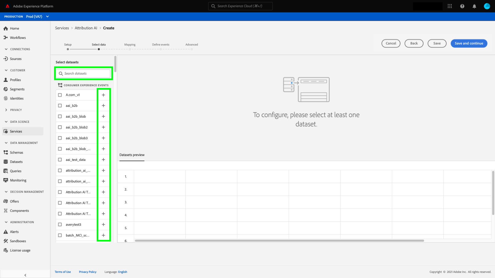
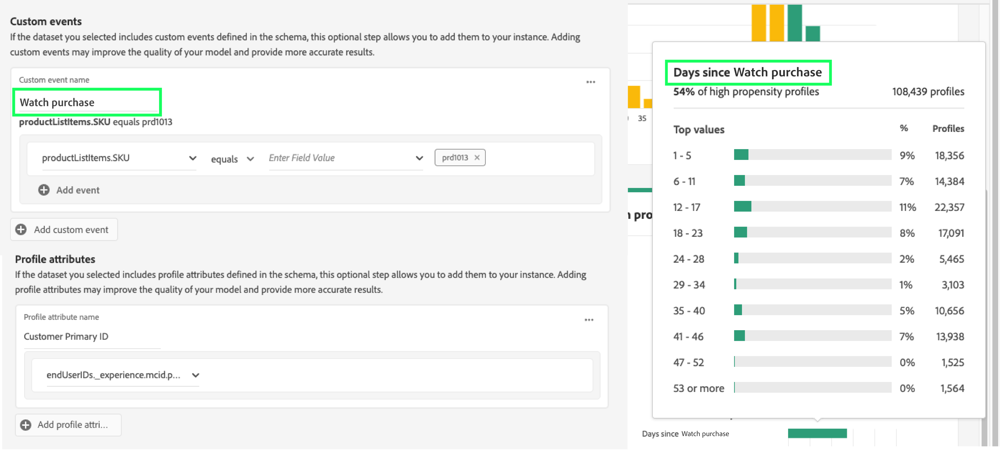

# Konfigurera en AI-instans för kund

Med kundens AI, som en del av AI/ML-tjänsterna, kan ni generera anpassade benägenhetspoäng utan att behöva bekymra er om maskininlärning.

AI/ML-tjänster ger kunden AI som en lättanvänd Adobe Sensei-tjänst som kan konfigureras för olika användningsområden. I följande avsnitt beskrivs hur du konfigurerar en instans av Kundens AI.

## Skapa en instans {#set-up-your-instance}

I Experience Platform-gränssnittet väljer du **[!UICONTROL Services]** i den vänstra navigeringen. Webbläsaren **[!UICONTROL Services]** visas och visar alla tillgängliga tjänster. Välj **[!UICONTROL Open]** i behållaren för kund-AI.

Gränssnittet **Kund-AI** visas och alla tjänstinstanser visas.

- Du hittar måttet **[!UICONTROL Total profiles scored]** i den nedre högra delen av behållaren **[!UICONTROL Create instance]**. Det här måttet spårar det totala antalet profiler som kunden har bedömt för det aktuella kalenderåret, inklusive alla sandlådemiljöer och eventuella borttagna tjänstinstanser.

Tjänstinstanser kan redigeras, klonas och tas bort med kontrollerna till höger i användargränssnittet. Om du vill visa dessa kontroller väljer du en instans från din befintliga **[!UICONTROL Service instances]**. Kontrollerna innehåller följande:

- **[!UICONTROL Edit]**: Om du väljer **[!UICONTROL Edit]** kan du ändra en befintlig tjänstinstans. Du kan redigera instansens namn, beskrivning och bedömningsfrekvens.
- **[!UICONTROL Clone]**: Om du väljer **[!UICONTROL Clone]** kopieras den valda tjänstinstansinställningen. Du kan sedan ändra arbetsflödet för att göra mindre ändringar och byta namn på det som en ny instans.
- **[!UICONTROL Delete]**: Du kan ta bort en tjänstinstans inklusive historikkörningar. Motsvarande utdatauppsättning kommer att tas bort från Experience Platform. Poäng som synkroniserades till kundprofilen i realtid tas dock inte bort.
- **[!UICONTROL Data source]**: En länk till datauppsättningen som används av den här instansen. Om du använder flera datauppsättningar och markerar hyperlänktexten, öppnas förhandsvisningsprogramvaran för datauppsättningen.
- **[!UICONTROL Last run details]**: Detta visas bara när en körning misslyckas. Här visas information om varför körningen misslyckades, t.ex. felkoder.
- **[!UICONTROL Score definition]**: En snabb översikt över målet som du konfigurerade för den här instansen.

Om du vill skapa en ny instans väljer du **[!UICONTROL Create instance]**.

## Konfigurera

Arbetsflödet för att skapa instanser visas med början i steget **[!UICONTROL Set up]**.

Nedan finns viktig information om värden som du måste ge instansen:

-**[!UICONTROL Name]:** Instansens namn används på alla platser där kundens AI-poäng visas. Därför bör namn beskriva vad förutsägelsepoängen representerar. Exempel:&quot;Sannolikhet för att avbryta tidskriftsprenumeration&quot;.

-**[!UICONTROL Description]:** En beskrivning som anger vad du försöker förutsäga.

-**[!UICONTROL Propensity type]:** Propensitetstypen avgör poängens och mätarpolaritetens avsikt. Du kan antingen välja **[!UICONTROL Churn]** eller **[!UICONTROL Conversion]**. Mer information om hur benägenhetstypen påverkar instansen finns i anteckningen under [poängsammanfattning](./discover-insights.md#scoring-summary) i dokumentet med identifieringsinsikter.

Ange de värden som krävs och välj sedan **[!UICONTROL Next]** för att fortsätta.

## Markera data {#select-data}

Kunds-AI använder sig av data från Adobe Analytics, Adobe Audience Manager, Experience Events i allmänhet och Consumer Experience Event för att beräkna benägenhetspoängen. När du väljer en datauppsättning visas bara de som är kompatibla med kundens AI. Om du vill välja en datauppsättning markerar du symbolen (**+**) bredvid datauppsättningsnamnet eller markerar kryssrutan för att lägga till flera datauppsättningar samtidigt. Använd sökalternativet för att snabbt hitta de datauppsättningar du är intresserad av.

När du har valt de datauppsättningar du vill använda väljer du knappen **[!UICONTROL Add]** för att lägga till datauppsättningarna i förhandsgranskningsfönstret för datauppsättningen.

Om du väljer informationsikonen  bredvid datauppsättningen öppnas förhandsvisningspoveringen för datauppsättningen.

Förhandsgranskningen av datauppsättningen innehåller data som senaste uppdateringstid, källschema och en förhandsgranskning av de första tio kolumnerna.

Välj **[!UICONTROL Save]** om du vill spara dina utkast när du följer arbetsflödet. Du kan också spara utkastmodellkonfigurationer och gå vidare till nästa steg i arbetsflödet. Använd **[!UICONTROL Save and continue]** för att skapa och spara utkast under modellkonfigurationer. Med den här funktionen kan du skapa och spara utkast av modellkonfigurationen och den är särskilt användbar när du måste definiera många fält i konfigurationsarbetsflödet.

### Fullständighet för datauppsättning {#dataset-completeness}

Det finns ett procentvärde för datauppsättningens fullständighet i datauppsättningsförhandsvisningen. Det här värdet ger en snabb ögonblicksbild av hur många kolumner i datauppsättningen som är tomma/null. Om en datauppsättning innehåller många värden som saknas och dessa värden hämtas någon annanstans rekommenderar vi att du inkluderar datauppsättningen som innehåller de värden som saknas. I det här exemplet är person-ID tomt, men person-ID fångas in i en separat datauppsättning som kan inkluderas.

>[!NOTE]
>
>Datauppsättningens fullständighet beräknas med hjälp av det maximala utbildningsfönstret för kundens AI (ett år). Detta innebär att data som är mer än ett år gamla inte beaktas när datamängdens fullständighetsvärde visas.

### Välj en identitet {#identity}

Nu kan du koppla flera datauppsättningar till varandra baserat på identitetskartan (fältet). Du måste välja en identitetstyp (kallas även&quot;id namespace&quot;) och ett identitetsvärde i det namnutrymmet. Om du har tilldelat mer än ett fält som en identitet i ditt schema under samma namnområde, visas alla tilldelade identitetsvärden i den listruta för identitet som föregås av namnutrymmet `EMAIL (personalEmail.address)` eller `EMAIL (workEmail.address)`.

>[!IMPORTANT]
>
>Samma identitetstyp (namnutrymme) måste användas för varje datamängd som du väljer. En grön bock visas bredvid identitetstypen i identitetskolumnen som anger att datauppsättningarna är kompatibla. Om du till exempel använder namnutrymmet Telefon och `mobilePhone.number` som identifierare måste alla identifierare för de återstående datauppsättningarna innehålla och använda namnutrymmet Telefon.

Markera en identitet genom att markera det understrukna värdet i identitetskolumnen. Välj en identitetsleverantör.

Om fler än en identitet är tillgänglig i ett namnutrymme måste du välja rätt identitetsfält för ditt användningsfall. Det finns till exempel två e-postidentiteter tillgängliga i e-postnamnutrymmet, ett arbete och en personlig e-postadress. Beroende på användningsfallet är det troligare att ett personligt e-postmeddelande fylls i och är mer användbart i individuella prognoser. Det innebär att `EMAIL (personalEmail.address)` väljs som identitet.

>[!NOTE]
>
> Om det inte finns någon giltig identitetstyp (namnrymd) för en datauppsättning måste du ange en primär identitet och tilldela den till ett identitetsnamnområde med [schemaredigeraren](../../../xdm/schema/composition.md#identity). Mer information om namnutrymmen och identiteter finns i dokumentationen för [identitetstjänstens namnutrymmen](../../../identity-service/features/namespaces.md).

## Definiera mål {#define-a-goal}

Steget **[!UICONTROL Define goal]** visas och innehåller en interaktiv miljö där du kan definiera ett förutsägelsemål visuellt. Ett mål består av en eller flera händelser, där varje händelses förekomst baseras på det villkor den innehåller. Målet för en kundens AI-instans är att fastställa sannolikheten för att uppnå dess mål inom en viss tidsram.

Om du vill skapa ett mål väljer du **[!UICONTROL Enter Field Name]** och följs av ett fält i listrutan. Välj den andra inmatningen, en sats för händelsens villkor, och ange sedan eventuellt målvärdet för att slutföra händelsen. Ytterligare händelser kan konfigureras genom att välja **[!UICONTROL Add event]**. Slutför målet genom att tillämpa en tidsram för förutsägelse i antal dagar och välj sedan **[!UICONTROL Next]**.

### Inträffar och kommer inte att inträffa

När du definierar ditt mål kan du välja **[!UICONTROL Will occur]** eller **[!UICONTROL Will not occur]**. Om du väljer **[!UICONTROL Will occur]** innebär det att de händelsevillkor du definierar måste uppfyllas för att en kunds händelsedata ska inkluderas i insikterna-gränssnittet.

Om du till exempel vill konfigurera en app för att förutsäga om en kund kommer att göra ett köp, kan du välja **[!UICONTROL Will occur]** följt av **[!UICONTROL All of]** och sedan ange **commerce.purchase.id** (eller ett liknande fält) och **[!UICONTROL exists]** som operator.

<!--  -->

Det kan dock finnas fall då du är intresserad av att förutsäga om en händelse inte kommer att inträffa inom en viss tidsperiod. Om du vill konfigurera ett mål med det här alternativet väljer du **[!UICONTROL Will not occur]** i den översta listrutan.

Om du till exempel är intresserad av att förutsäga vilka kunder som blir mindre engagerade och inte besöker inloggningssidan för ditt konto nästa månad. Markera **[!UICONTROL Will not occur]** följt av **[!UICONTROL All of]** och ange sedan **web.webInteraction.URL** (eller ett liknande fält) och **[!UICONTROL equals]** som operatorn med **account-login** som värde.

### Alla och alla

I vissa fall kanske du vill förutsäga om en kombination av händelser kommer att inträffa och i andra fall kanske du vill förutsäga förekomsten av en händelse från en fördefinierad uppsättning. För att kunna förutsäga om en kund kommer att ha en kombination av händelser väljer du alternativet **[!UICONTROL All of]** i listrutan på den andra nivån på sidan **[!UICONTROL Define Goal]**.

Du kanske vill förutsäga om en kund köper en viss produkt. Det här förutsägelsemålet definieras av två villkor: en `commerce.order.purchaseID` **finns** och `productListItems.SKU` **är lika med** ett visst värde.

För att kunna förutsäga om en kund kommer att ha någon händelse från en given uppsättning kan du använda alternativet **[!UICONTROL Any of]**.

Du kanske vill förutsäga om en kund besöker en viss URL-adress eller en webbsida med ett visst namn. Det här förutsägelsemålet definieras av två villkor: `web.webPageDetails.URL` **börjar med** ett visst värde och `web.webPageDetails.name` **börjar med** ett visst värde.

### Berättigad population *(valfritt)*

Som standard genereras benägenhetspoäng för alla profiler såvida inte en stödberättigad population anges. Du kan ange en berättigad population genom att definiera villkor för att inkludera eller exkludera profiler baserat på händelser.

### Anpassade händelser (*valfria*) {#custom-events}

Om du har ytterligare information utöver de [standardhändelsefält](../data-requirements.md#standard-events) som används av kundens AI för att generera benägenhetspoäng, finns det ett anpassat händelsealternativ. Om du använder det här alternativet kan du lägga till ytterligare händelser som du anser vara inflytelserika, vilket kan förbättra modellens kvalitet och bidra till mer korrekta resultat. Om den datamängd du har valt innehåller anpassade händelser som har definierats i ditt schema, kan du lägga till dem i din instans.

>[!NOTE]
>
> En detaljerad förklaring om hur anpassade händelser påverkar kundens AI-poängresultat finns i avsnittet [Exempel på anpassade händelser](#custom-event).

Välj **[!UICONTROL Add custom event]** om du vill lägga till en anpassad händelse. Därefter anger du ett anpassat händelsenamn och mappar det till händelsefältet i schemat. Anpassade händelsenamn visas i stället för fältvärdet när du tittar på inflytelserika faktorer och andra insikter. Det innebär att det anpassade händelsenamnet används i stället för händelsens ID/värde. Mer information om hur anpassade händelser visas finns i exempelavsnittet [för anpassade händelser](#custom-event). Dessa ytterligare anpassade händelser används av kundens AI för att förbättra modellens kvalitet och ge mer korrekta resultat.

Välj sedan den operator som du vill använda i listrutan med tillgängliga operatorer. Endast operatorer som är kompatibla med händelsen visas.

Ange fältvärdena om den markerade operatorn kräver ett. I det här exemplet behöver vi bara se om det finns ett hotell- eller restaurangbokningar. Men om vi vill vara mer exakta kan vi använda likhetsoperatorn och ange ett exakt värde i värdeprompten.

När du är klar väljer du **[!UICONTROL Next]** i det övre högra hörnet för att fortsätta.

### Anpassade profilattribut (*valfria*)

Du kan definiera viktiga profildatauppsättningsfält (med tidsstämplar) i dina data utöver de [standardhändelsefält](../data-requirements.md#standard-events) som används av kundens AI för att generera benägenhetspoäng. Om du använder det här alternativet kan du lägga till ytterligare profilattribut som du anser vara inflytelserika, vilket kan förbättra modellens kvalitet och ge mer korrekta resultat. Om du dessutom lägger till anpassade profilattribut kan kundens AI bättre visa hur specifika profiler hamnar i en benägenhetsklocka.

>[!NOTE]
>
>När du lägger till ett anpassat profilattribut följer du samma arbetsflöde som när du lägger till en anpassad händelse. Ungefär som anpassade händelser påverkar anpassade profilattribut din modellbedömning på samma sätt. Mer information finns i avsnittet [Exempel på anpassade händelser](#custom-event).

#### Välj profilattribut från export av ögonblicksbild av profil

Du kan också välja att ta med profilattribut från den dagliga exporten av ögonblicksbilder. Dessa attribut synkroniseras med export av ögonblicksbilder och visar det senast tillgängliga värdet. De visas automatiskt och kräver inte att en datauppsättning väljs i konfigurationssteget.

>[!WARNING]
>
> Välj inte ett profilattribut som har uppdaterats som ett resultat av förutsägelsemålet eller som är mycket korrelerat med förutsägelsemålet. Detta resulterar i dataläckage och överpassning av modellen. `total_purchases_in_the_last_3_months` är till exempel ett attribut som förutser köpkonvertering.

### Lägga till ett eget händelseexempel {#custom-event}

I följande exempel läggs ett anpassat händelse- och profilattribut till i en Kund AI-instans. Målet med kundens AI-instans är att förutsäga sannolikheten för att en kund köper en annan Luma-produkt inom de kommande 60 dagarna. Vanligtvis är produktdata länkade till en produkt-SKU. I det här fallet är SKU `prd1013`. När kundens AI-modell har tränats/bedömts kan denna SKU länkas till en händelse och visas som en inflytelserik faktor för en benägenhetspyts.

Kund-AI tillämpar automatiskt generering av funktioner som &quot;Dagar sedan&quot; eller &quot;Antal&quot; mot anpassade händelser som **Titta på köp**. Om den här händelsen ansågs vara en inflytelserik faktor för varför kunderna är höga, medelstora eller låga, visas den som `Days since prd1013 purchase` eller `Count of prd1013 purchase` av kundens AI. Genom att skapa detta som en anpassad händelse kan du ge händelsen ett nytt namn som gör resultatet mycket lättare att läsa. Exempel: `Days since Watch purchase`. Dessutom använder kundens AI den här händelsen i utbildningen och poängsättningen även om händelsen inte är en standardhändelse. Det innebär att du kan lägga till flera händelser som du tror kan vara inflytelserika och anpassa modellen ytterligare genom att inkludera data som reservationer, besöksloggar och andra händelser. Genom att lägga till dessa datapunkter ökar du noggrannheten och precisionen i kundens AI-modell ytterligare.

## Ange alternativ

Stegen för inställningsalternativ gör att du kan konfigurera ett schema för att automatisera förutsägelsekörningar, definiera undantag för förutsägelser för att filtrera vissa händelser och växla mellan att aktivera och inaktivera **[!UICONTROL Profile]**.

### Konfigurera ett schema *(valfritt)* {#configure-a-schedule}

Om du vill konfigurera ett poängschema börjar du med att konfigurera **[!UICONTROL Scoring Frequency]**. Automatiserade prognoskörningar kan schemaläggas att köras antingen varje vecka eller varje månad.

### Undantag för förutsägelse *(valfritt)*

Om datauppsättningen innehåller kolumner som lagts till som testdata kan du lägga till den kolumnen eller händelsen i en exkluderingslista genom att välja **[!UICONTROL Add Exclusion]** och sedan ange det fält som du vill utesluta. Detta förhindrar att händelser som uppfyller vissa villkor utvärderas när bakgrundsmusik genereras. Den här funktionen kan användas för att filtrera bort irrelevanta dataindata eller kampanjer.

Om du vill exkludera en händelse väljer du **[!UICONTROL Add exclusion]** och definierar händelsen. Om du vill ta bort ett undantag markerar du ellipserna (**[!UICONTROL ...]**) längst upp till höger i händelsebehållaren och väljer sedan **[!UICONTROL Remove Container]**.

### Växla profil

Tack vare växlingsknappen Profil kan kundens artificiell intelligens (AI) exportera poängresultaten till kundprofilen i realtid. Om du inaktiverar den här växeln kan du inte lägga till modellens poängresultat i profilen. Resultat av AI-bedömning för kunder är fortfarande tillgängliga med den här funktionen inaktiverad.

När du använder AI för första gången kan du inaktivera den här funktionen tills du är nöjd med modellens utdataresultat. Detta förhindrar att du överför flera poängsättningsdatauppsättningar till dina kundprofiler samtidigt som du finjusterar modellen. När du har kalibrerat modellen kan du klona modellen med [klonalternativet](#set-up-your-instance) från sidan **Tjänstförekomster**. På så sätt kan du skapa en kopia av modellen och aktivera profilen.

När du har angett ditt poängschema, inkluderat undantag för förutsägelser och profilen växlar var du vill att det ska vara, väljer du **[!UICONTROL Finish]** i det övre högra hörnet för att skapa en Kund-AI-instans.

Om instansen skapas utan fel utlöses en förutsägelsekörning omedelbart och efterföljande körningar utförs enligt ditt definierade schema.

>[!NOTE]
>
>Beroende på storleken på indata kan det ta upp till 24 timmar att slutföra förutsägelser.

Genom att följa det här avsnittet har du konfigurerat en instans av Customer AI och utfört en förutsägelsekörning. När körningen är klar fyller poängsatta insikter automatiskt i profiler med förutbestämda poängvärden om profilväxlingen är aktiverad. Vänta i upp till 24 timmar innan du fortsätter till nästa avsnitt i den här självstudien.

## Nästa steg {#next-steps}

Genom att följa den här självstudiekursen har du konfigurerat en instans av kundens AI och genererat benägenhetspoäng. Du kan nu välja att använda segmentbyggaren för att [skapa kundsegment med förutbestämda poäng](./create-segment.md) eller [identifiera insikter med kundens AI](./discover-insights.md).

## Ytterligare resurser

Följande video är utformad för att ge dig en bättre förståelse för hur kundens AI kan konfigureras. Dessutom finns bästa praxis och exempel på användningsfall.

>[!IMPORTANT]
>
> Följande video är inaktuell. Den senaste informationen finns i dokumentationen.

>[!VIDEO](https://video.tv.adobe.com/v/32665?learn=on&quality=12)
