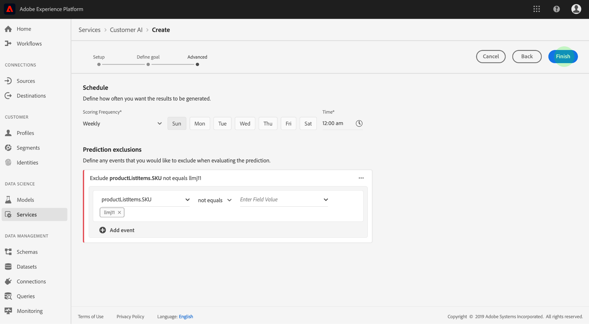

# Konfigurera en AI-instans för kund

Tack vare kundens AI, som ingår i Intelligent Services, kan ni generera anpassade benägenhetspoäng utan att behöva bekymra er om maskininlärning.

Intelligenta tjänster ger kunden artificiell intelligens (AI) som en lättanvänd Adobe Sensei-tjänst som kan konfigureras för olika användningsområden. I följande avsnitt beskrivs hur du konfigurerar en instans av Kundens AI.

## Konfigurera din instans {#set-up-your-instance}

Klicka i det vänstra navigeringsfältet **[!UICONTROL Services]** i plattformsgränssnittet. Webbläsaren visas och **[!UICONTROL Services]** visar alla tillgängliga tjänster. Klicka på i behållaren för kundens AI **[!UICONTROL Open]**.

På *kundens AI* -skärm visas alla befintliga AI-instanser för kunder. Klicka på **[!UICONTROL Create instance]**.

Arbetsflödet för att skapa instanser visas med början i *steget Konfigurera* .

Nedan finns viktig information om värden som du måste ge instansen:

* Instansens namn används på alla platser där kundens AI-poäng visas. Namnen bör därför beskriva vad förutsägelsepoängen representerar, till exempel&quot;Sannolikhet för att avbryta tidskriftsprenumeration&quot;.

* Propensitetstypen bestämmer poängsättets och den metriska polaritetens avsikt. Du kan antingen välja **[!UICONTROL Churn]** eller **[!UICONTROL Conversion]**. Se anteckningen under [poängsammanfattning](./discover-insights.md#scoring-summary) i dokumentet om upptäckt av insikter för mer information om hur benägenhetstypen påverkar din instans.

* Datakällan är den plats där data finns. Datauppsättningen är den indatamängd som används för att förutsäga bakgrundsmusik. Kunds-AI använder per design data om kundupplevelsehändelser för att beräkna benägenhetspoängen. När du väljer en datauppsättning i listruteväljaren visas bara de som är kompatibla med kundens AI.

* Som standard genereras benägenhetspoäng för alla profiler såvida inte en stödberättigad population anges. Du kan ange en berättigad population genom att definiera villkor för att inkludera eller exkludera profiler baserat på händelser.

Ange önskade värden och klicka sedan på **[!UICONTROL Next]**.

### Definiera ett mål {#define-a-goal}

Steget *Definiera mål* visas och innehåller en interaktiv miljö där du kan definiera ett mål visuellt. Ett mål består av en eller flera händelser, där varje händelses förekomst baseras på det villkor den innehåller. Målet för en kundens AI-instans är att fastställa sannolikheten för att uppnå dess mål inom en viss tidsram.

Klicka på **[!UICONTROL Enter Field Name]** och välj ett fält i listrutan. Klicka på den andra inmatningen och välj en sats för händelsens villkor och ange sedan ett målvärde för att slutföra händelsen. Ytterligare händelser kan konfigureras genom att klicka **[!UICONTROL Add event]**. Slutför målet genom att tillämpa en tidsram för förutsägelse i antal dagar och klicka sedan på **[!UICONTROL Next]**.

### Konfigurera ett schema *(valfritt)* {#configure-a-schedule}

Det *avancerade* steget visas. Med det här valfria steget kan du konfigurera ett schema för att automatisera prediktionskörningar, definiera undantag för förutsägelser för att filtrera vissa händelser eller klicka **[!UICONTROL Finish]** om inget behövs.

Konfigurera ett poängschema genom att konfigurera *poängfrekvensen*. Automatiserade prognoskörningar kan schemaläggas att köras antingen varje vecka eller varje månad.

Under schemakonfigurationen kan du definiera undantag för förutsägelse för att förhindra händelser som uppfyller vissa villkor från att utvärderas när du genererar poäng. Den här funktionen kan användas för att filtrera bort irrelevanta dataindata.

Om du vill utesluta vissa händelser klickar du på **[!UICONTROL Add exclusion]** och definierar händelsen på samma sätt som målet definieras. Om du vill ta bort ett undantag klickar du på ellipserna (**[!UICONTROL ...]**) längst upp till höger i händelsebehållaren och sedan på **[!UICONTROL Remove Container]**.

Uteslut händelser efter behov och klicka sedan på **[!UICONTROL Finish]** för att skapa instansen.

Om instansen skapas utan fel utlöses en förutsägelsekörning omedelbart och efterföljande körningar utförs enligt ditt definierade schema.

>[!NOTE]
>
>Beroende på storleken på indata kan det ta upp till 24 timmar att slutföra förutsägelser.

Genom att följa det här avsnittet har du konfigurerat en instans av Kundens AI och en förutsägelsekörning utfördes. När körningen är klar fyller poängsatta insikter automatiskt i profiler med förutbestämda poäng. Vänta i upp till 24 timmar innan du fortsätter till nästa avsnitt i den här självstudiekursen.

## Nästa steg {#next-steps}

Genom att följa den här självstudiekursen har du konfigurerat en instans av kundens AI och genererat benägenhetspoäng. Du kan nu välja att använda segmentbyggaren för att [skapa kundsegment med förutbestämda poäng](./create-segment.md) eller [identifiera insikter med kundens AI](./discover-insights.md).

## Ytterligare resurser

Följande video är utformad för att ge dig en bättre förståelse för hur kundens AI kan konfigureras. Dessutom finns bästa praxis och exempel på användningsfall.

>[!VIDEO](https://video.tv.adobe.com/v/32665?learn=on&quality=12)

