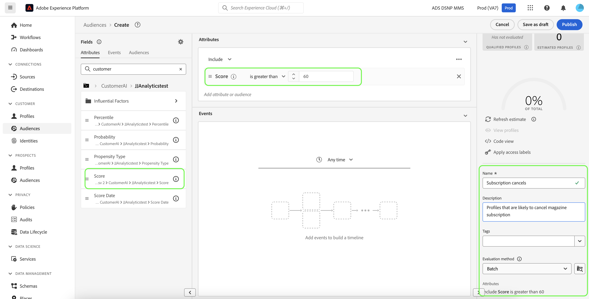

# Skapa kundsegment med förutbestämda poäng

När en förutsägelsekörning är klar används automatiskt förväntade benägenhetspoäng av profiler. Genom att förbättra profiler med kundens AI-poäng kan man skapa kundsegment för att hitta målgrupper baserat på deras benägenhetspoäng. I det här avsnittet beskrivs stegen för hur du skapar segment med hjälp av segmentverktyget. En mer robust självstudiekurs om hur du skapar segment finns i användarhandboken för [Segment Builder](../../../segmentation/ui/segment-builder.md).

>[!IMPORTANT]
>
>Om du vill använda den här metoden måste kundprofilen i realtid aktiveras för datauppsättningen.

I Experience Platform-gränssnittet klickar du på **[!UICONTROL Segments]** i den vänstra navigeringen och sedan på **[!UICONTROL Create segment]**.

**Segment Builder** visas. Klicka på mappen **[!UICONTROL XDM Individual Profile]** i den vänstra kolumnen **[!UICONTROL Fields]** och under fliken **[!UICONTROL Attributes]** och klicka sedan på mappen med organisationens namnområde. Mappen **[!UICONTROL Customer AI]** innehåller resultatet av förutsägelsekörningar och namnges efter instansen som poängen tillhör. Klicka på en instansmapp för att komma åt resultatet av den önskade instansen.

Placerad i mitten av Segment Builder, dra och släpp attributet **[!UICONTROL Score]** på *regelbyggararbetsytan* för att definiera en regel.

Ange ett namn för segmentet under den högra kolumnen *Segmentegenskaper*.

Ovanför den vänstra kolumnen *Fält* klickar du på ikonen **kugghjulet** och väljer en *sammanfogningsprincip* i listrutan. Klicka på **[!UICONTROL Save]** för att skapa segmentet.

## Nästa steg

Genom att följa den här självstudiekursen har du hittat målgrupper baserat på deras benägenhetspoäng med hjälp av segmentbyggaren. Nu kan ni inrikta er på era målgrupper genom att aktivera dem för destinationer. Mer information finns i [målöversikten](../../../destinations/home.md).
