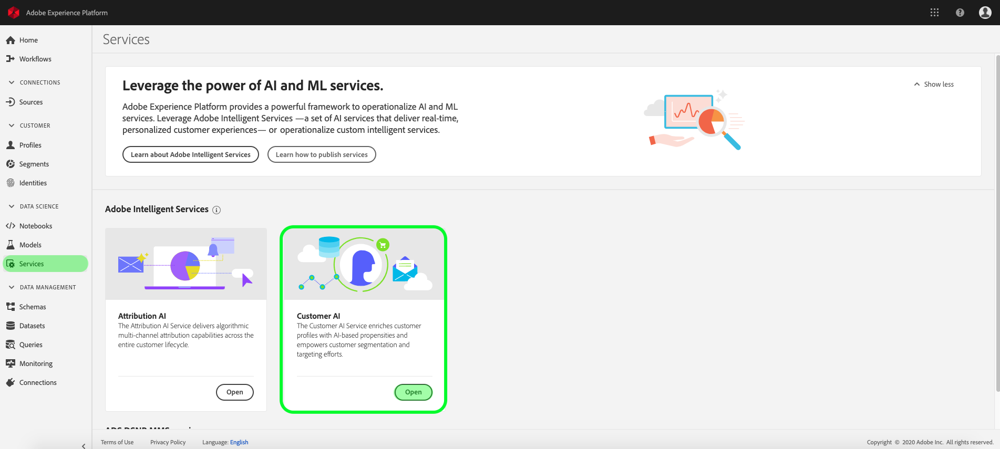
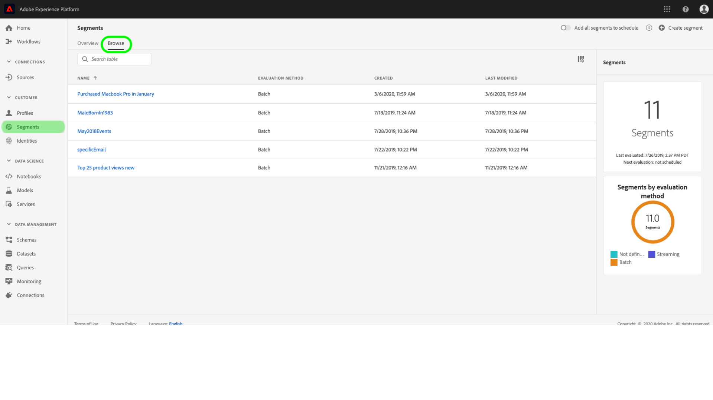

# Upptäck insikter med kundens AI

Kundens AI, som en del av de intelligenta tjänsterna, ger marknadsförarna möjlighet att utnyttja Adobe Sensei för att förutse vad kunderna kommer att göra härnäst. Kundens AI används för att generera anpassade benägenhetspoäng som bortfall och konvertering för enskilda profiler i stor skala. Detta uppnås utan att man behöver omvandla affärsbehoven till maskininlärningsproblem, välja en algoritm, utbildning eller driftsättning.

Det här dokumentet fungerar som en guide för interaktion med Service Instance Insights i användargränssnittet för AI för Intelligent Services.

## Komma igång

För att kunna utnyttja insikter om kundens AI måste du ha en tjänstinstans med status lyckad körning tillgänglig. Om du vill skapa en ny tjänstinstans går du till [Configuring a Customer AI instance](./configure.md). Om du nyligen har skapat en tjänstinstans och den fortfarande håller på att träna och betygsätta, kan du vänta i 24 timmar tills den är klar.

## Översikt över tjänstinstans

Klicka på **[!UICONTROL Services]** i det vänstra navigeringsfältet i gränssnittet för [!DNL Adobe Experience Platform]. Webbläsaren *Tjänster* visas och visar tillgängliga intelligenta tjänster. Klicka på **[!UICONTROL Open]** i behållaren för kundens AI.

Kundens AI-tjänstsida visas. På den här sidan visas tjänstinstanser för kundens AI och information om dem, inklusive namnet på instansen, typ av benägenhet, hur ofta instansen körs och status för den senaste uppdateringen.

>[!NOTE]
>
>Det är bara tjänstinstanser som har slutfört poängsättningen som har insikter.

Klicka på ett tjänstinstansnamn för att börja.

Därefter visas informationssidan för den tjänstinstansen, där du får visualiseringar av dina data. Visualiseringarna och vad du kan göra med data beskrivs mer ingående i den här handboken.

### Information om tjänstinstans

Det finns två sätt att visa tjänstinstansinformation: från kontrollpanelen eller i tjänstinstansen.

Om du vill visa en översikt över tjänstinstansinformationen på kontrollpanelen väljer du en tjänstinstansbehållare och undviker hyperlänken som är kopplad till namnet. Då öppnas en högerrät som innehåller ytterligare information. Kontrollerna innehåller följande:

- **[!UICONTROL Edit]**: Om du väljer  **[!UICONTROL Edit]** det här alternativet kan du ändra en befintlig tjänstinstans. Du kan redigera namn, beskrivning och bedömningsfrekvens för instansen.
- **[!UICONTROL Clone]**: Om du väljer  **[!UICONTROL Clone]** det här alternativet kopieras den valda tjänstinstansen. Du kan sedan ändra arbetsflödet för att göra mindre ändringar och byta namn på det som en ny instans.
- **[!UICONTROL Delete]**: Du kan ta bort en tjänstinstans, inklusive eventuella tidigare körningar.
- **[!UICONTROL Data source]**: En länk till den datauppsättning som används av den här instansen.
- **[!UICONTROL Run Frequency]**: Hur ofta en poängsättning äger rum och när.
- **[!UICONTROL Score definition]**: En snabb översikt över målet som du konfigurerade för den här instansen.

>[!NOTE]
>
>Om en poängkörning misslyckas visas ett felmeddelande. Felmeddelandet visas under **Information om senaste körning** i den högra listen, som bara är synlig för misslyckade körningar.

Det andra sättet att visa ytterligare information för en tjänstinstans finns på sidan med insikter. Du kan klicka på **[!UICONTROL Show more]** i det övre högra hörnet för att fylla i en listruta. Detaljer visas, till exempel poängdefinitionen, när den skapades och benägenhetstypen. Mer information om de angivna egenskaperna finns på [Konfigurera en AI-instans](./configure.md).

### Redigera en instans

Om du vill redigera en instans klickar du på **[!UICONTROL Edit]** i navigeringen längst upp till höger.

Dialogrutan Redigera visas. Du kan redigera instansens namn, beskrivning, status och bedömningsfrekvens. Om du vill bekräfta ändringarna och stänga dialogrutan väljer du **[!UICONTROL Save]** i det nedre högra hörnet.

### Fler åtgärder

Knappen **[!UICONTROL More actions]** finns i den övre högra navigeringen bredvid **[!UICONTROL Edit]**. När du klickar på **[!UICONTROL More actions]** öppnas en listruta där du kan välja någon av följande åtgärder:

- **[!UICONTROL Clone]**: Om du väljer  **[!UICONTROL Clone]** det här alternativet kopieras tjänstinstansens inställning. Du kan sedan ändra arbetsflödet för att göra mindre ändringar och byta namn på det som en ny instans.
- **[!UICONTROL Delete]**: Tar bort instansen.
- **[!UICONTROL Access scores]**: När du väljer  **[!UICONTROL Access scores]** det här alternativet öppnas en dialogruta med en länk till  [nedladdningspoängen för Customer ](./download-scores.md) AItutorial. Dialogrutan innehåller även det datauppsättnings-ID som krävs för att göra API-anrop.
- **[!UICONTROL View run history]**: En dialogruta med en lista över alla poängserier som är associerade med tjänstinstansen visas.

## Bedömningssammanfattning {#scoring-summary}

Bedömningssammanfattning visar det totala antalet profiler som poängsatts och kategoriserar dem i grupper som innehåller hög, medelhög och låg benägenhet. Propensitetsbucketerna baseras på poängintervall, låg är mindre än 24, medel är 25 till 74 och hög är över 74. Varje hink har en färg som motsvarar teckenförklaringen.

>[!NOTE]
>
>Om det är en konverteringsbenägenhetspoäng visas de höga poängen i grönt och de låga poängen i rött. Om du förutser kurvbenägenheten att detta vänds är de höga poängen röda och de låga poängen gröna. Mediefiltret förblir gult oavsett vilken typ av benägenhet du väljer.

Du kan hovra över en färg i ringen om du vill visa ytterligare information, till exempel ett procenttal och det totala antalet profiler som tillhör en hink.

## Distribution av bakgrundsmusik

Kortet **[!UICONTROL Distribution of Scores]** ger en visuell sammanfattning av populationen baserat på poängen. Färgerna som visas på [!UICONTROL Distribution of Scores]-kortet representerar den typ av benägenhetspoäng som genereras. Genom att hovra över någon av poängfördelningarna får du det exakta antal som hör till den fördelningen.

## Influensafaktorer

För varje poänggrupp skapas ett kort som visar de tio viktigaste inflytelserika faktorerna för den aktuella bucket. Inflytelserika faktorer ger er ytterligare information om varför era kunder tillhör olika poänggrupper.

### Influentiella faktornivåreglagen

När du hovrar över någon av de viktigaste inflytelserika faktorerna bryts data ytterligare. Du får en översikt över varför vissa profiler tillhör en benägenhetsklocka. Beroende på faktorn kan du få tal, kategoriserade värden eller booleska värden. I exemplet nedan visas kategoriska värden per region.

Dessutom kan du använda drolldowns för att jämföra en fördelningsfaktor om den förekommer i två eller flera benägenhetsintervall och skapa mer specifika segment med dessa värden. I följande exempel visas det första användningsfallet:

Du ser att det är mindre troligt att profiler med låg benägenhet att konvertera har gjort ett besök på adobe.com-webbsidorna nyligen. Faktorn&quot;Dagar sedan senaste webVisit&quot; har bara 8 % täckning jämfört med 26 % i medelstora prioritetsprofiler. Med hjälp av dessa tal kan du jämföra fördelningen inom varje hink för faktorn. Den här informationen kan användas för att dra slutsatsen att den senaste webbbesöket inte har lika stor inverkan på den låga benägenhetsknappen som den är i en större benägenhetsklocka.

### Skapa ett segment

Om du markerar knappen **[!UICONTROL Create Segment]** i någon av bucketerna för låg, medelhög och hög benägenhet dirigeras du om till segmentbyggaren.

>[!NOTE]
>
>Knappen **[!UICONTROL Create Segment]** är bara tillgänglig om kundprofilen i realtid är aktiverad för datauppsättningen. Mer information om hur du aktiverar kundprofilen i realtid finns i [Kundprofilöversikt i realtid](../../../rtcdp/overview.md).

Segmentverktyget används för att definiera ett segment. När du väljer **[!UICONTROL Create Segment]** på Insights-sidan lägger Kund-AI automatiskt till den valda bukettinformationen i segmentet. Slutför segmentskapandet genom att fylla i *Namn* och *Beskrivning*-behållare som finns till höger i segmentbyggarens användargränssnitt. När du har gett segmentet ett namn och en beskrivning klickar du på **[!UICONTROL Save]** i det övre högra hörnet.

>[!NOTE]
>
>Eftersom benägenhetspoängen skrivs till den enskilda profilen är de tillgängliga i segmentbyggaren som andra profilattribut. När du navigerar till segmentbyggaren för att skapa nya segment kan du se alla olika benägenhetspoäng under din namnområdes-AI för kunder.

Om du vill visa det nya segmentet i plattformsgränssnittet klickar du på **[!UICONTROL Segments]** i den vänstra navigeringen. Sidan **[!UICONTROL Browse]** visas och visar alla tillgängliga segment.

## Nästa steg

I det här dokumentet beskrevs de insikter som en kundens AI-tjänstinstans har gett. Du kan nu fortsätta med självstudiekursen om [nedladdning av bakgrundsmusik i Customer AI](./download-scores.md) eller gå till de andra [Adobe Intelligent Services](../../home.md)-guiderna som erbjuds.

## Ytterligare resurser

I följande videofilm visas hur du använder AI från kunder för att se resultatet av modellerna och de inflytelserika faktorerna.

>[!VIDEO](https://video.tv.adobe.com/v/32666?learn=on&quality=12)