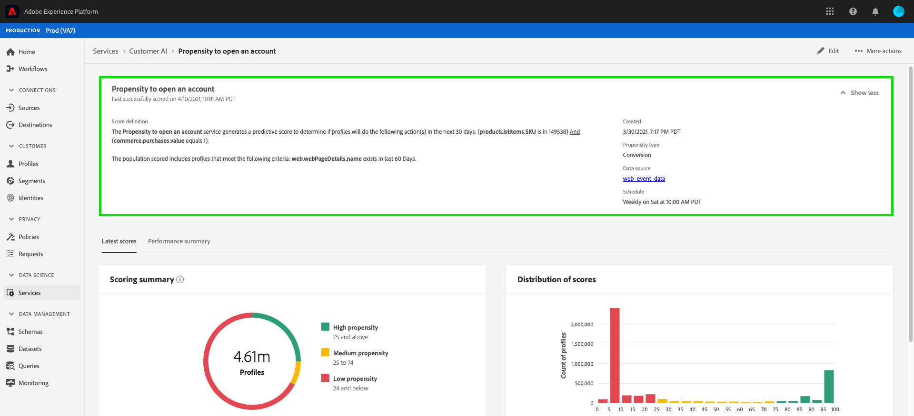

# Identifiera insikter med kundens AI

Kundens AI, som en del av de intelligenta tjänsterna, ger marknadsförarna möjlighet att utnyttja Adobe Sensei för att förutse vad kunderna kommer att göra härnäst. Kundens AI används för att generera anpassade benägenhetspoäng som bortfall och konvertering för enskilda profiler i stor skala. Detta uppnås utan att man behöver omvandla affärsbehoven till maskininlärningsproblem, välja en algoritm, utbildning eller driftsättning.

Det här dokumentet är en guide för interaktion med Service Instance Insights i användargränssnittet för AI för Intelligent Services.

## Komma igång

För att kunna utnyttja insikter om kundens AI måste du ha en tjänstinstans med status lyckad körning tillgänglig. Om du vill skapa en ny tjänstinstans går du till [Konfigurera en AI-instans](./configure.md)för kunder. Om du nyligen har skapat en tjänstinstans och den fortfarande håller på att träna och betygsätta, kan du vänta i 24 timmar tills den är klar.

## Översikt över tjänstinstans

In the [!DNL Adobe Experience Platform] UI, click **[!UICONTROL Services]** in the left navigation. Webbläsaren *Services* visas och visar tillgängliga Intelligent Services. Klicka på i behållaren för kundens AI **[!UICONTROL Open]**.

Kundens AI-tjänstsida visas. På den här sidan visas tjänstinstanser för kundens AI och information om dem, inklusive namnet på instansen, typ av benägenhet, hur ofta instansen körs och status för den senaste uppdateringen.

>[!NOTE]
>
>Det är bara tjänstinstanser som har slutfört poängsättningen som har insikter.

Klicka på ett tjänstinstansnamn för att börja.

Därefter visas informationssidan för den tjänstinstansen, där du får visualiseringar av dina data. Visualiseringarna och vad du kan göra med data beskrivs mer ingående i den här handboken.

### Information om tjänstinstans

Det finns två sätt att visa tjänstinstansinformation, det första från kontrollpanelen och det andra från tjänstinstansen.

Om du vill visa information från kontrollpanelen klickar du på en tjänstinstansbehållare och undviker den hyperlänk som är kopplad till namnet. Detta öppnar en höger ratt med ytterligare information som beskrivning, poängfrekvens, förutsägelsemål och stödberättigad population. Dessutom kan du välja att redigera och ta bort instansen genom att klicka på **[!UICONTROL Edit]** eller **[!UICONTROL Delete]**.

>[!NOTE]
>
>Om en poängkörning misslyckas visas ett felmeddelande. Felmeddelandet visas under *Senaste körningsinformation* i den högra listen, som bara är synlig för misslyckade körningar.

Det andra sättet att visa ytterligare information för en tjänstinstans finns på sidan med insikter. Du kan klicka **[!UICONTROL Show more]** i det övre högra hörnet för att fylla i en listruta. Detaljer visas, till exempel poängdefinitionen, när den skapades och benägenhetstypen. Mer information om egenskaperna finns i [Konfigurera en AI-instans](./configure.md).

### Redigera en instans

Om du vill redigera en instans klickar du **[!UICONTROL Edit]** i den övre högra navigeringen.

Dialogrutan Redigera visas. Du kan redigera *beskrivning* och *bedömningsfrekvens* för instansen. Bekräfta ändringarna och stäng dialogrutan genom att klicka **[!UICONTROL Edit]** i det nedre högra hörnet.

### Fler åtgärder

Knappen finns i den övre högra navigeringen bredvid **[!UICONTROL More actions]** **[!UICONTROL Edit]**. När du klickar **[!UICONTROL More actions]** öppnas en listruta där du kan välja någon av följande åtgärder:

- **[!UICONTROL Delete]**: Tar bort instansen.
- **[!UICONTROL Access scores]**: När du klickar på *Åtkomstpoäng* öppnas en dialogruta med en länk till [nedladdningspoängen för Kundens AI](./download-scores.md) -självstudiekurs. Dialogrutan innehåller även det datauppsättnings-ID som krävs för att göra API-anrop.
- **[!UICONTROL View run history]**: En dialogruta med en lista över alla poängserier som är associerade med tjänstinstansen visas.

## Poängsammanfattning {#scoring-summary}

Betygsningssammanfattning visar det totala antalet profiler med poäng och kategoriserar dem i grupper som innehåller hög, medelhög och låg benägenhet. Propensitetsbucketerna baseras på poängintervall, låg är mindre än 24, medel är 25 till 74 och hög är över 74. Varje hink har en färg som motsvarar teckenförklaringen.

>[!NOTE]
>
>Om det är en konverteringsbenägenhetspoäng visas de höga poängen i grönt och de låga poängen i rött. Om du förutser kurvbenägenheten att detta vänds är de höga poängen röda och de låga poängen gröna. Mediefiltret förblir gult oavsett vilken typ av benägenhet du väljer.

## Distribution av bakgrundsmusik

Distributionen av Scores ** - kortet ger en visuell sammanfattning av populationen baserat på poängen. Färgerna som visas på *Distribuera poäng* representerar den typ av poäng som genereras.

## Influensafaktorer

För varje poänggrupp skapas ett kort som visar de tio viktigaste inflytelserika faktorerna för den aktuella bucket. Inflytelserika faktorer ger er ytterligare information om varför era kunder tillhör olika poänggrupper.

### Skapa ett segment

Om du klickar på **[!UICONTROL Create Segment]** knappen i någon av buckarna för Låg, Medel eller Hög benägenhet dirigeras du om till segmentbyggaren.

>[!NOTE]
>Knappen är bara tillgänglig om kundprofilen i realtid är aktiverad för datauppsättningen. **[!UICONTROL Create Segment]** Mer information om hur du aktiverar kundprofilen i realtid finns i [Kundprofilöversikt](../../../rtcdp/overview.md)i realtid.

Segmentverktyget används för att definiera ett segment. När du väljer **[!UICONTROL Create Segment]** från Insights-sidan lägger Kund-AI automatiskt till den valda bukettinformationen i segmentet. Slutför segmentskapandet genom att fylla i behållarna *Namn* och *Beskrivning* som finns till höger i segmentbyggarens användargränssnitt. När du har gett segmentet ett namn och en beskrivning klickar du **[!UICONTROL Save]** i det övre högra hörnet.

>!![NOTE] Eftersom benägenhetspoängen skrivs till den enskilda profilen är de tillgängliga i segmentbyggaren som andra profilattribut. När du navigerar till segmentbyggaren för att skapa nya segment kan du se alla olika benägenhetspoäng under din namnområdes-AI för kunder.

Om du vill visa det nya segmentet i användargränssnittet i Platform klickar du **[!UICONTROL Segments]** i den vänstra navigeringen. Sidan *Bläddra* visas och alla tillgängliga segment visas.

## Nästa steg

I det här dokumentet beskrevs de insikter som en kundens AI-tjänstinstans har gett. Du kan nu fortsätta med självstudiekursen om [nedladdning av poäng i Customer AI](./download-scores.md) eller gå till de andra [Adobe Intelligent Services](../../home.md) -guiderna som erbjuds.

## Ytterligare resurser

I följande videofilm visas hur du använder AI från kunder för att se resultatet av modellerna och de inflytelserika faktorerna.

>[!VIDEO](https://video.tv.adobe.com/v/32666?learn=on&quality=12)