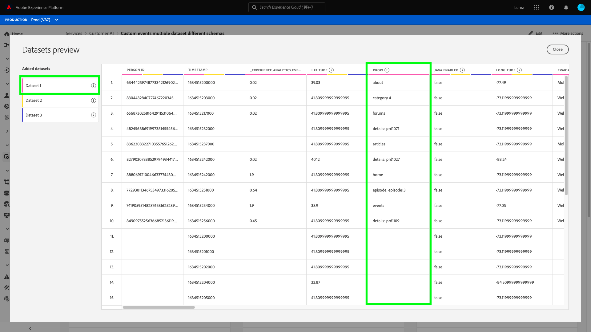

# Upptäck insikter med kundens AI

Kundens AI, som en del av de intelligenta tjänsterna, ger marknadsförarna möjlighet att utnyttja Adobe Sensei för att förutse vad kunderna kommer att göra härnäst. Kundens AI används för att generera anpassade benägenhetspoäng som bortfall och konvertering för enskilda profiler i stor skala. Detta uppnås utan att man behöver omvandla affärsbehoven till maskininlärningsproblem, välja en algoritm, utbildning eller driftsättning.

Det här dokumentet fungerar som en guide för interaktion med Service Instance Insights i användargränssnittet för AI för Intelligent Services.

## Komma igång

För att kunna utnyttja insikter om kundens AI måste du ha en tjänstinstans med status lyckad körning tillgänglig. Om du vill skapa en ny tjänstinstans går du till [Konfigurera en AI-instans för kund](./configure.md). Om du nyligen har skapat en tjänstinstans och den fortfarande håller på att träna och betygsätta, kan du vänta i 24 timmar tills den är klar.

## Översikt över tjänstinstans

I [!DNL Adobe Experience Platform] Gränssnitt, välj **[!UICONTROL Services]** i den vänstra navigeringen. The *Tjänster* webbläsaren visas och visar tillgängliga intelligenta tjänster. Välj **[!UICONTROL Open]**.

Kundens AI-tjänstsida visas. På den här sidan visas tjänstinstanser för kundens AI och information om dem, inklusive namnet på instansen, typ av benägenhet, hur ofta instansen körs och status för den senaste uppdateringen.

>[!NOTE]
>
>Det är bara tjänstinstanser som har slutfört poängsättningen som har insikter.

Välj ett tjänstinstansnamn som ska börja.

Därefter visas informationssidan för den aktuella tjänstinstansen med alternativet att välja **[!UICONTROL Latest scores]** eller **[!UICONTROL Performance summary]**. Standardfliken **[!UICONTROL Latest scores]** innehåller visualiseringar av dina data. Visualiseringarna och vad du kan göra med data beskrivs mer ingående i den här handboken.

The **[!UICONTROL Performance summary]** visas de faktiska bortfall- eller konverteringsfrekvenserna för varje prioritetsbucket. Mer information finns i avsnittet om [nyckeltal](#performance-metrics).

## Information om tjänstinstans

Det finns två sätt att visa tjänstinstansinformation: från kontrollpanelen eller i tjänstinstansen.

### Instrumentpanel för tjänstinstans

Om du vill visa en översikt över tjänstinstansinformationen på kontrollpanelen väljer du en tjänstinstansbehållare och undviker hyperlänken som är kopplad till namnet. Då öppnas en högerrät som innehåller ytterligare information. Kontrollerna innehåller följande:

- **[!UICONTROL Edit]**: Markera **[!UICONTROL Edit]** gör att du kan ändra en befintlig tjänstinstans. Du kan redigera instansens namn, beskrivning och bedömningsfrekvens.
- **[!UICONTROL Clone]**: Markera **[!UICONTROL Clone]** kopierar den valda tjänstinstansen. Du kan sedan ändra arbetsflödet för att göra mindre ändringar och byta namn på det som en ny instans.
- **[!UICONTROL Delete]**: Du kan ta bort en tjänstinstans, inklusive eventuella tidigare körningar.
- **[!UICONTROL Data source]**: En länk till den datauppsättning som används av den här instansen.
- **[!UICONTROL Run Frequency]**: Hur ofta en poängsättning äger rum och när.
- **[!UICONTROL Score definition]**: En snabb översikt över målet som du konfigurerade för den här instansen.

>[!NOTE]
>
>Om en poängkörning misslyckas visas ett felmeddelande. Felmeddelandet visas under **Information om senaste körning** i den högra listen som bara är synlig för misslyckade körningar.

### Visa fler insikter i listrutan

Det andra sättet att visa ytterligare information för en tjänstinstans finns på sidan med insikter. Välj **[!UICONTROL Show more]** i det övre högra hörnet för att fylla i en listruta. Detaljer visas, till exempel poängdefinitionen, när den skapades, typ av benägenhet och vilka datamängder som används. Mer information om egenskaperna finns på [Konfigurera en AI-instans för kund](./configure.md).

### Förhandsgranskning av AI-datauppsättning för kund

Om mer än en datauppsättning används av kundens AI, finns en hyperlänk med etiketten **[!UICONTROL Multiple ]** följt av antalet datauppsättningar inom hakparentes `()` anges.

Om du väljer länken för flera datauppsättningar öppnas förhandsvisningsprogrammet för kundens AI-datauppsättning. Varje färg i förhandsvisningen representerar en datauppsättning som visas av färgnyckeln till vänster om datauppsättningens kolumner. I det här exemplet kan du se att bara **Datauppsättning 1** innehåller `PROP1` kolumn.

### Redigera en instans

Om du vill redigera en instans markerar du **[!UICONTROL Edit]** i den övre högra navigeringen.

Dialogrutan Redigera visas. Du kan redigera instansens namn, beskrivning, status och bedömningsfrekvens. Bekräfta ändringarna och stäng dialogrutan genom att välja **[!UICONTROL Save]** i det nedre högra hörnet.

### Fler åtgärder

The **[!UICONTROL More actions]** knappen finns i den övre högra navigeringen bredvid **[!UICONTROL Edit]**. Markera **[!UICONTROL More actions]** öppnar en listruta där du kan välja någon av följande åtgärder:

- **[!UICONTROL Clone]**: Markera **[!UICONTROL Clone]** kopierar tjänstinstansens konfiguration. Du kan sedan ändra arbetsflödet för att göra mindre ändringar och byta namn på det som en ny instans.
- **[!UICONTROL Delete]**: Tar bort instansen.
- **[!UICONTROL Access scores]**: Markera **[!UICONTROL Access scores]** öppnar en dialogruta med en länk till [ladda ned poäng för kundens AI](./download-scores.md) I självstudiekursen visas även det datauppsättnings-ID som krävs för att göra API-anrop.
- **[!UICONTROL View run history]**: En dialogruta med en lista över alla poängserier som är associerade med tjänstinstansen visas.

## Sammanfattning av poäng {#scoring-summary}

Bedömningssammanfattning visar det totala antalet profiler som poängsatts och kategoriserar dem i grupper som innehåller hög, medelhög och låg benägenhet. Propensitetsbucketerna baseras på poängintervall, låg är mindre än 24, medel är 25 till 74 och hög är över 74. Varje hink har en färg som motsvarar teckenförklaringen.

>[!NOTE]
>
>Om det är en konverteringsbenägenhetspoäng visas de höga poängen i grönt och de låga poängen i rött. Om du förutser kurvbenägenheten att detta vänds är de höga poängen röda och de låga poängen gröna. Mediefiltret förblir gult oavsett vilken typ av benägenhet du väljer.

Du kan hovra över en färg i ringen om du vill visa ytterligare information, till exempel ett procenttal och det totala antalet profiler som tillhör en hink.

## Distribution av bakgrundsmusik

The **[!UICONTROL Distribution of Scores]** ger en synlig sammanfattning av populationen baserat på poängen. Färgerna som visas i [!UICONTROL Distribution of Scores] kort representerar den typ av benägenhetspoäng som genereras. Genom att hovra över någon av poängfördelningarna får du det exakta antal som hör till den fördelningen.

## Influensafaktorer

För varje poänggrupp skapas ett kort som visar de tio viktigaste inflytelserika faktorerna för den aktuella bucket. Inflytelserika faktorer ger er ytterligare information om varför era kunder tillhör olika poänggrupper.

### Influentiella faktornivåreglagen

När du hovrar över någon av de viktigaste inflytelserika faktorerna bryts data ytterligare. Du får en översikt över varför vissa profiler tillhör en benägenhetsklocka. Beroende på faktorn kan du få tal, kategoriserade värden eller booleska värden. I exemplet nedan visas kategoriska värden per region.

Dessutom kan du använda drolldowns för att jämföra en fördelningsfaktor om den förekommer i två eller flera benägenhetsintervall och skapa mer specifika segment med dessa värden. I följande exempel visas det första användningsfallet:

Du ser att det är mindre troligt att profiler med låg benägenhet att konvertera har gjort ett besök på adobe.com-webbsidorna nyligen. Faktorn&quot;Dagar sedan senaste webVisit&quot; har bara 8 % täckning jämfört med 26 % i medelstora prioritetsprofiler. Med hjälp av dessa tal kan du jämföra fördelningen inom varje hink för faktorn. Den här informationen kan användas för att dra slutsatsen att den senaste webbbesöket inte har lika stor inverkan på den låga benägenhetsknappen som den är i en större benägenhetsklocka.

### Skapa ett segment

Markera **[!UICONTROL Create Segment]** i någon av bucketerna för låg, medelstor och hög benägenhet dirigerar om dig till segmentbyggaren.

>[!NOTE]
>
>The **[!UICONTROL Create Segment]** är bara tillgängligt om kundprofilen i realtid är aktiverad för datauppsättningen. Mer information om hur du aktiverar kundprofilen i realtid finns på [Översikt över kundprofiler i realtid](../../../rtcdp/overview.md).

Segmentverktyget används för att definiera ett segment. Vid val **[!UICONTROL Create Segment]** från Insights-sidan lägger Kund-AI automatiskt till den valda bukettinformationen i segmentet. Fyll i **Namn** och **Beskrivning** behållare som finns i den högra listen i användargränssnittet för segmentbyggaren. När du har gett segmentet ett namn och en beskrivning väljer du **[!UICONTROL Save]** i det övre högra hörnet.

>[!NOTE]
>
>Eftersom benägenhetspoängen skrivs till den enskilda profilen är de tillgängliga i segmentbyggaren som andra profilattribut. När du navigerar till segmentbyggaren för att skapa nya segment kan du se alla olika benägenhetspoäng under din namnområdes-AI för kunder.

Om du vill visa det nya segmentet i användargränssnittet för plattformen väljer du **[!UICONTROL Segments]** i den vänstra navigeringen. The **[!UICONTROL Browse]** visas och alla tillgängliga segment visas.

## Historiska prestanda {#historical-performance}

The **[!UICONTROL Performance summary]** På fliken visas de faktiska bortfall- eller konverteringsfrekvenserna, som är indelade i de olika benägenhetsintervall som kunden har angett som AI.

Inledningsvis visas bara förväntade frekvenser (prickade linjer). Förväntade hastigheter visas när en poängkörning inte har utförts och data ännu inte är tillgängliga. När ett resultatfönster har passerat ersätts den förväntade hastigheten med en faktisk hastighet (heldragen linje).

När du hovrar över raderna visas datumet och den faktiska/förväntade frekvensen för den dagen i den hakparken.

Du kan filtrera tidsramen för de förväntade och faktiska frekvenserna som visas. Välj **kalenderikon** välj sedan ett nytt datumintervall. Resultaten i varje bucket uppdateras för att visas inom det nya datumintervallet.

### Enskilda poängsättningsgrader

Den nedre halvan av **[!UICONTROL Performance summary]** visar resultaten för varje enskild poängkörning. Välj listdatumet i det övre högra hörnet om du vill visa resultat för en annan poängkörning.

Beroende på om du förutser bortfall eller konvertering kan [!UICONTROL Distribution of Scores] I diagrammet visas fördelningen av profiler som är kurvformade/konverterade och inte kurvformade/inte konverterade i varje steg.

## Modellutvärdering {#model-evaluation}

Förutom att följa upp de förväntade och faktiska resultaten över tid på fliken Historiska prestanda har marknadsförarna ännu större transparens över modellkvalitet på fliken Modellutvärdering. Du kan använda diagrammen Lyft och Vinst för att avgöra skillnaderna när det gäller att använda en prediktiv modell jämfört med målinriktning slumpmässigt. Dessutom kan du bestämma hur många positiva utfall som ska tas vid varje poängutfall. Detta är användbart för segmentering och för att anpassa avkastningen på investeringar till marknadsföringsåtgärder.

### Lyft diagram

Lyftdiagrammet mäter förbättringen av användningen av en prediktiv modell i stället för slumpmässig målinriktning.

Exempel på indikatorer för högkvalitetsmodeller är:

- Höga höjdvärden i de första decimalerna. Det innebär att modellen är bra på att identifiera de användare som har störst benägenhet att vidta intressanta åtgärder.
- Fallande lyftvärden. Det innebär att kunder med högre poäng är mer benägna att vidta intressanta åtgärder än personer med lägre poäng.

### Vinster

Diagrammet över kumulativa vinster mäter andelen positiva resultat som erhållits genom målresultat över ett visst tröskelvärde. Efter att ha sorterat kunderna efter benägenhetspoäng från hög till låg delas populationen in i deciler - 10 lika stora grupper. En perfekt modell skulle fånga alla positiva utfall i de högsta poängen. En målinriktningsmetod som baslinje hämtar positiva resultat proportionellt mot gruppens storlek - 30 % av användarna fångar 30 % av resultaten.

Exempel på indikatorer för högkvalitetsmodeller är:

- De kumulativa vinsterna når upp till 100 % snabbt.
- Den kumulativa kurvan för modellen ligger närmare diagrammets övre vänstra hörn.
- Diagrammet över kumulativa vinster kan användas för att fastställa poängbortfall för segmentering och målinriktning. Om modellen till exempel fångar 70 % av de positiva resultaten i de två första poängen kommer målgruppsanvändare med PercentileScore > 80 att förväntas fånga upp cirka 70 % av de positiva resultaten.

### AUC (yta under kurvan)

AUC återspeglar styrkan i relationen mellan rangordningen efter poäng och förekomsten av det förväntade målet. An **AUC** av 0,5 betyder att modellen inte är bättre än en slumpmässig gissning. An **AUC** av 1 innebär att modellen kan förutsäga exakt vem som kommer att vidta den relevanta åtgärden.

## Nästa steg

I det här dokumentet beskrevs de insikter som en kundens AI-tjänstinstans har gett. Nu kan du fortsätta med självstudiekursen på [ladda ned poäng i kundens AI](./download-scores.md) eller bläddra bland andra [Adobe Intelligent Services](../../home.md) stödlinjer som erbjuds.

## Ytterligare resurser

I följande videofilm visas hur du använder AI från kunder för att se resultatet av modellerna och de inflytelserika faktorerna.

>[!VIDEO](https://video.tv.adobe.com/v/32666?learn=on&quality=12)
