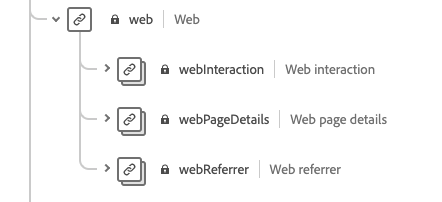

# Förbered data för användning i intelligenta tjänster

För att Intelligent Services ska kunna hitta insikter från era marknadsföringshändelsedata måste data anrikas semantiskt och underhållas i en standardstruktur. Intelligenta tjänster utnyttjar XDM-scheman (Experience Data Model) för att uppnå detta. Alla datauppsättningar som används i Intelligent Services måste överensstämma med **CEE-schemat (Consumer ExperienceEvent)** XDM.

Det här dokumentet innehåller allmän vägledning om hur du mappar data om marknadsföringshändelser från flera kanaler till det här schemat, och ger information om viktiga fält i schemat för att hjälpa dig att avgöra hur data effektivt kan mappas till dess struktur.

## Sammanfattning av arbetsflöde

Beredningsprocessen varierar beroende på om dina data lagras i Adobe Experience Platform eller externt. I det här avsnittet sammanfattas de steg som du behöver utföra med tanke på båda scenarierna.

### Förberedelse av externa data

Om dina data lagras utanför [!DNL Experience Platform]följer du stegen nedan:

1. Kontakta Adobe Consulting Services för att begära åtkomstautentiseringsuppgifter för en dedikerad Azure Blob Storage-behållare.
1. Ladda upp dina data till blobbehållaren med dina inloggningsuppgifter.
1. Arbeta med Adobe Consulting Services för att mappa data till [Consumer ExperienceEvent-schemat](#cee-schema) och lägga in dem i Intelligent Services.

### [!DNL Experience Platform] dataförberedelse

Om dina data redan är lagrade i [!DNL Platform]följer du stegen nedan:

1. Granska strukturen för [Consumer ExperienceEvent-schemat](#cee-schema) och se om dina data kan mappas till dess fält.
1. Kontakta Adobe Consulting Services för att mappa dina data till schemat och importera dem till Intelligent Services, eller [följ stegen i den här guiden](#mapping) om du vill mappa data själv.

## CEE-schemat {#cee-schema}

Consumer ExperienceEvent-schemat beskriver en individs beteende när det gäller digitala marknadsföringshändelser (webb eller mobil) samt online- eller offlinehandel. Det här schemat måste användas för intelligenta tjänster på grund av semantiskt väl definierade fält (kolumner), så att okända namn som annars skulle göra data mindre tydliga undviks.

CEE-schemat, liksom alla XDM ExperienceEvent-scheman, hämtar systemets tidsseriebaserade tillstånd när en händelse (eller uppsättning händelser) inträffade, inklusive tidpunkten och identiteten för det berörda ämnet. Experience Events är faktauppgifter om vad som hände, och de är därför oföränderliga och representerar vad som hände utan aggregering eller tolkning.

Intelligent Services använder flera nyckelfält i detta schema för att generera insikter från era marknadsföringshändelsedata, som alla kan hittas på rotnivå och expanderas för att visa de underfält som krävs.


Precis som alla XDM-scheman är CEE-blandningen utökningsbar. Med andra ord kan ytterligare fält läggas till i CEE-mixen, och olika varianter kan vid behov inkluderas i flera scheman.

Ett fullständigt exempel på blandningen finns i den [offentliga XDM-databasen](https://github.com/adobe/xdm/blob/797cf4930d5a80799a095256302675b1362c9a15/docs/reference/context/experienceevent-consumer.schema.md)och bör användas som referens för de nyckelfält som beskrivs i avsnittet nedan.

## Nyckelfält

Det finns flera nyckelfält i CEE-mixen som bör användas för att Intelligent Services ska kunna generera användbara insikter. I det här avsnittet beskrivs användningsfallet och förväntade data för dessa fält, och det finns länkar till referensdokumentation för ytterligare exempel.

### Obligatoriska fält

Alla nyckelfält bör användas, men det finns två fält som **krävs** för att de intelligenta tjänsterna ska fungera:

* [Ett primärt identitetsfält](#identity)
* [xdm:tidsstämpel](#timestamp)
* [xdm:channel](#channel) (obligatoriskt endast för Attribution AI)

#### Primär identitet {#identity}

Ett av fälten i ditt schema måste anges som ett primärt identitetsfält, som gör att Intelligent Services kan länka varje instans av tidsseriedata till en enskild person.

Du måste fastställa det bästa fältet som ska användas som primär identitet baserat på källan och datatypen. Ett identitetsfält måste innehålla ett **identitetsnamnutrymme** som anger vilken typ av identitetsdata som fältet förväntar som ett värde. Några giltiga namnutrymmesvärden är:

* &quot;email&quot;
* &quot;phone&quot;
* &quot;mcid&quot; (för Adobe Audience Manager ID)
* &quot;aaid&quot; (för Adobe Analytics ID)

Om du är osäker på vilket fält du ska använda som primär identitet kontaktar du Adobe Consulting Services för att fastställa den bästa lösningen.

#### xdm:tidsstämpel {#timestamp}

Det här fältet representerar det datum/tid då händelsen inträffade. Detta värde måste anges som en sträng enligt ISO 8601-standarden.

#### xdm:kanal {#channel}

>[!NOTE]
>
>Detta fält är endast obligatoriskt när du använder Attribution AI.

Detta fält representerar den marknadsföringskanal som är relaterad till ExperienceEvent. Fältet innehåller information om kanaltyp, medietyp och platstyp.


**Exempelschema**

```json
{
  "@id": "https://ns.adobe.com/xdm/channels/facebook-feed",
  "@type": "https://ns.adobe.com/xdm/channel-types/social",
  "xdm:mediaType": "earned",
  "xdm:mediaAction": "clicks"
}
```

Fullständig information om de olika delfälten för `xdm:channel`finns i [Experience channel schema](https://github.com/adobe/xdm/blob/797cf4930d5a80799a095256302675b1362c9a15/docs/reference/channels/channel.schema.md) spec. Exempel på mappningar finns i [tabellen nedan](#example-channels).

##### Exempel på kanalmappningar {#example-channels}

I följande tabell visas några exempel på marknadsföringskanaler som har mappats till `xdm:channel` schemat:

| Kanal | `@type` | `mediaType` | `mediaAction` |
| --- | --- | --- | --- |
| Betalsökning | https:/<span>/ns.adobe.com/xdm/channel-types/search | betald | klickningar |
| Social - marknadsföring | https:/<span>/ns.adobe.com/xdm/channel-types/social | upparbetade | klickningar |
| Visa | https:/<span>/ns.adobe.com/xdm/channel-types/display | betald | klickningar |
| E-post | https:/<span>/ns.adobe.com/xdm/channel-types/email | betald | klickningar |
| Intern referens | https:/<span>/ns.adobe.com/xdm/channel-types/direct | ägt | klickningar |
| VisaVia | https:/<span>/ns.adobe.com/xdm/channel-types/display | betald | visningar |
| Omdirigering av QR-kod | https:/<span>/ns.adobe.com/xdm/channel-types/direct | ägt | klickningar |
| Mobil | https:/<span>/ns.adobe.com/xdm/channel-types/mobile | ägt | klickningar |

### Rekommenderade fält

I det här avsnittet beskrivs resten av nyckelfälten. Dessa fält behövs inte nödvändigtvis för att Intelligent Services ska fungera, men vi rekommenderar att du använder så många som möjligt för att få bättre insikter.

#### xdm:productListItems

Det här fältet är en array med artiklar som representerar produkter som valts ut av en kund, inklusive produkt-SKU, namn, pris och kvantitet.


**Exempelschema**

```json
[
  {
    "xdm:SKU": "1002352692",
    "xdm:name": "24-Watt 8-Light Chrome Integrated LED Bath Light",
    "xdm:currencyCode": "USD",
    "xdm:quantity": 1,
    "xdm:priceTotal": 159.45
  },
  {
    "xdm:SKU": "3398033623",
    "xdm:name": "16ft RGB LED Strips",
    "xdm:currencyCode": "USD",
    "xdm:quantity": 1,
    "xdm:priceTotal": 79.99
  }
]
```

Fullständig information om de olika delfälten för `xdm:productListItems`finns i schemats [specifikationer för](https://github.com/adobe/xdm/blob/797cf4930d5a80799a095256302675b1362c9a15/docs/reference/context/experienceevent-commerce.schema.md) handelsinformation.

#### xdm:commerce

Det här fältet innehåller handelsspecifik information om ExperienceEvent, inklusive inköpsordernummer och betalningsinformation.


**Exempelschema**

```json
{
    "xdm:order": {
      "xdm:purchaseID": "a8g784hjq1mnp3",
      "xdm:purchaseOrderNumber": "123456",
      "xdm:payments": [
        {
          "xdm:transactionID": "transactid-a111",
          "xdm:paymentAmount": 59,
          "xdm:paymentType": "credit_card",
          "xdm:currencyCode": "USD"
        },
        {
          "xdm:transactionId": "transactid-a222",
          "xdm:paymentAmount": 100,
          "xdm:paymentType": "gift_card",
          "xdm:currencyCode": "USD"
        }
      ],
      "xdm:currencyCode": "USD",
      "xdm:priceTotal": 159
    },
    "xdm:purchases": {
      "xdm:value": 1
    }
  }
```

Fullständig information om de olika delfälten för `xdm:commerce`finns i schemats [specifikationer för](https://github.com/adobe/xdm/blob/797cf4930d5a80799a095256302675b1362c9a15/docs/reference/context/experienceevent-commerce.schema.md) handelsinformation.

#### xdm:webb

Det här fältet representerar webbinformation som relaterar till ExperienceEvent, t.ex. interaktionen, sidinformation och referenten.



**Exempelschema**

```json
{
  "xdm:webPageDetails": {
    "xdm:siteSection": "Shopping Cart",
    "xdm:server": "example.com",
    "xdm:name": "Purchase Confirmation",
    "xdm:URL": "https://www.example.com/orderConf",
    "xdm:errorPage": false,
    "xdm:homePage": false,
    "xdm:pageViews": {
      "xdm:value": 1
    }
  },
  "xdm:webReferrer": {
    "xdm:URL": "https://www.example.com/checkout",
    "xdm:referrerType": "internal"
  }
}
```

Fullständig information om de olika delfälten för `xdm:productListItems`finns i [ExperienceEvent-webbinformationsschemats](https://github.com/adobe/xdm/blob/797cf4930d5a80799a095256302675b1362c9a15/docs/reference/context/experienceevent-web.schema.md) specifikation.

#### xdm:marknadsföring

Detta fält innehåller information om marknadsföringsaktiviteter som är aktiva med kontaktytan.


**Exempelschema**

```json
{
  "xdm:trackingCode": "marketingcampaign111",
  "xdm:campaignGroup": "50%_DISCOUNT",
  "xdm:campaignName": "50%_DISCOUNT_USA"
}
```

Fullständig information om samtliga obligatoriska underfält för `xdm:productListItems`finns i [produktresumén](https://github.com/adobe/xdm/blob/797cf4930d5a80799a095256302675b1362c9a15/docs/reference/context/marketing.schema.md) .

## Mappning och inhämtning av data (#mapping)

När ni väl har fastställt om era data om marknadsföringshändelser kan mappas till CEE-schemat är nästa steg att avgöra vilka data ni ska hämta till Intelligent Services. Alla historiska data som används i Intelligent Services måste ligga inom den kortaste tidsgränsen på fyra månaders data plus det antal dagar som avses som en uppslagsperiod.

När du har bestämt vilket dataintervall du vill skicka kan du kontakta Adobe Consulting Services för att mappa dina data till schemat och överföra dem till tjänsten.

Om du har en [!DNL Adobe Experience Platform] prenumeration och vill mappa och importera data själv följer du stegen som beskrivs i avsnittet nedan.

### Använda Adobe Experience Platform

>[!NOTE]
>
>Stegen nedan kräver en prenumeration på Experience Platform. Om du inte har tillgång till Platform går du vidare till [nästa steg](#next-steps) .

I det här avsnittet beskrivs arbetsflödet för mappning och inmatning av data till Experience Platform för användning i intelligenta tjänster, inklusive länkar till självstudiekurser för detaljerade steg.

#### Skapa ett CEE-schema och en datauppsättning

När du är redo att börja förbereda dina data för konsumtion är det första steget att skapa ett nytt XDM-schema som använder CEE-mixen. I följande självstudiekurser får du hjälp med att skapa ett nytt schema i gränssnittet eller API:

* [Skapa ett schema i användargränssnittet](../xdm/tutorials/create-schema-ui.md)
* [Skapa ett schema i API:t](../xdm/tutorials/create-schema-api.md)

>[!IMPORTANT]
>
>Självstudiekurserna ovan följer ett allmänt arbetsflöde för att skapa ett schema. När du väljer en klass för schemat måste du använda **klassen** XDM ExperienceEvent. När den här klassen har valts kan du lägga till CEE-mixinen i schemat.

När du har lagt till CEE-mixen i schemat kan du lägga till andra mixiner efter behov för ytterligare fält i dina data.

När du har skapat och sparat schemat kan du skapa en ny datauppsättning som baseras på det schemat. I följande självstudiekurser får du hjälp med att skapa en ny datauppsättning i gränssnittet eller API:

* [Skapa en datauppsättning i användargränssnittet](../catalog/datasets/user-guide.md#create) (Följ arbetsflödet för att använda ett befintligt schema)
* [Skapa en datauppsättning i API:t](../catalog/datasets/create.md)

När datauppsättningen har skapats kan du hitta den i Platform-gränssnittet på *[!UICONTROL Datasets]* arbetsytan.


#### Lägg till en primär ID-namnområdestagg i datauppsättningen

>[!NOTE]
>
>Framtida releaser av Intelligent Services kommer att integrera [Adobe Experience Platform Identity Service](../identity-service/home.md) i deras funktioner för kundidentifiering. Stegen nedan kan ändras.

Om du hämtar in data från [!DNL Adobe Audience Manager], [!DNL Adobe Analytics]eller någon annan extern källa, måste du lägga till en `primaryIdentityNameSpace` -tagg i datauppsättningen. Detta kan du göra genom att göra en PATCH-begäran till katalogtjänstens API.

Om du importerar data från en lokal CSV-fil kan du gå vidare till nästa avsnitt om [mappning och datainhämtning](#ingest).

Innan du följer med exempelanropet till API:t nedan finns viktig information om obligatoriska huvuden i avsnittet [](../catalog/api/getting-started.md) Komma igång i guiden för katalogutvecklare.

**API-format**

```http
PATCH /dataSets/{DATASET_ID}
```

| Parameter | Beskrivning |
| --- | --- |
| `{DATASET_ID}` | ID:t för datauppsättningen som du skapade tidigare. |

**Begäran**

Beroende på vilken källa du hämtar data från måste du ange lämpliga `primaryIdentityNamespace` - och `sourceConnectorId` taggvärden i nyttolasten för begäran.

Följande begäran lägger till lämpliga taggvärden för Audience Manager:

```shell
curl -X PATCH \
  https://platform.adobe.io/data/foundation/catalog/dataSets/5ba9452f7de80400007fc52a \
  -H 'Authorization: Bearer {ACCESS_TOKEN}' \
  -H 'x-api-key: {API_KEY}' \
  -H 'x-gw-ims-org-id: {IMS_ORG}' \
  -H 'x-sandbox-name: {SANDBOX_NAME}' \
  -H 'Content-Type: application/json' \
  -d '{
        "tags": {
          "primaryIdentityNameSpace": ["mcid"],
          "sourceConnectorId": ["audiencemanager"],
        }
      }'
```

Följande begäran lägger till lämpliga taggvärden för Analytics:

```shell
curl -X PATCH \
  https://platform.adobe.io/data/foundation/catalog/dataSets/5ba9452f7de80400007fc52a \
  -H 'Authorization: Bearer {ACCESS_TOKEN}' \
  -H 'x-api-key: {API_KEY}' \
  -H 'x-gw-ims-org-id: {IMS_ORG}' \
  -H 'x-sandbox-name: {SANDBOX_NAME}' \
  -H 'Content-Type: application/json' \
  -d '{
        "tags": {
          "primaryIdentityNameSpace": ["aaid"],
          "sourceConnectorId": ["analytics"],
        }
      }'
```

>[!NOTE]
>
>Mer information om hur du arbetar med identitetsnamnutrymmen i Platform finns i översikten över [identitetsnamnutrymmet](../identity-service/namespaces.md).

**Svar**

Ett lyckat svar returnerar en array som innehåller ID:t för den uppdaterade datauppsättningen. Detta ID ska matcha det som skickades i PATCH-begäran.

```json
[
    "@/dataSets/5ba9452f7de80400007fc52a"
]
```

#### Mappa och importera data {#ingest}

När du har skapat ett CEE-schema och en datauppsättning kan du börja mappa dina datatabeller till schemat och importera dessa data till Platform. I självstudiekursen om hur du [mappar en CSV-fil till ett XDM-schema](../ingestion/tutorials/map-a-csv-file.md) finns mer information om hur du gör detta i användargränssnittet. När en datauppsättning har fyllts i kan samma datauppsättning användas för att importera ytterligare datafiler.

Om dina data lagras i ett tredjepartsprogram som stöds kan du även välja att skapa en [källanslutning](../sources/home.md) för att importera dina marknadsföringshändelsedata till Platform i realtid.

## Nästa steg {#next-steps}

Det här dokumentet innehåller allmän vägledning om hur du förbereder data för användning i Intelligent Services. Om du behöver ytterligare konsultation baserat på ditt användningsfall, kontakta Adobe konsultsupport.

När ni har fyllt i en datauppsättning med era kundupplevelsedata kan ni använda intelligenta tjänster för att generera insikter. Se följande dokument för att komma igång:

* [Översikt över Attribution AI](./attribution-ai/overview.md)
* [Översikt över AI för kunder](./customer-ai/overview.md)
