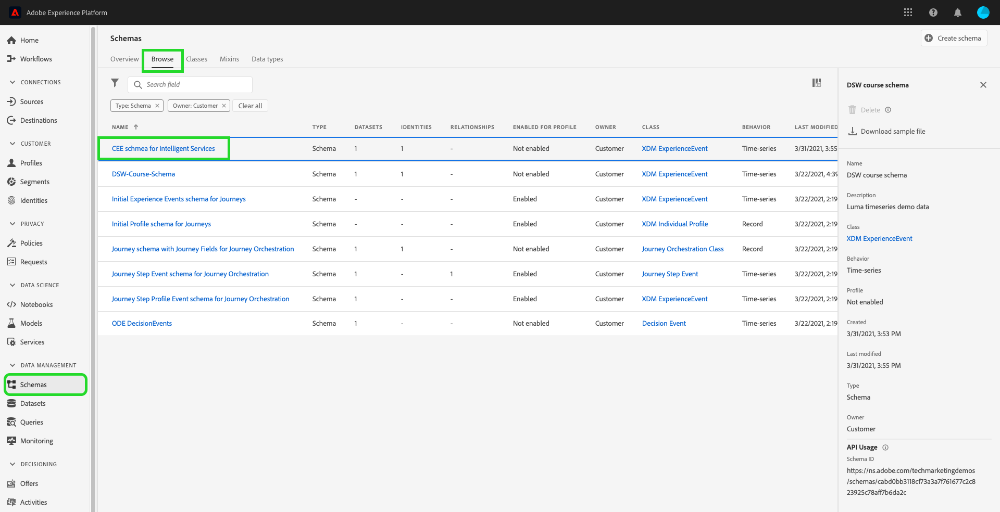
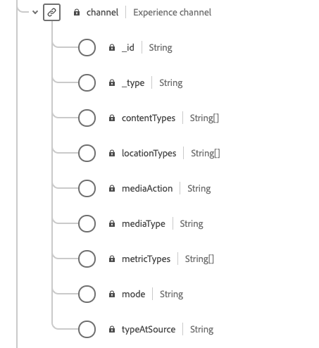

# Förbered data för [!DNL Intelligent Services]

För att [!DNL Intelligent Services] ska kunna identifiera insikter från dina marknadsföringshändelsedata måste data anrikas semantiskt och underhållas i en standardstruktur. [!DNL Intelligent Services] använder [!DNL Experience Data Model] (XDM)-scheman för att uppnå detta. Mer specifikt måste alla datauppsättningar som används i [!DNL Intelligent Services] överensstämma med CEE-XDM-schemat (Consumer ExperienceEvent) eller använda Adobe Analytics-anslutningen. Dessutom stöder kundens AI Adobe Audience Manager-anslutning.

Det här dokumentet innehåller allmän vägledning om hur du mappar data om marknadsföringshändelser från flera kanaler till CEE-schemat, och ger information om viktiga fält i schemat för att hjälpa dig att avgöra hur data effektivt kan mappas till dess struktur. Om du planerar att använda Adobe Analytics-data läser du avsnittet om [Adobe Analytics-dataförberedelse](#analytics-data). Om du planerar att använda Adobe Audience Manager-data (endast AI för kunder) kan du läsa avsnittet för [Adobe Audience Manager-dataförberedelse](#AAM-data).

## Datakrav

[!DNL Intelligent Services] kräver olika mängder historiska data beroende på vilket mål du skapar. Oavsett vilket måste de data du förbereder för **all** [!DNL Intelligent Services] innehålla både positiva och negativa kundresor/händelser. Både negativa och positiva händelser förbättrar modellens precision och precision.

Om du t.ex. använder AI för att förutsäga sannolikheten för att köpa en produkt behöver modellen för AI för kunden både exempel på lyckade köpvägar och exempel på misslyckade sökvägar. Detta beror på att kundens AI under modellutbildning ser ut att förstå vilka händelser och resor som leder till ett köp. Detta omfattar även de åtgärder som vidtas av kunder som inte har köpt något, t.ex. en person som avbrutit sin resa genom att lägga en artikel i kundvagnen. Dessa kunder kan uppvisa liknande beteenden, men kundens AI kan ge insikter och fördjupa de viktigaste skillnaderna och faktorerna som leder till en högre benägenhetspoäng. På samma sätt kräver Attribution AI både typer av händelser och resor för att visa mått som kontaktytans effektivitet, toppkonverteringsvägar och uppdelning efter kontaktytpunktsposition.

Fler exempel och information om krav på historiska data finns i avsnittet [Kundens AI](./customer-ai/data-requirements.md#data-requirements) eller [Attribution AI](./attribution-ai/input-output.md#data-requirements) i dokumentationen för in-/utdata.

### Riktlinjer för sammanfogning av data

Vi rekommenderar att du knyter ihop en användares händelser med ett gemensamt ID när det är möjligt. Du kan till exempel ha användardata med ID1 för 10 händelser. Senare tog samma användare bort cookie-ID:t och registreras som&quot;id2&quot; under de kommande 20 händelserna. Om du vet att id1 och id2 motsvarar samma användare är det bästa sättet att sammanfoga alla 30 händelser med ett gemensamt ID.

Om detta inte är möjligt bör du behandla varje händelseuppsättning som en annan användare när du skapar modellindata. Detta ger bästa resultat under modellutbildning och poängsättning.

## Sammanfattning av arbetsflöde

Förberedelseprocessen varierar beroende på om dina data lagras i Adobe Experience Platform eller externt. I det här avsnittet sammanfattas de steg som du behöver utföra med tanke på båda scenarierna.

### Förberedelse av externa data

Om dina data lagras utanför Experience Platform måste du mappa dina data till obligatoriska och relevanta fält i ett [Consumer ExperienceEvent-schema](#cee-schema). Schemat kan utökas med anpassade fältgrupper för att bättre kunna samla in kunddata. När data har mappats kan du skapa en datauppsättning med hjälp av ditt Consumer ExperienceEvent-schema och [importera dina data till plattformen](../ingestion/home.md). CEE-datauppsättningen kan sedan väljas när en [!DNL Intelligent Service] konfigureras.

Beroende på vilken [!DNL Intelligent Service] du vill använda kan olika fält vara obligatoriska. Observera att det är bäst att lägga till data i ett fält om du har tillgängliga data. Mer information om obligatoriska fält finns i [Attribution AI](./attribution-ai/input-output.md) - eller [Customer AI](./customer-ai/data-requirements.md) -guiden för datakrav.

### Adobe Analytics datagenerering {#analytics-data}

Kundens AI och Attribution AI stöder Adobe Analytics data. Om du vill använda Adobe Analytics-data följer du stegen som beskrivs i dokumentationen för att konfigurera en [Analytics-källkoppling](../sources/tutorials/ui/create/adobe-applications/analytics.md).

När källkopplingen direktuppspelar data i Experience Platform kan du välja Adobe Analytics som datakälla följt av en datauppsättning under instanskonfigurationen. Alla nödvändiga schemafältgrupper och enskilda fält skapas automatiskt när anslutningen skapas. Du behöver inte ETL (Extract, Transform, Load) för datauppsättningarna till CEE-formatet.

Om du jämför data som matas in via Adobe Analytics-källanslutningen till Adobe Experience Platform med Adobe Analytics-data kan du upptäcka vissa avvikelser. Source-kopplingen för Analytics kan släppa rader under omvandlingen till ett XDM-schema (Experience Data Model). Det kan finnas flera orsaker till att hela raden inte är lämplig för omformning, t.ex. saknade tidsstämplar, person-ID:n som saknas, ogiltiga eller stora person-ID:n, ogiltiga analysvärden med mera.

Mer information och exempel finns i dokumentationen för att [jämföra Adobe Analytics- och Customer Journey Analytics-data](https://www.adobe.com/go/compare-aa-data-to-cja-data). Den här artikeln är utformad för att hjälpa dig att diagnostisera och lösa de skillnaderna så att du och ditt team kan använda Adobe Experience Platform-data för intelligenta tjänster utan att riskera dataintegritet.

I Adobe Experience Platform Query Services kör du följande Total Records mellan start- och sluttidsstämpeln per channel.typeAtSource-fråga för att hitta antalet via marknadsföringskanaler.

```SELECT channel.typeAtSource as typeAtSource,
       Count(_id) AS Records 
FROM  df_hotel
WHERE timestamp>=from_utc_timestamp('2021-05-15','UTC')
        AND timestamp<from_utc_timestamp('2022-01-10','UTC')
        AND timestamp IS NOT NULL
        AND enduserids._experience.aaid.id IS NOT NULL
GROUP BY channel.typeAtSource
```

>[!IMPORTANT]
>
>Adobe Analytics Connector tar upp till fyra veckor på sig att fylla i data. Om du nyligen har upprättat en anslutning bör du kontrollera att datauppsättningen har den minsta datalängd som krävs för kunden eller Attribution AI. Granska historikdatasektionerna i [Kund-AI](./customer-ai/data-requirements.md#data-requirements) eller [Attribution AI](./attribution-ai/input-output.md#data-requirements) och verifiera att du har tillräckligt med data för ditt förutsägelsemål.

### Adobe Audience Manager dataförberedelse (endast kundens AI) {#AAM-data}

Kunden AI har inbyggt stöd för Adobe Audience Manager data. Om du vill använda Audience Manager-data följer du stegen som beskrivs i dokumentationen för att konfigurera en [Audience Manager-källanslutning](../sources/tutorials/ui/create/adobe-applications/audience-manager.md).

När källkopplingen direktuppspelar data i Experience Platform kan du välja Adobe Audience Manager som datakälla följt av en datauppsättning under din AI-konfiguration. Alla schemafältgrupper och enskilda fält skapas automatiskt när anslutningen skapas. Du behöver inte ETL (Extract, Transform, Load) för datauppsättningarna till CEE-formatet.

>[!IMPORTANT]
>
>Om du nyligen har konfigurerat en koppling bör du verifiera att datauppsättningen har den minsta tillåtna längden data. Granska avsnittet med historiska data i [indata-/utdatadokumentationen](./customer-ai/data-requirements.md) för kundens AI och kontrollera att du har tillräckligt med data för ditt förutsägelsemål.

### Förberedelse av [!DNL Experience Platform]-data

Om dina data redan lagras i [!DNL Platform] och inte direktuppspelas via källanslutningarna för Adobe Analytics eller Adobe Audience Manager (endast kund-AI) följer du stegen nedan. Du bör fortfarande förstå CEE-schemat.

1. Granska strukturen för [Consumer ExperienceEvent-schemat](#cee-schema) och fastställ om dina data kan mappas till dess fält.
2. Kontakta Adobe Consulting Services för att mappa dina data till schemat och importera dem till [!DNL Intelligent Services], eller [följ stegen i den här guiden](#mapping) om du vill mappa data själv.

## CEE-schemat {#cee-schema}

Consumer ExperienceEvent-schemat beskriver en individs beteende när det gäller digitala marknadsföringshändelser (webb eller mobil) samt online- eller offlinehandel. Det här schemat måste användas för [!DNL Intelligent Services] på grund av semantiskt väl definierade fält (kolumner), så att okända namn som annars skulle göra data mindre tydliga undviks.

CEE-schemat, liksom alla XDM ExperienceEvent-scheman, hämtar systemets tidsseriebaserade tillstånd när en händelse (eller uppsättning händelser) inträffade, inklusive tidpunkten och identiteten för det berörda ämnet. Experience Events är faktauppgifter om vad som hände, och de är därför oföränderliga och representerar vad som hände utan aggregering eller tolkning.

[!DNL Intelligent Services] använder flera nyckelfält i det här schemat för att generera insikter från dina marknadsföringshändelsedata, som alla kan hittas på rotnivå och expanderas för att visa de underfält som krävs.


Precis som alla XDM-scheman är CEE-schemafältgruppen utökningsbar. Med andra ord kan ytterligare fält läggas till i CEE-fältgruppen, och olika variationer kan vid behov inkluderas i flera scheman.

Ett fullständigt exempel på fältgruppen finns i den [publika XDM-databasen](https://github.com/adobe/xdm/blob/797cf4930d5a80799a095256302675b1362c9a15/docs/reference/context/experienceevent-consumer.schema.md). Dessutom kan du visa och kopiera följande [JSON-fil](https://github.com/AdobeDocs/experience-platform.en/blob/master/help/intelligent-services/assets/CEE_XDM_sample_rows.json) för att få ett exempel på hur data kan struktureras så att de överensstämmer med CEE-schemat. Läs båda dessa exempel när du lär dig mer om de nyckelfält som beskrivs i avsnittet nedan för att avgöra hur du kan mappa dina egna data till schemat.

## Nyckelfält

Det finns flera nyckelfält i CEE-fältgruppen som bör användas för att [!DNL Intelligent Services] ska kunna generera användbara insikter. I det här avsnittet beskrivs användningsfallet och förväntade data för dessa fält, och det finns länkar till referensdokumentation för ytterligare exempel.

### Obligatoriska fält

Alla nyckelfält bör användas, men det finns två fält som är **required** för att [!DNL Intelligent Services] ska fungera:

* [Ett primärt identitetsfält](#identity)
* [xdm:tidsstämpel](#timestamp)
* [xdm:channel](#channel) (obligatoriskt endast för Attribution AI)

#### Primär identitet {#identity}

Ett av fälten i schemat måste anges som ett primärt identitetsfält, som tillåter [!DNL Intelligent Services] att länka varje instans av tidsseriedata till en enskild person.

Du måste fastställa det bästa fältet som ska användas som primär identitet baserat på datakälla och datatyp. Ett identitetsfält måste innehålla ett **identitetsnamnområde** som anger vilken typ av identitetsdata som fältet förväntar sig som ett värde. Några giltiga namnutrymmesvärden är:

>[!NOTE]
>
>Experience Cloud ID (ECID) kallas även MCID och används även i namnutrymmen.

* &quot;email&quot;
* &quot;phone&quot;
* &quot;mcid&quot; (för Adobe Audience Manager ID)
* &quot;aaid&quot; (för Adobe Analytics ID)

Om du är osäker på vilket fält du ska använda som primär identitet kontaktar du Adobe Consulting Services för att fastställa den bästa lösningen. Om ingen primär identitet anges används följande standardbeteende i programmet för intelligenta tjänster:

| Standard | Attribution AI | Kund-AI |
| --- | --- | --- |
| Identitetskolumn | `endUserIDs._experience.aaid.id` | `endUserIDs._experience.mcid.id` |
| Namnutrymme | STÖD | ECID |

Om du vill ange en primär identitet går du till schemat från fliken **[!UICONTROL Schemas]** och väljer hyperlänken för schemanamnet för att öppna **[!DNL Schema Editor]**.



Navigera sedan till det fält som du vill använda som primär identitet och markera det. Menyn **[!UICONTROL Field properties]** öppnas för det fältet.


Bläddra nedåt på menyn **[!UICONTROL Field properties]** tills du hittar kryssrutan **[!UICONTROL Identity]**. När du har markerat rutan kan du ange den valda identiteten som **[!UICONTROL Primary identity]** visas. Markera även den här rutan.


Därefter måste du ange **[!UICONTROL Identity namespace]** i listan med fördefinierade namnutrymmen i listrutan. I det här exemplet har ECID-namnutrymmet valts eftersom ett Adobe Audience Manager-ID `mcid.id` används. Välj **[!UICONTROL Apply]** för att bekräfta uppdateringarna och välj sedan **[!UICONTROL Save]** i det övre högra hörnet för att spara ändringarna i schemat.


#### xdm:tidsstämpel {#timestamp}

Det här fältet representerar det datum/tid då händelsen inträffade. Det här värdet måste anges som en sträng enligt ISO 8601-standarden.

#### xdm:kanal {#channel}

>[!NOTE]
>
>Detta fält är endast obligatoriskt när du använder Attribution AI.

Detta fält representerar den marknadsföringskanal som är relaterad till ExperienceEvent. Fältet innehåller information om kanaltyp, medietyp och platstyp.



**Exempelschema**

```json
{
  "@id": "https://ns.adobe.com/xdm/channels/facebook-feed",
  "@type": "https://ns.adobe.com/xdm/channel-types/social",
  "xdm:mediaType": "earned",
  "xdm:mediaAction": "clicks"
}
```

Fullständig information om vart och ett av de obligatoriska underfälten för `xdm:channel` finns i [Experience channel schema](https://github.com/adobe/xdm/blob/797cf4930d5a80799a095256302675b1362c9a15/docs/reference/channels/channel.schema.md) -specifikationen. Exempel på mappningar finns i tabellen [nedan](#example-channels).

#### Exempel på kanalmappningar {#example-channels}

I följande tabell visas några exempel på marknadsföringskanaler som har mappats till schemat `xdm:channel`:

| Kanal | `@type` | `mediaType` | `mediaAction` |
| --- | --- | --- | --- |
| Betalsökning | https:/<span>/ns.adobe.com/xdm/channel-types/search | betald | klickningar |
| Social - marknadsföring | https:/<span>/ns.adobe.com/xdm/channel-types/social | upparbetade | klickningar |
| Visa | https:/<span>/ns.adobe.com/xdm/channel-types/display | betald | klickningar |
| E-post | https:/<span>/ns.adobe.com/xdm/channel-types/email | betald | klickningar |
| Intern referent | https:/<span>/ns.adobe.com/xdm/channel-types/direct | ägt | klickningar |
| VisaVia | https:/<span>/ns.adobe.com/xdm/channel-types/display | betald | visningar |
| Omdirigering av QR-kod | https:/<span>/ns.adobe.com/xdm/channel-types/direct | ägt | klickningar |
| Mobil | https:/<span>/ns.adobe.com/xdm/channel-types/mobile | ägt | klickningar |

### Rekommenderade fält

Här beskrivs resten av nyckelfälten. Dessa fält behövs inte nödvändigtvis för att [!DNL Intelligent Services] ska fungera, men du bör använda så många som möjligt för att få bättre insikter.

#### xdm:productListItems

Det här fältet är en array med artiklar som representerar produkter som valts ut av en kund, inklusive produkt-SKU, namn, pris och kvantitet.


**Exempelschema**

```json
[
  {
    "xdm:SKU": "1002352692",
    "xdm:name": "24-Watt 8-Light Chrome Integrated LED Bath Light",
    "xdm:currencyCode": "USD",
    "xdm:quantity": 1,
    "xdm:priceTotal": 159.45
  },
  {
    "xdm:SKU": "3398033623",
    "xdm:name": "16ft RGB LED Strips",
    "xdm:currencyCode": "USD",
    "xdm:quantity": 1,
    "xdm:priceTotal": 79.99
  }
]
```

Fullständig information om vart och ett av de obligatoriska underfälten för `xdm:productListItems` finns i [schema för handelsinformation](https://github.com/adobe/xdm/blob/797cf4930d5a80799a095256302675b1362c9a15/docs/reference/context/experienceevent-commerce.schema.md) -specifikationen.

#### xdm:commerce

Det här fältet innehåller handelsspecifik information om ExperienceEvent, inklusive inköpsordernummer och betalningsinformation.


**Exempelschema**

```json
{
    "xdm:order": {
      "xdm:purchaseID": "a8g784hjq1mnp3",
      "xdm:purchaseOrderNumber": "123456",
      "xdm:payments": [
        {
          "xdm:transactionID": "transactid-a111",
          "xdm:paymentAmount": 59,
          "xdm:paymentType": "credit_card",
          "xdm:currencyCode": "USD"
        },
        {
          "xdm:transactionId": "transactid-a222",
          "xdm:paymentAmount": 100,
          "xdm:paymentType": "gift_card",
          "xdm:currencyCode": "USD"
        }
      ],
      "xdm:currencyCode": "USD",
      "xdm:priceTotal": 159
    },
    "xdm:purchases": {
      "xdm:value": 1
    }
  }
```

Fullständig information om vart och ett av de obligatoriska underfälten för `xdm:commerce` finns i [schema för handelsinformation](https://github.com/adobe/xdm/blob/797cf4930d5a80799a095256302675b1362c9a15/docs/reference/context/experienceevent-commerce.schema.md) -specifikationen.

#### xdm:webb

Det här fältet representerar webbinformation som relaterar till ExperienceEvent, t.ex. interaktionen, sidinformation och referenten.


**Exempelschema**

```json
{
  "xdm:webPageDetails": {
    "xdm:siteSection": "Shopping Cart",
    "xdm:server": "example.com",
    "xdm:name": "Purchase Confirmation",
    "xdm:URL": "https://www.example.com/orderConf",
    "xdm:errorPage": false,
    "xdm:homePage": false,
    "xdm:pageViews": {
      "xdm:value": 1
    }
  },
  "xdm:webReferrer": {
    "xdm:URL": "https://www.example.com/checkout",
    "xdm:referrerType": "internal"
  }
}
```

Fullständig information om vart och ett av de obligatoriska underfälten för `xdm:productListItems` finns i specifikationen för [ExperienceEvent-webbinformationen ](https://github.com/adobe/xdm/blob/797cf4930d5a80799a095256302675b1362c9a15/docs/reference/context/experienceevent-web.schema.md) .

#### xdm:marknadsföring

Detta fält innehåller information om marknadsföringsaktiviteter som är aktiva med kontaktytan.


**Exempelschema**

```json
{
  "xdm:trackingCode": "marketingcampaign111",
  "xdm:campaignGroup": "50%_DISCOUNT",
  "xdm:campaignName": "50%_DISCOUNT_USA"
}
```

Fullständig information om vart och ett av de obligatoriska underfälten för `xdm:productListItems` finns i [marknadsspecifikationen ](https://github.com/adobe/xdm/blob/797cf4930d5a80799a095256302675b1362c9a15/docs/reference/context/marketing.schema.md).

## Mappning och inhämtning av data {#mapping}

När du har fastställt om dina marknadsföringshändelsedata kan mappas till CEE-schemat är nästa steg att avgöra vilka data du ska hämta till [!DNL Intelligent Services]. Alla historiska data som används i [!DNL Intelligent Services] måste ligga inom den kortaste tidsgränsen på fyra månaders data plus det antal dagar som är avsett som en uppslagsperiod.

När du har bestämt vilket dataintervall du vill skicka kan du kontakta Adobe Consulting Services för att mappa dina data till schemat och överföra dem till tjänsten.

Om du har en [!DNL Adobe Experience Platform]-prenumeration och vill mappa och importera data själv följer du stegen som beskrivs i avsnittet nedan.

### Använda Adobe Experience Platform

>[!NOTE]
>
>Stegen nedan kräver en prenumeration på Experience Platform. Om du inte har tillgång till plattformen går du vidare till avsnittet [Nästa steg](#next-steps).

I det här avsnittet beskrivs arbetsflödet för mappning och inmatning av data till Experience Platform för användning i [!DNL Intelligent Services], inklusive länkar till självstudiekurser för detaljerade steg.

#### Skapa ett CEE-schema och en datauppsättning

När du är redo att börja förbereda dina data för konsumtion är det första steget att skapa ett nytt XDM-schema som använder CEE-fältgruppen. I följande självstudiekurser får du hjälp med att skapa ett nytt schema i gränssnittet eller API:

* [Skapa ett schema i användargränssnittet](../xdm/tutorials/create-schema-ui.md)
* [Skapa ett schema i API:t](../xdm/tutorials/create-schema-api.md)

>[!IMPORTANT]
>
>Självstudiekurserna ovan följer ett allmänt arbetsflöde för att skapa ett schema. När du väljer en klass för schemat måste du använda klassen **XDM ExperienceEvent**. När den här klassen har valts kan du lägga till CEE-fältgruppen i schemat.

När du har lagt till CEE-fältgruppen i schemat kan du lägga till andra fältgrupper efter behov för ytterligare fält i dina data.

När du har skapat och sparat schemat kan du skapa en ny datauppsättning som baseras på det schemat. I följande självstudiekurser får du hjälp med att skapa en ny datauppsättning i gränssnittet eller API:

* [Skapa en datauppsättning i användargränssnittet](../catalog/datasets/user-guide.md#create) (Följ arbetsflödet för att använda ett befintligt schema)
* [Skapa en datauppsättning i API:t](../catalog/datasets/create.md)

När datauppsättningen har skapats kan du hitta den i plattformsgränssnittet på arbetsytan **[!UICONTROL Datasets]**.


#### Lägg till identitetsfält i datauppsättningen

Om du hämtar in data från [!DNL Adobe Audience Manager], [!DNL Adobe Analytics] eller en annan extern källa kan du ange ett schemafält som ett identitetsfält. Om du vill ange ett schemafält som ett identitetsfält kan du visa avsnittet om att ange identitetsfält i [självstudiekursen](../xdm/tutorials/create-schema-ui.md#identity-field) eller [API-självstudiekursen](../xdm/tutorials/create-schema-api.md#define-an-identity-descriptor) för att skapa ett schema.

Om du importerar data från en lokal CSV-fil kan du gå vidare till nästa avsnitt om [mappning och inhämtning av data](#ingest).

#### Mappa och importera data {#ingest}

När du har skapat ett CEE-schema och en datauppsättning kan du börja mappa dina datatabeller till schemat och importera dessa data till plattformen. I självstudiekursen [Mappa en CSV-fil till ett XDM-schema](../ingestion/tutorials/map-csv/overview.md) finns anvisningar om hur du utför detta i användargränssnittet. Du kan använda följande [exempel-JSON-fil](https://github.com/AdobeDocs/experience-platform.en/blob/master/help/intelligent-services/assets/CEE_XDM_sample_rows.json) för att testa intagsprocessen innan du använder dina egna data.

När en datauppsättning har fyllts i kan samma datauppsättning användas för att importera ytterligare datafiler.

Om dina data lagras i ett tredjepartsprogram som stöds kan du även välja att skapa en [källanslutning](../sources/home.md) som dina marknadsföringshändelsedata ska importeras till [!DNL Platform] i realtid.

## Nästa steg {#next-steps}

Det här dokumentet innehåller allmän vägledning om hur du förbereder dina data för användning i [!DNL Intelligent Services]. Kontakta Adobe Consulting Support om du behöver ytterligare konsultation baserat på ditt användningsfall.

När du har fyllt i en datauppsättning med dina kundupplevelsedata kan du använda [!DNL Intelligent Services] för att generera insikter. Se följande dokument för att komma igång:

* [Översikt över AI för attribuering](./attribution-ai/overview.md)
* [Översikt över AI för kundbenägenhet](./customer-ai/overview.md)
