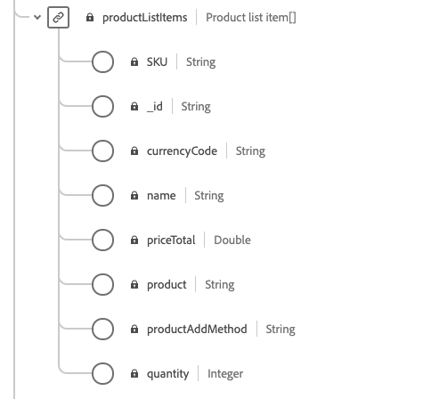

# Förbered data för användning i [!DNL Intelligent Services]

För att [!DNL Intelligent Services] ska kunna identifiera insikter från marknadsföringshändelsedata måste data anrikas semantiskt och underhållas i en standardstruktur. [!DNL Intelligent Services] utnyttja  [!DNL Experience Data Model] (XDM)-scheman för att uppnå detta. Alla datauppsättningar som används i [!DNL Intelligent Services] måste överensstämma med CEE-XDM-schemat (Consumer Experience Event).

Det här dokumentet innehåller allmän vägledning om hur du mappar data om marknadsföringshändelser från flera kanaler till det här schemat, och ger information om viktiga fält i schemat för att hjälpa dig att avgöra hur data effektivt kan mappas till dess struktur.

## Sammanfattning av arbetsflöde

Förberedelseprocessen varierar beroende på om dina data lagras i Adobe Experience Platform eller externt. I det här avsnittet sammanfattas de steg som du behöver utföra med tanke på båda scenarierna.

### Förberedelse av externa data

Om dina data lagras utanför [!DNL Experience Platform] följer du stegen nedan:

1. Kontakta Adobe Consulting Services för att begära åtkomstautentiseringsuppgifter för en dedikerad Azure Blob Storage-behållare.
1. Ladda upp dina data till blobbehållaren med dina inloggningsuppgifter.
1. Arbeta med Adobe Consulting Services för att mappa dina data till [Consumer ExperienceEvent-schemat](#cee-schema) och lägga in dem i [!DNL Intelligent Services].

### [!DNL Experience Platform] dataförberedelse

Om dina data redan lagras i [!DNL Platform] följer du stegen nedan:

1. Granska strukturen för [Consumer ExperienceEvent-schemat](#cee-schema) och kontrollera om dina data kan mappas till dess fält.
1. Kontakta Adobe Consulting Services för att mappa dina data till schemat och importera dem till [!DNL Intelligent Services], eller [följ stegen i den här guiden](#mapping) om du vill mappa data själv.

## CEE-schemat {#cee-schema}

Consumer ExperienceEvent-schemat beskriver en individs beteende när det gäller digitala marknadsföringshändelser (webb eller mobil) samt online- eller offlinehandel. Schemat måste användas för [!DNL Intelligent Services] på grund av semantiskt väl definierade fält (kolumner), så att okända namn som annars skulle göra data mindre tydliga undviks.

CEE-schemat, liksom alla XDM ExperienceEvent-scheman, hämtar systemets tidsseriebaserade tillstånd när en händelse (eller uppsättning händelser) inträffade, inklusive tidpunkten och identiteten för det berörda ämnet. Experience Events är faktauppgifter om vad som hände, och de är därför oföränderliga och representerar vad som hände utan aggregering eller tolkning.

[!DNL Intelligent Services] använda flera nyckelfält i det här schemat för att generera insikter från era marknadsföringshändelsedata, som alla kan hittas på rotnivå och expanderas för att visa de underfält som krävs.


Precis som alla XDM-scheman är CEE-blandningen utökningsbar. Med andra ord kan ytterligare fält läggas till i CEE-mixen, och olika varianter kan vid behov inkluderas i flera scheman.

Ett fullständigt exempel på blandningen finns i [den offentliga XDM-databasen](https://github.com/adobe/xdm/blob/797cf4930d5a80799a095256302675b1362c9a15/docs/reference/context/experienceevent-consumer.schema.md). Dessutom kan du visa och kopiera följande [JSON-fil](https://github.com/AdobeDocs/experience-platform.en/blob/master/help/intelligent-services/assets/CEE_XDM_sample_rows.json) för att få ett exempel på hur data kan struktureras så att de överensstämmer med CEE-schemat. Läs båda dessa exempel när du lär dig mer om de nyckelfält som beskrivs i avsnittet nedan för att avgöra hur du kan mappa dina egna data till schemat.

## Nyckelfält

Det finns flera nyckelfält i CEE-mixen som bör användas för att [!DNL Intelligent Services] ska generera användbara insikter. I det här avsnittet beskrivs användningsfallet och förväntade data för dessa fält, och det finns länkar till referensdokumentation för ytterligare exempel.

### Obligatoriska fält

Alla nyckelfält bör användas, men det finns två fält som är **obligatoriska** för att [!DNL Intelligent Services] ska fungera:

* [Ett primärt identitetsfält](#identity)
* [xdm:tidsstämpel](#timestamp)
* [xdm:channel](#channel)  (obligatoriskt endast för Attribution AI)

#### Primär identitet {#identity}

Ett av fälten i schemat måste anges som ett primärt identitetsfält, vilket gör att [!DNL Intelligent Services] kan länka varje instans av tidsseriedata till en enskild person.

Du måste fastställa det bästa fältet som ska användas som primär identitet baserat på källan och datatypen. Ett identitetsfält måste innehålla ett **identitetsnamnutrymme** som anger vilken typ av identitetsdata som fältet förväntar sig som ett värde. Några giltiga namnutrymmesvärden är:

* &quot;email&quot;
* &quot;phone&quot;
* &quot;mcid&quot; (för Adobe Audience Manager ID)
* &quot;aaid&quot; (för Adobe Analytics ID)

Om du är osäker på vilket fält du ska använda som primär identitet kontaktar du Adobe Consulting Services för att fastställa den bästa lösningen.

#### xdm:tidsstämpel {#timestamp}

Det här fältet representerar det datum/tid då händelsen inträffade. Detta värde måste anges som en sträng enligt ISO 8601-standarden.

#### xdm:kanal {#channel}

>[!NOTE]
>
>Detta fält är endast obligatoriskt när du använder Attribution AI.

Detta fält representerar den marknadsföringskanal som är relaterad till ExperienceEvent. Fältet innehåller information om kanaltyp, medietyp och platstyp.


**Exempelschema**

```json
{
  "@id": "https://ns.adobe.com/xdm/channels/facebook-feed",
  "@type": "https://ns.adobe.com/xdm/channel-types/social",
  "xdm:mediaType": "earned",
  "xdm:mediaAction": "clicks"
}
```

Fullständig information om vart och ett av de obligatoriska underfälten för `xdm:channel` finns i [Experience channel schema](https://github.com/adobe/xdm/blob/797cf4930d5a80799a095256302675b1362c9a15/docs/reference/channels/channel.schema.md) spec. Exempel på mappningar finns i tabellen [nedan](#example-channels).

##### Exempel på kanalmappningar {#example-channels}

I följande tabell visas några exempel på marknadsföringskanaler som har mappats till schemat `xdm:channel`:

| Kanal | `@type` | `mediaType` | `mediaAction` |
| --- | --- | --- | --- |
| Betalsökning | https:/<span>/ns.adobe.com/xdm/channel-types/search | betald | klickningar |
| Social - marknadsföring | https:/<span>/ns.adobe.com/xdm/channel-types/social | upparbetade | klickningar |
| Visa | https:/<span>/ns.adobe.com/xdm/channel-types/display | betald | klickningar |
| E-post | https:/<span>/ns.adobe.com/xdm/channel-types/email | betald | klickningar |
| Intern referens | https:/<span>/ns.adobe.com/xdm/channel-types/direct | ägt | klickningar |
| VisaVia | https:/<span>/ns.adobe.com/xdm/channel-types/display | betald | visningar |
| Omdirigering av QR-kod | https:/<span>/ns.adobe.com/xdm/channel-types/direct | ägt | klickningar |
| Mobil | https:/<span>/ns.adobe.com/xdm/channel-types/mobile | ägt | klickningar |

### Rekommenderade fält

I det här avsnittet beskrivs resten av nyckelfälten. Dessa fält behövs inte nödvändigtvis för att [!DNL Intelligent Services] ska fungera, men du bör använda så många som möjligt av dem för att få bättre insikter.

#### xdm:productListItems

Det här fältet är en array med artiklar som representerar produkter som valts ut av en kund, inklusive produkt-SKU, namn, pris och kvantitet.



**Exempelschema**

```json
[
  {
    "xdm:SKU": "1002352692",
    "xdm:name": "24-Watt 8-Light Chrome Integrated LED Bath Light",
    "xdm:currencyCode": "USD",
    "xdm:quantity": 1,
    "xdm:priceTotal": 159.45
  },
  {
    "xdm:SKU": "3398033623",
    "xdm:name": "16ft RGB LED Strips",
    "xdm:currencyCode": "USD",
    "xdm:quantity": 1,
    "xdm:priceTotal": 79.99
  }
]
```

Fullständig information om vart och ett av de obligatoriska underfälten för `xdm:productListItems` finns i [specifikationen för handelsinformation](https://github.com/adobe/xdm/blob/797cf4930d5a80799a095256302675b1362c9a15/docs/reference/context/experienceevent-commerce.schema.md).

#### xdm:commerce

Det här fältet innehåller handelsspecifik information om ExperienceEvent, inklusive inköpsordernummer och betalningsinformation.


**Exempelschema**

```json
{
    "xdm:order": {
      "xdm:purchaseID": "a8g784hjq1mnp3",
      "xdm:purchaseOrderNumber": "123456",
      "xdm:payments": [
        {
          "xdm:transactionID": "transactid-a111",
          "xdm:paymentAmount": 59,
          "xdm:paymentType": "credit_card",
          "xdm:currencyCode": "USD"
        },
        {
          "xdm:transactionId": "transactid-a222",
          "xdm:paymentAmount": 100,
          "xdm:paymentType": "gift_card",
          "xdm:currencyCode": "USD"
        }
      ],
      "xdm:currencyCode": "USD",
      "xdm:priceTotal": 159
    },
    "xdm:purchases": {
      "xdm:value": 1
    }
  }
```

Fullständig information om vart och ett av de obligatoriska underfälten för `xdm:commerce` finns i [specifikationen för handelsinformation](https://github.com/adobe/xdm/blob/797cf4930d5a80799a095256302675b1362c9a15/docs/reference/context/experienceevent-commerce.schema.md).

#### xdm:webb

Det här fältet representerar webbinformation som relaterar till ExperienceEvent, t.ex. interaktionen, sidinformation och referenten.


**Exempelschema**

```json
{
  "xdm:webPageDetails": {
    "xdm:siteSection": "Shopping Cart",
    "xdm:server": "example.com",
    "xdm:name": "Purchase Confirmation",
    "xdm:URL": "https://www.example.com/orderConf",
    "xdm:errorPage": false,
    "xdm:homePage": false,
    "xdm:pageViews": {
      "xdm:value": 1
    }
  },
  "xdm:webReferrer": {
    "xdm:URL": "https://www.example.com/checkout",
    "xdm:referrerType": "internal"
  }
}
```

Fullständig information om vart och ett av de obligatoriska underfälten för `xdm:productListItems` finns i [ExperienceEvent-webbinformationsschemat](https://github.com/adobe/xdm/blob/797cf4930d5a80799a095256302675b1362c9a15/docs/reference/context/experienceevent-web.schema.md)-specifikationen.

#### xdm:marknadsföring

Detta fält innehåller information om marknadsföringsaktiviteter som är aktiva med kontaktytan.


**Exempelschema**

```json
{
  "xdm:trackingCode": "marketingcampaign111",
  "xdm:campaignGroup": "50%_DISCOUNT",
  "xdm:campaignName": "50%_DISCOUNT_USA"
}
```

Fullständig information om vart och ett av de obligatoriska underfälten för `xdm:productListItems` finns i [specifikationen för marknadsföringssekretet](https://github.com/adobe/xdm/blob/797cf4930d5a80799a095256302675b1362c9a15/docs/reference/context/marketing.schema.md).

## Mappa och importera data {#mapping}

När du har fastställt om dina data för marknadsföringshändelser kan mappas till CEE-schemat är nästa steg att avgöra vilka data du ska hämta till [!DNL Intelligent Services]. Alla historiska data som används i [!DNL Intelligent Services] måste ligga inom den kortaste tidsgränsen på fyra månaders data plus det antal dagar som är avsett som en uppslagsperiod.

När du har bestämt vilket dataintervall du vill skicka kan du kontakta Adobe Consulting Services för att mappa dina data till schemat och överföra dem till tjänsten.

Om du har en [!DNL Adobe Experience Platform]-prenumeration och vill mappa och importera data själv följer du stegen som beskrivs i avsnittet nedan.

### Använda Adobe Experience Platform

>[!NOTE]
>
>Stegen nedan kräver en prenumeration på Experience Platform. Om du inte har tillgång till Platform går du vidare till [nästa steg](#next-steps).

I det här avsnittet beskrivs arbetsflödet för mappning och inmatning av data till Experience Platform för användning i [!DNL Intelligent Services], inklusive länkar till självstudiekurser för detaljerade steg.

#### Skapa ett CEE-schema och en datauppsättning

När du är redo att börja förbereda dina data för konsumtion är det första steget att skapa ett nytt XDM-schema som använder CEE-mixen. I följande självstudiekurser får du hjälp med att skapa ett nytt schema i gränssnittet eller API:

* [Skapa ett schema i användargränssnittet](../xdm/tutorials/create-schema-ui.md)
* [Skapa ett schema i API:t](../xdm/tutorials/create-schema-api.md)

>[!IMPORTANT]
>
>Självstudiekurserna ovan följer ett allmänt arbetsflöde för att skapa ett schema. När du väljer en klass för schemat måste du använda klassen **XDM ExperienceEvent**. När den här klassen har valts kan du lägga till CEE-mixinen i schemat.

När du har lagt till CEE-mixen i schemat kan du lägga till andra mixiner efter behov för ytterligare fält i dina data.

När du har skapat och sparat schemat kan du skapa en ny datauppsättning som baseras på det schemat. I följande självstudiekurser får du hjälp med att skapa en ny datauppsättning i gränssnittet eller API:

* [Skapa en datauppsättning i användargränssnittet](../catalog/datasets/user-guide.md#create)  (Följ arbetsflödet för att använda ett befintligt schema)
* [Skapa en datauppsättning i API:t](../catalog/datasets/create.md)

När datauppsättningen har skapats kan du hitta den i plattformsgränssnittet på arbetsytan **[!UICONTROL Datasets]**.


#### Lägg till identitetsfält i datauppsättningen

Om du hämtar in data från [!DNL Adobe Audience Manager], [!DNL Adobe Analytics] eller en annan extern källa kan du ange ett schemafält som ett identitetsfält. Om du vill ange ett schemafält som ett identitetsfält kan du läsa avsnittet om att ställa in identitetsfält i [självstudiekursen](../xdm/tutorials/create-schema-ui.md#identity-field) eller [API-självstudiekursen](../xdm/tutorials/create-schema-api.md#define-an-identity-descriptor) för att skapa ett schema.

Om du importerar data från en lokal CSV-fil kan du gå vidare till nästa avsnitt om [mappning och inhämtning av data](#ingest).

#### Mappa och importera data {#ingest}

När du har skapat ett CEE-schema och en datauppsättning kan du börja mappa dina datatabeller till schemat och importera dessa data till plattformen. I självstudiekursen om [mappning av en CSV-fil till ett XDM-schema](../ingestion/tutorials/map-a-csv-file.md) finns mer information om hur du utför detta i användargränssnittet. Du kan använda följande [JSON-exempelfil](https://github.com/AdobeDocs/experience-platform.en/blob/master/help/intelligent-services/assets/CEE_XDM_sample_rows.json) för att testa intagsprocessen innan du använder dina egna data.

När en datauppsättning har fyllts i kan samma datauppsättning användas för att importera ytterligare datafiler.

Om dina data lagras i ett tredjepartsprogram som stöds kan du även välja att skapa en [källanslutning](../sources/home.md) för att importera data för marknadsföringshändelser till [!DNL Platform] i realtid.

## Nästa steg {#next-steps}

Det här dokumentet innehåller allmän vägledning om hur du förbereder dina data för användning i [!DNL Intelligent Services]. Om du behöver ytterligare konsultationer baserat på ditt användningsfall, kontakta Adobe konsultsupport.

När du har fyllt i en datauppsättning med kundupplevelsedata kan du använda [!DNL Intelligent Services] för att generera insikter. Se följande dokument för att komma igång:

* [Översikt över Attribution AI](./attribution-ai/overview.md)
* [Översikt över AI för kunder](./customer-ai/overview.md)
