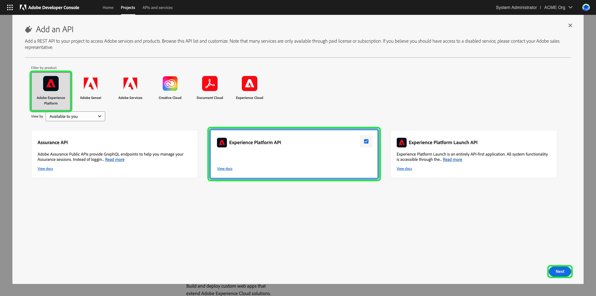

# Autentisera och få åtkomst till Experience Platform-API:er

I det här dokumentet finns en stegvis självstudiekurs för att få tillgång till ett Adobe Experience Platform-utvecklarkonto för att ringa till Experience Platform API:er. I slutet av den här självstudiekursen kommer du att ha genererat eller samlat in följande inloggningsuppgifter som krävs som huvuden i alla Experience Platform API-anrop:

* `{ACCESS_TOKEN}`
* `{API_KEY}`
* `{ORG_ID}`

>[!TIP]
>
>Förutom de tre autentiseringsuppgifterna ovan kräver många Experience Platform API:er även att en giltig `{SANDBOX_NAME}` anges som rubrik. Mer information om sandlådor som är tillgängliga för din organisation finns i [översikten över sandlådor](../sandboxes/home.md) och i dokumentationen för [slutpunkten för sandlådehantering](/help/sandboxes/api/sandboxes.md#list).

För att skydda program och användare måste alla förfrågningar till Experience Platform API:er autentiseras och auktoriseras med standarder som OAuth.

I den här självstudiekursen beskrivs hur du samlar in de nödvändiga inloggningsuppgifterna för att autentisera Experience Platform API-anrop, vilket beskrivs i nedanstående flödesschema. Du kan samla de flesta nödvändiga autentiseringsuppgifter i den första engångsinställningen. Åtkomsttoken måste dock uppdateras var 24:e timme.


## Förhandskrav {#prerequisites}

För att kunna anropa Experience Platform API:er måste du ha följande:

* En organisation med tillgång till Adobe Experience Platform.
* En Admin Console-administratör som kan lägga till dig som utvecklare och som användare för en produktprofil.
* En Experience Platform-systemadministratör som kan ge dig nödvändiga attributbaserade åtkomstkontroller för att utföra läs- och skrivåtgärder på olika delar av Experience Platform via API:er.

Du måste också ha en Adobe ID för att slutföra kursen. Om du inte har någon Adobe ID kan du skapa en med följande steg:

1. Gå till [Adobe Developer Console](https://console.adobe.io).
2. Välj **[!UICONTROL Create a new account]**.
3. Slutför registreringsprocessen.

## Få utvecklare och användare åtkomst till Experience Platform {#gain-developer-user-access}

Innan du skapar integreringar på Adobe Developer Console måste ditt konto ha utvecklar- och användarbehörigheter för en Experience Platform-produktprofil i Adobe Admin Console.

### Få utvecklaråtkomst {#gain-developer-access}

Kontakta en Admin Console-administratör i din organisation om du vill lägga till dig som utvecklare i en Experience Platform-produktprofil. Mer information om hur du [hanterar utvecklaråtkomst för produktprofiler](https://helpx.adobe.com/enterprise/admin-guide.html/enterprise/using/manage-developers.ug.html) finns i Admin Console-dokumentationen.

När du har tilldelats en utvecklare kan du börja skapa integreringar i [Adobe Developer Console](https://www.adobe.com/go/devs_console_ui). Dessa integreringar är en pipeline från externa program och tjänster till Adobe API:er.

### Få användaråtkomst {#gain-user-access}

Din Admin Console-administratör måste också lägga till dig som användare i samma produktprofil. Med användaråtkomst kan du i gränssnittet se resultatet av de API-åtgärder du utför.

Mer information finns i guiden om [hantering av användargrupper i Admin Console](https://helpx.adobe.com/enterprise/admin-guide.html/enterprise/using/user-groups.ug.html).

## Generera en API-nyckel (klient-ID) och ett företags-ID {#generate-credentials}

>[!NOTE]
>
>Om du följer det här dokumentet från [Privacy Service API-handboken](../privacy-service/api/getting-started.md) kan du nu gå tillbaka till den vägledningen för att generera autentiseringsuppgifter som är unika för [!DNL Privacy Service].

När du har fått utvecklare och användare åtkomst till Experience Platform via Admin Console är nästa steg att generera dina `{ORG_ID}`- och `{API_KEY}`-autentiseringsuppgifter i Adobe Developer Console. Dessa autentiseringsuppgifter behöver bara genereras en gång och kan återanvändas i framtida Experience Platform API-anrop.

>[!TIP]
>
>I stället för att gå till Developer Console kan du få alla inloggningsuppgifter som du behöver för att arbeta med Experience Platform API:er direkt från API:ns referensdokumentationssidor. [Läs mer](#get-credentials-functionality) om funktionaliteten.

### Lägg till Experience Platform i ett projekt {#add-platform-to-project}

Gå till [Adobe Developer Console](https://www.adobe.com/go/devs_console_ui) och logga in med din Adobe ID. Följ sedan stegen som beskrivs i självstudiekursen om att [skapa ett tomt projekt](https://developer.adobe.com/developer-console/docs/guides/projects/projects-empty/) i Adobe Developer Console-dokumentationen.

När du har skapat ett nytt projekt väljer du **[!UICONTROL Add API]** på skärmen **[!UICONTROL Project Overview]**.

>[!TIP]
>
>Om du har etablerat dig för flera organisationer använder du organisationsväljaren i det övre högra hörnet av gränssnittet för att kontrollera att du är i den organisation du behöver.


Skärmen **[!UICONTROL Add an API]** visas. Välj produktikonen för **[!UICONTROL Adobe Experience Platform]** och välj sedan **[!UICONTROL Experience Platform API]** innan du väljer **[!UICONTROL Next]**.



>[!TIP]
>
>Välj alternativet **[!UICONTROL View docs]** om du vill navigera i ett separat webbläsarfönster till den fullständiga [Experience Platform API-referensdokumentationen](https://developer.adobe.com/experience-platform-apis/).

### Välj autentiseringstypen [!UICONTROL OAuth Server-to-Server] {#select-oauth-server-to-server}

Välj sedan autentiseringstypen **[!UICONTROL OAuth Server-to-Server]** för att generera åtkomsttoken och få åtkomst till Experience Platform API. Ge dina autentiseringsuppgifter ett beskrivande namn i textfältet **[!UICONTROL Credential name]** innan du väljer **[!UICONTROL Next]**.

>[!IMPORTANT]
>
>Metoden **[!UICONTROL OAuth Server-to-Server]** är den enda tokengenereringsmetod som stöds för att gå framåt. Metoden **[!UICONTROL Service Account (JWT)]** som tidigare stöddes är föråldrad och kan inte väljas för nya integreringar. Befintliga integreringar som använder JWT-autentiseringsmetoden fortsätter att fungera fram till 30 juni 2025, men Adobe rekommenderar starkt att du migrerar befintliga integreringar till den nya [!UICONTROL OAuth Server-to-Server]-metoden före det datumet. Hämta mer information i avsnittet [!BADGE Föråldrat]{type=negative} [Generera en JSON-webbtoken (JWT)](#jwt).


### Välj produktprofiler för integreringen {#select-product-profiles}

På skärmen **[!UICONTROL Configure API]** väljer du **[!UICONTROL AEP-Default-All-Users]** tillsammans med eventuella ytterligare produktprofiler som du vill ha tillgång till.

>[!IMPORTANT]
>
>För att få tillgång till vissa funktioner i Experience Platform behöver du också en systemadministratör som ger dig de nödvändiga attributbaserade behörigheterna för åtkomstkontroll. Läs mer i avsnittet [Få de nödvändiga attributbaserade behörigheterna för åtkomstkontroll](#get-abac-permissions).


Välj **[!UICONTROL Save configured API]** när du är klar.

En genomgång av stegen som beskrivs ovan för att konfigurera en integrering med Experience Platform API finns också i videosjälvstudien nedan:

>[!VIDEO](https://video.tv.adobe.com/v/28832/?learn=on)

### Samla in inloggningsuppgifter {#gather-credentials}

När API:t har lagts till i projektet visar **[!UICONTROL OAuth Server-to-Server]**-sidan för projektet följande autentiseringsuppgifter som krävs i alla anrop till Experience Platform API:er:


* `{API_KEY}` ([!UICONTROL Client ID])
* `{ORG_ID}` ([!UICONTROL Organization ID])

<!--


<!--

In addition to the above credentials, you also need the generated **[!UICONTROL Client Secret]** for a future step. Select **[!UICONTROL Retrieve client secret]** to reveal the value, and then copy it for later use.


-->

## Generera en åtkomsttoken {#generate-access-token}

Nästa steg är att generera en `{ACCESS_TOKEN}`-autentiseringsuppgift som kan användas i Experience Platform API-anrop. Till skillnad från värdena för `{API_KEY}` och `{ORG_ID}` måste en ny token genereras var 24:e timme för att du ska kunna fortsätta använda Experience Platform API:er. Välj **[!UICONTROL Generate access token]** som skapar din åtkomsttoken, så som visas nedan.


>[!TIP]
>
>Du kan också använda en Postman-miljö och en samling för att generera åtkomsttoken. Mer information finns i avsnittet om att [använda Postman för att autentisera och testa API-anrop](#use-postman).

## Skapa och hämta autentiseringsuppgifter direkt i API-referensdokumentationen {#get-credentials-functionality}

Från och med november 2024-utgåvan av Experience Platform kan du få inloggningsuppgifter för att använda Experience Platform API:er direkt från API:ns referenssidor, utan att behöva gå till [!UICONTROL Developer Console]. Visa exemplet nedan från [Flow Service API - Destinations-sidan](https://developer.adobe.com/experience-platform-apis/references/destinations/).


Om du vill ha inloggningsuppgifter för att anropa Experience Platform API:er går du till en referenssida för Experience Platform API och väljer **[!UICONTROL Sign in]** överst på sidan. Logga in med din **[!UICONTROL Personal Account]** eller **[!UICONTROL Company or School Account]**.

När du har loggat in väljer du **[!UICONTROL Create new credential]** för att skapa en ny uppsättning autentiseringsuppgifter för att komma åt Experience Platform API:er.


Använd sedan listruteväljaren för att öppna inloggningsfönstret, generera en åtkomsttoken och hämta API-nyckeln och ditt organisations-ID. Kopiera autentiseringsuppgifterna till [**[!UICONTROL Try it]**](/help/release-notes/2024/may-2024.md#interactive-api-documentation)-blocken på API-referenssidorna för att börja arbeta med Experience Platform API:er.


>[!TIP]
>
>Det övre referensblocket visas fortfarande när du navigerar mellan olika slutpunktssidor i referensdokumentationen för Experience Platform API.

## [!BADGE Borttagen]{type=negative} Generera en JSON-webbtoken (JWT) {#jwt}

>[!WARNING]
>
>JWT-metoden för att generera åtkomsttoken har tagits bort. Alla nya integreringar måste skapas med autentiseringsmetoden [OAuth Server-till-server](#select-oauth-server-to-server). Adobe kräver också att du migrerar dina befintliga integreringar till OAuth-metoden senast 30 juni 2025 för att integreringarna ska fortsätta att fungera. Läs följande viktiga dokumentation:
> 
> * [Migreringsguide för program från JWT till OAuth](https://developer.adobe.com/developer-console/docs/guides/authentication/ServerToServerAuthentication/migration/)
> * [Implementeringsguide för nya och gamla program med OAuth](https://developer.adobe.com/developer-console/docs/guides/authentication/ServerToServerAuthentication/implementation/)
> * [Fördelar med att använda inloggningsmetoden OAuth Server-till-server](https://developer.adobe.com/developer-console/docs/guides/authentication/ServerToServerAuthentication/migration/#why-oauth-server-to-server-credentials)

+++ Visa inaktuell information

Nästa steg är att generera en JSON Web Token (JWT) baserat på dina kontouppgifter. Det här värdet används för att generera dina `{ACCESS_TOKEN}`-autentiseringsuppgifter för användning i Experience Platform API-anrop, som måste genereras om var 24:e timme.

>[!IMPORTANT]
>
>I den här självstudiekursen beskrivs hur du genererar en JWT-fil i Developer Console i stegen nedan. Denna genereringsmetod bör dock endast användas för testning och utvärdering.
>
>För normal användning måste JWT genereras automatiskt. Mer information om programmässig generering av JWT finns i [autentiseringsguiden för tjänstkontot](https://www.adobe.io/developer-console/docs/guides/authentication/JWT/) på Adobe Developer.

Välj **[!UICONTROL Service Account (JWT)]** i den vänstra navigeringen och välj sedan **[!UICONTROL Generate JWT]**.


I textrutan under **[!UICONTROL Generate custom JWT]** klistrar du in innehållet i den privata nyckeln som du tidigare skapade när du lade till Experience Platform API i ditt tjänstkonto. Välj sedan **[!UICONTROL Generate Token]**.


Sidan uppdateras för att visa den genererade JWT-filen tillsammans med ett exempel på ett cURL-kommando som gör att du kan generera en åtkomsttoken. I den här självstudiekursen väljer du **[!UICONTROL Copy]** bredvid **[!UICONTROL Generated JWT]** för att kopiera token till Urklipp.


**Generera en åtkomsttoken**

När du har genererat en JWT kan du använda den i ett API-anrop för att generera `{ACCESS_TOKEN}`. Till skillnad från värdena för `{API_KEY}` och `{ORG_ID}` måste en ny token genereras var 24:e timme för att du ska kunna fortsätta använda Experience Platform API:er.

**Begäran**

Följande begäran genererar en ny `{ACCESS_TOKEN}` baserat på autentiseringsuppgifterna som anges i nyttolasten. Den här slutpunkten godkänner endast formulärdata som sin nyttolast, och därför måste den få `Content-Type`-huvudet `multipart/form-data`.

```shell
curl -X POST https://ims-na1.adobelogin.com/ims/exchange/jwt \
  -H 'Content-Type: multipart/form-data' \
  -F 'client_id={API_KEY}' \
  -F 'client_secret={SECRET}' \
  -F 'jwt_token={JWT}'
```

| Egenskap | Beskrivning |
| --- | --- |
| `{API_KEY}` | `{API_KEY}` ([!UICONTROL Client ID]) som du hämtade i ett [föregående steg](#api-ims-secret). |
| `{SECRET}` | Klienthemligheten som du hämtade i ett [föregående steg](#api-ims-secret). |
| `{JWT}` | Den JWT som du genererade i ett [föregående steg](#jwt). |

>[!NOTE]
>
>Du kan använda samma API-nyckel, klienthemlighet och JWT för att generera en ny åtkomsttoken för varje session. Detta gör att du kan automatisera genereringen av åtkomsttoken i dina program.

**Svar**

```json
{
  "token_type": "bearer",
  "access_token": "{ACCESS_TOKEN}",
  "expires_in": 86399992
}
```

| Egenskap | Beskrivning |
| --- | --- |
| `token_type` | Den typ av token som returneras. För åtkomsttoken är det här värdet alltid `bearer`. |
| `access_token` | Den genererade `{ACCESS_TOKEN}`. Det här värdet, som föregås av ordet `Bearer`, krävs som `Authentication`-rubrik för alla Experience Platform API-anrop. |
| `expires_in` | Antalet millisekunder som återstår tills åtkomsttoken upphör att gälla. När värdet når 0 måste en ny åtkomsttoken genereras för att du ska kunna fortsätta använda Experience Platform API:er. |

+++

## Testa autentiseringsuppgifter {#test-credentials}

När du har samlat in alla tre nödvändiga autentiseringsuppgifter - åtkomsttoken, API-nyckel och organisations-ID - kan du försöka göra följande API-anrop. Det här samtalet listar alla [!DNL Experience Data Model] (XDM) standardklasser som är tillgängliga för din organisation. Importera och kör samtalet i [Postman](#use-postman).

>[!BEGINSHADEBOX]

**Begäran**

```SHELL
curl -X GET https://platform.adobe.io/data/foundation/schemaregistry/global/classes \
  -H 'Accept: application/vnd.adobe.xed-id+json' \
  -H 'Authorization: Bearer {{ACCESS_TOKEN}}' \
  -H 'x-api-key: {{API_KEY}}' \
  -H 'x-gw-ims-org-id: {{ORG_ID}}'
```

**Svar**

Om ditt svar liknar det som visas nedan är dina inloggningsuppgifter giltiga och fungerar. (Det här svaret har trunkerats för utrymme.)

```JSON
{
  "results": [
    {
        "title": "XDM ExperienceEvent",
        "$id": "https://ns.adobe.com/xdm/context/experienceevent",
        "meta:altId": "_xdm.context.experienceevent",
        "version": "1"
    },
    {
        "title": "XDM Individual Profile",
        "$id": "https://ns.adobe.com/xdm/context/profile",
        "meta:altId": "_xdm.context.profile",
        "version": "1"
    }
  ]
}
```

>[!ENDSHADEBOX]

>[!IMPORTANT]
>
>Samtalet ovan räcker för att testa dina inloggningsuppgifter, men tänk på att du inte kommer att kunna komma åt eller ändra flera resurser utan rätt attributbaserad åtkomstkontrollbehörighet. Läs mer i avsnittet **Hämta de nödvändiga attributbaserade åtkomstkontrollsbehörigheterna** nedan.

## Skaffa nödvändiga attributbaserade behörigheter för åtkomstkontroll {#get-abac-permissions}

Om du vill få åtkomst till eller ändra flera resurser i Experience Platform måste du ha rätt åtkomstkontrollbehörighet. Systemadministratörer kan ge dig de [behörigheter du behöver](/help/access-control/ui/permissions.md). Mer information finns i avsnittet om att [hantera API-autentiseringsuppgifter för en roll](/help/access-control/abac/ui/permissions.md#manage-api-credentials-for-role).

Detaljerad information om hur en systemadministratör kan bevilja de behörigheter som krävs för att få åtkomst till Experience Platform-resurser via API finns också i videosjälvstudien nedan:

>[!VIDEO](https://video.tv.adobe.com/v/28832/?learn=on&t=159)

## Använd Postman för att autentisera och testa API-anrop {#use-postman}

[Postman](https://www.postman.com/) är ett populärt verktyg som gör att utvecklare kan utforska och testa RESTful-API:er. Du kan använda Experience Platform Postman samlingar och miljöer för att snabba upp arbetet med Experience Platform API:er. Läs mer om [att använda Postman i Experience Platform](/help/landing/postman.md) och komma igång med samlingar och miljöer.

Detaljerad information om hur du använder Postman med Experience Platform samlingar och miljöer finns också i videosjälvstudierna nedan:

**Hämta och importera en Postman-miljö att använda med Experience Platform API:er**

>[!VIDEO](https://video.tv.adobe.com/v/28832/?learn=on&t=106)

**Använd en Postman-samling för att generera åtkomsttoken**

Hämta [Identity Management Service Postman-samlingen](https://github.com/adobe/experience-platform-postman-samples/tree/master/apis/ims) och se videon nedan för att lära dig hur du genererar åtkomsttoken.

>[!VIDEO](https://video.tv.adobe.com/v/29698/?learn=on)

**Hämta Experience Platform API Postman-samlingar och interagera med API:erna**

>[!VIDEO](https://video.tv.adobe.com/v/29704/?learn=on)

<!--
This [Medium post](https://medium.com/adobetech/using-postman-for-jwt-authentication-on-adobe-i-o-7573428ffe7f) describes how you can set up Postman to automatically perform JWT authentication and use it to consume Experience Platform APIs.
-->

## Systemadministratörer: Bevilja utvecklare och API-åtkomstkontroll med Experience Platform-behörigheter {#grant-developer-and-api-access-control}

Innan du kan skapa integreringar på Adobe Developer Console måste ditt konto ha utvecklar- och användarbehörigheter för en Experience Platform-produktprofil.

>[!NOTE]
>
>Det är bara systemadministratörer som kan visa och hantera API-autentiseringsuppgifter i behörigheter.

### Lägg till utvecklare i produktprofilen {#add-developers-to-product-profile}

Navigera till [Admin Console](https://adminconsole.adobe.com/) och logga in med din Adobe ID.

Välj **[!UICONTROL Products]** i navigeringsfältet och välj sedan **[!UICONTROL Adobe Experience Platform]** i produktlistan.


Välj **[!UICONTROL Product Profiles]** på fliken **[!UICONTROL AEP-Default-All-Users]**. Du kan också använda sökfältet för att söka efter produktprofilen genom att ange namnet.


Välj fliken **[!UICONTROL Developers]** och välj sedan **[!UICONTROL Add Developer]**.


Dialogrutan **[!UICONTROL Add developers]** visas. Ange utvecklarens **[!UICONTROL Email or username]**. En giltig [!UICONTROL Email or username] visar utvecklarinformationen. Välj **[!UICONTROL Save]**.


Utvecklaren har lagts till och visas på fliken **[!UICONTROL Developers]**.


### Tilldela API-autentiseringsuppgifter till en roll

>[!NOTE]
>
> Endast en systemadministratör kan tilldela API:er till roller i Experience Platform-gränssnittet.

Om du vill använda och utföra åtgärder på Experience Platform API:er måste en systemadministratör lägga till API-autentiseringsuppgifterna utöver en rolls angivna behörighetsuppsättning. Mer information finns i avsnittet om att [hantera API-autentiseringsuppgifter för en roll](../access-control/abac/ui/permissions.md#manage-api-credentials-for-a-role).

En genomgång av stegen som beskrivs ovan för att lägga till utvecklare i produktprofiler och tilldela API:er till roller finns också i videosjälvstudien nedan:

>[!VIDEO](https://video.tv.adobe.com/v/3426407/?learn=on)

## Ytterligare resurser {#additional-resources}

Mer information om hur du kommer igång med Experience Platform API:er finns i de ytterligare resurserna som är länkade nedan

* [Autentisera och få tillgång till sidan med självstudiekurser för Experience Platform API](https://experienceleague.adobe.com/docs/platform-learn/tutorials/platform-api-authentication.html)
* [Identity Management Service Postman Collection](https://github.com/adobe/experience-platform-postman-samples/tree/master/apis/ims) för generering av åtkomsttoken
* [Experience Platform API Postman-samlingar](https://github.com/adobe/experience-platform-postman-samples/tree/master/apis/experience-platform)

## Nästa steg {#next-steps}

Genom att läsa det här dokumentet har du samlat in och testat dina inloggningsuppgifter för Experience Platform API:er. Du kan nu följa med i de exempel på API-anrop som finns i [dokumentationen](../landing/documentation/overview.md).

Förutom de autentiseringsvärden du har samlat in i den här självstudiekursen, kräver många Experience Platform API:er även att en giltig `{SANDBOX_NAME}` anges som rubrik. Se [översikten över sandlådor](../sandboxes/home.md) för mer information.
