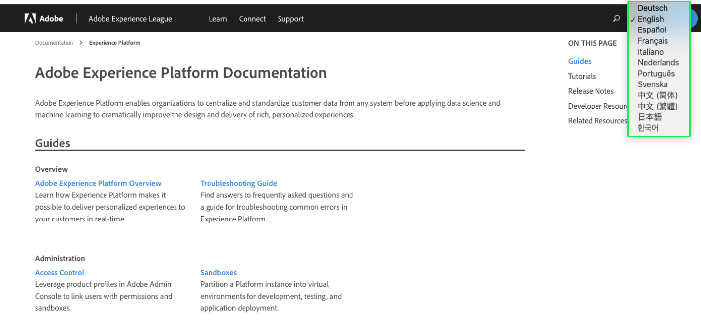

# Stöd för Experience Platform dokumentationsspråk

Adobe Experience Platform-dokumentation finns på flera språk.

Om du vill ändra vilket språk som visas i dokumentationen väljer du språkikonen i den övre navigeringen.

När listrutan för språk öppnas väljer du det språk som du vill visa dokumentationen på.

