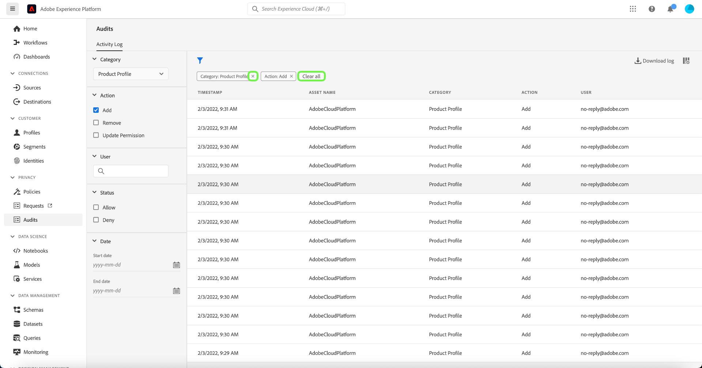

# Granskningsloggar {#audit-logs}

>[!CONTEXTUALHELP]
>id="platform_audits_privacyconsole_actions"
>title="De vanligaste funktionsmakrona"
>abstract="Den här widgeten visar de vanligaste åtgärderna som har vidtagits i Experience Platform inom den valda tidsramen. Om du vill se en fullständig lista över registrerade åtgärder i Platform väljer du **Granskningar** i den vänstra navigeringen."

>[!CONTEXTUALHELP]
>id="platform_audits_privacyconsole_users"
>title="De vanligaste användarna"
>abstract="Den här widgeten visar de användare som har utfört de flesta åtgärderna i Experience Platform inom den valda tidsramen. Om du vill se en fullständig lista över registrerade åtgärder i Platform väljer du **Granskningar** i den vänstra navigeringen."

För att öka insynen i och synligheten i de aktiviteter som utförs i systemet kan du med Adobe Experience Platform granska användaraktiviteter för olika tjänster och funktioner i form av &quot;granskningsloggar&quot;. Loggarna utgör en verifieringskedja som kan hjälpa till med felsökningsproblem på plattformen och hjälpa ditt företag att effektivt följa företagets policyer för datahantering och lagstadgade krav.

I grundläggande bemärkelse anger en granskningslogg **som** utförd **vad** och **när**. Varje åtgärd som registreras i en logg innehåller metadata som anger åtgärdstyp, datum och tid, e-post-ID för användaren som utförde åtgärden samt ytterligare attribut som är relevanta för åtgärdstypen.

Det här dokumentet innehåller granskningsloggar i Platform, inklusive hur du visar och hanterar dem i användargränssnittet eller API.

## Händelsetyper som hämtats av granskningsloggar {#category}

Följande tabell visar vilka åtgärder som resurser registreras av granskningsloggar för:

| Resurs | Instruktioner |
| --- | --- |
| [Åtkomstkontrollprincip (attributbaserad åtkomstkontroll)](../../../access-control/home.md) | <ul><li>Skapa</li><li>Uppdatera</li><li>Ta bort</li></ul> |
| [Konto (Adobe)](../../../sources/connectors/tutorials/ui/../../../tutorials/ui/update.md) | <ul><li>Skapa</li><li>Uppdatera</li><li>Ta bort</li></ul> |
| [Attribution AI instans](../../../intelligent-services/attribution-ai/overview.md) | <ul><li>Skapa</li><li>Uppdatera</li><li>Ta bort</li><li>Aktivera</li><li>Inaktivera</li></ul> |
| [Granskningsloggar](../../../landing/governance-privacy-security/audit-logs/overview.md) | <ul><li>Exportera</li></ul> |
| [Klass](../../../xdm/schema/composition.md#class) | <ul><li>Skapa</li><li>Uppdatera</li><li>Ta bort</li></ul> |
| [Beräknat attribut](../../../profile/computed-attributes/overview.md) | <ul><li>Skapa</li><li>Uppdatera</li><li>Ta bort</li></ul> |
| [AI-instans för kund](../../../intelligent-services/customer-ai/overview.md) | <ul><li>Skapa</li><li>Uppdatera</li><li>Ta bort</li><li>Aktivera</li><li>Inaktivera</li></ul> |
| [Datauppsättning](../../../catalog/datasets/overview.md) | <ul><li>Skapa</li><li>Uppdatera</li><li>Ta bort</li><li>Aktivera för [Kundprofil i realtid](../../../profile/home.md)</li><li>Inaktivera för profil</li><li>Lägg till data</li><li>Ta bort batch</li></ul> |
| [Datatyper](../../../xdm/schema/composition.md#data-type) | <ul><li>Skapa</li><li>Uppdatera</li><li>Ta bort</li></ul> |
| [Destination](../../../destinations/home.md) | <ul><li>Skapa</li><li>Uppdatera</li><li>Ta bort</li><li>Aktivera</li><li>Inaktivera</li><li>Aktivera datauppsättning</li><li>Ta bort datauppsättning</li><li>Aktivera profil</li><li>Ta bort profil</li></ul> |
| [Fältgrupp](../../../xdm/schema/composition.md#field-group) | <ul><li>Skapa</li><li>Uppdatera</li><li>Ta bort</li></ul> |
| [Identitetsdiagram](../../../identity-service/ui/identity-graph-viewer.md) | <ul><li>Visa</li></ul> |
| [Namnutrymme för identitet](../../../identity-service/ui/identity-graph-viewer.md) | <ul><li>Skapa</li><li>Uppdatera</li></ul> |
| [Kopplingsprincip](../../../profile/merge-policies/overview.md) | <ul><li>Skapa</li><li>Uppdatera</li><li>Ta bort</li></ul> |
| [Produktprofil](../../../access-control/home.md) | <ul><li>Skapa</li><li>Uppdatera</li><li>Ta bort</li></ul> |
| [Fråga](../../../query-service/ui/overview.md) | <ul><li>Kör</li></ul> |
| [Frågemall](../../../query-service/ui/overview.md) | <ul><li>Skapa</li><li>Uppdatera</li><li>Ta bort</li></ul> |
| [Roll (attributbaserad åtkomstkontroll)](../../../access-control/home.md) | <ul><li>Skapa</li><li>Uppdatera</li><li>Ta bort</li><li>Lägg till användare</li><li>Ta bort användare</li></ul> |
| [Sandbox](../../../sandboxes/home.md) | <ul><li>Skapa</li><li>Uppdatera</li><li>Återställ</li><li>Ta bort</li></ul> |
| [Schemalagd fråga](../../../query-service/ui/overview.md) | <ul><li>Skapa</li><li>Uppdatera</li><li>Ta bort</li></ul> |
| [Schema](../../../xdm/schema/composition.md) | <ul><li>Skapa</li><li>Uppdatera</li><li>Ta bort</li><li>Aktivera för profil</li></ul> |
| [Segment](../../../segmentation/home.md) | <ul><li>Skapa</li><li>Ta bort</li><li>Aktivera segment</li><li>Ta bort segment</li></ul> |
| [Källdataflöde](../../../sources/connectors/tutorials/ui/../../../tutorials/ui/update.md) | <ul><li>Skapa</li><li>Uppdatera</li><li>Ta bort</li><li>Aktivera</li><li>Inaktivera</li><li>Aktivera datauppsättning</li><li>Ta bort datauppsättning</li><li>Profil aktiverad</li><li>Ta bort profil</li></ul> |
| [Arbetsorder](../../../hygiene/home.md) | <ul><li>Skapa</li></ul> |

## Åtkomst till granskningsloggar

När funktionen är aktiverad för din organisation samlas granskningsloggarna automatiskt in när aktiviteten inträffar. Du behöver inte aktivera loggsamling manuellt.

För att kunna visa och exportera granskningsloggar måste du ha **[!UICONTROL View User Activity Log]** behörighet för åtkomstkontroll (finns under [!UICONTROL Data Governance] kategori). Läs mer om hur du hanterar individuella behörigheter för plattformsfunktioner i [dokumentation om åtkomstkontroll](../../../access-control/home.md).

## Hantera granskningsloggar i användargränssnittet

Du kan visa granskningsloggar för olika Experience Platform-funktioner i **[!UICONTROL Audits]** i plattformsgränssnittet. På arbetsytan visas en lista med inspelade loggar. Som standard sorteras de från senaste till senaste.

Granskningsloggarna sparas i 365 dagar efter vilka de kommer att tas bort från systemet. Därför kan du bara gå tillbaka under en period på högst 365 dagar. Om du behöver data som är längre än 365 dagar bör du exportera loggar med en regelbunden mellanrum för att uppfylla dina interna policykrav.

Välj en händelse i listan om du vill visa information om händelsen i den högra listen.

### Filtrera granskningsloggar

>[!NOTE]
>
>Eftersom det här är en ny funktion går de data som visas endast tillbaka till mars 2022. Beroende på vilken resurs som valts kan tidigare data vara tillgängliga från och med januari 2022.

Markera trattecknet () för att visa en lista med filterkontroller för att begränsa resultatet. Endast de 1000 sista posterna visas oavsett vilket filter du har valt.

Följande filter är tillgängliga för granskningshändelser i användargränssnittet:

| Filter | Beskrivning |
| --- | --- |
| [!UICONTROL Category] | Använd listrutan för att filtrera de resultat som visas med [kategori](#category). |
| [!UICONTROL Action] | Filtrera efter åtgärd. Endast för närvarande [!UICONTROL Create] och [!UICONTROL Delete] kan filtreras. |
| [!UICONTROL User] | Ange hela användar-ID:t (till exempel `johndoe@acme.com`) för att filtrera efter användare. |
| [!UICONTROL Status] | Filtrera efter om åtgärden tilläts (slutförd) eller nekades på grund av brist på [åtkomstkontroll](../../../access-control/home.md) behörigheter. |
| [!UICONTROL Date] | Välj ett startdatum och/eller ett slutdatum för att definiera ett datumintervall som resultaten ska filtreras efter. Data kan exporteras med en 90-dagars uppslagsperiod (till exempel 2021-12-15 till 2022-03-15). Detta kan skilja sig åt beroende på händelsetyp. |

Om du vill ta bort ett filter väljer du &quot;X&quot; på ikonen för pilen för filtret i fråga eller väljer **[!UICONTROL Clear all]** om du vill ta bort alla filter.

### Exportera granskningsloggar

Om du vill exportera den aktuella listan med granskningsloggar väljer du **[!UICONTROL Download log]**.

Välj önskat format i dialogrutan som visas (antingen **[!UICONTROL CSV]** eller **[!UICONTROL JSON]**) och sedan väljer **[!UICONTROL Download]**. Webbläsaren hämtar den genererade filen och sparar den på datorn.

## Hantera granskningsloggar i API

Alla åtgärder som du kan utföra i användargränssnittet kan också utföras med API-anrop. Se [API-referensdokument](https://www.adobe.io/experience-platform-apis/references/audit-query/) för mer information.

## Hantera granskningsloggar för Adobe Admin Console

Mer information om hur du hanterar granskningsloggar för aktiviteter i Adobe Admin Console finns i följande [dokument](https://helpx.adobe.com/enterprise/using/audit-logs.html).

## Nästa steg och ytterligare resurser

I den här guiden beskrivs hur du hanterar granskningsloggar i Experience Platform. Mer information om hur du övervakar plattformsaktiviteter finns i dokumentationen om [Insikter om observerbarhet](../../../observability/home.md) och [övervaka datainmatning](../../../ingestion/quality/monitor-data-ingestion.md).

Titta på följande video för att få en bättre förståelse för granskningsloggar i Experience Platform:

>[!VIDEO](https://video.tv.adobe.com/v/341450?quality=12&learn=on)
