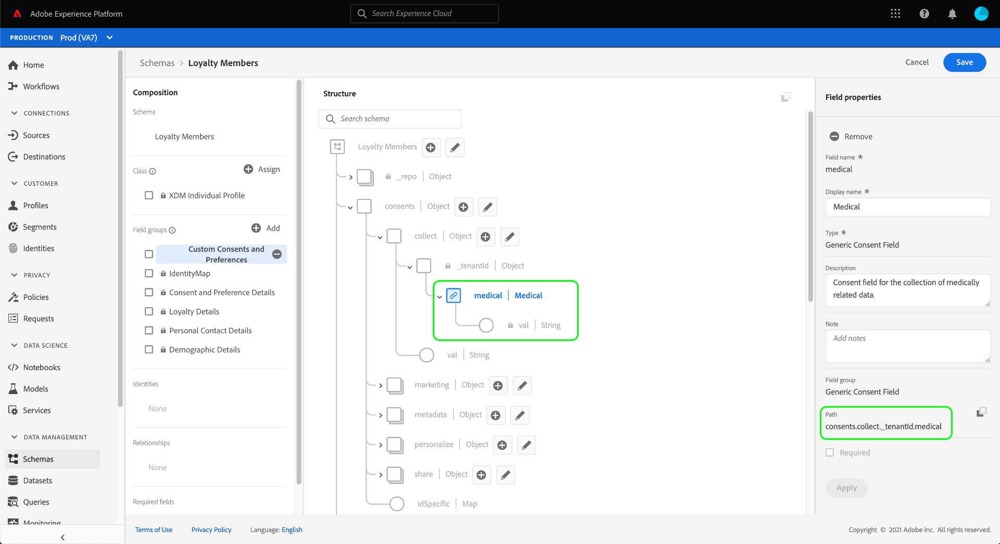

# Konfigurera en datauppsättning för inhämtning av samtycke och inställningsdata

För att Adobe Experience Platform ska kunna behandla dina data om kundens samtycke/preferens måste dessa data skickas till en datauppsättning vars schema innehåller fält som rör samtycke och andra behörigheter. Den här datauppsättningen måste baseras på klassen [!DNL XDM Individual Profile] och vara aktiverad för användning i [!DNL Real-time Customer Profile].

Det här dokumentet innehåller steg för hur du konfigurerar en datauppsättning för att bearbeta medgivandedata i Experience Platform. En översikt över det fullständiga arbetsflödet för bearbetning av samtycke/inställningsdata i Platform finns i [översikten över godkännandebearbetning](./overview.md).

>[!IMPORTANT]
>
>Exemplen i den här handboken använder en standardiserad uppsättning fält för att representera värden för kundgodkännande, enligt definitionen i schemafältgruppen [[!UICONTROL Consent and Preference Details]](../../../../xdm/field-groups/profile/consents.md). Strukturen på dessa fält är avsedd att tillhandahålla en effektiv datamodell som omfattar många vanliga fall av insamling av samtycke.
>
>Du kan dock även definiera egna fältgrupper för att representera samtycke enligt dina egna datamodeller. Kontakta ditt juridiska team för att få ett godkännande av en datamodell för samtycke som passar era affärsbehov, baserat på följande alternativ:
>
>* Den standardiserade fältgruppen för samtycke
>* En anpassad fältgrupp för samtycke som skapats av din organisation
>* En kombination av den standardiserade fältgruppen för samtycke och ytterligare fält som tillhandahålls av en anpassad fältgrupp för samtycke


## Förutsättningar

Den här självstudiekursen kräver en fungerande förståelse av följande komponenter i Adobe Experience Platform:

* [Experience Data Model (XDM)](../../../../xdm/home.md): Det standardiserade ramverket som  [!DNL Experience Platform] organiserar kundupplevelsedata.
   * [Grundläggande om schemakomposition](../../../../xdm/schema/composition.md): Lär dig mer om grundstenarna i XDM-scheman.
* [Kundprofil](../../../../profile/home.md) i realtid: Konsoliderar kunddata från olika källor till en komplett, enhetlig vy och erbjuder samtidigt ett användbart, tidsstämplat konto för varje kundinteraktion.

>[!IMPORTANT]
>
>I den här självstudien antas att du känner till det [!DNL Profile]-schema i plattformen som du vill använda för att hämta kundattributsinformation. Oavsett vilken metod du använder för att samla in medgivandedata måste schemat vara [aktiverat för kundprofil för realtid](../../../../xdm/ui/resources/schemas.md#profile). Dessutom kan schemats primära identitet inte vara ett direkt identifierbart fält som inte får användas i intressebaserad annonsering, till exempel en e-postadress. Kontakta ditt juridiska ombud om du är osäker på vilka fält som är begränsade.

## [!UICONTROL Consent and Preference Details] fältgruppstruktur {#structure}

Fältgruppen [!UICONTROL Consent and Preference Details] ger standardiserade medgivandefält till ett schema. För närvarande är den här fältgruppen bara kompatibel med scheman som baseras på klassen [!DNL XDM Individual Profile].

Fältgruppen innehåller ett enda fält av objekttyp, `consents`, vars underegenskaper samlar in en uppsättning standardiserade medgivandefält. Följande JSON är ett exempel på den typ av data som `consents` förväntar sig vid datainmatning:

```json
{
  "consents": {
    "collect": {
      "val": "y",
    },
    "share": {
      "val": "y",
    },
    "personalize": {
      "content": {
        "val": "y"
      }
    },
    "marketing": {
      "preferred": "email",
      "any": {
        "val": "y"
      },
      "push": {
        "val": "n",
        "reason": "Too Frequent",
        "time": "2019-01-01T15:52:25+00:00"
      }
    },
    "idSpecific": {
      "email": {
        "jdoe@example.com": {
          "marketing": {
            "email": {
              "val": "n"
            }
          }
        }
      }
    }
  },
  "metadata": {
    "time": "2019-01-01T15:52:25+00:00"
  }
}
```

>[!NOTE]
>
>Mer information om underegenskapernas struktur och innebörd i `consents` finns i översikten i fältgruppen [[!UICONTROL Consent and Preference Details]](../../../../xdm/field-groups/profile/consents.md).

## Lägg till obligatoriska fältgrupper i ditt [!DNL Profile]-schema {#add-field-group}

För att kunna samla in data om samtycke med hjälp av Adobe-standarden måste du ha ett profilaktiverat schema som innehåller följande två fältgrupper:

* [!UICONTROL Consent and Preference Details]
* [!UICONTROL IdentityMap] (krävs om du använder Platform Web eller Mobile SDK för att skicka medgivandesignaler)

Välj **[!UICONTROL Schemas]** i den vänstra navigeringen i plattformsgränssnittet och välj sedan fliken **[!UICONTROL Browse]** för att visa en lista över befintliga scheman. Här markerar du namnet på det [!DNL Profile]-aktiverade schema som du vill lägga till medgivandefält i. Skärmbilderna i det här avsnittet använder schemat &quot;Loyalty Members&quot; som är inbyggt i självstudiekursen [för att skapa schema](../../../../xdm/tutorials/create-schema-ui.md) som exempel.


>[!TIP]
>
>Du kan använda arbetsytans sök- och filtreringsfunktioner för att enklare hitta ditt schema. Mer information finns i guiden [utforska XDM-resurser](../../../../xdm/ui/explore.md).

[!DNL Schema Editor] visas och visar schemats struktur på arbetsytan. Till vänster på arbetsytan väljer du **[!UICONTROL Add]** under avsnittet **[!UICONTROL Field groups]**.


Dialogrutan **[!UICONTROL Add field group]** visas. Här väljer du **[!UICONTROL Consent and Preference Details]** i listan. Du kan även använda sökfältet för att begränsa resultaten och enklare hitta fältgruppen.


Leta sedan reda på fältgruppen **[!UICONTROL IdentityMap]** i listan och markera den också. När båda fältgrupperna visas i den högra listen väljer du **[!UICONTROL Add field groups]**.


Arbetsytan visas igen och visar att fälten `consents` och `identityMap` har lagts till i schemastrukturen. Om du behöver ytterligare fält för samtycke och inställningar som inte fångats in av standardfältgruppen kan du läsa avsnittet i bilagan [om hur du lägger till egna fält för samtycke och inställningar i schemat](#custom-consent). Annars väljer du **[!UICONTROL Save]** för att slutföra ändringarna av schemat.


>[!IMPORTANT]
>
>Om du skapar ett nytt schema, eller redigerar ett befintligt schema som inte har aktiverats för profilen, måste du [aktivera schemat för profilen](../../../../xdm/ui/resources/schemas.md#profile) innan du sparar.

Om schemat som du redigerade används av det [!UICONTROL Profile Dataset] som anges i ditt Platform Web SDK-datastam, kommer den datauppsättningen nu att innehålla de nya medgivandefälten. Du kan nu gå tillbaka till [handboken för behandling av samtycke](./overview.md#merge-policies) för att fortsätta konfigurera Experience Platform för att bearbeta data om samtycke. Om du inte har skapat någon datauppsättning för det här schemat följer du stegen i nästa avsnitt.

## Skapa en datauppsättning baserat på ditt medgivandeschema {#dataset}

När du har skapat ett schema med medgivandefält måste du skapa en datauppsättning som i slutändan kommer att innehålla kundernas medgivandedata. Den här datauppsättningen måste aktiveras för [!DNL Real-time Customer Profile].

Börja med att välja **[!UICONTROL Datasets]** i den vänstra navigeringen och välj sedan **[!UICONTROL Create dataset]** i det övre högra hörnet.


På nästa sida väljer du **[!UICONTROL Create dataset from schema]**.


Arbetsflödet **[!UICONTROL Create dataset from schema]** visas med början i steget **[!UICONTROL Select schema]**. Leta reda på ett av de medgivandescheman som du skapade tidigare i listan. Du kan även använda sökfältet för att begränsa resultaten och enklare hitta ditt schema. Markera alternativknappen bredvid önskat schema och välj sedan **[!UICONTROL Next]** för att fortsätta.


**[!UICONTROL Configure dataset]**-steget visas. Ange ett unikt, enkelt identifierbart namn och en beskrivning för datauppsättningen innan du väljer **[!UICONTROL Finish]**.


Informationssidan för den nya datauppsättningen visas. Om datauppsättningen baseras på ditt tidsserieschema är processen slutförd. Om datauppsättningen baseras på ditt postschema är det sista steget i processen att aktivera datauppsättningen för användning i [!DNL Real-time Customer Profile].

Välj alternativet **[!UICONTROL Profile]** till höger.


Slutligen väljer du **[!UICONTROL Enable]** i bekräftelseporten för att aktivera schemat för [!DNL Profile].


Datauppsättningen har nu sparats och aktiverats för användning i [!DNL Profile]. Om du planerar att använda Platform Web SDK för att skicka data om samtycke till profil måste du välja den här datauppsättningen som [!UICONTROL Profile Dataset] när du konfigurerar [datastream](../../../../edge/fundamentals/datastreams.md).

## Nästa steg

Genom att följa den här självstudiekursen har du lagt till medgivandefält i ett [!DNL Profile]-aktiverat schema, vars datamängd ska användas för att importera medgivandedata med hjälp av Platform Web SDK eller direkt XDM-inmatning.

Du kan nu gå tillbaka till översikten över [godkännandebearbetning](./overview.md#merge-policies) för att fortsätta konfigurera Experience Platform för att bearbeta medgivandedata.

## Bilaga

Följande avsnitt innehåller ytterligare information om hur du skapar en datauppsättning för att importera kundens samtycke och inställningsdata.

### Lägg till anpassade medgivandefält och inställningsfält i schemat {#custom-consent}

Om du behöver hämta ytterligare medgivandesignaler utanför de som representeras av fältgruppen [!UICONTROL Consent and Preference Details] kan du använda anpassade XDM-komponenter för att förbättra ditt medgivandeschema så att det passar just dina affärsbehov. I det här avsnittet beskrivs de grundläggande principerna för hur du anpassar ditt medgivandeschema för att kunna importera dessa signaler till profilen.

>[!IMPORTANT]
>
>SDK:n för plattformswebben och mobiler stöder inte anpassade fält i sina kommandon för ändring av samtycke. Det enda sättet att importera egna medgivandefält till profilen är för närvarande genom [batchimport](../../../../ingestion/batch-ingestion/overview.md) eller en [källanslutning](../../../../sources/home.md).

Vi rekommenderar att du använder fältgruppen [!UICONTROL Consent and Preference Details] som en baslinje för strukturen för dina medgivandedata och lägger till ytterligare fält efter behov, i stället för att försöka skapa hela strukturen från grunden.

Om du vill lägga till anpassade fält i strukturen för en standardfältgrupp måste du först skapa en anpassad fältgrupp. När du har lagt till fältgruppen [!UICONTROL Consent and Preference Details] i schemat väljer du ikonen **plus (+)** i avsnittet **[!UICONTROL Field groups]** och väljer sedan **[!UICONTROL Create new field group]**. Ange ett namn och en valfri beskrivning för fältgruppen och välj sedan **[!UICONTROL Add field group]**.


[!DNL Schema Editor] visas igen med den nya anpassade fältgruppen markerad i den vänstra listen. På arbetsytan visas kontroller som gör att du kan lägga till anpassade fält i schemastrukturen. Om du vill lägga till ett nytt medgivandefält eller inställningsfält väljer du ikonen **plus (+)** bredvid `consents`-objektet.


Ett nytt fält visas i `consents`-objektet. Eftersom du lägger till ett anpassat fält i ett standard-XDM-objekt skapas det nya fältet under ett objekt som har ett namn som är kopplat till ditt klient-ID.


Ange ett namn och en beskrivning för fältet i den högra listen under **[!UICONTROL Field properties]**. När du väljer fältets **[!UICONTROL Type]** måste du använda rätt standarddatatyp för ett anpassat samtycke- eller inställningsfält:

* [[!UICONTROL Generic Consent Field]](../../../../xdm/data-types/consent-field.md)
* [[!UICONTROL Generic Marketing Preference Field]](../../../../xdm/data-types/marketing-field.md)
* [[!UICONTROL Generic Marketing Preference Field with Subscriptions]](../../../../xdm/data-types/marketing-field-subscriptions.md)
* [[!UICONTROL Generic Personalization Preference Field]](../../../../xdm/data-types/personalization-field.md)

När du är klar väljer du **[!UICONTROL Apply]**.


Medgivande- eller inställningsfältet läggs till i schemastrukturen. Observera att namnutrymmet [!UICONTROL Path] som visas i den högra listen innehåller namnutrymmet `_tenantId`. Det här namnutrymmet måste inkluderas när du refererar till sökvägen till det här fältet i dataåtgärderna.



Följ stegen ovan för att fortsätta lägga till de medgivandefält och inställningsfält som du behöver. När du är klar väljer du **[!UICONTROL Save]** för att bekräfta ändringarna.

Om du inte har skapat någon datauppsättning för det här schemat fortsätter du till avsnittet [skapa en datauppsättning](#dataset).
