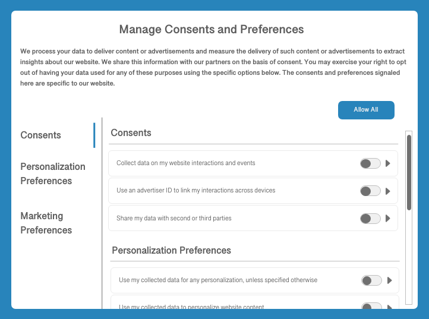

# Samtyckeshantering i Adobe Experience Platform

Med Adobe Experience Platform kan ni behandla de data ni samlat in från era kunder och integrera dem i era lagrade kundprofiler. Dessa data kan sedan användas av processerna längre fram i kedjan för att avgöra om datainsamling sker för en viss kund eller om deras profiler används för särskilda ändamål. Medgivandedata för en viss profil kan till exempel avgöra om den kan inkluderas i ett exporterat målgruppssegment eller om den kan delta i särskilda marknadsföringskanaler som e-post, textmeddelanden eller push-meddelanden.

Detta dokument ger en översikt över hur ni konfigurerar era plattformsdataåtgärder för att importera data om kundsamtycke som genererats av en plattform för hantering av samtycke (CMP) och integrerar dessa data i kundprofiler för användning längre fram i kedjan.

>[!NOTE]
>
>Det här dokumentet fokuserar på behandling av data om samtycke med hjälp av Adobe-standarden. Om du bearbetar medgivandedata i enlighet med IAB Transparency and Consent Framework (TCF) 2.0, se guiden [TCF 2.0 support in Real-time Customer Data Platform](../iab/overview.md).

## Förutsättningar

Handboken kräver en arbetsförståelse av de olika Experience Platform-tjänster som arbetar med behandling av data om samtycke:

* [Experience Data Model (XDM)](../../../../xdm/home.md): Det standardiserade ramverk som Experience Platform använder för att ordna kundupplevelsedata.
* [Adobe Experience Platform Identity Service](../../../../identity-service/home.md): Lös den grundläggande utmaning som fragmenteringen av kundupplevelsedata innebär genom att överbrygga identiteter mellan olika enheter och system.
* [Kundprofil](../../../../profile/home.md) i realtid: Använder  [!DNL Identity Service] funktioner för att skapa detaljerade kundprofiler utifrån era datauppsättningar i realtid. Kundprofilen i realtid hämtar data från datasjön och bevarar kundprofiler i sitt eget separata datalager.
* [Adobe Experience Platform Web SDK](../../../../edge/home.md): Ett JavaScript-bibliotek på klientsidan som gör att du kan integrera olika plattformstjänster i kundens webbplats.
   * [SDK-medgivandekommandon](../../../../edge/consent/supporting-consent.md): En översikt över de medgivande-relaterade SDK-kommandona som visas i den här handboken.
* [Adobe Experience Platform segmenteringstjänst](../../../../segmentation/home.md): Gör att ni kan dela in kundprofildata i realtid i grupper av individer som delar liknande egenskaper och kommer att svara på liknande sätt som marknadsföringsstrategier.

## Sammanfattning av godkännandebearbetningsflöde {#summary}

Nedan beskrivs hur data om samtycke behandlas efter att systemet har konfigurerats korrekt:

1. En kund ger sitt samtycke till datainsamling via en dialogruta på er webbplats.
1. På varje sida som läses in (eller när CMP upptäcker en ändring i medgivandeinställningarna) mappas de aktuella inställningarna med ett anpassat skript på webbplatsen till ett standard-XDM-objekt. Objektet skickas sedan till Platform Web SDK `setConsent`-kommandot.
1. När `setConsent` anropas kontrollerar Platform Web SDK om värdena för medgivande skiljer sig från dem som den senast fick. Om värdena är olika (eller om det inte finns något tidigare värde) skickas strukturerade data för samtycke/inställning till Adobe Experience Platform.
1. Medgivande-/inställningsdata hämtas till en [!DNL Profile]-aktiverad datauppsättning vars schema innehåller fält för samtycke/inställning.

Förutom SDK-kommandon som utlöses av CMP-krokar för ändring av samtycke, kan data för samtycke även flöda in i Experience Platform via alla kundgenererade XDM-data som överförs direkt till en [!DNL Profile]-aktiverad datauppsättning.

### Bekräftelsekontroll

I den aktuella versionen av stöd för tillståndsbearbetning i Platform används automatiskt bara datainsamlingsbehörigheten (`collect.val`) av Platform Web SDK. Även om mer detaljerat samtycke och preferenser kan samlas in och sparas i kundprofiler, måste dessa ytterligare signaler framtvingas manuellt i era egna nedströmsprocesser.

>[!NOTE]
>
>Mer information om strukturen för de XDM-medgivandefält som nämns ovan finns i guiden för datatypen [[!UICONTROL Consents and Preferences]](../../../../xdm/data-types/consents.md).

När systemet har konfigurerats tolkar Platform Web SDK datainsamlingsvärdet för den aktuella användaren för att avgöra om data ska skickas till Adobe Experience Platform Edge Network, släppas från klienten eller bevaras tills datainsamlingsbehörigheten är inställd på ja eller nej.

## Bestäm hur ni genererar data om kundsamtycke i er CMP {#consent-data}

Eftersom varje CMP-system är unikt måste ni fastställa det bästa sättet för kunderna att ge sitt samtycke när de interagerar med tjänsten. Ett vanligt sätt att uppnå detta är att använda en dialogruta för cookie-samtycke, som i följande exempel:

Den här dialogrutan bör göra det möjligt för kunden att välja om de vill använda data för marknadsföring och personalisering eller inte. Dessa samtycke och inställningar ska överensstämma med den datamodell som du definierar för den [!DNL Profile]-aktiverade datauppsättningen i nästa steg.

## Lägg till standardiserade medgivandefält i en [!DNL Profile]-aktiverad datauppsättning {#dataset}

Data för kundgodkännande måste skickas till en [!DNL Profile]-aktiverad datauppsättning vars schema innehåller medgivandefält. Dessa fält måste ingå i samma schema och datauppsättning som du använder för att samla in attributinformation om enskilda kunder.

Se självstudiekursen [Konfigurera en datauppsättning för att hämta data](./dataset.md) om du vill ha mer information om hur du lägger till de här obligatoriska fälten i en [!DNL Profile]-aktiverad datauppsättning innan du fortsätter med den här guiden.

## Uppdatera [!DNL Profile]-sammanfogningsprinciper så att de innehåller medgivandedata {#merge-policies}

När du har skapat en [!DNL Profile]-aktiverad datauppsättning för bearbetning av medgivandedata, måste du se till att dina sammanfogningsprinciper har konfigurerats så att de alltid inkluderar medgivandefält i varje kundprofil. Detta innebär att ange datauppsättningens prioritet så att din sambandsuppsättning prioriteras framför andra datauppsättningar som kan vara i konflikt.

>[!NOTE]
>
>Om du inte har några datauppsättningar som är i konflikt bör du ange tidsstämpelprioritet för din sammanfogningsprincip i stället. Detta bidrar till att säkerställa att det senaste samtycke som anges av en kund är den inställning för samtycke som används.

Mer information om hur du arbetar med sammanfogningsprinciper finns i [översikten över sammanfogningsprinciper](../../../../profile/merge-policies/overview.md). När du konfigurerar dina sammanfogningsprinciper måste du se till att dina profiler innehåller alla obligatoriska medgivandeattribut som finns i schemafältgruppen [!UICONTROL Consents and Preferences], enligt riktlinjerna för [förberedelse av datamängd](./dataset.md).

## Använd data om samtycke i plattformen

När ni har era datauppsättningar och sammanfogningspolicyer för att representera de obligatoriska medgivandefälten i era kundprofiler är nästa steg att överföra informationen om samtycke till plattformen.

I första hand bör du använda Adobe Experience Platform Web SDK för att skicka data om samtycke till plattformen när händelser om tillståndsändring upptäcks av din CMP. Om du samlar in data om samtycke på en mobilplattform bör du använda Adobe Experience Platform Mobile SDK. Du kan också välja att importera insamlade data direkt genom att mappa dem till XDM-schemat för ditt samtycke och skicka dem till plattformen via batchinmatning.

Närmare information om dessa metoder finns i underavsnitten nedan.

### Konfigurera Experience Platform Web SDK för att bearbeta medgivandedata {#web-sdk}

När du har konfigurerat din CMP för att lyssna efter medgivandeändringshändelser på din webbplats kan du integrera Experience Platform Web SDK för att ta emot de uppdaterade medgivandeinställningarna och skicka dem till Platform på varje sida som läses in och närhelst en förändring av medgivandet inträffar. Mer information finns i guiden [konfigurera Web SDK för att bearbeta kundens medgivandedata](../sdk.md).

### Konfigurera Experience Platform Mobile SDK för att bearbeta medgivandedata {#mobile-sdk}

Om du behöver göra inställningar för kundgodkännande i ditt mobilprogram kan du integrera Experience Platform Mobile SDK för att hämta och uppdatera inställningar för samtycke och skicka dem till plattformen när API för samtycke anropas.

Se dokumentationen för Mobile SDK för [hur du konfigurerar mobiltillägget för godkännande](https://aep-sdks.gitbook.io/docs/v/AEP-Edge-Docs/using-mobile-extensions/adobe-edge-consent) och [med API:t för samtycke](https://aep-sdks.gitbook.io/docs/v/AEP-Edge-Docs/using-mobile-extensions/adobe-edge-consent/edge-consent-api-reference). Mer information om hur du hanterar integritetsfrågor med Mobile SDK finns i avsnittet [Sekretess och GDPR](https://aep-sdks.gitbook.io/docs/v/AEP-Edge-Docs/resources/privacy-and-gdpr).

### Importera XDM-kompatibla data direkt {#batch}

Du kan importera XDM-kompatibla medgivandedata från en CSV-fil genom att använda gruppinmatning. Detta kan vara användbart om ni har en eftersläpning av tidigare insamlade data om samtycke som ännu inte har integrerats i era kundprofiler.

Följ självstudiekursen om [mappning av en CSV-fil till XDM](../../../../ingestion/tutorials/map-a-csv-file.md) för att lära dig hur du konverterar dina datafält till XDM och importerar dem till Platform. När du väljer [!UICONTROL Destination] för mappningen måste du markera alternativet **[!UICONTROL Use existing dataset]** och välja den [!DNL Profile]-aktiverade medgivandedatauppsättningen som du skapade tidigare.

## Testa implementeringen {#test-implementation}

När du har inhämtat data om kundens samtycke till din [!DNL Profile]-aktiverade datauppsättning kan du kontrollera dina uppdaterade profiler för att se om de innehåller medgivandeattribut.

>[!IMPORTANT]
>
>Om du vill visa attributen för en befintlig profil i användargränssnittet måste du känna till minst ett identitetsvärde (och dess motsvarande namnutrymme) som är associerat med den profilen.
>
>Om du inte har tillgång till den här informationen kan du välja att importera dina egna testmedgivandedata och associera dem med ett identitetsvärde/namnutrymme som du känner till i stället.

I avsnittet [Sök efter profiler efter identitet](../../../../profile/ui/user-guide.md#browse) i användargränssnittsguiden för [!DNL Profile] finns mer information om hur du söker efter information om en profil.

De nya medgivandeattributen visas inte som standard på en profils kontrollpanel. Du måste därför navigera till fliken **[!UICONTROL Attributes]** på informationssidan för en profil för att bekräfta att de har importerats som förväntat. Se guiden på [profilkontrollpanelen](../../../../profile/ui/profile-dashboard.md) för att lära dig hur du anpassar kontrollpanelen efter dina behov.

<!-- (To be included once CJM is GA)
## Handling consent in Customer Journey Management

If you are using Customer Journey Management, after confirming that your profiles and segments contain consent data, you can start honoring customer [marketing preferences](../../../../xdm/data-types/consents.md#marketing) when pulling segments from Platform. Specifically, profiles who have opted out of the email marketing preference should not be included in segments that are targeted for email campaigns.

Customer Journey Management can also send consent-change signals back to Platform. When a customer selects an "unsubscribe" link in an email message, the updated consent preference is sent to Platform and the appropriate profile attributes are updated accordingly.
-->

## Nästa steg

I den här guiden beskrivs hur du konfigurerar plattformsåtgärder för att bearbeta kundens medgivandedata med hjälp av Adobe-standarden, och dessa attribut finns representerade i kundprofiler. Nu kan ni integrera preferenser för kundgodkännande som en avgörande faktor för segmentkvalificering och andra användningsfall längre fram i kedjan.

Mer information om Experience Platform sekretessrelaterade funktioner finns i översikten om [styrning, sekretess och säkerhet i Platform](../../overview.md).
