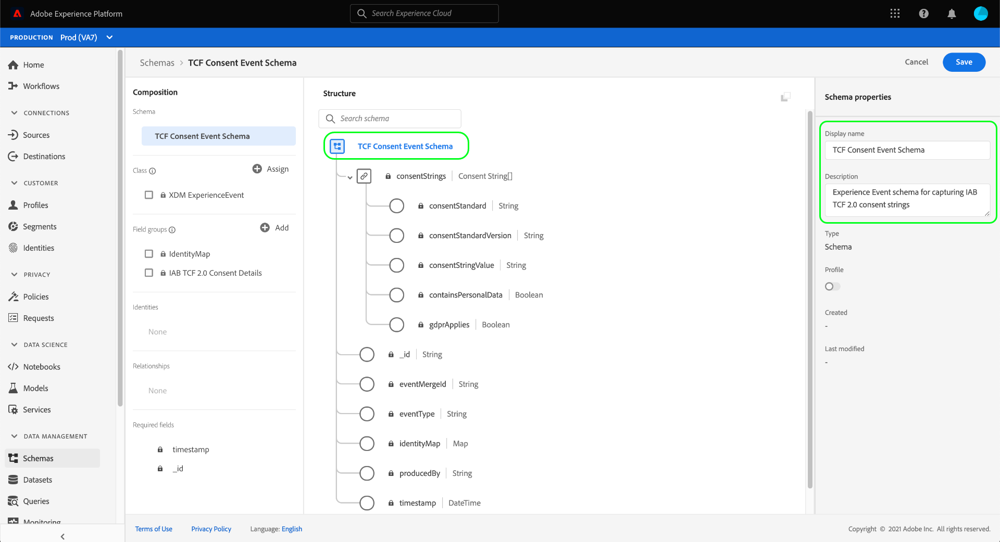

# Skapa datauppsättningar för att hämta IAB TCF 2.0-medgivandedata

För att Adobe Experience Platform ska kunna behandla kundens medgivandedata i enlighet med IAB [!DNL Transparency & Consent Framework] (TCF) 2.0, dessa data måste skickas till datauppsättningar vars scheman innehåller TCF 2.0-tillståndsfält.

Två datauppsättningar krävs för att hämta TCF 2.0-medgivandedata:

* En datauppsättning baserad på [!DNL XDM Individual Profile] klass, aktiverad för användning i [!DNL Real-Time Customer Profile].
* En datauppsättning baserad på [!DNL XDM ExperienceEvent] klassen.

>[!IMPORTANT]
>
>Plattformen använder bara de TCF-strängar som samlats in i datauppsättningen för den enskilda profilen. En ExperienceEvent-datauppsättning krävs fortfarande för att skapa ett datastream som en del av det här arbetsflödet, men du behöver bara importera data till profildatauppsättningen. ExperienceEvent-datauppsättningen kan fortfarande användas om du vill spåra händelser om samtyckesändringar över tiden, men dessa värden används inte i när segmentaktivering används.

Det här dokumentet innehåller steg för hur du konfigurerar de här två datauppsättningarna. En översikt över det fullständiga arbetsflödet för att konfigurera plattformsdataåtgärder för TCF 2.0 finns i [IAB TCF 2.0-kompatibilitetsöversikt](./overview.md).

## Förutsättningar

Den här självstudiekursen kräver en fungerande förståelse av följande komponenter i Adobe Experience Platform:

* [Experience Data Model (XDM)](../../../../xdm/home.md): Det standardiserade ramverk som [!DNL Experience Platform] organiserar kundupplevelsedata.
   * [Grunderna för schemakomposition](../../../../xdm/schema/composition.md): Lär dig mer om grundläggande byggstenar i XDM-scheman.
* [Adobe Experience Platform Identity Service](../../../../identity-service/home.md): Gör att ni kan kombinera kundidentiteter från olika datakällor på olika enheter och system.
   * [Identitetsnamnutrymmen](../../../../identity-service/features/namespaces.md): Kundidentitetsdata måste anges under ett specifikt ID-namnområde som identifieras av identitetstjänsten.
* [Kundprofil i realtid](../../../../profile/home.md): Leveranser [!DNL Identity Service] så att ni kan skapa detaljerade kundprofiler utifrån era datauppsättningar i realtid. [!DNL Real-Time Customer Profile] hämtar data från Data Lake och behåller kundprofiler i sitt eget separata datalager.

## TCF 2.0-fältgrupper {#field-groups}

The [!UICONTROL IAB TCF 2.0 Consent Details] schemafältgruppen innehåller fält för kundgodkännande som krävs för TCF 2.0-stöd. Det finns två versioner av den här fältgruppen: en kompatibel med [!DNL XDM Individual Profile] och den andra med [!DNL XDM ExperienceEvent] klassen.

I avsnitten nedan förklaras strukturen för var och en av dessa fältgrupper, inklusive de data som förväntas vid intag.

### Profilfältgrupp {#profile-field-group}

För scheman baserade på [!DNL XDM Individual Profile], [!UICONTROL IAB TCF 2.0 Consent Details] fältgruppen innehåller ett enda karttypsfält, `identityPrivacyInfo`, som mappar kundidentiteter till deras inställningar för TCF-medgivande. Den här fältgruppen måste inkluderas i ett postbaserat schema som är aktiverat för kundprofil i realtid för att automatisk tillämpning ska kunna utföras.

Se [referenshandbok](../../../../xdm/field-groups/profile/iab.md) för den här fältgruppen om du vill veta mer om dess struktur och användningsexempel.

### Fältgrupp för händelse {#event-field-group}

Om du vill spåra händelser för ändring av samtycke över tiden kan du lägga till [!UICONTROL IAB TCF 2.0 Consent Details] fältgrupp till [!UICONTROL XDM ExperienceEvent] schema.

Om du inte har för avsikt att spåra händelser för tillståndsändringar över tid, behöver du inte inkludera den här fältgruppen i ditt händelseschema. När TCF-medgivandevärden används automatiskt, använder Experience Platform endast den senaste medgivandeinformationen som angetts i [profilfältgrupp](#profile-field-group). Medgivandevärden som fångas av händelser deltar inte i automatiska arbetsflöden för verkställighet.

Se [referenshandbok](../../../../xdm/field-groups/event/iab.md) för den här fältgruppen om du vill ha mer information om dess struktur och användningsfall.

## Skapa kundmedgivandescheman {#create-schemas}

För att kunna skapa datauppsättningar som samlar in medgivandedata måste du först skapa XDM-scheman som baserar dessa datauppsättningar på.

Som nämndes i föregående avsnitt, ett schema som använder [!UICONTROL XDM Individual Profile] klassen krävs för att tvinga fram samtycke i arbetsflöden för efterföljande plattformar. Du kan också skapa ett separat schema baserat på [!UICONTROL XDM ExperienceEvent] om du vill spåra ändringar av samtycke över tid. Båda scheman måste innehålla en `identityMap` och en lämplig TCF 2.0-fältgrupp.

Välj **[!UICONTROL Schemas]** i den vänstra navigeringen för att öppna [!UICONTROL Schemas] arbetsyta. Härifrån följer du stegen i avsnitten nedan för att skapa varje obligatoriskt schema.

>[!NOTE]
>
>Om du har befintliga XDM-scheman som du vill använda för att hämta medgivandedata i stället, kan du redigera dessa scheman i stället för att skapa nya. Men om ett befintligt schema har aktiverats för användning i kundprofilen i realtid, kan dess primära identitet inte vara ett direkt identifierbart fält som är förbjudet att använda i intressebaserad annonsering, till exempel en e-postadress. Kontakta ditt juridiska ombud om du är osäker på vilka fält som är begränsade.
>
>När du redigerar befintliga scheman kan du dessutom bara göra additiva (fasta) ändringar. Se avsnittet på sidan [principer för schemautveckling](../../../../xdm/schema/composition.md#evolution) för mer information.

### Skapa ett schema för profilgodkännande {#profile-schema}

Välj **[!UICONTROL Create schema]** väljer du **[!UICONTROL XDM Individual Profile]** i listrutan.

The **[!UICONTROL Add field groups]** visas så att du kan börja lägga till fältgrupper i schemat direkt. Välj **[!UICONTROL IAB TCF 2.0 Consent Details]** från listan. Du kan även använda sökfältet för att begränsa resultaten och enklare hitta fältgruppen.

Gå till **[!UICONTROL IdentityMap]** fältgrupp från listan och markera den också. När båda fältgrupperna visas i den högra listen väljer du **[!UICONTROL Add field groups]**.

Arbetsytan visas igen, vilket visar att `identityPrivacyInfo` och `identityMap` fält har lagts till i schemastrukturen.

Innan du lägger till fler fält i schemat markerar du rotfältet som ska visas **[!UICONTROL Schema properties]** till höger, där du kan ange ett namn och en beskrivning för schemat.

När du har angett ett namn och en beskrivning kan du lägga till fler fält i schemat genom att välja **[!UICONTROL Add]** under **[!UICONTROL Field groups]** till vänster på arbetsytan.

Om du redigerar ett befintligt schema som redan har aktiverats för användning i [!DNL Real-Time Customer Profile], markera **[!UICONTROL Save]** för att bekräfta dina ändringar innan du går vidare till avsnittet om [skapa en datauppsättning baserad på ditt medgivandeschema](#dataset). Om du skapar ett nytt schema fortsätter du med de steg som beskrivs i underavsnittet nedan.

#### Aktivera schemat för användning i [!DNL Real-Time Customer Profile]

För att Platform ska kunna koppla de data den får till specifika kundprofiler måste medgivandeschemat aktiveras för användning i [!DNL Real-Time Customer Profile].

>[!NOTE]
>
>Exempelschemat som visas i det här avsnittet använder `identityMap` som sin primära identitet. Om du vill ange ett annat fält som primär identitet måste du se till att du använder en indirekt identifierare, som ett cookie-ID, och inte ett direkt identifierbart fält som är förbjudet att använda i intressebaserad annonsering, som en e-postadress. Kontakta ditt juridiska ombud om du är osäker på vilka fält som är begränsade.
>
>Steg om hur du anger ett primärt identitetsfält för ett schema finns i [[!UICONTROL Schemas] Användargränssnittsguide](../../../../xdm/ui/fields/identity.md).

Aktivera schemat för [!DNL Profile]markerar du schemats namn i den vänstra listen för att öppna **[!UICONTROL Schema properties]** -avsnitt. Här väljer du **[!UICONTROL Profile]** växlingsknapp.

En pover visas, vilket anger att en primär identitet saknas. Markera kryssrutan för att använda en alternativ primär identitet, eftersom den primära identiteten finns i `identityMap` fält.

Äntligen väljer du **[!UICONTROL Save]** för att bekräfta dina ändringar.

### Skapa ett schema för godkännande av händelse {#event-schema}

>[!NOTE]
>
>Scheman för godkännande av händelser används bara för att spåra händelser om godkännande över tiden, och deltar inte i arbetsflöden för tillsyn längre fram. Om du inte vill spåra ändringar av ditt medgivande över tiden kan du gå vidare till nästa avsnitt på [skapa medgivandedatauppsättningar](#datasets).

I **[!UICONTROL Schemas]** arbetsyta, välja **[!UICONTROL Create schema]** väljer du **[!UICONTROL XDM ExperienceEvent]** i listrutan.

The **[!UICONTROL Add field groups]** visas. Välj **[!UICONTROL IAB TCF 2.0 Consent Details]** från listan. Du kan även använda sökfältet för att begränsa resultaten och enklare hitta fältgruppen.

Gå till **[!UICONTROL IdentityMap]** fältgrupp från listan och markera den också. När båda fältgrupperna visas i den högra listen väljer du **[!UICONTROL Add field groups]**.

Arbetsytan visas igen, vilket visar att `consentStrings` och `identityMap` fält har lagts till i schemastrukturen.

Innan du lägger till fler fält i schemat markerar du rotfältet som ska visas **[!UICONTROL Schema properties]** till höger, där du kan ange ett namn och en beskrivning för schemat.

När du har angett ett namn och en beskrivning kan du lägga till fler fält i schemat genom att välja **[!UICONTROL Add]** under **[!UICONTROL Field groups]** till vänster på arbetsytan.

När fältgrupperna som du behöver har lagts till, slutför du genom att välja **[!UICONTROL Save]**.

## Skapa datauppsättningar baserat på dina medgivandescheman {#datasets}

För vart och ett av de obligatoriska scheman som beskrivs ovan måste du skapa en datauppsättning som i slutändan kommer att innehålla kundernas medgivandedata. Datauppsättningen som baseras på postschemat måste aktiveras för [!DNL Real-Time Customer Profile], medan datauppsättningen baseras på tidsseriens schema **bör inte** be [!DNL Profile]-enabled.

Börja genom att välja **[!UICONTROL Datasets]** i den vänstra navigeringen väljer du **[!UICONTROL Create dataset]** längst upp till höger.

På nästa sida väljer du **[!UICONTROL Create dataset from schema]**.

The **[!UICONTROL Create dataset from schema]** arbetsflödet visas, med början vid **[!UICONTROL Select schema]** steg. Leta reda på ett av de medgivandescheman som du skapade tidigare i listan. Du kan även använda sökfältet för att begränsa resultaten och enklare hitta ditt schema. Markera alternativknappen bredvid önskat schema och välj sedan **[!UICONTROL Next]** för att fortsätta.

The **[!UICONTROL Configure dataset]** visas. Ange ett unikt, enkelt identifierbart namn och en beskrivning för datauppsättningen innan du väljer **[!UICONTROL Finish]**.

Informationssidan för den nya datauppsättningen visas. Om datauppsättningen baseras på ditt tidsserieschema är processen slutförd. Om datauppsättningen baseras på ditt postschema är det sista steget i processen att aktivera datauppsättningen för användning i [!DNL Real-Time Customer Profile].

I den högra listen väljer du **[!UICONTROL Profile]** växla och sedan markera **[!UICONTROL Enable]** i bekräftelsepovern för att aktivera schemat för [!DNL Profile].

Följ stegen ovan igen för att skapa en händelsebaserad datauppsättning om du skapade ett schema för den.

## Nästa steg

Genom att följa den här självstudiekursen har du skapat minst en datauppsättning som nu kan användas för att samla in data om kundens samtycke:

* En postbaserad datauppsättning som är aktiverad för användning i kundprofilen i realtid. **(Obligatoriskt)**
* En tidsseriebaserad datauppsättning som inte är aktiverad för [!DNL Profile]. (Valfritt)

Du kan nu gå tillbaka till [IAB TCF 2.0 - översikt](./overview.md#merge-policies) för att fortsätta konfigurera Platform för TCF 2.0-kompatibilitet.
