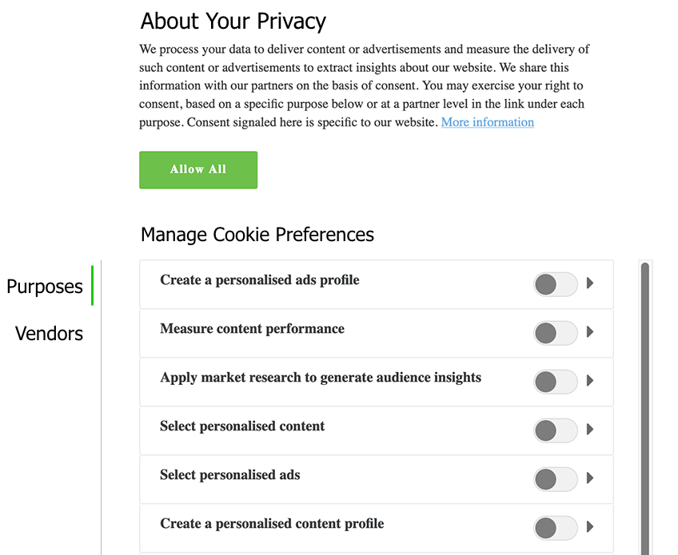

# Stöd för IAB TCF 2.0 i Experience Platform

([!DNL Transparency & Consent Framework]) (TCF), som beskrivs i IAB (The [!DNL Interactive Advertising Bureau]), är en öppen teknisk ram som är avsedd att göra det möjligt för organisationer att få, registrera och uppdatera konsumentens samtycke till behandling av deras personuppgifter, i enlighet med Europeiska unionens [!DNL General Data Protection Regulation] (GDPR). Den andra versionen av ramverket, TCF 2.0, ger större flexibilitet för hur konsumenter kan ge eller vägra samtycke, inklusive om och hur leverantörer kan använda vissa funktioner för databearbetning, till exempel exakt positionering.

>[!NOTE]
>
>Mer information om TCF 2.0 finns på webbplatsen [IAB Europe](https://iabeurope.eu/tcf-2-0/), inklusive supportmaterial och tekniska specifikationer.

Adobe Experience Platform ingår i den registrerade [IAB TCF 2.0-leverantörslistan](https://iabeurope.eu/vendor-list-tcf-v2-0/), under ID **565**. I enlighet med kraven för TCF 2.0 kan du med hjälp av Platform samla in data om kundernas samtycke och integrera dessa i era lagrade kundprofiler. Dessa data om samtycke kan sedan beaktas för att avgöra om profiler ska inkluderas i exporterade målgruppssegment, beroende på hur de används.

>[!IMPORTANT]
>
>Plattformen kan bara uppfylla version 2.0 av TCF (eller senare). Tidigare versioner av TCF stöds inte.

Det här dokumentet innehåller en översikt över hur du konfigurerar dataåtgärder och profilscheman för att acceptera kundmedgivandedata som genereras av din CMP, och hur Platform förmedlar val av användarsamtycke när du exporterar segment.

## Förutsättningar

För att kunna följa med i den här guiden måste du använda en CMP (Consent Management Platform), antingen kommersiell eller egen, som är integrerad och kompatibel med IAB TCF. Mer information finns i [listan över kompatibla CMP](https://iabeurope.eu/cmp-list/).

>[!IMPORTANT]
>
>Om ditt CMP-ID är ogiltigt fortsätter Platform att bearbeta dina data som de är. Om du vill använda TCF 2.0 måste du bekräfta att din CMP har ett giltigt ID som har registrerats med IAB TCF 2.0 innan du skickar data till plattformen.

Handboken kräver även en fungerande förståelse av följande plattformstjänster:

* [Experience Data Model (XDM)](../../../../xdm/home.md): Det standardiserade ramverk som Experience Platform använder för att ordna kundupplevelsedata.
* [Adobe Experience Platform Identity Service](../../../../identity-service/home.md): Lös den grundläggande utmaning som fragmenteringen av kundupplevelsedata innebär genom att överbrygga identiteter mellan olika enheter och system.
* [Kundprofil](../../../../profile/home.md) i realtid: Utnyttja  [!DNL Identity Service] för att skapa detaljerade kundprofiler utifrån era datauppsättningar i realtid. [!DNL Real-time Customer Profile] hämtar data från Data Lake och behåller kundprofiler i sitt eget separata datalager.
* [Adobe Experience Platform Web SDK](../../../../edge/home.md): Ett JavaScript-bibliotek på klientsidan som gör att du kan integrera olika plattformstjänster i kundens webbplats.
   * [SDK-medgivandekommandon](../../../../edge/consent/supporting-consent.md): En översikt över de medgivande-relaterade SDK-kommandona som visas i den här handboken.
* [Adobe Experience Platform segmenteringstjänst](../../../../segmentation/home.md): Gör att ni kan dela in  [!DNL Real-time Customer Profile] data i grupper av individer som delar liknande egenskaper och kommer att svara på liknande sätt som marknadsföringsstrategier.

Utöver de plattformstjänster som anges ovan bör du även känna till [mål](../../../../data-governance/home.md) och deras roll i plattformens ekosystem.

## Sammanfattning av kundens godkännandeflöde {#summary}

I följande avsnitt beskrivs hur data om samtycke samlas in och används efter att systemet har konfigurerats korrekt.

### Samling av data för samtycke

Plattformen gör att ni kan samla in data om kundens samtycke genom följande process:

1. En kund ger sitt samtycke till datainsamling via en dialogruta på er webbplats.
1. Din CMP identifierar ändringen av medgivandeinställningen och genererar TCF-medgivandedata i enlighet med detta.
1. Med Platform Web SDK skickas genererade data om samtycke (returneras av CMP) till Adobe Experience Platform.
1. De insamlade data om samtycke importeras till en [!DNL Profile]-aktiverad datauppsättning vars schema innehåller TCF-medgivandefält.

Förutom SDK-kommandon som utlöses av CMP-krokar för ändring av samtycke, kan data för samtycke även flöda in i Experience Platform via alla kundgenererade XDM-data som överförs direkt till en [!DNL Profile]-aktiverad datauppsättning.

Alla segment som delas med Platform av Adobe Audience Manager (via källkopplingen [!DNL Audience Manager] eller på annat sätt) kan också innehålla data om samtycke, förutsatt att rätt fält har tillämpats på dessa segment via [!DNL Experience Cloud Identity Service]. Mer information om hur du samlar in medgivandedata i [!DNL Audience Manager] finns i dokumentet om [Adobe Audience Manager plugin-programmet för IAB TCF](https://experienceleague.adobe.com/docs/audience-manager/user-guide/overview/data-privacy/consent-management/aam-iab-plugin.html).

### Efterföljande av samtycke

När TCF-medgivandedata har importerats, utförs följande processer i efterföljande plattformstjänster:

1. [!DNL Real-time Customer Profile] uppdaterar lagrade medgivandedata för kundens profil.
1. Plattformen behandlar endast kund-ID:n om leverantörsbehörigheten för Platform (565) anges för varje ID i ett kluster.
1. När du exporterar segment till mål som tillhör medlemmar i leverantörslistan för TCF 2.0, inkluderar Platform bara profiler om leverantörsbehörigheterna för både Platform (565) *och* anges för varje ID i ett kluster.

Övriga avsnitt i det här dokumentet innehåller riktlinjer för hur du konfigurerar plattformen och dina dataåtgärder så att de uppfyller de krav på insamling och verkställighet som beskrivs ovan.

## Bestäm hur ni ska generera data för kundgodkännande i er CMP {#consent-data}

Eftersom varje CMP-system är unikt måste ni fastställa det bästa sättet för kunderna att ge sitt samtycke när de interagerar med tjänsten. Ett vanligt sätt att uppnå detta är genom att använda en dialogruta för godkännande av cookies, som liknar följande exempel:



Den här dialogrutan måste göra det möjligt för kunden att välja att inte göra något av följande:

| Medgivandealternativ | Beskrivning |
| --- | --- |
| **Syfte** | Ändamålen definierar vilka reklamsyften ett varumärke kan använda kundens data för. Följande syften måste väljas för att Platform ska kunna behandla kund-ID: <ul><li>**Syfte 1**: Lagra och/eller få åtkomst till information på en enhet</li><li>**Syfte 10**: Utveckla och förbättra produkter</li></ul> |
| **Leverantörsbehörigheter** | Utöver annonseringsteknologiska ändamål måste dialogen också göra det möjligt för kunden att välja att inte få sina data använda av specifika leverantörer, inklusive Adobe Experience Platform (565). |

### Samtyckessträngar {#consent-strings}

Oavsett vilken metod du använder för att samla in data, är målet att generera ett strängvärde baserat på de alternativ för samtycke som kunden valt, vilket kallas godkännandesträng.

I TCF-specifikationen används medgivandesträngar för att koda relevant information om en kunds medgivandeinställningar, i termer av specifika marknadsföringssyften som definieras av policyer och leverantörer. Plattformen använder dessa strängar för att lagra medgivandeinställningarna för varje kund, och därför måste en ny medgivandesträng skapas varje gång inställningarna ändras.

Samtyckessträngar kan bara skapas av en CMP som är registrerad med IAB TCF. Mer information om hur du skapar medgivandesträngar med din CMP finns i [formateringsguiden för medgivandesträngen](https://github.com/InteractiveAdvertisingBureau/GDPR-Transparency-and-Consent-Framework/blob/master/TCFv2/IAB%20Tech%20Lab%20-%20Consent%20string%20and%20vendor%20list%20formats%20v2.md) i IAB TCF GitHub-repo.

## Skapa datauppsättningar med TCF-medgivandefält {#datasets}

Data om kundsamtycke måste skickas till datauppsättningar vars scheman innehåller TCF-medgivandefält. Se självstudiekursen [Skapa datauppsättningar för att hämta TCF 2.0-samtycke](./dataset.md) för hur du skapar de två nödvändiga datauppsättningarna innan du fortsätter med den här guiden.

## Uppdatera [!DNL Profile]-sammanfogningsprinciper så att de innehåller medgivandedata {#merge-policies}

När du har skapat en [!DNL Profile]-aktiverad datauppsättning för insamling av medgivandedata måste du se till att dina sammanfogningsprinciper har konfigurerats så att de alltid inkluderar TCF-medgivandefält i kundprofilerna. Detta innebär att ange datauppsättningens prioritet så att din sambandsuppsättning prioriteras framför andra datauppsättningar som kan vara i konflikt.

Mer information om hur du arbetar med sammanfogningsprinciper finns i [användarhandboken för sammanfogningsprinciper](../../../../profile/ui/merge-policies.md). När du konfigurerar sammanfogningsprinciperna måste du se till att dina segment innehåller alla nödvändiga medgivandeattribut som finns i [XDM-integritetsmixinen](./dataset.md#privacy-mixin), enligt riktlinjerna för datauppsättningsförberedelse.

## Integrera Experience Platform Web SDK för att samla in data om kundens samtycke {#sdk}

>[!NOTE]
>
>Experience Platform Web SDK krävs för att man ska kunna behandla data om samtycke direkt i Adobe Experience Platform. [!DNL Experience Cloud Identity Service] stöds för närvarande inte.
>
>[!DNL Experience Cloud Identity Service] stöds dock fortfarande för godkännandebearbetning i Adobe Audience Manager, och efterlevnad av TCF 2.0 kräver bara att biblioteket uppdateras till  [version 5.0](https://github.com/Adobe-Marketing-Cloud/id-service/releases).

När du har konfigurerat din CMP för att generera medgivandesträngar måste du integrera Experience Platform Web SDK för att samla in strängarna och skicka dem till Platform. Plattforms-SDK innehåller två kommandon som kan användas för att skicka TCF-medgivandedata till plattformen (förklaras i underavsnitten nedan), och bör användas när en kund lämnar medgivandeinformation för första gången och när som helst där medgivandet ändras därefter.

**SDK:n samverkar inte med några CMP:er som finns i kartongen**. Det är upp till dig att bestämma hur du ska integrera SDK i din webbplats, lyssna efter medgivandeändringar i CMP och anropa lämpligt kommando.

### Skapa en ny kantkonfiguration

För att SDK ska kunna skicka data till Experience Platform måste du först skapa en ny edge-konfiguration för plattformen i [!DNL Adobe Experience Platform Launch]. Specifika steg för hur du skapar en ny konfiguration finns i [SDK-dokumentationen](../../../../edge/fundamentals/edge-configuration.md).

När du har angett ett unikt namn för konfigurationen väljer du växlingsknappen bredvid **[!UICONTROL Adobe Experience Platform]**. Använd sedan följande värden för att fylla i resten av formuläret:

| Konfiguration av Edge-fält | Värde |
| --- | --- |
| [!UICONTROL Sandbox] | Namnet på plattformen [sandlådan](../../../../sandboxes/home.md) som innehåller den nödvändiga direktuppspelningsanslutningen och de datauppsättningar som krävs för att konfigurera edge-konfigurationen. |
| [!UICONTROL Streaming Inlet] | En giltig direktuppspelningsanslutning för Experience Platform. Se självstudiekursen om att [skapa en direktuppspelningsanslutning](../../../../ingestion/tutorials/create-streaming-connection-ui.md) om du inte har ett befintligt direktuppspelningsinlopp. |
| [!UICONTROL Event Dataset] | Markera den [!DNL XDM ExperienceEvent] datauppsättning som skapades i [föregående steg](#datasets). |
| [!UICONTROL Profile Dataset] | Markera den [!DNL XDM Individual Profile] datauppsättning som skapades i [föregående steg](#datasets). |


När du är klar väljer du **[!UICONTROL Save]** längst ned på skärmen och fortsätter att följa eventuella ytterligare uppmaningar för att slutföra konfigurationen.

### Kommandon för att ändra samtycke

När du har skapat kantkonfigurationen som beskrivs i föregående avsnitt kan du börja använda SDK-kommandon för att skicka data om samtycke till plattformen. Avsnitten nedan innehåller exempel på hur varje SDK-kommando kan användas i olika scenarier.

>[!NOTE]
>
>En introduktion till den vanliga syntaxen för alla SDK-kommandon för plattformar finns i dokumentet om [utförande av kommandon](../../../../edge/fundamentals/executing-commands.md).

#### Använda CMP-krokar för ändring av samtycke

Många CMP-modeller har färdiga kopplingar som lyssnar på händelser om samtycke. När dessa händelser inträffar kan du använda kommandot `setConsent` för att uppdatera kundens medgivandedata.

Kommandot `setConsent` förväntar sig två argument: (1) en sträng som anger kommandotypen (i det här fallet &quot;setConsent&quot;) och (2) en nyttolast som innehåller en `consent`-array, som måste innehålla minst ett objekt som tillhandahåller obligatoriska godkännandefält, vilket visas nedan:

```js
alloy("setConsent", {
  consent: [{
    standard: "IAB TCF",
    version: "2.0",
    value: "CLcVDxRMWfGmWAVAHCENAXCkAKDAADnAABRgA5mdfCKZuYJez-NQm0TBMYA4oCAAGQYIAAAAAAEAIAEgAA.argAC0gAAAAAAAAAAAA",
    gdprApplies: "true"
  }]
});
```

| Nyttolastegenskap | Beskrivning |
| --- | --- |
| `standard` | Den standard för samtycke som används. Värdet måste vara `IAB` för TCF 2.0-godkännandebearbetning. |
| `version` | Versionsnumret för den medgivandestandard som anges under `standard`. Värdet måste vara `2.0` för TCF 2.0-godkännandebearbetning. |
| `value` | Den bas-64-kodade medgivandesträngen som genererats av CMP. |
| `gdprApplies` | Ett booleskt värde som anger om GDPR gäller för den inloggade kunden. För att TCF 2.0 ska kunna användas för den här kunden måste värdet anges till `true`. |

Kommandot `setConsent` bör användas som en del av en CMP-krok som upptäcker ändringar i medgivandeinställningarna. Följande JavaScript innehåller ett exempel på hur kommandot `setConsent` kan användas för OneTrust&#39;s `OnConsentChanged`-krok:

```js
OneTrust.OnConsentChanged(function () {
  // Retrieve the TCF 2.0 consent data generated by the CMP, and pass it to Alloy. 
  __tcfapi("getTCData", 2, function (data, success) {
    if (success) {
      var tcString = data.tcString;
      var gdpr = data.gdprApplies;

      alloy("setConsent", {
        consent: [{
          standard: "IAB TCF",
          version: "2.0",
          value: tcString,
          gdprApplies: gdpr
        }]
      });
    }
  });
});
```

#### Använda händelser

Du kan också samla in TCF 2.0-medgivandedata för varje händelse som utlöses i Platform med kommandot `sendEvent`.

>[!NOTE]
>
>För att du ska kunna använda den här metoden måste du ha lagt till [!DNL Experience Event Privacy mixin] i det [!DNL Profile]-aktiverade [!DNL XDM ExperienceEvent]-schemat. I avsnittet [Uppdatera ExperienceEvent-schemat](./dataset.md#event-schema) i guiden för datauppsättningsförberedelse finns anvisningar om hur du konfigurerar det här.

Kommandot `sendEvent` bör användas som återanrop i lämpliga händelseavlyssnare på webbplatsen. Kommandot förväntar sig två argument: (1) en sträng som anger kommandotypen (i det här fallet `sendEvent`) och (2) en nyttolast som innehåller ett `xdm`-objekt som tillhandahåller obligatoriska medgivandefält som JSON:

```js
alloy("sendEvent", {
  xdm: {
    "consentStrings": [{
      "consentStandard": "IAB TCF",
      "consentStandardVersion": "2.0",
      "consentStringValue": "CLcVDxRMWfGmWAVAHCENAXCkAKDAADnAABRgA5mdfCKZuYJez-NQm0TBMYA4oCAAGQYIAAAAAAEAIAEgAA.argAC0gAAAAAAAAAAAA",
      "gdprApplies": true
    }]
  }
});
```

| Nyttolastegenskap | Beskrivning |
| --- | --- |
| `xdm.consentStrings` | En array som måste innehålla minst ett objekt som innehåller de obligatoriska medgivandefälten. |
| `consentStandard` | Den standard för samtycke som används. Värdet måste vara `IAB` för TCF 2.0-godkännandebearbetning. |
| `consentStandardVersion` | Versionsnumret för den medgivandestandard som anges under `standard`. Värdet måste vara `2.0` för TCF 2.0-godkännandebearbetning. |
| `consentStringValue` | Den bas-64-kodade medgivandesträngen som genererats av CMP. |
| `gdprApplies` | Ett booleskt värde som anger om GDPR gäller för den inloggade kunden. För att TCF 2.0 ska kunna användas för den här kunden måste värdet anges till `true`. |

### Hantera SDK-svar

Alla [!DNL Platform SDK]-kommandon returnerar löften som anger om anropet lyckades eller misslyckades. Du kan sedan använda dessa svar för ytterligare logik, till exempel för att visa bekräftelsemeddelanden för kunden. Se avsnittet [Hantera om ](../../../../edge/fundamentals/executing-commands.md#handling-success-or-failure) lyckades eller misslyckades i guiden om hur SDK-kommandon körs för specifika exempel.

## Exportera segment {#export}

>[!NOTE]
>
>Innan du börjar exportera segment måste du se till att dina segment innehåller alla obligatoriska fält för samtycke. Mer information finns i avsnittet [Konfigurera sammanfogningsprinciper](#merge-policies).

När ni har samlat in kundens medgivandedata och skapat målgruppssegment som innehåller de obligatoriska medgivandeattributen, kan ni tillämpa TCF 2.0-kompatibilitet när ni exporterar dessa segment till efterföljande destinationer.

Förutsatt att medgivandeinställningen `gdprApplies` är `true` för en uppsättning kundprofiler, filtreras alla data från de profiler som exporteras till efterföljande destinationer baserat på medgivandeinställningarna för varje profil. Alla profiler som inte uppfyller de obligatoriska medgivandeinställningarna hoppas över under exportprocessen.

Kunden måste godkänna följande syften (enligt riktlinjerna i [TCF 2.0-policyer](https://iabeurope.eu/iab-europe-transparency-consent-framework-policies/#Appendix_A_Purposes_and_Features_Definitions)) för att deras profiler ska kunna inkluderas i segment som exporteras till destinationer:

* **Syfte 1**: Lagra och/eller få åtkomst till information på en enhet
* **Syfte 10**: Utveckla och förbättra produkter

TCF 2.0 kräver också att datakällan måste kontrollera målets leverantörsbehörighet innan data skickas till det målet. Plattformen kontrollerar därför om målets leverantörsbehörighet har valts för alla ID:n i klustret innan data som är bundna till målet inkluderas.

>[!NOTE]
>
>Alla segment som delas med Adobe Audience Manager kommer att innehålla samma TCF 2.0-medgivandevärden som deras plattformsmotsvarigheter. Eftersom [!DNL Audience Manager] delar samma leverantörs-ID som Platform (565) krävs samma syften och leverantörsbehörighet. Mer information finns i dokumentet på [Adobe Audience Manager plugin-programmet för IAB TCF](https://experienceleague.adobe.com/docs/audience-manager/user-guide/overview/data-privacy/consent-management/aam-iab-plugin.html).

## Testa implementeringen {#test-implementation}

När du har konfigurerat implementeringen av TCF 2.0 och exporterat segment till destinationer, kommer data som inte uppfyller kraven för samtycke inte att exporteras. För att kunna se om rätt kundprofiler filtrerades under exporten måste du dock manuellt kontrollera datalagret på dina destinationer för att se om samtycke har använts på rätt sätt.

Observera att om flera ID:n utgör ett kluster och TCF 2.0 gäller, kommer hela klustret att uteslutas om inte ens ett ID innehåller rätt syften och leverantörsbehörighet.

## Nästa steg

I det här dokumentet beskrivs hur du konfigurerar plattformsdataåtgärder så att de uppfyller dina affärsskyldigheter enligt TCF 2.0. Mer information om plattformens sekretessrelaterade funktioner finns i översikten [vd, sekretess och säkerhet](../../overview.md).