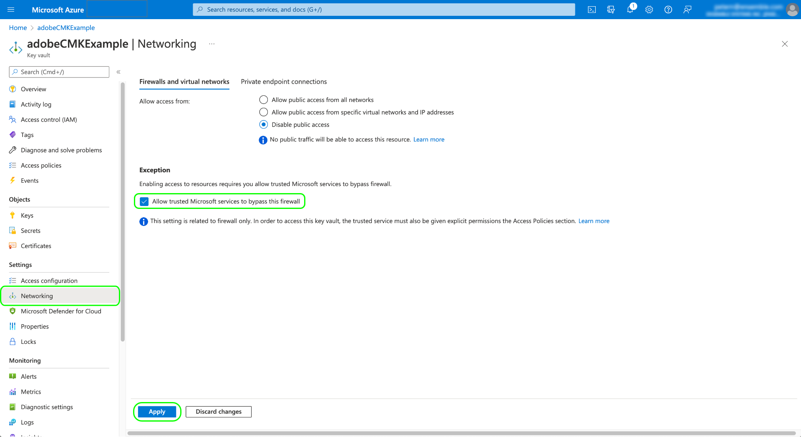

# Kundhanterade nycklar i Adobe Experience Platform

Data som lagras på Adobe Experience Platform krypteras i vila med hjälp av systemnivånycklar. Om du använder ett program som är byggt på plattformen kan du välja att använda dina egna krypteringsnycklar istället, vilket ger dig större kontroll över datasäkerheten.

>[!NOTE]
>
>Data i Adobe Experience Platform datasjön och Profile Store (CosmosDB) krypteras med CMK.

Det här dokumentet beskriver processen för att aktivera funktionen för kundhanterade nycklar (CMK) i Platform.

## Förutsättningar

Om du vill aktivera CMK måste du [!DNL Azure] Nyckelvalv måste konfigureras med följande inställningar:

* [Aktivera rensningsskydd](https://learn.microsoft.com/en-us/azure/key-vault/general/soft-delete-overview#purge-protection)
* [Aktivera mjuk borttagning](https://learn.microsoft.com/en-us/azure/key-vault/general/soft-delete-overview)
* [Konfigurera åtkomst med [!DNL Azure] rollbaserad åtkomstkontroll](https://learn.microsoft.com/en-us/azure/role-based-access-control/)

## Processsammanfattning

CMK ingår i hälso- och sjukvårdsskölden och i skölden för skydd av privatlivet och säkerhet från Adobe. När din organisation har köpt en licens för något av dessa erbjudanden kan du påbörja en engångsprocess för att konfigurera funktionen.

>[!WARNING]
>
>När du har konfigurerat CMK kan du inte återgå till systemhanterade nycklar. Du ansvarar för att hantera dina nycklar på ett säkert sätt och ge åtkomst till dina Key Vault-, Key- och CMK-appar i [!DNL Azure] för att förhindra att dataåtkomsten går förlorad.

Processen är följande:

1. [Konfigurera en [!DNL Azure] Nyckelvalv](#create-key-vault) baserat på organisationens policyer, och sedan [generera en krypteringsnyckel](#generate-a-key) som till slut kommer att delas med Adobe.
1. Använd API-anrop till [konfigurera CMK-appen](#register-app) med [!DNL Azure] tenant.
1. Använd API-anrop till [skicka ditt krypteringsnyckel-ID till Adobe](#send-to-adobe) och starta aktiveringsprocessen för funktionen.
1. [Kontrollera konfigurationsstatus](#check-status) för att kontrollera om CMK har aktiverats.

När konfigurationen är klar krypteras alla data som är inbyggda i Platform i alla sandlådor med hjälp av [!DNL Azure] nyckelinställningar. Om du vill använda CMK använder du [!DNL Microsoft Azure] funktioner som kan vara en del av deras [förhandsvisningsprogram](https://azure.microsoft.com/en-ca/support/legal/preview-supplemental-terms/).

## Konfigurera en [!DNL Azure] Nyckelvalv {#create-key-vault}

CMK stöder bara tangenter från en [!DNL Microsoft Azure] Nyckelvalv. För att komma igång måste du arbeta med [!DNL Azure] om du vill skapa ett nytt Enterprise-konto eller använda ett befintligt Enterprise-konto och följa stegen nedan för att skapa nyckelvalvet.

>[!IMPORTANT]
>
>Endast tjänstenivåerna Premium och Standard för [!DNL Azure] Nyckelvalv stöds. [!DNL Azure Managed HSM], [!DNL Azure Dedicated HSM] och [!DNL Azure Payments HSM] stöds inte. Se [[!DNL Azure] dokumentation](https://learn.microsoft.com/en-us/azure/security/fundamentals/key-management#azure-key-management-services) för mer information om nyckelhanteringstjänster.

>[!NOTE]
>
>Dokumentationen nedan beskriver bara de grundläggande stegen för att skapa nyckelvalvet. Utanför den här vägledningen bör du konfigurera nyckelvalvet enligt din organisations policyer.

Logga in på [!DNL Azure] portalen och använd sökfältet för att hitta **[!DNL Key vaults]** i förteckningen över tjänster.


The **[!DNL Key vaults]** visas när du har valt tjänsten. Här väljer du **[!DNL Create]**.


Fyll i grundläggande information för nyckelvalvet med hjälp av det angivna formuläret, inklusive ett namn och en tilldelad resursgrupp.

>[!WARNING]
>
>De flesta alternativ kan lämnas som standardvärden, men **se till att du aktiverar alternativen för mjuk borttagning och tömning av skydd**. Om du inte aktiverar de här funktionerna kan du förlora åtkomsten till dina data om nyckelvalvet tas bort.
>
>

Här fortsätter du med arbetsflödet för att skapa nyckelvalv och konfigurerar de olika alternativen enligt din organisations policyer.

När du har kommit till **[!DNL Review + create]** kan du granska informationen om nyckelvalvet medan det går igenom valideringen. När valideringen är klar väljer du **[!DNL Create]** för att slutföra processen.


### Konfigurera nätverksalternativ

Om ditt nyckelvalv är konfigurerat för att begränsa offentlig åtkomst till vissa virtuella nätverk eller inaktivera allmän åtkomst helt måste du bevilja Microsoft ett brandväggsundantag.

Välj **[!DNL Networking]** i den vänstra navigeringen. Under **[!DNL Firewalls and virtual networks]** markerar du kryssrutan **[!DNL Allow trusted Microsoft services to bypass this firewall]** väljer **[!DNL Apply]**.



### Generera en nyckel {#generate-a-key}

När du har skapat ett nyckelvalv kan du generera en ny nyckel. Navigera till **[!DNL Keys]** och markera **[!DNL Generate/Import]**.


Använd det angivna formuläret för att ange ett namn för nyckeln och markera **RSA** för nyckeltypen. Som ett minimum finns **[!DNL RSA key size]** måste vara minst **3072** bitar efter behov av [!DNL Cosmos DB]. [!DNL Azure Data Lake Storage] är också kompatibelt med RSA 3027.

>[!NOTE]
>
>Kom ihåg namnet som du anger för nyckeln, som det kommer att användas i senare steg när [skicka tangenten till Adobe](#send-to-adobe).

Använd de återstående kontrollerna för att konfigurera nyckeln som du vill generera eller importera efter behov. När du är klar väljer du **[!DNL Create]**.


Den konfigurerade nyckeln visas i listan med nycklar för valvet.


## Konfigurera CMK-appen {#register-app}

När du har konfigurerat nyckelvalvet är nästa steg att registrera dig för CMK-programmet som ska länka till [!DNL Azure] tenant.

### Komma igång

Om du registrerar CMK-appen måste du anropa API:er för plattformen. Mer information om hur du samlar in de autentiseringsrubriker som krävs för att ringa dessa samtal finns i [Autentiseringsguide för plattforms-API](../../landing/api-authentication.md).

Autentiseringsguiden innehåller instruktioner om hur du genererar ett eget unikt värde för den `x-api-key` begäranhuvud, alla API-åtgärder i den här handboken använder det statiska värdet `acp_provisioning` i stället. Du måste fortfarande ange dina egna värden för `{ACCESS_TOKEN}` och `{ORG_ID}`, dock.

I alla API-anrop som visas i den här handboken `platform.adobe.io` används som rotsökväg, som är standard för VA7-regionen. Om din organisation använder en annan region, `platform` måste följas av ett bindestreck och regionkoden som tilldelats din organisation: `nld2` för NLD2 eller `aus5` för AUS5 (till exempel: `platform-aus5.adobe.io`). Kontakta systemadministratören om du inte känner till din organisations region.

### Hämta en autentiserings-URL

Om du vill starta registreringsprocessen skickar du en GET-förfrågan till slutpunkten för programregistreringen för att hämta den autentiserings-URL som krävs för din organisation.

**Begäran**

```shell
curl -X GET \
  https://platform.adobe.io/data/infrastructure/manager/byok/app-registration \ 
  -H 'Authorization: Bearer {ACCESS_TOKEN}' \
  -H 'x-api-key: acp_provisioning' \
  -H 'x-gw-ims-org-id: {ORG_ID}'
```

**Svar**

Ett godkänt svar returnerar ett `applicationRedirectUrl` -egenskap som innehåller autentiserings-URL:en.

```json
{
    "id": "byok",
    "name": "acpebae9422Caepcmkmultitenantapp",
    "applicationUri": "https://adobe.com/acpebae9422Caepcmkmultitenantapp",
    "applicationId": "e463a445-c6ac-4ca2-b36a-b5146fcf6a52",
    "applicationRedirectUrl": "https://login.microsoftonline.com/common/oauth2/authorize?response_type=code&client_id=e463a445-c6ac-4ca2-b36a-b5146fcf6a52&redirect_uri=https://adobe.com/acpebae9422Caepcmkmultitenantapp&scope=user.read"
}
```

Kopiera och klistra in `applicationRedirectUrl` till en webbläsare för att öppna en autentiseringsdialogruta. Välj **[!DNL Accept]** för att lägga till CMK-programtjänstens huvudnamn i [!DNL Azure] tenant.


### Tilldela CMK-appen till en roll {#assign-to-role}

När du är klar med autentiseringsprocessen går du tillbaka till [!DNL Azure] Nyckelvalv och välj **[!DNL Access control]** i den vänstra navigeringen. Här väljer du **[!DNL Add]** följt av **[!DNL Add role assignment]**.


På nästa skärm får du en uppmaning om att välja en roll för uppdraget. Välj **[!DNL Key Vault Crypto Service Encryption User]** före markering **[!DNL Next]** för att fortsätta.


På nästa skärm väljer du **[!DNL Select members]** för att öppna en dialogruta i den högra listen. Använd sökfältet för att hitta tjänstens huvudnamn för CMK-programmet och markera det i listan. När du är klar väljer du **[!DNL Save]**.

>[!NOTE]
>
>Om du inte kan hitta ditt program i listan har ditt huvudnamn inte godkänts i din klientorganisation. Var vänlig och arbeta med [!DNL Azure] administratör eller representant för att säkerställa att du har rätt behörigheter.

## Aktivera krypteringsnyckelkonfigurationen i Experience Platform {#send-to-adobe}

När du har installerat CMK-appen på [!DNL Azure]kan du skicka krypteringsnyckelns identifierare till Adobe. Välj **[!DNL Keys]** i den vänstra navigeringen, följt av namnet på den tangent som du vill skicka.


Välj den senaste versionen av nyckeln så visas informationssidan. Här kan du välja att konfigurera de tillåtna åtgärderna för nyckeln. Nyckeln måste minst tilldelas **[!DNL Wrap Key]** och **[!DNL Unwrap Key]** behörigheter.

The **[!UICONTROL Key Identifier]** fältet visar URI-identifieraren för nyckeln. Kopiera det här URI-värdet för användning i nästa steg.


När du har fått nyckelvalvs-URI:n kan du skicka den med en POST-begäran till CMK-konfigurationsslutpunkten.

>[!NOTE]
>
>Endast nyckelvalvet och nyckelnamnet lagras med Adobe, inte nyckelversionen.

**Begäran**

```shell
curl -X POST \
  https://platform.adobe.io/data/infrastructure/manager/customer/config \ 
  -H 'Authorization: Bearer {ACCESS_TOKEN}' \
  -H 'x-api-key: acp_provisioning' \
  -H 'x-gw-ims-org-id: {ORG_ID}' \
  -d '{
        "name": "Config1",
        "type": "BYOK_CONFIG",
        "imsOrgId": "{ORG_ID}",
        "configData": {
          "providerType": "AZURE_KEYVAULT",
          "keyVaultKeyIdentifier": "https://adobecmkexample.vault.azure.net/keys/adobeCMK-key/7c1d50lo28234cc895534c00d7eb4eb4"
        }
      }'
```

| Egenskap | Beskrivning |
| --- | --- |
| `name` | Ett namn för konfigurationen. Se till att du kommer ihåg det här värdet eftersom det kommer att behövas för att kontrollera konfigurationens status på en [senare steg](#check-status). Värdet är skiftlägeskänsligt. |
| `type` | Konfigurationstypen. Måste anges till `BYOK_CONFIG`. |
| `imsOrgId` | Ditt organisations-ID. Detta måste vara samma värde som anges i `x-gw-ims-org-id` header. |
| `configData` | Innehåller följande information om konfigurationen:<ul><li>`providerType`: Måste anges till `AZURE_KEYVAULT`.</li><li>`keyVaultKeyIdentifier`: Det nyckelvalv-URI som du kopierade [tidigare](#send-to-adobe).</li></ul> |

**Svar**

Ett lyckat svar returnerar information om konfigurationsjobbet.

```json
{
  "id": "4df7886b-a122-4391-880b-47888d5c5b92",
  "config": {
    "configData": {
      "keyVaultUri": "https://adobecmkexample.vault.azure.net",
      "keyVaultKeyIdentifier": "https://adobecmkexample.vault.azure.net/keys/adobeCMK-key/7c1d50lo28234cc895534c00d7eb4eb4",
      "keyVersion": "7c1d50lo28234cc895534c00d7eb4eb4",
      "keyName": "Config1",
      "providerType": "AZURE_KEYVAULT"
    },
    "name": "acpcf978863Aaepcmkmultitenantapp",
    "type": "BYOK_CONFIG",
    "imsOrgId": "{IMS_ORG}",
    "status": "NEW"
  },
  "status": "CREATED"
}
```

Jobbet bör slutföras inom några minuter.

## Verifiera konfigurationens status {#check-status}

Om du vill kontrollera statusen för konfigurationsbegäran kan du göra en GET-förfrågan.

**Begäran**

Du måste lägga till `name` för konfigurationen som du vill kontrollera till sökvägen (`config1` i exemplet nedan) och inkludera en `configType` frågeparameter inställd på `BYOK_CONFIG`.

```shell
curl -X GET \
  https://platform.adobe.io/data/infrastructure/manager/customer/config/config1?configType=BYOK_CONFIG \ 
  -H 'Authorization: Bearer {ACCESS_TOKEN}' \
  -H 'x-api-key: acp_provisioning' \
  -H 'x-gw-ims-org-id: {ORG_ID}'
```

**Svar**

Ett lyckat svar returnerar jobbets status.

```json
{
  "name": "acpcf978863Aaepcmkmultitenantapp",
  "type": "BYOK_CONFIG",
  "status": "COMPLETED",
  "configData": {
    "keyVaultUri": "https://adobecmkexample.vault.azure.net",
    "keyVaultKeyIdentifier": "https://adobecmkexample.vault.azure.net/keys/adobeCMK-key/7c1d50lo28234cc895534c00d7eb4eb4",
    "keyVersion": "7c1d50lo28234cc895534c00d7eb4eb4",
    "keyName": "Config1",
    "providerType": "AZURE_KEYVAULT"
  },
  "imsOrgId": "{IMS_ORG}",
  "subscriptionId": "cf978863-7325-47b1-8fd9-554b9fdb6c36",
  "id": "4df7886b-a122-4391-880b-47888d5c5b92",
  "rowType": "BYOK_KEY"
}
```

The `status` -attribut kan ha ett av fyra värden med följande betydelse:

1. `RUNNING`: Verifierar att plattformen har åtkomst till nyckel- och nyckelvalvet.
1. `UPDATE_EXISTING_RESOURCES`: Systemet lägger till nyckelvalvet och nyckelnamnet i datalagret över alla sandlådor i organisationen.
1. `COMPLETED`: Nyckelvalvet och nyckelnamnet har lagts till i datalagret.
1. `FAILED`: Ett problem uppstod, huvudsakligen relaterat till nyckeln, nyckelvalvet eller konfigurationen av multi-tenant-appar.

## Nästa steg

Genom att utföra ovanstående steg har du aktiverat CMK för din organisation. Data som hämtas till Platform krypteras och dekrypteras nu med hjälp av nycklarna i [!DNL Azure] Nyckelvalv. Om du vill återkalla plattformsåtkomst till dina data kan du ta bort den användarroll som är associerad med programmet från nyckelvalvet i [!DNL Azure].

När åtkomsten till programmet har inaktiverats kan det ta från några minuter till 24 timmar innan data inte längre är tillgängliga i Platform. Samma tidsfördröjning gäller för data som ska bli tillgängliga igen när åtkomsten till programmet återaktiveras.

>[!WARNING]
>
>När Key Vault-, Key- eller CMK-appen är inaktiverad och data inte längre är tillgängliga i Platform, kommer eventuella åtgärder som rör dessa data inte längre att vara möjliga. Se till att du förstår vilka konsekvenser det kan få om plattformsåtkomst till dina data återkallas längre fram i kedjan innan du gör några ändringar i konfigurationen.
