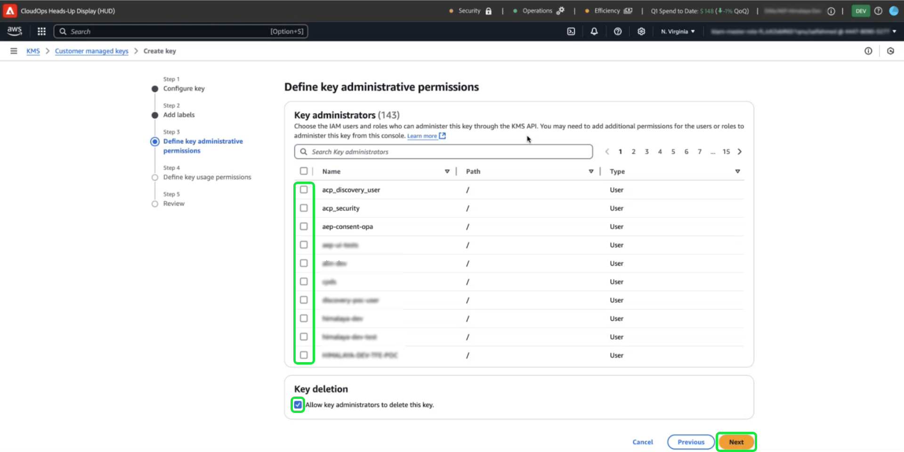

# Konfigurera AWS KMS för kundhanterade nycklar

>[!AVAILABILITY]
>
>Det här dokumentet gäller implementeringar av Experience Platform som körs på Amazon Web Services (AWS). Experience Platform som körs på AWS är för närvarande tillgängligt för ett begränsat antal kunder. Mer information om den Experience Platform-infrastruktur som stöds finns i [Experience Platform översikt över flera moln](https://experienceleague.adobe.com/en/docs/experience-platform/landing/multi-cloud).
>
>[Kundhanterade nycklar](../overview.md) (CMK) på AWS stöds för sköld för skydd av privatlivet och säkerheten, men är inte tillgängliga för hälso- och sjukvårdsskölden. CMK på Azure stöds både för Privacy och Security Shield samt för Healthcare Shield.

Använd den här guiden för att skydda dina data med Amazon Web Services (AWS) Key Management Service (KMS) genom att skapa, hantera och styra krypteringsnycklar för Adobe Experience Platform. Integrationen förenklar regelefterlevnaden, effektiviserar verksamheten genom automatisering och eliminerar behovet av att underhålla en egen nyckelhanteringsinfrastruktur.

Specifika Customer Journey Analytics-anvisningar finns i [Customer Journey Analytics CMK-dokumentationen](https://experienceleague.adobe.com/en/docs/analytics-platform/using/cja-privacy/cmk)

>[!IMPORTANT]
>
>Adobe Experience Platform krypterar vilande data som standard med systemhanterade nycklar. Genom att aktivera CMK (Customer Managed Keys) får du full kontroll över datasäkerheten. Den här ändringen går dock inte att ångra, men när CMK har aktiverats går det inte att återställa till systemhanterade nycklar. Du ansvarar för att hantera dina nycklar på ett säkert sätt för att säkerställa oavbruten åtkomst till dina data och förhindra eventuell otillgänglighet.

Använd AWS KMS för att förbättra datasäkerheten med integrerad krypteringsnyckelhantering för Adobe Experience Platform. Följ den här guiden för att skapa och hantera krypteringsnycklar och säkerställa att dina data förblir skyddade.

## Förhandskrav {#prerequisites}

Innan du fortsätter med det här dokumentet bör du ha god förståelse för följande viktiga begrepp och funktioner:

- **AWS nyckelhanteringstjänst (KMS)**: Förstå grunderna i AWS KMS, inklusive hur du skapar, hanterar och roterar krypteringsnycklar. Mer information finns i den [officiella KMS-dokumentationen](https://docs.aws.amazon.com/kms/).
- **IAM-principer (Identity and Access Management) i AWS**: IAM är en tjänst som gör att du kan hantera åtkomst till AWS tjänster och resurser på ett säkert sätt. Använd IAM för att:
   - Definiera vilka användare, grupper och roller som har åtkomst till specifika resurser.
   - Ange vilka åtgärder som användare tillåts eller nekas att utföra.
   - Implementera detaljerad åtkomstkontroll genom att tilldela behörigheter med IAM-principer.
Mer information finns i [IAM-reglerna för den officiella dokumentationen för AWS KMS](https://docs.aws.amazon.com/kms/latest/developerguide/iam-policies.html).
- **Datasäkerhet i Experience Platform**: Upptäck hur Experience Platform säkerställer datasäkerhet och integrerar med externa tjänster som AWS KMS för kryptering. Experience Platform skyddar data med HTTPS TLS v1.2 för överföring, molnkryptering i vila, isolerad lagring samt anpassningsbara autentiserings- och krypteringsalternativ. Mer information om hur dina data skyddas finns i [styrnings-, sekretess- och säkerhetsöversikten](../overview.md) eller i dokumentet om [datakryptering i Experience Platform](../../encryption.md).
- **AWS Management Console**: Ett centralt nav där du kan komma åt och hantera alla dina AWS-tjänster från ett webbaserat program. Använd sökfältet för att snabbt hitta verktyg, kontrollera meddelanden, hantera ditt konto och din fakturering samt anpassa inställningarna. Mer information finns i den [officiella dokumentationen för AWS-hanteringskonsolen](https://docs.aws.amazon.com/awsconsolehelpdocs/latest/gsg/what-is.html).

## Kom igång {#get-started}

Den här guiden kräver att du redan har tillgång till ett Amazon Web Services-konto och åtkomst till hanteringskonsolen. Följ stegen nedan för att komma igång:

### Välj ett område som stöds {#select-supported-region}

AWS KMS finns i vissa regioner. Kontrollera att du arbetar i en region där KMS stöds. Du kan visa en fullständig lista över regioner som stöds i [AWS KMS-slutpunkts- och kvotlistan](https://aws.amazon.com/about-aws/global-infrastructure/regional-product-services/).

Se till att AWS KMS-krypteringsnyckeln finns i samma region som Adobe Experience Platform-instansen för att uppfylla kraven på dataresistens, optimera prestanda och undvika extra kostnader i olika delar av regionen. Feljusterade områden kan leda till att data blir otillgängliga och integreringsfel uppstår.

### Verifiera behörigheter {#verify-permissions}

Se till att du har de AWS Identity and Access Management-behörigheter (IAM) som krävs för att skapa, hantera och använda krypteringsnycklar i KMS. Så här verifierar du dina behörigheter:

1. Gå till [IAM-principsimulatorn](https://policysim.aws.amazon.com/).
2. Välj ditt användarkonto eller din roll.
3. Simulera KMS-åtgärder som `kms:CreateKey` eller `kms:Encrypt`.

Om simuleringen returnerar ett fel, eller om du är osäker på din behörighet, kan du kontakta AWS-administratören för att få hjälp.

### Kontrollera AWS-kontokonfigurationen

Bekräfta att ditt AWS-konto är aktiverat för att använda AWS KMS-tjänster. KMS-åtkomst är aktiverat som standard för de flesta konton, men du kan granska kontoinställningarna genom att gå till [AWS Management Console](https://aws.amazon.com/console/). Mer information finns i [Utvecklarhandboken för AWS Key Management Service](https://docs.aws.amazon.com/kms/latest/developerguide/overview.html).

### Navigera till AWS KMS för att starta nyckelkonfigurationen

Om du vill börja konfigurera och hantera krypteringsnyckeln loggar du in på ditt AWS-konto och går till AWS nyckelhanteringstjänst (KMS). Från AWS Management Console och välj **Nyckelhanteringstjänst (KMS)** på menyn Tjänster.

## Skapa en ny nyckel {#create-a-key}

>[!IMPORTANT]
>
>Säkerställ säker lagring, åtkomst och tillgänglighet för krypteringsnycklarna. Du ansvarar för att hantera dina nycklar och förhindra störningar i Experience Platform verksamhet.

Välj **[!DNL Create a key]** på arbetsytan [!DNL Key Management Service (KMS)].

## Konfigurera nyckelinställningar {#configure-key}

Arbetsflödet [!DNL Configure Key] visas. Som standard är nyckeltypen inställd på **[!DNL Symmetric]** och nyckelanvändningen är inställd på **[!DNL Encrypt and Decrypt]**. Se till att de här alternativen är markerade innan du fortsätter.

Expandera listrutan **[!DNL Advanced options]**. Du rekommenderas att använda alternativet **[!DNL KMS]**, som gör att AWS kan skapa och hantera nyckelmaterial. Alternativet **[!DNL KMS]** är markerat som standard.

>[!NOTE]
>
>Om du redan har en befintlig nyckel kan du importera externt nyckelmaterial eller använda nyckelbehållaren för AWS [!DNL CloudHSM]. Dessa alternativ omfattas inte av detta dokuments tillämpningsområde.

Välj sedan inställningen [!DNL Regionality] som anger nyckelns regionomfång. Välj **[!DNL Single-Region key]** följt av **[!DNL Next]** för att fortsätta till steg två.

>[!IMPORTANT]
>
>AWS tillämpar regionsbegränsningar för KMS-nycklar. Den här regionsbegränsningen innebär att nyckeln måste finnas i samma region som ditt Adobe-konto. Adobe har bara åtkomst till KMS-nycklar som finns i kontoregionen. Kontrollera att den region du väljer matchar regionen för ditt Adobe single-tenant-konto.

## Märk upp och tagga nyckeln {#add-labels-and-tags-to-key}

Den andra [!DNL Add labels]-fasen av arbetsflödet visas. Här konfigurerar du fälten [!DNL Alias] och [!DNL Tags] så att du kan hantera och hitta din krypteringsnyckel från AWS KMS-konsolen.

Ange en beskrivande etikett för nyckeln i indatafältet **[!DNL Alias]**. Aliaset fungerar som en användarvänlig identifierare som snabbt hittar nyckeln med sökfältet i AWS KMS-konsolen. För att undvika missförstånd väljer du ett beskrivande namn som återspeglar nyckelns syfte, till exempel&quot;Adobe-Experience-Platform-Key&quot; eller&quot;Customer-Encryption-Key&quot;. Du kan även inkludera en beskrivning av nyckeln om nyckelaliaset inte räcker till för att beskriva dess syfte.

Tilldela slutligen metadata till nyckeln genom att lägga till nyckelvärdepar i avsnittet [!DNL Tags]. Det här steget är valfritt, men du bör lägga till taggar för att kategorisera och filtrera AWS-resurser för enklare hantering. Om din organisation till exempel använder flera Adobe-relaterade resurser kan du tagga dem med&quot;Adobe&quot; eller&quot;Experience-Platform&quot;. Det här extra steget gör det enkelt att söka efter och hantera alla associerade resurser i AWS Management Console. Välj **[!DNL Add tag]** för att påbörja processen.

<!-- I do not have an AWS account with which to document the Add tag process as yet. -->

När du är nöjd med dina inställningar väljer du **[!DNL Next]** för att fortsätta med arbetsflödet.

## Definiera administrativa nyckelbehörigheter {#define-key-admins}

Steg tre av arbetsflödet för att skapa nycklar visas. För att säkerställa säker och kontrollerad åtkomst kan du välja vilken av IAM-användarna och rollerna som kan hantera nyckeln. Det finns två alternativ i det här skedet, [!DNL Key administrators] och [!DNL Key deletion]. I avsnittet **[!DNL Key administrators]** markerar du en eller flera kryssrutor bredvid namnet på en användare, eller roll, som du vill ge administratörsbehörighet för den här nyckeln.

>[!NOTE]
>
>Du kan inte skapa administratörer i det här skedet av arbetsflödet.

I avsnittet **[!DNL Key deletion]** aktiverar du kryssrutan så att nyckeladministratörer kan ta bort den här nyckeln. Om du inte markerar kryssrutan tillåts inte administrativa användare att utföra den åtgärden.

Välj **[!DNL Next]** om du vill fortsätta med arbetsflödet.

## Bevilja åtkomst för nyckelanvändare {#assign-key-users}

I steg fyra av arbetsflödet kan du [!DNL Define key usage permissions]. I listan **[!DNL Key users]** markerar du kryssrutorna för alla IAM-användare och roller som du vill ha behörighet att använda den här nyckeln.

Från den här vyn kan du även [!DNL Add another AWS account], men du bör inte lägga till andra AWS-konton. Om du lägger till ett annat konto kan det medföra risker och komplicera behörighetshanteringen för krypterings- och dekrypteringsåtgärder. Genom att behålla nyckeln som är kopplad till ett enda AWS-konto säkerställer Adobe säker integrering med AWS KMS, minimerar riskerna och säkerställer tillförlitlig drift.

Välj **[!DNL Next]** om du vill fortsätta med arbetsflödet.

## Granska nyckelkonfiguration {#review}

Granskningssteget för nyckelkonfigurationen visas. Verifiera nyckelinformationen i avsnitten [!DNL Key configuration] och [!DNL Alias and description].

>[!NOTE]
>
>Se till att nyckelregionen är densamma som AWS-kontot.

Välj **[!DNL Confirm]** för att slutföra processen. Du återgår till arbetsytan KMS Customer Managed Keys med alla tillgängliga nycklar.

## Nästa steg

När AWS KMS har konfigurerats fortsätter du att konfigurera integreringen med användargränssnittet [!UICONTROL Platform Encryption Configuration] eller Adobe Experience Platform API. Om du vill fortsätta med engångsprocessen för att konfigurera funktionen Kundhanterade nycklar fortsätter du med [installationsguiden för användargränssnittet](./ui-set-up.md).
