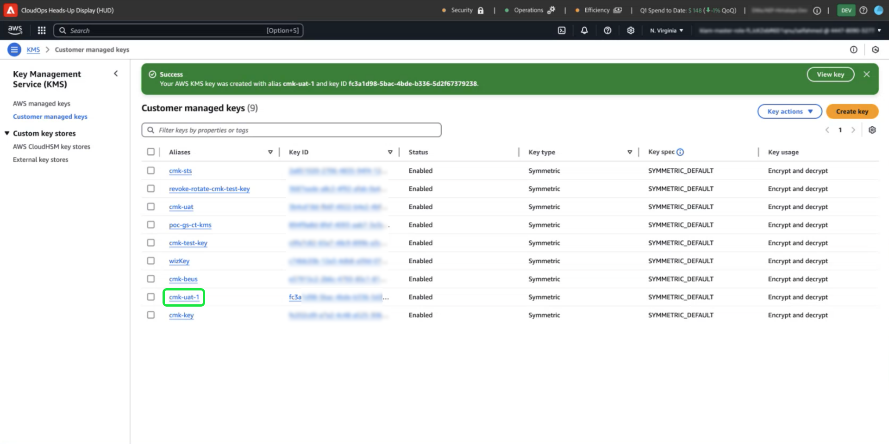

# Konfigurera kundhanterade nycklar med AWS med hjälp av plattformsgränssnittet

Använd den här vägledningen när du vill aktivera kundhanterade nycklar (CMK) för plattformsinstanser på AWS via plattformsgränssnittet.

>[!IMPORTANT]
>
>Innan du fortsätter med den här guiden kontrollerar du att du har slutfört konfigurationen som beskrivs i dokumentet [ Konfigurera AWS KMS för CMK ](./configure-kms.md).

## Uppdatera AWS nyckelpolicy för att integrera nyckeln med Experience Platform

Om du vill integrera din AWS-nyckel med Experience Platform måste du redigera JSON i **[!DNL Key Policy]**-delen av KMS-arbetsytan. En standardnyckelprincip ser ut ungefär som JSON nedan.

<!-- The AWS ID below is fake. Q) Can I refer to it simply as AWS_ACCOUNT_ID ? Is that suitable? -->

```JSON
{
  "Id": "key-consolepolicy-3",
  "Version": "2012-10-17",
  "Statement": [
    {
      "Sid": "Enable IAM User Permissions",
      "Effect": "Allow",
      "Principal": {
        "AWS": "arn:aws:iam::123464903283:root" // this is a mock AWS Principal ID, your ID will differ
      },
      "Action": "kms:*",
      "Resource": "*"
    }
  ]
}
```

I exemplet ovan har alla resurser (`"Resource": "*"`) inom samma konto (`Principal.AWS`) åtkomst till nyckeln. Den här principen tillåter att tjänster i kontot utför krypterings- och dekrypteringsåtgärder som är begränsade till det angivna kontot. Om du vill ge ditt Platform single-tenant-konto åtkomst till den här nyckeln lägger du till nya programsatser i AWS standardpolicy. Du kan hämta den nödvändiga JSON-principen från plattformsgränssnittet och använda den på din AWS KMS-nyckel för att upprätta en säker anslutning till Adobe Experience Platform.

Gå till avsnittet **[!UICONTROL Administration]** i det vänstra navigeringsfältet i plattformsgränssnittet och välj **[!UICONTROL Encryption]**. Välj **[!UICONTROL Configure]** på [!UICONTROL Customer Managed Keys]-kortet på arbetsytan [!UICONTROL Encryption Configuration].


[!UICONTROL Customer Managed Keys configuration] visas. Kopiera objektet `statement` från CMK KMS-principen som visas i [!UICONTROL Customer Managed Keys] [!UICONTROL Encryption Configuration].

<!-- Select the copy icon () to copy the CMK KMS policy to your clipboard. A green pop-up notification confirms that the policy was copied.  -->

<!-- I cannot add the 'and the copy icon highlighted.' to the alt text below as i do not have access to this UI. -->


<!-- This part of the workflow was in contention at the time of the demo.  -->

Gå sedan tillbaka till AWS KMS-arbetsytan och uppdatera nyckelprincipen som visas nedan.


Lägg till de fyra programsatserna från arbetsytan [!UICONTROL Platform Encryption Configuration] i standardprincipen enligt nedan: `Enable IAM User Permissions`, `CJA Flow IAM User Permissions`, `CJA Integrity IAM User Permissions`, `CJA Oberon IAM User Permissions`.

```json
{
    "Version": "2012-10-17",
    "Id": "key-consolepolicy",
    "Statement": [
        {
            "Sid": "Enable IAM User Permissions",
            "Effect": "Allow",
            "Principal": {
                "AWS": "arn:aws:iam::975049898882:root" // this is a mock AWS Principal ID, your ID will differ
            },
            "Action": [
                "kms:Decrypt",
                "kms:Encrypt",
                "kms:ReEncrypt*",
                "kms:GenerateDataKey*",
                "kms:DescribeKey",
                "kms:CreateGrant"
            ],
            "Resource": "*",
            "Condition": {
                "StringEquals": {
                    "aws:PrincipalAccount": "975049898882" // this is a mock AWS Principal ID, your ID will differ
                }
            }
        },
        {
            "Sid": "CJA Flow IAM User Permissions",
            "Effect": "Allow",
            "Principal": {
                "AWS": "arn:aws:iam::767397686373:root"
            },
            "Action": [
                "kms:Decrypt",
                "kms:Encrypt",
                "kms:ReEncrypt*",
                "kms:GenerateDataKey*",
                "kms:DescribeKey",
                "kms:CreateGrant"
            ],
            "Resource": "*",
            "Condition": {
                "StringEquals": {
                    "aws:PrincipalAccount": "767397686373"
                }
            }
        },
        {
            "Sid": "CJA Integrity IAM User Permissions",
            "Effect": "Allow",
            "Principal": {
                "AWS": "arn:aws:iam::730335345392:root"
            },
            "Action": [
                "kms:Decrypt",
                "kms:Encrypt",
                "kms:ReEncrypt*",
                "kms:GenerateDataKey*",
                "kms:DescribeKey",
                "kms:CreateGrant"
            ],
            "Resource": "*",
            "Condition": {
                "StringEquals": {
                    "aws:PrincipalAccount": "730335345392"
                }
            }
        },
        {
            "Sid": "CJA Oberon IAM User Permissions",
            "Effect": "Allow",
            "Principal": {
                "AWS": "arn:aws:iam::891377157113:root"
            },
            "Action": [
                "kms:Decrypt",
                "kms:Encrypt",
                "kms:ReEncrypt*",
                "kms:GenerateDataKey*",
                "kms:DescribeKey",
                "kms:CreateGrant"
            ],
            "Resource": "*",
            "Condition": {
                "StringEquals": {
                    "aws:PrincipalAccount": "891377157113"
                }
            }
        }
    ]
}
```

Välj **[!DNL Finish]** för att bekräfta den uppdaterade principen och skapa nyckeln. Konfigurationen innehåller nu fem programsatser som gör att ditt AWS-konto kan kommunicera med Adobe Experience Platform. Ändringarna träder i kraft omedelbart.

Den uppdaterade [!DNL Customer Managed Keys]-arbetsytan i AWS [!DNL Key Management Service] visas.

### Lägg till information om AWS krypteringsnyckel till plattformen

Om du sedan vill aktivera kryptering lägger du till nyckelns ARN (Amazon Resource Name) på plattformen [!UICONTROL Customer Managed Keys configuration]. I avsnittet [!DNL Customer Managed Keys] i AWS väljer du alias för den nya nyckeln i listan i [!DNL Key Management Service].



Information om nyckeln visas. Allt i AWS har ett ARN (Amazon Resource Name) som
är en unik identifierare som används för att ange resurser för olika AWS-tjänster. Det följer ett standardiserat format: `arn:partition:service:region:account-id:resource`.

Välj kopieringsikonen om du vill kopiera ARN. En bekräftelsedialogruta visas.


Gå tillbaka till användargränssnittet för plattformen [!UICONTROL Customer Managed Keys configuration]. I avsnittet **[!UICONTROL Add AWS encryption key details]** lägger du till en **[!UICONTROL Configuration name]** och den **[!UICONTROL KMS key ARN]** du kopierade från AWS-gränssnittet.


Välj sedan **[!UICONTROL SAVE]** för att skicka konfigurationsnamnet, KMS-nyckeln ARN, och börja validera nyckeln.


Du återgår till arbetsytan [!UICONTROL Encryption Configurations]. Status för krypteringskonfigurationen visas längst ned på kortet **[!UICONTROL Customer Managed Keys]**.


När nyckeln har validerats läggs nyckelvalvet-ID:n till i datavjön och profildatastores för alla sandlådor.

>[!NOTE]
>
>Hur länge processen varar beror på datastorleken. Vanligtvis slutförs processen på mindre än 24 timmar. Varje sandlåda uppdateras vanligtvis på två till tre minuter.

## Återkallning av nyckel {#key-revocation}

>[!IMPORTANT]
>
>Förstå konsekvenserna av återkallande av nyckelord för program längre fram i kedjan innan du återkallar en åtkomst.

Här följer några viktiga saker att tänka på när du återkallar en nyckel:

- Om du återkallar eller inaktiverar nyckeln blir plattformsdata otillgängliga. Denna åtgärd är irreversibel och bör utföras med försiktighet.
- Tänk på spridningstidslinjerna när åtkomst till krypteringsnycklar återkallas. Primära datalager blir oåtkomliga inom några minuter till 24 timmar. Cachelagrade eller tillfälliga datalager blir oåtkomliga inom sju dagar.

Om du vill återkalla en tangent går du till arbetsytan i AWS KMS. I avsnittet **[!DNL Customer managed keys]** visas alla tillgängliga nycklar för ditt AWS-konto. Välj alias för nyckeln i listan.


Information om nyckeln visas. Om du vill inaktivera nyckeln väljer du **[!DNL Key actions]** och sedan **[!DNL Disable]** i listrutan.


En bekräftelsedialogruta visas. Välj **[!DNL Disable key]** för att bekräfta ditt val. Effekten av att inaktivera nyckeln bör återspeglas i plattformsapplikationer och användargränssnittet inom ungefär fem minuter.

>[!NOTE]
>
>När du har inaktiverat nyckeln kan du aktivera den igen med samma metod som beskrivs ovan om du skulle behöva göra det. Det här alternativet är tillgängligt i listrutan **[!DNL Key actions]**.


Om nyckeln används för andra tjänster kan du även ta bort åtkomsten för Experience Platform direkt från nyckelprincipen. Välj **[!UICONTROL Edit]** i avsnittet **[!DNL Key Policy]**.


Sidan **[!DNL Edit key policy]** visas. Markera och ta bort den principsats som kopierats från plattformsgränssnittet för att ta bort behörigheten för appen Kundhanterade nycklar. Välj sedan **[!DNL Save changes]** för att slutföra processen.


## Nyckelrotation {#key-rotation}

AWS erbjuder automatisk tangentrotation på begäran. För att minska risken för nyckelkompromisser eller uppfylla säkerhetskraven kan du automatiskt generera nya krypteringsnycklar vid behov eller med regelbundna intervall. Schemalägg automatisk tangentrotation för att begränsa nyckelns livslängd och kontrollera att tangenten inte kan användas efter rotation om den är komprometterad. Moderna krypteringsalgoritmer är mycket säkra, men nyckelrotation är en viktig åtgärd för att uppfylla säkerhetskraven och visar att de bästa säkerhetsmetoderna följs.

### Automatisk tangentrotation {#automatic-key-rotation}

Automatisk tangentrotation är inaktiverat som standard. Om du vill schemalägga automatisk tangentrotation från KMS-arbetsytan väljer du fliken **[!DNL Key rotation]** följt av **[!DNL Edit]** i **[!DNL Automatic key rotation section]** .


Arbetsytan **[!DNL Edit automatic key rotation]** visas. Här väljer du alternativknappen för att aktivera eller inaktivera automatisk tangentrotation. Använd sedan textinmatningsfältet eller listrutan för att välja en tidsperiod för tangentrotationen. Välj **[!DNL Save]** för att bekräfta dina inställningar och återgå till arbetsytan med nyckelinformation.

>[!NOTE]
>
>Den minsta tangentrotationsperioden är 90 dagar och den högsta är 2 560 dagar.


### Rotation av on demand-tangenten {#on-demand-key-rotation}

Välj **[!DNL Rotate Now]** om du vill utföra en omedelbar tangentrotation om den aktuella nyckeln är komprometterad. AWS begränsar den här funktionen till tio rotationer. Schemalägg automatiska nyckelrotationer istället för regelbundet underhåll.


## Nästa steg

När du har läst det här dokumentet har du lärt dig att skapa, konfigurera och hantera krypteringsnycklar i AWS KMS för Adobe Experience Platform. Granska sedan organisationens säkerhets- och efterlevnadsprinciper för att implementera bästa praxis, som schemaläggning av nyckelrotationer och säkerställ säker nyckellagring.
