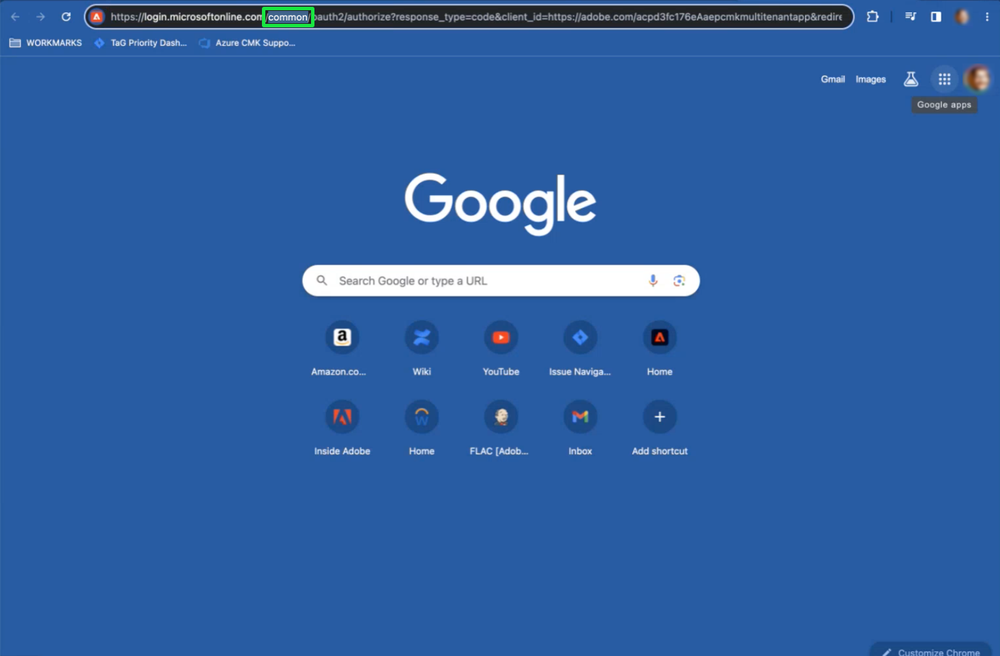

# Konfigurera och konfigurera kundhanterade nycklar med hjälp av plattformsgränssnittet

Det här dokumentet beskriver processen för att aktivera funktionen för kundhanterade nycklar (CMK) i plattformen med användargränssnittet. Instruktioner om hur du slutför processen med API:t finns i [Installationsdokument för API CMK](./api-set-up.md).

## Förutsättningar

Visa och gå till [!UICONTROL Encryption] i Adobe Experience Platform måste du ha skapat en roll och tilldelat [!UICONTROL Manage Customer Managed Key] behörighet till den rollen. Alla användare som har [!UICONTROL Manage Customer Managed Key] behörighet kan aktivera CMK för sin organisation.

Mer information om hur du tilldelar roller och behörigheter i Experience Platform finns i [konfigurera behörighetsdokumentation](https://experienceleague.adobe.com/docs/platform-learn/getting-started-for-data-architects-and-data-engineers/configure-permissions.html).

Om du vill aktivera CMK [[!DNL Azure] Nyckelvalv måste konfigureras](./azure-key-vault-config.md) med följande inställningar:

* [Aktivera rensningsskydd](https://learn.microsoft.com/en-us/azure/key-vault/general/soft-delete-overview#purge-protection)
* [Aktivera mjuk borttagning](https://learn.microsoft.com/en-us/azure/key-vault/general/soft-delete-overview)
* [Konfigurera åtkomst med [!DNL Azure] rollbaserad åtkomstkontroll](https://learn.microsoft.com/en-us/azure/role-based-access-control/)
* [Konfigurera en [!DNL Azure] Key Vault](./azure-key-vault-config.md)

## Konfigurera CMK-appen {#register-app}

När du har konfigurerat nyckelvalvet är nästa steg att registrera CMK-programmet som ska länka till [!DNL Azure] tenant.

### Komma igång

Så här visar du [!UICONTROL Encryption configurations] kontrollpanel, välja **[!UICONTROL Encryption]** under [!UICONTROL Administration] rubrik för vänster navigeringssidlist.

Välj **[!UICONTROL Configure]** för att öppna [!UICONTROL Customer Managed Keys configuration] vy. Den här arbetsytan innehåller alla värden som krävs för att slutföra stegen som beskrivs nedan och utföra integreringen med Azure Key-valvet.

### Kopiera autentiserings-URL {#copy-authentication-url}

Om du vill starta registreringsprocessen kopierar du URL:en för programautentisering för din organisation från [!UICONTROL Customer Managed Keys configuration] visa och klistra in den i [!DNL Azure] miljö **[!DNL Key Vault Crypto Service Encryption User]**. Information om hur du [tilldela en roll](#assign-to-role) finns i nästa avsnitt.

Markera kopieringsikonen () av [!UICONTROL Application authentication url].

![The [!UICONTROL Customer Managed Keys configuration] vy med URL:en för programautentisering markerad.](../../images/governance-privacy-security/customer-managed-keys/application-authentication-url.png)

Kopiera och klistra in [!UICONTROL Application authentication url] till en webbläsare för att öppna en autentiseringsdialogruta. Välj **[!DNL Accept]** för att lägga till CMK-programtjänstens huvudnamn i [!DNL Azure] tenant. Bekräftelse av autentiseringen omdirigerar dig till landningssidan för Experience Cloud.

![En dialogruta för Microsoft-behörighetsbegäran med [!UICONTROL Accept] markerad.](../../images/governance-privacy-security/customer-managed-keys/app-permission.png)

>[!IMPORTANT]
>
>Om du har flera [!DNL Microsoft Azure] prenumerationer kan du ansluta din Platform-instans till fel nyckelvalv. I den här situationen måste du byta ut `common` i URL-namnet för programautentisering för CMK-katalog-ID. Kopiera CMK-katalog-ID från sidan Portal settings, Directories, and Subscriptions på [!DNL Microsoft Azure] program ![The [!DNL Microsoft Azure] programportalinställningar, katalogsida och prenumerationssida med katalog-ID markerat.](../../images/governance-privacy-security/customer-managed-keys/directory-id.png) Klistra sedan in den i webbläsarens adressfält. 

### Tilldela CMK-appen till en roll {#assign-to-role}

När autentiseringsprocessen är klar går du tillbaka till [!DNL Azure] Nyckelvalv och välj **[!DNL Access control]** i den vänstra navigeringen. Välj **[!DNL Add]** följt av **[!DNL Add role assignment]**.

![The [!DNL Microsoft Azure] kontrollpanel med [!DNL Add] och [!DNL Add role assignment] markerad.](../../images/governance-privacy-security/customer-managed-keys/add-role-assignment.png)

På nästa skärm får du en uppmaning om att välja en roll för uppdraget. Välj **[!DNL Key Vault Crypto Service Encryption User]** före markering **[!DNL Next]** för att fortsätta.

![The [!DNL Microsoft Azure] kontrollpanelen med [!DNL Key Vault Crypto Service Encryption User] markerad.](../../images/governance-privacy-security/customer-managed-keys/select-role.png)

Välj **[!DNL Select members]** för att öppna en dialogruta i den högra listen. Använd sökfältet för att hitta tjänstens huvudnamn för CMK-programmet och markera det i listan. När du är klar väljer du **[!DNL Save]**.

>[!NOTE]
>
>Om du inte kan hitta ditt program i listan har ditt huvudnamn inte godkänts i din klientorganisation. För att vara säker på att du har rätt behörigheter kan du arbeta med [!DNL Azure] administratör eller representant.

Du kan verifiera programmet genom att jämföra [!UICONTROL Application ID] på [!UICONTROL Customer Managed Keys configuration] visa med [!DNL Application ID] på [!DNL Microsoft Azure] programöversikt.

![The [!UICONTROL Customer Managed Keys configuration] visa med [!UICONTROL Application ID] markerad.](../../images/governance-privacy-security/customer-managed-keys/application-id.png)

All information som krävs för att verifiera Azure-verktygen ingår i plattformens användargränssnitt. Den här detaljnivån tillhandahålls så många användare som vill använda andra Azure-verktyg för att förbättra sina möjligheter att övervaka och logga dessa program åtkomst till deras nyckelvalv. Att förstå dessa identifierare är avgörande för det ändamålet och för att hjälpa Adobes tjänster att komma åt nyckeln.

## Aktivera krypteringsnyckelkonfigurationen i Experience Platform {#send-to-adobe}

Efter installation av CMK-appen på [!DNL Azure]kan du skicka krypteringsnyckelns identifierare till Adobe. Välj **[!DNL Keys]** i den vänstra navigeringen, följt av namnet på den tangent som du vill skicka.

![Microsoft Azure-kontrollpanelen med [!DNL Keys] och nyckelnamnet är markerat.](../../images/governance-privacy-security/customer-managed-keys/select-key.png)

Välj den senaste versionen av nyckeln så visas informationssidan. Här kan du välja att konfigurera tillåtna åtgärder för nyckeln.

>[!IMPORTANT]
>
>De minsta åtgärder som krävs för nyckeln är **[!DNL Wrap Key]** och **[!DNL Unwrap Key]** behörigheter. Du kan inkludera [!DNL Encrypt], [!DNL Decrypt], [!DNL Sign]och [!DNL Verify] borde du vilja.

The **[!UICONTROL Key Identifier]** fältet visar URI-identifieraren för nyckeln. Kopiera det här URI-värdet för användning i nästa steg.

![Nyckelinformation för Microsoft Azure-instrumentpanelen med [!DNL Permitted operations] och kopieringsnyckelns URL-avsnitt är markerade.](../../images/governance-privacy-security/customer-managed-keys/copy-key-url.png)

När du har fått [!DNL Key vault URI], gå tillbaka till [!UICONTROL Customer Managed Keys configuration] visa och ange en beskrivning **[!UICONTROL Configuration name]**. Lägg sedan till [!DNL Key Identifier] från sidan med Azure-nyckelinformation till **[!UICONTROL Key vault key identifier]** och markera **[!UICONTROL  Save]**.

![The [!UICONTROL Customer Managed Keys configuration] visa med [!UICONTROL Configuration name] och [!UICONTROL Key vault key identifier] markerade avsnitt.](../../images/governance-privacy-security/customer-managed-keys/configuration-name.png)

Du kommer tillbaka till [!UICONTROL Encryption configurations dashboard]. Status för [!UICONTROL Customer Managed Keys] visas som [!UICONTROL Processing].

![The [!UICONTROL Encryption configurations] kontrollpanel med [!UICONTROL Processing] markerat på [!UICONTROL Customer Managed Keys] kort.](../../images/governance-privacy-security/customer-managed-keys/processing.png)

## Verifiera konfigurationens status {#check-status}

Bearbetningen kan ta lång tid. Om du vill kontrollera konfigurationsstatus går du tillbaka till [!UICONTROL Customer Managed Keys configuration] visa och rulla ned till [!UICONTROL Configuration status]. Förloppsindikatorn har avancerat till steg ett av tre och förklarar att systemet validerar att plattformen har åtkomst till nyckel- och nyckelvalvet.

Det finns fyra möjliga statusvärden för CMK-konfigurationen. De är följande:

* Steg 1: Verifierar att plattformen har åtkomst till nyckel- och nyckelvalvet.
* Steg 2: Nyckelvalvet och nyckelnamnet läggs till i alla datalager i organisationen.
* Steg 3: Nyckelvalvet och nyckelnamnet har lagts till i datalagret.
* `FAILED`: Ett problem uppstod, huvudsakligen relaterat till nyckeln, nyckelvalvet eller konfigurationen av multi-tenant-appar.

## Nästa steg

Genom att utföra ovanstående steg har du aktiverat CMK för din organisation. Data som hämtas till primära datalager krypteras och dekrypteras nu med nycklarna i [!DNL Azure] Key Vault.
