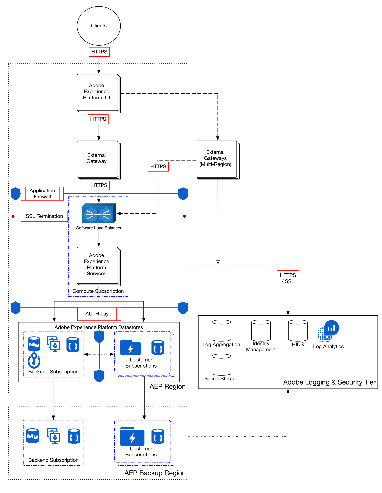

# Datakryptering i Adobe Experience Platform

Adobe Experience Platform är ett kraftfullt och utbyggbart system som centraliserar och standardiserar kundupplevelsedata för alla företagslösningar. Alla data som används av Platform krypteras under överföring och i vila för att skydda dina data. I det här dokumentet beskrivs plattformens krypteringsprocesser på en hög nivå.

Följande processflödesdiagram visar hur data importeras, krypteras och bevaras av [!DNL Experience Platform]:

## Uppgifter under transport {#in-transit}

Alla data som överförs mellan plattformen och alla externa komponenter utförs via säkra, krypterade anslutningar med HTTPS [TLS v1.2](https://datatracker.ietf.org/doc/html/rfc5246).

I allmänhet hämtas data till plattformen på tre sätt:

* [Datainsamling](../../collection/home.md) gör det möjligt för webbplatser och mobilappar att skicka data till Platform Edge Network för testning och förberedelse för förtäring.
* [Källkopplingar](../../sources/home.md) strömma data direkt till plattformen från Adobe Experience Cloud-program och andra företagsdatakällor.
* ETL-verktyg som inte är Adobe (extrahera, omforma, läsa in) skickar data till [API för gruppinmatning](../../ingestion/batch-ingestion/overview.md) för konsumtion.

När data har hämtats in i systemet och [krypterad i vila](#at-rest)kan den sedan berikas av plattformstjänster och tas ut ur systemet på följande sätt:

* [Destinationer](../../destinations/home.md) gör att du kan aktivera data för Adobe-program och partnerprogram.
* Applikationer för olika plattformar som [Customer Journey Analytics](https://experienceleague.adobe.com/docs/analytics-platform/using/cja-overview/cja-overview.html) och [Adobe Journey Optimizer](https://experienceleague.adobe.com/docs/journey-optimizer/using/ajo-home.html) kan också använda data.

## Restdata {#at-rest}

Data som importeras och används av Platform lagras i datasjön, ett mycket detaljerat datalager som innehåller alla data som hanteras av systemet, oavsett ursprung eller filformat. Alla data som lagras i datasjön krypteras, lagras och hanteras i en isolerad [[!DNL Microsoft Azure Data Lake] Lagring](https://docs.microsoft.com/en-us/azure/storage/blobs/data-lake-storage-introduction) instans som är unik för din organisation.

Mer information om hur vilande data krypteras i Azure Data Lake Storage finns i [officiell Azure-dokumentation](https://learn.microsoft.com/en-us/azure/storage/common/storage-service-encryption).

## Nästa steg

Det här dokumentet innehåller en översikt på hög nivå över hur data krypteras i Platform. Mer information om säkerhetsprocedurer i Platform finns i översikten om [styrning, integritet och säkerhet](./overview.md) på Experience League, eller ta en titt på [Informationsdokument om plattformssäkerhet](https://www.adobe.com/content/dam/cc/en/security/pdfs/AEP_SecurityOverview.pdf).
