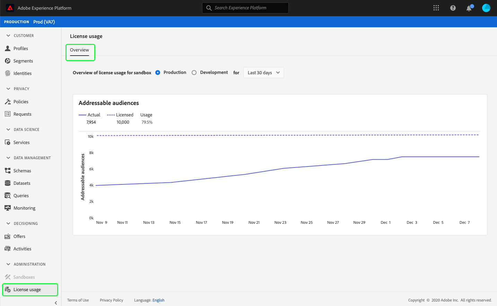

# (Alfa) [!UICONTROL License usage] instrumentpanel {#license-usage-dashboard}

>[!IMPORTANT]
>
>Instrumentpanelsfunktionen som beskrivs i det här dokumentet är för närvarande alfavertiv och är inte tillgänglig för alla användare. Dokumentationen och funktionaliteten kan komma att ändras.

Adobe Experience Platform användargränssnitt (UI) är en kontrollpanel där du kan visa viktig information om din organisations licensanvändning, som den fångats in under en daglig ögonblicksbild. I den här handboken beskrivs hur du får åtkomst till och arbetar med kontrollpanelen för licensanvändning i användargränssnittet och den innehåller mer information om de visualiseringar som visas på kontrollpanelen.

En allmän översikt över användargränssnittet för plattformen finns i [användargränssnittsguiden för Experience Platform](ui-guide.md).

## Kontrollpanelsdata för licensanvändning

På kontrollpanelen för licensanvändning visas en ögonblicksbild av din organisations licensrelaterade data för Experience Platform. Informationen i kontrollpanelen visas exakt som den visas vid den specifika tidpunkt då ögonblicksbilden togs. Ögonblicksbilden är alltså inte en uppskattning eller ett urval av data och instrumentpanelen uppdateras inte i realtid.

>[!NOTE]
>
>Ändringar eller uppdateringar som gjorts i data sedan ögonblicksbilden togs kommer inte att visas på kontrollpanelen förrän nästa ögonblicksbild tas.

## Utforska kontrollpanelen för licensanvändning

Om du vill navigera till kontrollpanelen för licensanvändning i plattformsgränssnittet väljer du **[!UICONTROL License usage]** i den vänstra listen. Detta öppnas med fliken **[!UICONTROL Overview]** som visar kontrollpanelen.

### Markera en sandlåda

Välj antingen [!UICONTROL Production] eller [!UICONTROL Development] om du vill välja en sandlåda att visa på kontrollpanelen. Den markerade sandlådan indikeras av alternativknappen bredvid namnet på sandlådan.

>[!NOTE]
>
>Konsumtionsrapportering för sandlådor är kumulativ för alla sandlådor av samma typ. Om du väljer [!UICONTROL Production] eller [!UICONTROL Development] rapporteras med andra ord alla produktions- respektive utvecklingssandlådor.

### Välj ett datumintervall

När du har valt en sandlåda kan du använda listrutan för datumintervall för att välja vilken tidsperiod som ska visas på instrumentpanelen. Det finns tre tillgängliga alternativ: [!UICONTROL Last 30 days], [!UICONTROL Last 90 days] och [!UICONTROL Last 12 months]. De senaste 30 dagarna markeras som standard.

### Widgetar och mätvärden

Kontrollpanelen för licensanvändning består av widgetar som visar skrivskyddade mått med viktig information om organisationens licensanvändning. Mer information om de här widgetarna finns i avsnittet om tillgängliga widgetar i den här handboken.

## Tillgängliga widgetar {#available-widgets}

Experience Platform har för närvarande en widget som du kan använda för att visualisera licensanvändningen, och fler widgetar kommer snart.

### [!UICONTROL Addressable audiences] {#addressable-audiences}

Widgeten **[!UICONTROL Addressable audiences]** visar det totala antalet sammanfogade profiler i profildatalagret, efter att ha tillämpat en systemgenererad sammanfogningsprincip för att kombinera profilfragment från alla aktuella datauppsättningar med hjälp av en deterministisk (privat) diagramalgoritm.

Om du vill ha mer information om fragment och sammanfogade profiler börjar du med att läsa *profilfragment jämfört med sammanfogade profiler* i [profilöversikt](../profile/home.md).

>[!NOTE]
>
>Sammanslagningsprincipen som används för att beräkna det här måttet genereras av Experience Platform och kan inte redigeras, och inte heller kan en annan sammanfogningsprincip väljas. Den systemgenererade sammanfogningsprincipen är inte densamma som standardsammanfogningsprincipen som används för att beräkna [!UICONTROL Audience size] på kontrollpanelen [!DNL Profile]. Därför är det inte troligt att antalet målgrupper i kontrollpanelerna [!UICONTROL License usage] och [!DNL Profile] är exakt detsamma.

## Ytterligare instrumentpaneler

Plattformsgränssnittet innehåller ytterligare instrumentpaneler för att visa ögonblicksbilder av dina data i Experience Platform. Dessa paneler innehåller kundprofiler och segment i realtid. Om du vill ha mer information om de här instrumentpanelerna väljer du bland följande länkar:

* [[!DNL Profile] kontrollpanel](../profile/ui/profile-dashboard.md)
* [Kontrollpanel för segment](../segmentation/ui/segment-dashboard.md)

## Nästa steg

Genom att följa det här dokumentet bör du nu kunna hitta kontrollpanelen för licensanvändning och välja en sandlåda att visa. Du bör också förstå mätvärdena som visas i de tillgängliga widgetarna. Mer information om användargränssnittet i Experience Platform finns i [användargränssnittshandboken för plattformen](ui-guide.md).