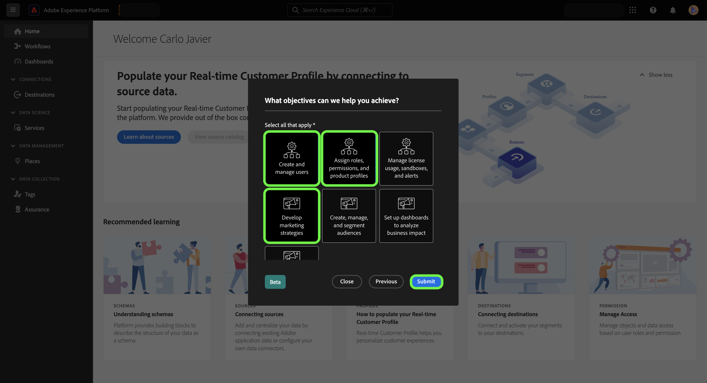
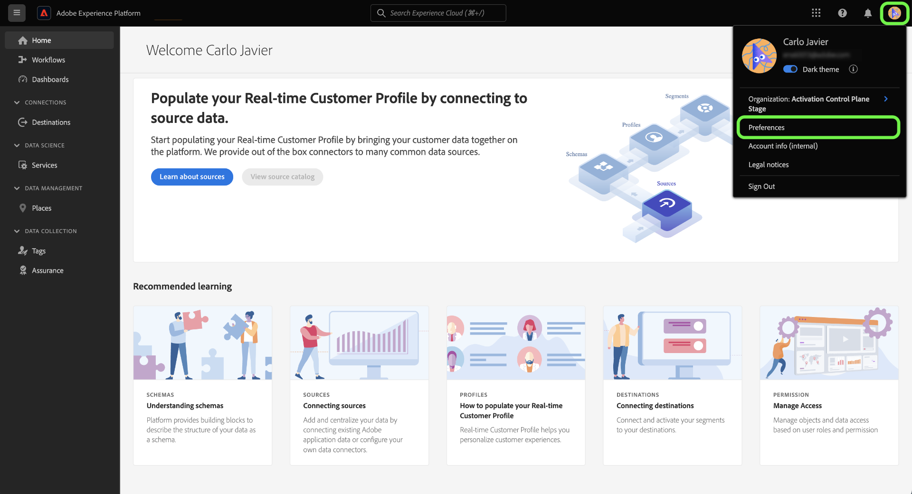

# Använd självidentifieringsundersökningen för att skapa din personliga profil för Experience Platform

>[!NOTE]
>
>Självidentifieringsundersökningen är i betaversion. Dess funktioner och dokumentation kan komma att ändras.

Självidentifieringsundersökningen är ett kort frågeformulär som presenteras på Adobe Experience Platform användargränssnittets hemsida. Du kan fylla i enkäten för att få information om dina jobbfunktioner och allmänna mål. Informationen används sedan för att bättre anpassa produktguiderna och så småningom leverera innehåll som är mer relevant för era mål.

Det här dokumentet innehåller information om hur du kan använda självidentifieringsundersökningen i plattformsgränssnittet för att få relevant innehåll baserat på dina mål och uppgifter, samt hur du konfigurerar om dina personliga profilattribut med användargränssnittet.

Läs mer om Adobe Experience Platform i [Experience Platform - översikt](home.md).

## Självidentifieringsundersökning i plattformsgränssnittet

Uppmaningen om självidentifiering visas längst ned till höger på startsidan för användargränssnittet för plattformen när du loggar in.

Välj **[!UICONTROL Start]**.

För den första enkätfrågan väljer du den funktion som bäst beskriver ditt arbete.

De tillgängliga alternativen är:

* Administrering
* Teknik
* Integritet och styrning
* Marknadsföring
* Övriga

>[!NOTE]
>
>Du kan välja mer än en funktion i listan med alternativ. Om du väljer [!UICONTROL Other]blir du ombedd att lämna uppgifter om ditt mål.

Om du vill fortsätta väljer du den eller de funktioner som bäst beskriver ditt nuvarande arbete och väljer sedan **[!UICONTROL Next]**.

Välj sedan det eller de mål som bäst passar ditt arbete.

Förteckningen över tillgängliga mål omfattar följande:

* Skapa och hantera användare
* Tilldela roller, behörigheter och produktprofiler
* Hantera licensanvändning, sandlådor och aviseringar
* Konfigurera systemet för datainhämtning
* Modellera min organisations datastruktur
* Fråga, filtrera och optimera data för att generera insikter
* Konfigurera samtycke och dataprinciper
* Datastyrning och integritet
* Utveckla marknadsföringsstrategier
* Skapa, hantera och segmentera målgrupper
* Ställ in instrumentpaneler för att analysera affärspåverkan
* Aktivera data till mål för nedladdning

När du är klar väljer du **[!UICONTROL Submit]**.

Välj **[!UICONTROL Done]**.

>[!NOTE]
>
>Mål och rekommendationer (om sådana finns) ändras baserat på de valda jobbfunktionerna.

## Uppdatera dina enkätsvar

Uppdatera dina jobbfunktioner och objekt på inställningsmenyn i Experience Cloud. Du öppnar inställningsmenyn genom att markera din profilikon i den övre navigeringen och sedan välja **[!UICONTROL Preferences]**.

Nästa, i [!UICONTROL General] väljer du **[!UICONTROL Update your job functions and objectives]**.

Självidentifieringsundersökningen visas, så att du kan konfigurera om dina svar och uppdatera din profil.

## Nästa steg

Genom att läsa det här dokumentet har du nu skickat in och uppdaterat information om dina jobbfunktioner och mål för att få mer relevant innehåll när du använder plattformsgränssnittet. Mer information om plattformsgränssnitt finns i [Experience Platform - översikt](home.md).
