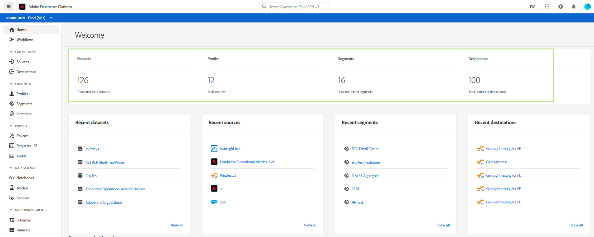
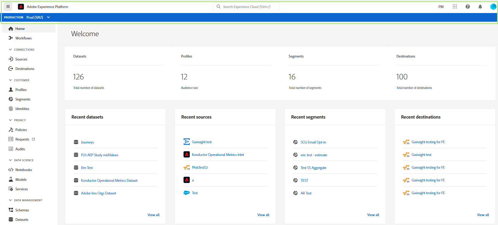

# Adobe Experience Platform UI Guide

Den här guiden är en introduktion till hur du använder Adobe Experience Platform användargränssnitt, förklarar vad de olika komponenterna används för och ger länkar till ytterligare dokumentation för mer information.

Läs mer om Adobe Experience Platform i översikten över Experience Platform.

## Hemskärm

När du har loggat in på Adobe Experience Platform kommer du till [!UICONTROL Home] sidan, som består av kontrollpanelen för mätvärden, senaste data och rekommenderade utbildningsavsnitt.

### Kontrollpanel för mått

Kontrollpanelen för mätvärden innehåller kort som ger dig information om datauppsättningar, profiler, segment och mål inom organisationen.

I avsnittet visas **[!UICONTROL Datasets]** antalet datauppsättningar i IMS-organisationen. Numret uppdateras när en ny datauppsättning skapas. Mer information om datauppsättningar finns i översikten över [datauppsättningar](../catalog/datasets/overview.md).

I **[!UICONTROL Profiles]** avsnittet visas det totala antalet personer med profiler inom IMS-organisationen, exklusive profilfragment. Det totala antalet personer representerar den totala adresserbara publiken och uppdateras en gång var 24:e timme. Mer information om profiler finns i [Kundprofilöversikt](../profile/home.md)i realtid.

I **[!UICONTROL Segments]** avsnittet visas det totala antalet segment som skapats i IMS-organisationen. Numret uppdateras när ett nytt segment skapas. Mer information om segment finns i översikten över [segmenteringstjänsten](../segmentation/home.md).

I **[!UICONTROL Destinations]** avsnittet visas det totala antalet destinationer som skapats för IMS-organisationen. Numret uppdateras när ett nytt mål skapas. Mer information om destinationer finns i [destinationsöversikten](../rtcdp/destinations/destinations-overview.md).

### Senaste data

Den senaste datapanelen innehåller information om nyligen skapade datauppsättningar, källor, segment och mål.

I **[!UICONTROL Recent datasets]** avsnittet visas de fem senast skapade datauppsättningarna i din IMS-organisation. Den här listan uppdateras varje gång en ny datauppsättning skapas. Du kan välja en datauppsättning i listan om du vill visa mer information om den angivna datauppsättningen eller välja **[!UICONTROL View all]** att visa en lista över alla skapade datauppsättningar. Mer information om datauppsättningar finns i översikten över [datauppsättningar](../catalog/datasets/overview.md).

I **[!UICONTROL Recent sources]** avsnittet visas de fem senast skapade källanslutningarna i IMS-organisationen. Listan uppdateras varje gång en ny källkoppling skapas. Du kan välja en källanslutning i listan om du vill visa mer information om den angivna kopplingen eller välja **[!UICONTROL View all]** att visa en lista över alla skapade källanslutningar. Mer information om källor finns i [Källöversikt](../sources/home.md).

I **[!UICONTROL Recent segments]** avsnittet visas de fem senast skapade segmentdefinitionerna i din IMS-organisation. Listan uppdateras varje gång en ny segmentdefinition skapas. Du kan välja en segmentdefinition i listan om du vill visa mer information om den angivna segmentdefinitionen eller välja **[!UICONTROL View all]** att visa en lista över alla skapade segmentdefinitioner. Mer information om segment finns i översikten över [segmenteringstjänsten](../segmentation/home.md).

I **[!UICONTROL Recent destinations]** avsnittet visas de fem senast skapade destinationerna inom din IMS-organisation. Listan uppdateras varje gång ett nytt mål skapas. Du kan välja ett mål i listan om du vill visa mer information om det angivna målet eller välja **[!UICONTROL View all]** att visa en lista över alla skapade mål. Mer information om destinationer finns i [destinationsöversikten](../rtcdp/destinations/destinations-overview.md).

### Rekommenderad utbildning

I det här avsnittet finns länkar till användbar dokumentation för att komma igång med Adobe Experience Platform. **[!UICONTROL Recommended learning]**

## Övre navigeringsfältet

Det övre navigeringsfältet i plattformsgränssnittet visar den IMS-organisation som du är inloggad på och innehåller flera viktiga kontroller.

Till vänster i navigeringsfältet finns Adobe Experience Platform logotyp. Om du väljer det här alternativet återgår du till startskärmen för användargränssnittet för plattformen.

### IMS-organisationsväljare

Det första objektet till höger om navigeringsfältet är **IMS-organisationväxlaren**.

Om du väljer väljaren öppnas en listruta med IMS-organisationer som du har tillgång till, om det finns några. Välj ett alternativ i listan för att växla till den IMS-organisationen.

### Byt program

Nästa objekt till höger är **programväljaren**, som representeras av ikonen för  . När du väljer den här ikonen kan du växla mellan Experience Platform, Resurser, Exchange och Launch.

### Hjälp

Till höger om programväljaren finns **hjälp- och supportmenyn**, som representeras av  . När du väljer den här ikonen visas en snabbmeny med flera hjälp- och supportresurser. På fliken **[!UICONTROL Help]** visas en lista med relevant dokumentation för sidan som du är på. På fliken **[!UICONTROL Support]** kan du skapa en supportanmälan med Adobe supportteam. På fliken **[!UICONTROL Feedback]** kan du skicka feedback om Platform till Adobe.

### Meddelanden

När hjälp- och supportmenyn är **meddelandeavsnittet**, som representeras av ikonen  . På fliken **[!UICONTROL Notifications]** visas viktig information om produkten och andra relevanta uppdateringar, medan det på **[!UICONTROL Announcements]** fliken visas meddelanden om serviceunderhåll.

### Användarprofil

Det sista objektet i det övre navigeringsfältet är **användarinställningarna**, som representeras av ikonen för  . Välj den här ikonen om du vill redigera dina inställningar eller logga ut.

### Sandlådor

Direkt nedanför det övre navigeringsfältet finns sandlådefältet. I det här fältet visas vilken sandlåda du använder för plattformen. Mer information om sandlådor finns i översikten över [sandlådor](../sandboxes/home.md).

## Vänster navigering {#left-nav}

Navigeringen till vänster på skärmen visar alla olika tjänster som stöds i plattformsgränssnittet.

>[!IMPORTANT]
>
>Vissa avsnitt i det vänstra navigeringsfältet kanske inte visas eller är nedtonade. Det beror på att du inte har tillgång till dessa funktioner. Kontakta systemadministratören om du anser att du bör ha tillgång till dessa avsnitt.

I det här avsnittet kan du gå tillbaka till startsidan för användargränssnittet för plattformen. **[!UICONTROL Home]**

I avsnittet visas en lista med arbetsflöden i flera steg för att utföra åtgärder inom plattformen. **[!UICONTROL Workflows]** Mer information om arbetsflöden finns i [arbetsflödesöversikten](./workflows.md).

### [!UICONTROL Connections]

I avsnittet kan du **[!UICONTROL Sources]** skapa, uppdatera och ta bort källanslutningar, så att du kan importera data från externa källor till plattformen. Mer information om källor finns i [Källöversikt](../sources/home.md).

I avsnittet kan du **[!UICONTROL Destinations]** skapa, uppdatera och ta bort mål, så att du kan exportera data från Platform till många externa mål. Mer information om destinationer finns i [destinationsöversikten](../rtcdp/destinations/destinations-overview.md).

### [!UICONTROL Customer]

I det här **[!UICONTROL Profiles]** avsnittet kan du bläddra bland kundprofiler, visa profilvärden, skapa och hantera sammanfogningspolicyer och visa unionsscheman. Mer information om hur du använder [!UICONTROL Profiles] avsnittet finns i [[!DNL Profile] användarhandboken](../profile/ui/user-guide.md). Mer information om kundprofilen i realtid finns i [realtidskundprofilöversikten](../profile/home.md).

I det här **[!UICONTROL Segments]** avsnittet kan du skapa och hantera segmentdefinitioner. Mer information om hur du använder [!UICONTROL Segments] avsnittet finns i användarhandboken för [segmentering](../segmentation/ui/overview.md). Mer information om segmenteringstjänsten finns i översikten över [segmenteringstjänsten](../segmentation/home.md).

I avsnittet kan du **[!UICONTROL Identities]** skapa och hantera identitetsnamnutrymmen. Mer information om [!UICONTROL Identities] avsnittet, inklusive information om identitetsnamnutrymmen och hur du använder identiteter i plattformsgränssnittet, finns i översikten över [identitetsnamnutrymmet](../identity-service/namespaces.md).

### [!UICONTROL Privacy]

I det här **[!UICONTROL Policies]** avsnittet kan du skapa och hantera dataanvändningsprinciper. Mer information om hur du använder avsnittet Profiler finns i användarhandboken för [dataanvändningsprinciper](../data-governance/policies/user-guide.md). Mer information om dataanvändningsprinciper finns i [översikten över](../data-governance/policies/overview.md)dataanvändningsprinciper.

I det här **[!UICONTROL Requests]** avsnittet kan du skapa och hantera sekretessförfrågningar. Observera att du måste vara tillåtslista för att få tillgång till Privacy Servicens användargränssnitt. Läs användarhandboken för [Privacy Servicen om du vill veta mer om hur du använder avsnittet med förfrågningar](../privacy-service/ui/user-guide.md). Mer information om Privacy Service finns i [Privacy Servicen](../privacy-service/home.md).

### [!UICONTROL Data Science]

Avsnittet ger **[!UICONTROL Notebooks]** åtkomst till JupyterLab, en interaktiv utvecklingsmiljö där du kan utforska, analysera och modellera data. Läs användarhandboken för [JupyterLab om du vill veta mer om hur du använder avsnittet Anteckningsböcker](../data-science-workspace/jupyterlab/overview.md). Mer information om arbetsytan Datavetenskap finns i översikten över arbetsytan [Datavetenskap](../data-science-workspace/home.md)

I det här **[!UICONTROL Models]** avsnittet kan du utnyttja maskininlärning och artificiell intelligens för att skapa, utveckla, utbilda och trimma modeller för att göra prognoser. Mer information om modellavsnittet finns i självstudiekursen om [utbildning och utvärdering av en modell](../data-science-workspace/models-recipes/train-evaluate-model-ui.md).

I det här **[!UICONTROL Services]** avsnittet kan ni hantera era publicerade modeller för schemalagd utbildning och poängsättning, eller utnyttja Adobe Intelligent Services, en uppsättning AI-tjänster som levererar personaliserade kundupplevelser i realtid. Mer information om tjänstavsnittet finns i [Publicera en modell som en självstudiekurs](../data-science-workspace/models-recipes/publish-model-service-ui.md).

### [!UICONTROL Data management]

I det här **[!UICONTROL Schemas]** avsnittet kan du skapa och hantera scheman. Om du vill veta mer om hur du använder schemaavsnittet kan du läsa självstudiekursen om hur du [skapar ett schema](../xdm/tutorials/create-schema-ui.md). Mer information om Experience Data Model (XDM) finns i [XDM-översikten](../xdm/home.md).

I det här **[!UICONTROL Datasets]** avsnittet kan du skapa och hantera datauppsättningar. Mer information om avsnittet Datauppsättningar finns i användarhandboken för [datauppsättningar](../catalog/datasets/user-guide.md).

I avsnittet kan du **[!UICONTROL Queries]** skapa och hantera frågor, logga SQL-frågor som har gjorts av Query Service och visa dina PostgreSQL-autentiseringsuppgifter. Mer information om avsnittet Frågor finns i användarhandboken för [frågetjänsten](../query-service/ui/overview.md).

I det här avsnittet kan du övervaka inmatning av grupper och strömning. **[!UICONTROL Monitoring]** Mer information om övervakningsavsnittet finns i användarhandboken för [övervakning av dataöverföring](../ingestion/quality/monitor-data-flows.md).

## Nästa steg

Genom att läsa den här guiden har du nu introducerats på startsidan och viktiga navigeringselement i användargränssnittet för plattformen. Mer detaljerad information om hur du arbetar i användargränssnittet finns i dokumentationen för respektive plattformstjänst. Länkar till den här dokumentationen finns i det [vänstra navigeringsavsnittet](#left-nav) som tidigare fanns i det här dokumentet.