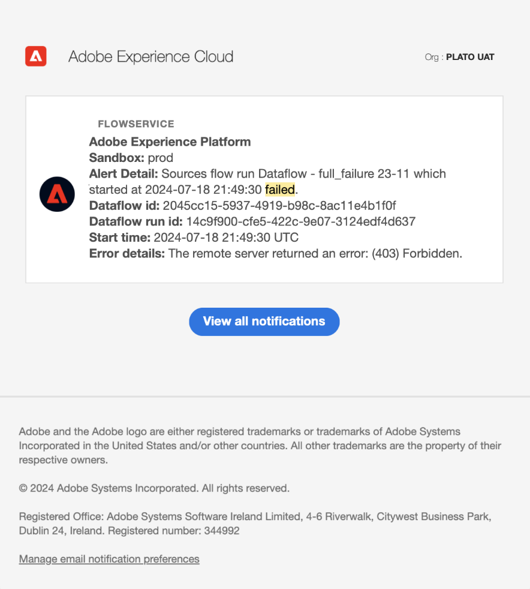

# Användargränssnittshandbok för aviseringar

Med Adobe Experience Platform användargränssnitt kan du visa historik över mottagna aviseringar baserat på mätvärden som visas av Adobe Experience Platform observability Insights. I användargränssnittet kan du även visa, aktivera, inaktivera och prenumerera på tillgängliga varningsregler.

>[!NOTE]
>
>En introduktion till aviseringar i Experience Platform finns i [varningsöversikten](./overview.md).

Om du vill komma igång väljer du **[!UICONTROL Alerts]** i den vänstra navigeringen.

![Varnar sidmarkering [!UICONTROL Alerts] i den vänstra navigeringen.](../images/alerts/ui/workspace.png)

## Hantera varningsregler {#manage-rules}

Fliken **[!UICONTROL Browse]** visar de tillgängliga reglerna som kan utlösa en varning.

![En lista över tillgängliga aviseringar visas på fliken [!UICONTROL Browse].](../images/alerts/ui/rules.png)

Välj en regel i listan om du vill visa dess beskrivning och dess konfigurationsparametrar i den högra listen, inklusive tröskelvärde och allvarlighetsgrad.

Markera ellipsen (**..**) bredvid en regel och i en listruta visas kontroller för att aktivera eller inaktivera aviseringen (beroende på dess aktuella status) och för att prenumerera eller avbryta prenumerationen på e-postmeddelanden för aviseringen.

## Hantera aviseringsprenumeranter {#manage-subscribers}

>[!NOTE]
>
> Om du vill tilldela en avisering till ett Adobe-användar-ID, en extern e-postadress eller en e-postgrupplista måste du vara administratör.

Fliken **[!UICONTROL Browse]** visar de tillgängliga reglerna som kan utlösa en varning.

![En lista över tillgängliga varningsregler visas på fliken [!UICONTROL Browse].](../images/alerts/ui/rules.png)

Markera ellipsen (**...**) bredvid en regels namn, så visas kontroller i en listruta. Välj **[!UICONTROL Manage alert subscribers]**.

![Markera de ellipser som ska visas i listrutan. Alternativet [!UICONTROL Manage alert subscribers] är markerat.](../images/alerts/ui/manage-alert-subscribers.png)

Sidan [!UICONTROL Manage alert subscribers] visas. Om du vill tilldela aviseringar till specifika användare anger du användar-ID, extern e-postadress eller en e-postgrupplista för Adobe och trycker sedan på Retur.

>[!NOTE]
>
>Om du vill skicka det här meddelandet till flera användare samtidigt anger du en lista med användar-ID:n eller e-postadresser avgränsade med kommatecken.

E-postadresserna visas i listan över aktuella prenumeranter. Välj **[!UICONTROL Update]**.

![Sidan Hantera aviseringsprenumeranter med fokus på prenumeranter och [!UICONTROL Update].](../images/alerts/ui/manage-alert-subscribers-added-email.png)

Du har lagt till användare i aviseringslistan. De skickade användarna får nu e-postmeddelanden om den här varningen enligt bilden nedan.

## Aktivera e-postaviseringar {#enable-email}

Varningsmeddelanden kan skickas direkt till ditt e-postmeddelande.

Välj klockikonen () i det övre menyfliksområdet till höger för att visa meddelanden och meddelanden. I listrutan som visas väljer du kodikonen () för att öppna inställningssidan för Experience Cloud.

Sidan **Profil** visas. Välj **[!UICONTROL Notifications]** i den vänstra navigeringen för att komma åt inställningarna för e-postaviseringar.

![Markeringen av profilsidan [!UICONTROL Notifications] i den vänstra navigeringen.](../images/alerts/ui/profile.png)

Bläddra till avsnittet **E-post** längst ned på sidan och välj **[!UICONTROL Instant notifications]**

Alla aviseringar du prenumererar på levereras nu till den e-postadress som är ansluten till ditt Adobe ID-konto.

## Anpassa tröskelvärde för avisering {#alert-threshold}

Varningströskelvärden kan anpassas för följande varningstyper:

| Aviseringstyp | Anpassad parameter |
|---|---|
| Fördröjning för segmentjobb | Fördröjningströskel |
| Fördröjning för segmentexport | Fördröjningströskel |
| Körningsfördröjning för destinationsflöde | Fördröjningströskel |
| Körningsfördröjning för identitetstjänstens flöde | Fördröjningströskel |
| Körningsfördröjning för profilflöde | Fördröjningströskel |
| Körningsfördröjning för källflöde | Fördröjningströskel |
| Frågekörningsfördröjning | Fördröjningströskel |
| Ingen aktiveringshastighet har överskridits | Feltröskel |
| Felfrekvens för källinmatning har överskridits | Feltröskel |

Markera ellipsen (**...**) bredvid en regels namn, så visas kontroller i en listruta. Välj **[!UICONTROL Edit]**.

![Alternativet [!UICONTROL Edit] är markerat för den valda regeln.](../images/alerts/ui/threshold-edit.png)

Sidan **[!UICONTROL Customize alert]** visas. Uppdatera tröskelvärdet till önskade minuter och välj sedan **[!UICONTROL Confirm]**.

![Alternativen Anpassa markering av varningssida [!UICONTROL Threshold] och [!UICONTROL Confirm] .](../images/alerts/ui/threshold-update.png)

Du återgår till sidan **[!UICONTROL Alerts]**. Om du vill visa tröskelvärden för varningen väljer du regeln i listan. Du kan se tröskelinställningarna för varningen i den högra listen, inklusive detaljer som status och allvarlighetsgrad.

![En varning markerad med detaljer i den högra listen och markering [!UICONTROL Threshold].](../images/alerts/ui/threshold-view.png)

## Visa aviseringshistorik {#alert-history}

Fliken **[!UICONTROL History]** visar historiken för mottagna aviseringar för din organisation, inklusive regeln som utlöste aviseringen, utlösande datum och löst datum (om tillämpligt).

![En lista över mottagna aviseringar visas på fliken [!UICONTROL History].](../images/alerts/ui/history.png)

Välj en avisering och mer information visas i den högra listen, inklusive en kort sammanfattning av händelsen som utlöste aviseringen.

## Nästa steg

Det här dokumentet innehåller en översikt över hur du visar och hanterar aviseringar i plattformsgränssnittet. Mer information om tjänstens funktioner finns i översikten om [Insights](../home.md).
