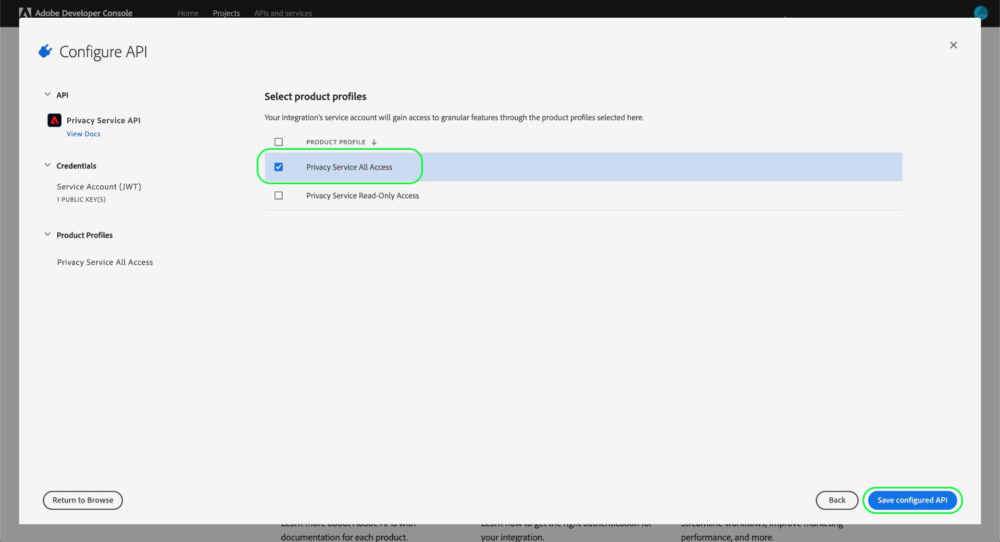

# Autentisera och få tillgång till Privacy Service API

Den här guiden ger en introduktion till de centrala koncept du måste känna till innan du försöker ringa anrop till Adobe Experience Platform Privacy Service API.

## Förhandskrav {#prerequisites}

Den här handboken kräver en fungerande förståelse av [Privacy Service](../home.md) och hur den gör att du kan hantera förfrågningar från dina registrerade (kunder) i olika Adobe Experience Cloud-program.

För att kunna skapa åtkomstautentiseringsuppgifter för API:t måste en administratör i din organisation tidigare ha konfigurerat produktprofiler för Privacy Service i Adobe Admin Console. Den produktprofil som du tilldelar till en API-integrering avgör vilka behörigheter som integreringen har för åtkomst till Privacy Service-funktioner. Mer information finns i handboken om [hantering av Privacy Service-behörigheter](../permissions.md).

## Samla in värden för obligatoriska rubriker {#gather-values-required-headers}

För att kunna ringa anrop till Privacy Service API måste du först samla in dina inloggningsuppgifter och använda dem i obligatoriska rubriker:

* `Authorization: Bearer {ACCESS_TOKEN}`
* `x-api-key: {API_KEY}`
* `x-gw-ims-org-id: {ORG_ID}`

Dessa värden genereras med [Adobe Developer Console](https://developer.adobe.com/console). `{ORG_ID}` och `{API_KEY}` behöver bara genereras en gång och kan återanvändas i framtida API-anrop. Din `{ACCESS_TOKEN}` är temporär och måste genereras om var 24:e timme.

Stegen för att generera dessa värden beskrivs närmare nedan.

### Engångskonfiguration {#one-time-setup}

Gå till [Adobe Developer Console](https://developer.adobe.com/console) och logga in med din Adobe ID. Följ sedan stegen som beskrivs i självstudiekursen om att [skapa ett tomt projekt](https://developer.adobe.com/developer-console/docs/guides/projects/projects-empty/) i Developer Console-dokumentationen.

När du har skapat ett nytt projekt väljer du **[!UICONTROL Add to Project]** och väljer **[!UICONTROL API]** i listrutan.

![Det API-alternativ som väljs i listrutan [!UICONTROL Add to Project] från sidan med projektinformation i Developer Console](../images/api/getting-started/add-api-button.png)

#### Välj Privacy Service API {#select-privacy-service-api}

Skärmen **[!UICONTROL Add an API]** visas. Välj **[!UICONTROL Experience Cloud]** om du vill begränsa listan över tillgängliga API:er och markera sedan kortet för **[!UICONTROL Privacy Service API]** innan du väljer **[!UICONTROL Next]**.

>[!TIP]
>
>Välj alternativet **[!UICONTROL View docs]** om du vill navigera i ett separat webbläsarfönster till den fullständiga [Privacy Service API-referensdokumentationen](https://developer.adobe.com/experience-platform-apis/references/privacy-service/).

Välj sedan autentiseringstypen för att generera åtkomsttoken och få åtkomst till Privacy Service API.

>[!IMPORTANT]
>
>Välj metoden **[!UICONTROL OAuth Server-to-Server]** eftersom det här är den enda metod som stöds för att gå framåt. Metoden **[!UICONTROL Service Account (JWT)]** är föråldrad. Integreringar som använder JWT-autentiseringsmetoden fortsätter att fungera fram till 1 januari 2025, men Adobe rekommenderar starkt att du migrerar befintliga integreringar till den nya OAuth Server-till-Server-metoden före detta datum. Hämta mer information i avsnittet [!BADGE Föråldrat]{type=negative}[Skapa en JSON-webbtoken (JWT)](/help/landing/api-authentication.md#jwt).

#### Tilldela behörigheter via produktprofiler {#product-profiles}

Det sista konfigurationssteget är att välja de produktprofiler som den här integreringen ska ärva sina behörigheter från. Om du väljer mer än en profil kombineras deras behörighetsgrupper för integreringen.

>[!NOTE]
>
Produktprofiler och de detaljerade behörigheter de ger skapas och hanteras av administratörer via Adobe Admin Console. Mer information finns i handboken om [Privacy Service permissions](../permissions.md).

När du är klar väljer du **[!UICONTROL Save configured API]**.

När API:t har lagts till i projektet visar **[!UICONTROL Privacy Service API]**-sidan för projektet följande autentiseringsuppgifter som krävs i alla anrop till Privacy Service API:er:

* `{API_KEY}` ([!UICONTROL Client ID])
* `{ORG_ID}` ([!UICONTROL Organization ID])

### Autentisering för varje session {#authentication-each-session}

Den sista obligatoriska autentiseringen som du måste samla in är din `{ACCESS_TOKEN}`, som används i auktoriseringshuvudet. Till skillnad från värdena för `{API_KEY}` och `{ORG_ID}` måste en ny token genereras var 24:e timme för att du ska kunna fortsätta använda API:t.

I allmänhet finns det två metoder för att generera en åtkomsttoken:

* [Generera token manuellt](#manual-token) för testning och utveckling.
* [Automatisera tokengenerering](#auto-token) för API-integreringar.

#### Generera en token manuellt {#manual-token}

Om du vill generera en ny `{ACCESS_TOKEN}` manuellt går du till **[!UICONTROL Credentials]** > **[!UICONTROL OAuth Server-to-Server]** och väljer **[!UICONTROL Generate access token]** enligt nedan.

En ny åtkomsttoken genereras och en knapp för att kopiera token till Urklipp tillhandahålls. Det här värdet används för det obligatoriska [!DNL Authorization]-huvudet och måste anges i formatet `Bearer {ACCESS_TOKEN}`.

#### Automatisera generering av token {#auto-token}

Du kan också använda en Postman-miljö och en samling för att generera åtkomsttoken. Mer information finns i avsnittet om att [använda Postman för att autentisera och testa API-anrop](/help/landing/api-authentication.md#use-postman) i autentiseringsguiden för Experience Platform API.

## Läser exempel-API-anrop {#read-sample-api-calls}

Varje slutpunktshandbok innehåller exempel på API-anrop som visar hur du formaterar dina begäranden. Det kan vara sökvägar, obligatoriska rubriker och korrekt formaterade begärandenyttolaster. Ett exempel på JSON som returneras i API-svar finns också. Information om konventioner som används i dokumentationen för exempel-API-anrop finns i avsnittet [Så här läser du exempel-API-anrop](../../landing/api-guide.md#sample-api) i Komma igång-guiden för Experience Platform API:er.

## Nästa steg {#next-steps}

Nu när du förstår vilka rubriker du ska använda kan du börja ringa anrop till Privacy Service API. Välj någon av slutpunktsguiderna för att komma igång:

* [Sekretessjobb](./privacy-jobs.md)
* [Godkännande](./consent.md)
