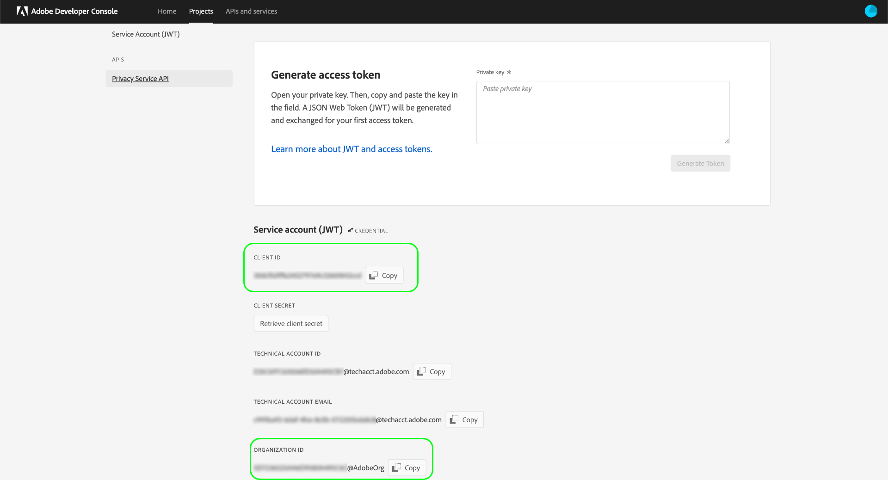

# [!DNL Privacy Service] API-guide

Adobe Experience Platform [!DNL Privacy Service] har ett RESTful API och användargränssnitt som gör att du kan hantera (komma åt och ta bort) personuppgifter för dina registrerade (kunder) i alla Adobe Experience Cloud-program. [!DNL Privacy Service] har också en central mekanism för granskning och loggning som gör att du kan komma åt status och resultat för jobb som innefattar  [!DNL Experience Cloud] program.

Den här guiden beskriver hur du använder API:t [!DNL Privacy Service]. Mer information om hur du använder användargränssnittet finns i översikten [Privacy Servicens användargränssnitt](../ui/overview.md). En fullständig lista över alla tillgängliga slutpunkter i [!DNL Privacy Service] API finns i [API-referensen](https://www.adobe.io/apis/experienceplatform/home/api-reference.html#!acpdr/swagger-specs/privacy-service.yaml).

## Komma igång {#getting-started}

Handboken kräver en fungerande förståelse för följande [!DNL Experience Platform]-funktioner:

* [[!DNL Privacy Service]](../home.md): Tillhandahåller ett RESTful-API och användargränssnitt som gör att du kan hantera förfrågningar från registrerade (kunder) i olika Adobe Experience Cloud-program.

I följande avsnitt finns ytterligare information som du behöver känna till för att kunna anropa Privacy Service-API:t.

### Läser exempel-API-anrop

I den här självstudiekursen finns exempel-API-anrop som visar hur du formaterar dina begäranden. Det kan vara sökvägar, obligatoriska rubriker och korrekt formaterade begärandenyttolaster. Ett exempel på JSON som returneras i API-svar finns också. Information om de konventioner som används i dokumentationen för exempel-API-anrop finns i avsnittet [hur du läser exempel-API-anrop](../../landing/troubleshooting.md) i felsökningsguiden för [!DNL Experience Platform].

## Samla in värden för obligatoriska rubriker

För att kunna anropa API:t [!DNL Privacy Service] måste du först samla in dina autentiseringsuppgifter för att kunna användas i obligatoriska rubriker:

* Behörighet: Bearer `{ACCESS_TOKEN}`
* x-api-key: `{API_KEY}`
* x-gw-ims-org-id: `{IMS_ORG}`

Detta innebär att du måste skaffa utvecklarbehörigheter för [!DNL Experience Platform] i Adobe Admin Console och sedan generera autentiseringsuppgifterna i Adobe Developer Console.

### Få utvecklaråtkomst till [!DNL Experience Platform]

Följ de inledande stegen i [självstudiekursen för autentisering av Experience Platform](https://www.adobe.com/go/platform-api-authentication-en) för att få utvecklaråtkomst till [!DNL Platform]. När du kommer till steget&quot;Generera autentiseringsuppgifter för åtkomst i Adobe Developer Console&quot; går du tillbaka till den här självstudiekursen för att generera autentiseringsuppgifter som är specifika för [!DNL Privacy Service].

### Generera autentiseringsuppgifter för åtkomst

Med Adobe Developer Console måste du generera följande tre autentiseringsuppgifter:

* `{IMS_ORG}`
* `{API_KEY}`
* `{ACCESS_TOKEN}`

Dina `{IMS_ORG}` och `{API_KEY}` behöver bara genereras en gång och kan återanvändas i framtida API-anrop. Din `{ACCESS_TOKEN}` är temporär och måste genereras om var 24:e timme.

Stegen för att generera dessa värden beskrivs närmare nedan.

#### Engångskonfiguration

Gå till [Adobe Developer Console](https://www.adobe.com/go/devs_console_ui) och logga in med din Adobe ID. Följ sedan stegen som beskrivs i självstudiekursen om att [skapa ett tomt projekt](https://www.adobe.io/apis/experienceplatform/console/docs.html#!AdobeDocs/adobeio-console/master/projects-empty.md) i dokumentationen för Adobe Developer Console.

När du har skapat ett nytt projekt väljer du **[!UICONTROL Add API]** på skärmen **[!UICONTROL Project Overview]**.

Skärmen **[!UICONTROL Add an API]** visas. Välj **[!UICONTROL Privacy Service API]** i listan med tillgängliga API:er innan du väljer **[!UICONTROL Next]**.

Skärmen **[!UICONTROL Configure API]** visas. Välj alternativet **[!UICONTROL Generate a key pair]** och välj sedan **[!UICONTROL Generate keypair]** i det nedre högra hörnet.

Nyckelparet genereras automatiskt och en ZIP-fil som innehåller en privat nyckel och ett offentligt certifikat hämtas till din lokala dator (som kan användas i ett senare steg). Välj **[!UICONTROL Save configured API]** för att slutföra konfigurationen.

När API:t har lagts till i projektet visas projektsidan igen på sidan **Privacy Service-API översikt**. Här rullar du ned till avsnittet **[!UICONTROL Service Account (JWT)]**, som innehåller följande åtkomstautentiseringsuppgifter som krävs i alla anrop till API:t [!DNL Privacy Service]:

* **[!UICONTROL CLIENT ID]**: Klient-ID är det som krävs  `{API_KEY}` för det måste anges i huvudet med x-api-key.
* **[!UICONTROL ORGANIZATION ID]**: Organisations-ID är det  `{IMS_ORG}` värde som måste användas i rubriken x-gw-ims-org-id.

#### Autentisering för varje session

Den sista obligatoriska autentiseringen som du måste samla in är din `{ACCESS_TOKEN}`, som används i auktoriseringshuvudet. Till skillnad från värdena för `{API_KEY}` och `{IMS_ORG}` måste en ny token genereras var 24:e timme för att du ska kunna fortsätta använda [!DNL Platform] API:er.

Om du vill skapa en ny `{ACCESS_TOKEN}`-nyckel öppnar du den tidigare hämtade privata nyckeln och klistrar in innehållet i textrutan bredvid **[!UICONTROL Generate access token]** innan du väljer **[!UICONTROL Generate Token]**.

En ny åtkomsttoken genereras och en knapp för att kopiera token till Urklipp tillhandahålls. Det här värdet används för det obligatoriska auktoriseringshuvudet och måste anges i formatet `Bearer {ACCESS_TOKEN}`.

## Nästa steg

Nu när du förstår vilka rubriker som ska användas kan du börja ringa anrop till API:t [!DNL Privacy Service]. Dokumentet på [sekretessjobb](privacy-jobs.md) går igenom de olika API-anrop du kan göra med API:t [!DNL Privacy Service]. Varje exempelanrop innehåller det allmänna API-formatet, en exempelbegäran med obligatoriska rubriker och ett exempelsvar.
