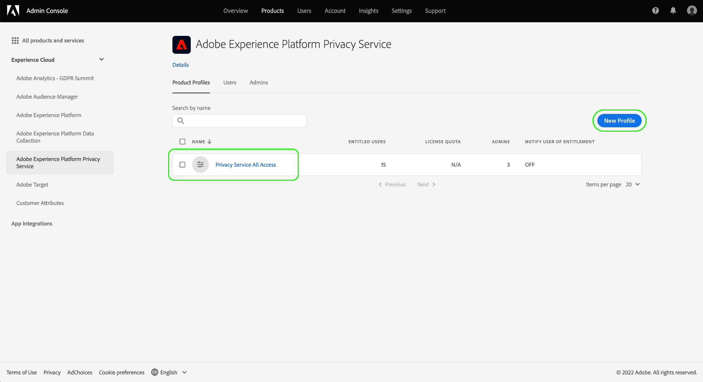
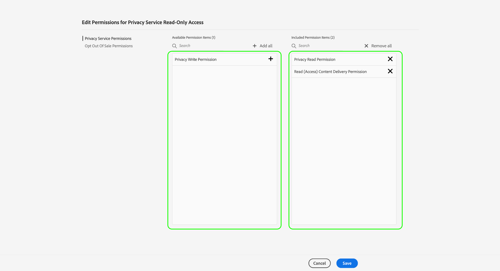

# Hantera behörigheter för Privacy Service

>[!IMPORTANT]
>
>Behörigheterna för Adobe Experience Platform Privacy Service har förbättrats för att öka deras granularitet. Med dessa ändringar kan organisationsadministratörer ge fler användare åtkomst med önskad roll och behörighetsnivå. Användare av tekniska konton måste uppdatera sina behörigheter för Privacy Service eftersom den här kommande uppdateringen utgör en viktig förändring för dem. Den här behörighetsändringen verkställs på **28 mars 2023**.
>
>Tekniska konton är tillgängliga för företagskunder och skapas via Adobe Developers Console. En teknisk kontoinnehavares Adobe ID avslutas med `@techacct.adobe.com`. Om du är osäker på om du har ett tekniskt konto kontaktar du din organisations administratör.

Åtkomst till [Adobe Experience Platform Privacy Service](./home.md) styrs av rollbaserade behörigheter i Adobe Admin Console. Genom att skapa produktprofiler som tilldelar behörigheter till användargrupper kan du bestämma vem som har åtkomst till vilka funktioner i Privacy Servicen [UI](./ui/overview.md) och [API](./api/overview.md).

>[!NOTE]
>
>När du skapar en integrering för Privacy Service-API måste du välja en befintlig produktprofil för att kunna avgöra vilka funktioner eller åtgärder som integreringen har behörighet för. Se guiden [komma igång med Privacy Services-API](./api/getting-started.md) för mer information.

I den här handboken visas hur du hanterar behörigheter för Privacy Service.

## Komma igång

För att kunna konfigurera åtkomstkontroll för Privacy Service måste du ha administratörsbehörighet för en organisation som har en produktintegrering med Adobe Experience Platform Privacy Service. Minimirollen som kan bevilja eller återkalla behörigheter är en **produktprofiladministratör**. Andra administratörsroller som kan hantera behörigheter är **produktadministratörer** (kan hantera alla profiler i en produkt) och **systemadministratörer** (inga begränsningar). Läs artikeln om [administrativa roller](https://helpx.adobe.com/enterprise/using/admin-roles.html) i administrationshandboken för Adobe Enterprise om du vill ha mer information.

I den här handboken förutsätts det att du är bekant med grundläggande produktkoncept som produktprofiler och hur du tilldelar produktbehörigheter till enskilda användare och grupper. Mer information finns i [Användarhandbok för Admin Console](https://helpx.adobe.com/se/enterprise/using/admin-console.html).

## Tillgängliga behörigheter

I följande tabell visas de tillgängliga behörigheterna för Privacy Service med beskrivningar av de specifika funktioner som de ger åtkomst till:

| Kategori | Behörighet | Beskrivning |
| --- | --- | --- |
| [!UICONTROL Privacy Service Permissions] | [!UICONTROL Privacy Read Permission] | Avgör om användaren kan visa befintliga begäranden om åtkomst och borttagning, tillsammans med information om dem. |
| [!UICONTROL Privacy Service Permissions] | [!UICONTROL Privacy Write Permission] | Avgör om en användare kan skapa nya begäranden om åtkomst och borttagning. |
| [!UICONTROL Privacy Service Permissions] | [!UICONTROL Read (Access) Content Delivery Permission] | När en åtkomstbegäran bearbetas som Privacy Service skickas en ZIP-fil med kundens data till den kunden. När du tittar upp information om en åtkomstbegäran avgör den här behörigheten om användaren kan komma åt nedladdningslänken för förfrågningens ZIP-fil. |
| [!UICONTROL Opt Out of Sale Permissions] | [!UICONTROL Read Permission - Opt Out of Sale] | Avgör om användaren kan visa befintliga begäranden om avanmälan och deras information. |
| [!UICONTROL Opt Out of Sale Permissions] | [!UICONTROL Write Permission - Opt Out of Sale] | Avgör om en användare kan skapa nya begäranden om avanmälan från försäljning. |

{style="table-layout:auto"}

## Hantera behörigheter {#manage}

Om du vill hantera behörigheter för Privacy Service loggar du in på [Admin Console](https://adminconsole.adobe.com/) och markera **[!UICONTROL Products]** i den övre navigeringen. Här väljer du **[!UICONTROL Adobe Experience Platform Privacy Service]**.

### Välj eller skapa en produktprofil

På nästa skärm visas en lista med tillgängliga produktprofiler för Privacy Service i din organisation. Om det inte finns några produktprofiler väljer du **[!UICONTROL New Profile]** för att skapa en. Om du har flera roller eller användargrupper i organisationen som kräver olika åtkomstnivåer bör du skapa en separat produktprofil för var och en av dem.

När du har valt en produktprofil kan du använda **[!UICONTROL Permissions]** flik att starta [redigera behörigheter](#edit-permissions) för profilen eller välj **[!UICONTROL Users]** flik att starta [tilldela användare](#assign-users) till profilen.

### Redigera behörigheter för profilen {#edit-permissions}

På **[!UICONTROL Permissions]** väljer du någon av de behörighetskategorier som visas för att komma åt behörighetens redigeringsvy.

När du redigerar behörigheter för en profil visas tillgängliga behörigheter i den vänstra kolumnen medan de som ingår i profilen visas i den högra kolumnen. Välj de angivna behörigheterna för att flytta dem mellan någon av kolumnerna.

Behörigheter är ordnade i kategorier. Om du vill växla mellan kategorier väljer du önskad kategori i den vänstra navigeringen.

![Bilden visar [!UICONTROL Opt Out of Sale] sektion under behörigheter](./images/permissions/switch-category.png)

Välj **[!UICONTROL Save]** när du är klar med konfigurationen av behörigheter.

Produktprofilvyn visas igen med de tillagda behörigheterna.

### Tilldela användare till profilen {#assign-users}

Om du vill tilldela användare till produktprofilen (och ge dem profilens konfigurerade behörigheter) väljer du **[!UICONTROL Users]** tabbtecken, följt av **[!UICONTROL Add user]**.

Mer information om hur du hanterar användare för en produktprofil finns i [Admin Console dokumentation](https://helpx.adobe.com/enterprise/using/manage-product-profiles.html).

### Migrera tidigare API-autentiseringsuppgifter till profilen {#migrate-tech-accounts}

>[!NOTE]
>
>Det här avsnittet gäller endast befintliga API-autentiseringsuppgifter som skapades innan Privacy Servicens behörigheter integrerades i Adobe Admin Console. För nya autentiseringsuppgifter tilldelas produktprofiler (och deras behörigheter) via [Adobe Developer Console-projekt](https://developer.adobe.com/developer-console/docs/guides/projects/) i stället.  Se avsnittet om [tilldela produktprofiler till ett projekt](./api/getting-started.md#product-profiles) i guiden Komma igång för Privacy Service-API för mer information.

Om du vill migrera äldre API-autentiseringsuppgifter till produktprofilen väljer du **[!UICONTROL API Credentials]**, följt av **[!UICONTROL Add API Credentials]**.

![[!UICONTROL Add API Credentials] markeras i Admin Console, under [!UICONTROL API Credentials] flik för en produktprofil](./images/permissions/api-credentials.png)

Välj önskade Developer Console-projekt i listan och välj sedan **[!UICONTROL Save]** för att lägga till dem i produktprofilen. Alla API-anrop som använder autentiseringsuppgifterna från dessa projekt ärver de detaljerade behörigheter som produktprofilen ger.

## Nästa steg

I den här guiden beskrivs de tillgängliga behörigheterna för Privacy Service och hur du hanterar dem via Admin Console.

Anvisningar om hur du skapar en ny API-integrering när du har konfigurerat produktprofiler finns i [komma igång-guide för Privacy Services-API](./api/getting-started.md). Mer information om hur du hanterar behörigheter för andra Adobe Experience Platform-funktioner finns i [dokumentation om åtkomstkontroll](../access-control/home.md).
