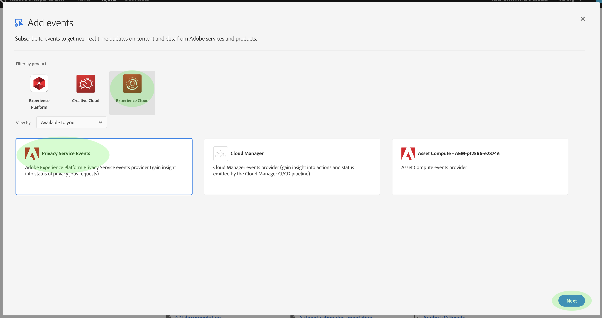
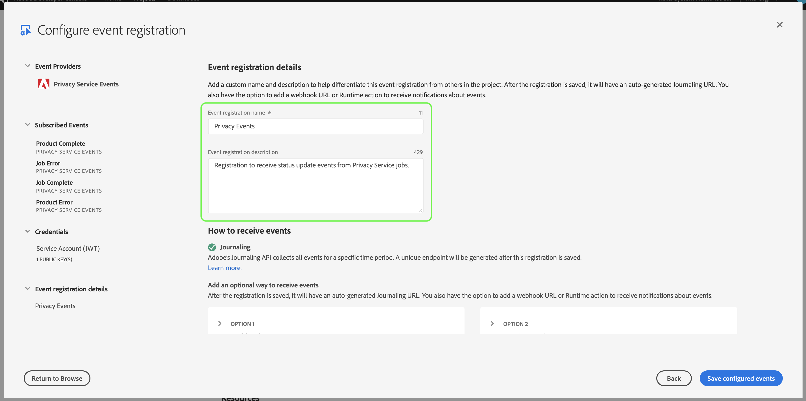
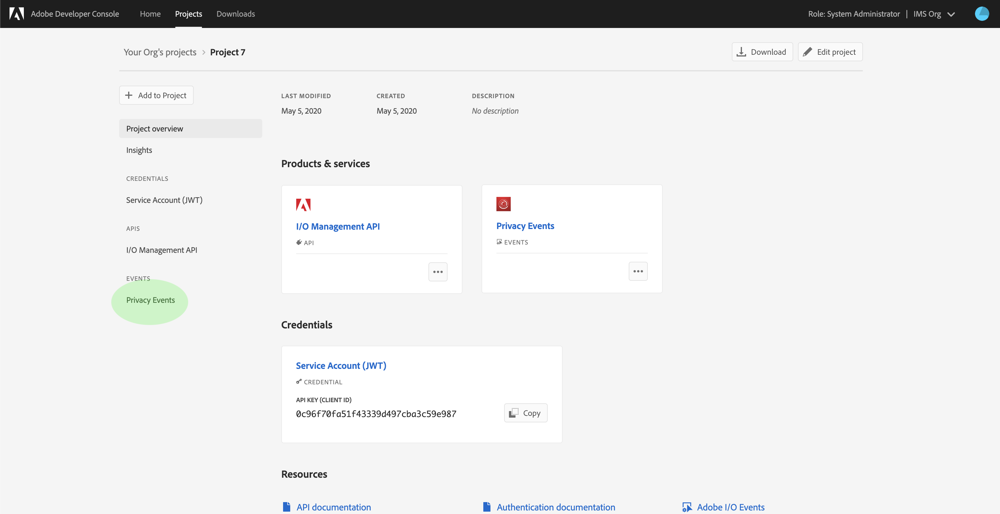
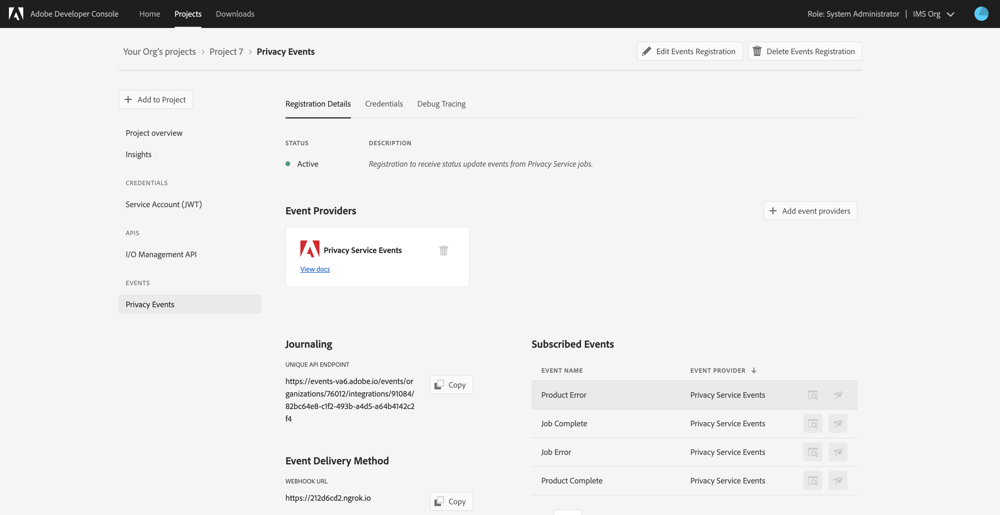

# Prenumerera på [!DNL Privacy Events]

[!DNL Privacy Events] är meddelanden från Adobe Experience Platform [!DNL Privacy Service]som utnyttjar Adobe I/O-händelser som skickas till en konfigurerad webkrok för att underlätta automatisering av jobbförfrågningar. De minskar eller eliminerar behovet av att avfråga [!DNL Privacy Service] API för att kontrollera om ett jobb är färdigt eller om en viss milstolpe i ett arbetsflöde har nåtts.

Det finns för närvarande fyra typer av meddelanden som rör livscykeln för sekretessjobben:

| Typ | Beskrivning |
--- | ---
| Jobbet har slutförts | Alla [!DNL Experience Cloud] lösningar har rapporterats tillbaka och jobbens övergripande eller globala status har markerats som slutförd. |
| Jobbfel | En eller flera lösningar rapporterade ett fel när begäran bearbetades. |
| Produkten är klar | En av lösningarna som är kopplad till det här jobbet har slutfört sitt arbete. |
| Produktfel | En av lösningarna rapporterade ett fel när begäran bearbetades. |

Det här dokumentet innehåller steg för hur du konfigurerar en integrering för [!DNL Privacy Service] meddelanden i Adobe I/O. En översikt över [!DNL Privacy Service] och dess funktioner på hög nivå finns i översikten över [Privacy Servicen](home.md).

## Komma igång

I den här självstudiekursen används **ngrok**, en programvaruprodukt som exponerar lokala servrar för det offentliga internet via säkra tunnlar. Installera [blocket](https://ngrok.com/download) innan du startar den här självstudiekursen för att följa med och skapa en webkrok till din lokala dator. Den här guiden kräver även att du har en hämtad GIT-databas som innehåller en enkel [Node.js](https://nodejs.org/) -server.

## Skapa en lokal server

Din Node.js-server måste returnera en `challenge` parameter som skickas från en begäran till rotslutpunkten (`/`). Skapa din `index.js` fil med följande JavaScript för att uppnå detta:

```js
var express = require('express')
var app = express()

app.set('port', (process.env.PORT || 3000))
app.use(express.static(__dirname + '/public'))

app.get('/', function(request, response) {
  response.send(request.originalUrl.split('?challenge=')[1]);
})

app.listen(app.get('port'), function() {
  console.log("Node app is running at localhost:" + app.get('port'))
})
```

Navigera med kommandoraden till rotkatalogen på din Node.js-server. Skriv sedan följande kommandon:

1. `npm install`
1. `npm start`

Dessa kommandon installerar alla beroenden och initierar servern. Om du lyckas hittar du servern på http://localhost:3000/.

## Skapa en webkrok med ngrok

Öppna ett nytt kommandoradsfönster och navigera till den katalog där du tidigare installerade blocket. Här skriver du följande kommando:

```shell
./ngrok http -bind-tls=true 3000
```

Ett lyckat resultat ser ut ungefär så här:


Anteckna `Forwarding` URL (`https://212d6cd2.ngrok.io`), eftersom den används för att identifiera din webbkrok i nästa steg.

## Skapa ett nytt projekt i Adobe Developer Console

Gå till [Adobe Developer Console](https://www.adobe.com/go/devs_console_ui) och logga in med din Adobe ID. Följ sedan stegen som beskrivs i självstudiekursen om hur du [skapar ett tomt projekt](https://www.adobe.io/apis/experienceplatform/console/docs.html#!AdobeDocs/adobeio-console/master/projects-empty.md) i dokumentationen för Adobe Developer Console.

## Lägg till sekretessaktiviteter i projektet

När du är klar med att skapa ett nytt projekt i konsolen klickar du **[!UICONTROL Add event]** på skärmen _Projektöversikt_ .


Dialogrutan _Lägg till händelser_ visas. Välj **[!UICONTROL Experience Cloud]** om du vill filtrera listan över tillgängliga händelsetyper och markera sedan **[!UICONTROL Privacy Service Events]** innan du klickar **[!UICONTROL Next]**.



Dialogrutan _Konfigurera händelseregistrering_ visas. Välj vilka händelser du vill ta emot genom att markera motsvarande kryssrutor. Händelser som du väljer visas under **[!UICONTROL Subscribed Events]** i den vänstra kolumnen. Klicka på **[!UICONTROL Next]** när du är klar.


På nästa skärm får du en uppmaning om att ange en offentlig nyckel för händelseregistreringen. Du kan generera ett nyckelpar automatiskt eller överföra en egen offentlig nyckel som genererats i terminalen.

I den här självstudiekursen används det första alternativet. Klicka på alternativrutan för **[!UICONTROL Generate a key pair]** och sedan på **[!UICONTROL Generate keypair]** knappen i det nedre högra hörnet.


När nyckelparet genereras hämtas det automatiskt av webbläsaren. Du måste lagra den här filen själv eftersom den inte sparas i Developer Console.

På nästa skärm kan du granska informationen om det nya nyckelparet. Klicka **[!UICONTROL Next]** för att fortsätta.


Ange ett namn och en beskrivning för händelseregistreringen på nästa skärm. Det bästa sättet är att skapa ett unikt, enkelt identifierbart namn som hjälper till att skilja den här evenemangsregistreringen från andra i samma projekt.



Du kan konfigurera hur du tar emot händelser ytterligare på samma skärm. Markera **[!UICONTROL Webhook]** och ange `Forwarding` URL:en för den webbkrok som du skapade tidigare under **[!UICONTROL Webhook URL]**. Välj sedan önskad leveransstil (en eller flera) innan du klickar på **[!UICONTROL Save configured events]** för att slutföra registreringen av evenemanget.


Informationssidan för ditt projekt visas igen och [!DNL Privacy Events] visas under **[!UICONTROL Events]** den vänstra navigeringen.

## Visa händelsedata

När du har registrerat dig [!DNL Privacy Events] i ditt projekt och sekretessjobben har bearbetats kan du visa alla mottagna meddelanden för den registreringen. På fliken **[!UICONTROL Projects]** i Developer Console väljer du ditt projekt i listan för att öppna sidan _Produktöversikt_ . Välj **[!UICONTROL Privacy Events]** från den vänstra navigeringen.



Fliken _Registreringsinformation_ visas, där du kan visa mer information om registreringen, redigera konfigurationen eller visa de faktiska händelser som tagits emot sedan du aktiverade webkroken.



Klicka på **[!UICONTROL Debug Tracing]** fliken för att visa en lista över mottagna händelser. Klicka på en händelse i listan för att visa information om den.


Avsnittet innehåller information om den valda händelsen, inklusive dess händelsetyp ( **[!UICONTROL Payload]**`com.adobe.platform.gdpr.productcomplete`) som markeras i exemplet ovan.

## Nästa steg

Du kan upprepa stegen ovan för att lägga till nya integreringar för olika webkrofadresser efter behov.