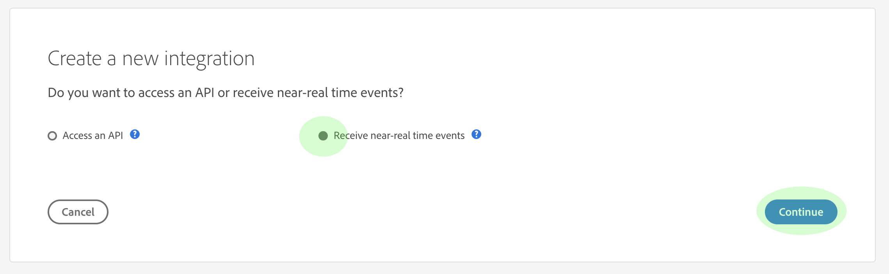
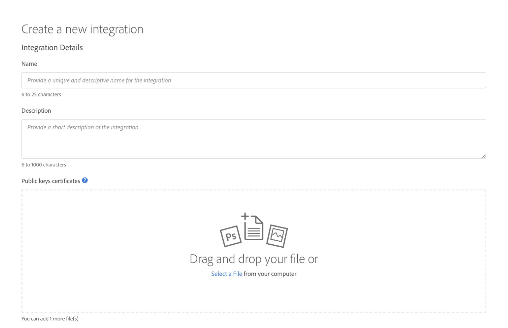
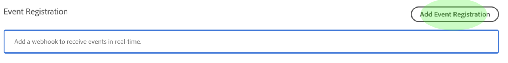

# Prenumerera på sekretesshändelser

Integritetshändelser är meddelanden från Adobe Experience Platform Privacy Service, som utnyttjar Adobe I/O-händelser som skickas till en konfigurerad webkrok för att underlätta effektiv automatisering av jobbförfrågningar. De minskar eller eliminerar behovet av att avfråga API:t för sekretesstjänsten för att kontrollera om ett jobb är färdigt eller om en viss milstolpe i ett arbetsflöde har nåtts.

Det finns för närvarande fyra typer av meddelanden som rör livscykeln för sekretessjobben:

| Typ | Beskrivning |
--- | ---
| Jobbet har slutförts | Alla Experience Cloud-lösningar har rapporterat tillbaka och den övergripande eller globala statusen för jobbet har markerats som fullständig. |
| Jobbfel | En eller flera lösningar rapporterade ett fel när begäran bearbetades. |
| Produkten är klar | En av lösningarna som är kopplad till det här jobbet har slutfört sitt arbete. |
| Produktfel | En av lösningarna rapporterade ett fel när begäran bearbetades. |

Det här dokumentet innehåller steg för hur du konfigurerar en integrering för meddelanden om sekretesstjänster i Adobe I/O. En översikt över sekretesstjänsten och dess funktioner på hög nivå finns i översikten över [sekretesstjänsten](home.md).

## Komma igång

I den här självstudiekursen används **ngrok**, en programvaruprodukt som exponerar lokala servrar för det offentliga internet via säkra tunnlar. Installera [blocket](https://ngrok.com/download) innan du startar den här självstudiekursen för att följa med och skapa en webkrok till din lokala dator. Den här guiden kräver även att du har en hämtad GIT-databas som innehåller en enkel server skriven i [Node.js](https://nodejs.org/).

## Skapa en lokal server

Din Node.js-server måste returnera en `challenge` parameter som skickas från en begäran till rotslutpunkten (`/`). Skapa din `index.js` fil med följande JavaScript för att uppnå detta:

```js
var express = require('express')
var app = express()

app.set('port', (process.env.PORT || 3000))
app.use(express.static(__dirname + '/public'))

app.get('/', function(request, response) {
  response.send(request.originalUrl.split('?challenge=')[1]);
})

app.listen(app.get('port'), function() {
  console.log("Node app is running at localhost:" + app.get('port'))
})
```

Navigera med kommandoraden till rotkatalogen på din Node.js-server. Skriv sedan följande kommandon:

1. `npm install`
1. `npm start`

Dessa kommandon installerar alla beroenden och initierar servern. Om du lyckas hittar du servern på http://localhost:3000/.

## Skapa en webkrok med ngrok

I samma katalog och i ett nytt kommandoradsfönster skriver du följande kommando:

```shell
ngrok http -bind-tls=true 3000
```

Ett lyckat resultat ser ut ungefär så här:


Anteckna `Forwarding` URL (`https://e142b577.ngrok.io`), eftersom den används för att identifiera din webbkrok i nästa steg.

## Skapa en ny integrering med Adobe I/O Console

Logga in på [Adobe I/O Console](https://console.adobe.io) och klicka på fliken **Integreringar** . Fönstret _Integrationer_ visas. Klicka på **Ny integrering** härifrån.


Fönstret *Skapa en ny integration* visas. Välj **Ta emot händelser** i realtid och klicka sedan på **Fortsätt**.



Nästa skärm innehåller alternativ för att skapa integreringar med olika händelser, produkter och tjänster som är tillgängliga för din organisation baserat på dina prenumerationer, berättiganden och behörigheter. För den här integreringen väljer du **Sekretessrelaterade händelser** och klickar sedan på **Fortsätt**.


Formuläret *Integreringsinformation* visas, där du måste ange ett namn och en beskrivning för integreringen samt ett certifikat för offentlig nyckel.



Om du inte har något offentligt certifikat kan du skapa ett med följande terminalkommando:

```shell
openssl req -x509 -sha256 -nodes -days 365 -newkey rsa:2048 -keyout private.key -out certificate_pub
```

När du har skapat ett certifikat drar och släpper du filen i rutan **Publika nycklar för certifikat** , eller klickar på **Välj en fil** för att bläddra i filkatalogen och välja certifikatet direkt.

När du har lagt till ditt certifikat visas alternativet *Händelseregistrering* . Klicka på **Lägg till händelseregistrering**.



Dialogrutan utökas och visar ytterligare kontroller. Här kan du välja önskad händelsetyp och registrera din webkrok. Ange ett namn för händelseregistreringen, webkroks-URL:en (den `Forwarding` adress som returnerades när du [skapade webkroken](#create-a-webhook-using-ngrok)) samt en kort beskrivning. Slutligen väljer du de händelsetyper som du vill prenumerera på och klickar sedan på **Spara**.


När formuläret för händelseregistrering är ifyllt klickar du på **Skapa integrering** så slutförs I/O-integreringen.


## Visa händelsedata

När du har skapat dina I/O-integrerings- och sekretessjobb har bearbetats kan du visa alla mottagna meddelanden för den integreringen. Gå till **integreringen på fliken Integrationer** i I/O-konsolen och klicka på **Visa**.


Informationssidan för integreringen visas. Klicka på **Händelser** för att visa händelseregistreringar för integreringen. Leta reda på registreringen av sekretesshändelser och klicka på **Visa**.


Fönstret *Händelseinformation* visas så att du kan visa mer information om registreringen, redigera dess konfiguration eller visa de faktiska händelser som tagits emot sedan du aktiverade din webkrok. Du kan visa händelseinformation och navigera till alternativet **Felsökningsspårning** .


Avsnittet **Nyttolast** innehåller information om den valda händelsen, inklusive dess händelsetyp (`"com.adobe.platform.gdpr.productcomplete"`) som markeras i exemplet ovan.

## Nästa steg

Du kan upprepa stegen ovan för att lägga till nya integreringar för olika webkrofadresser efter behov.