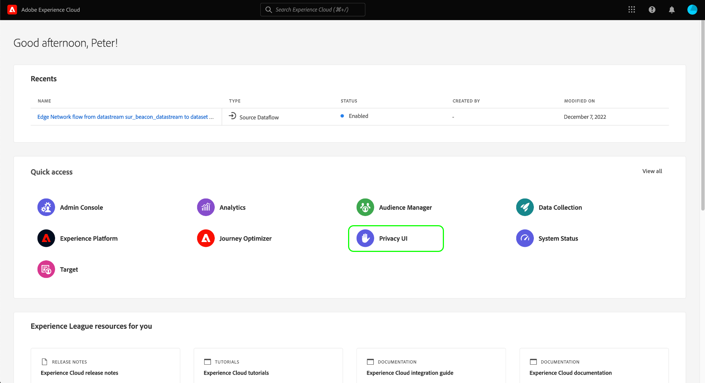

# [!DNL Privacy Service] Översikt över användargränssnittet

Adobe Experience Platform [!DNL Privacy Service] tillhandahåller ett RESTful API och användargränssnitt som gör att ni kan samordna förfrågningar om sekretess och regelefterlevnad i olika lösningar. Det här dokumentet utforskar [!DNL Privacy Service] användargränssnittet. Information om hur du använder API finns i [Privacy Servicens utvecklarhandbok](../api/getting-started.md).

## Logga in i [!DNL Privacy Service] användargränssnittet

Du måste ha en Adobe ID för att kunna autentisera med [!DNL Privacy Service] användargränssnittet. Dessutom måste du ha behörighet som systemadministratör i den organisation som din Adobe ID är kopplad till.

Gå till inloggningssidan för Adobe Experience Cloud på https://experience.adobe.com. Klicka **[!UICONTROL Sign In with an Adobe ID]** och ange dina Adobe ID-uppgifter när du uppmanas till det.

När du är inloggad klickar du på **[!UICONTROL Privacy UI]**.

### Logga in från [!DNL Experience Platform]

Om du har tillgång till användargränssnittet i Adobe Experience Platform kan du även komma åt [!DNL Privacy Service] användargränssnittet via **[!UICONTROL Requests]** fliken till vänster.

## Nästa steg

Nu när du har loggat in kan du läsa [användarhandboken](user-guide.md) för steg om hur du utför olika åtgärder med [!DNL Privacy Service] användargränssnittet.