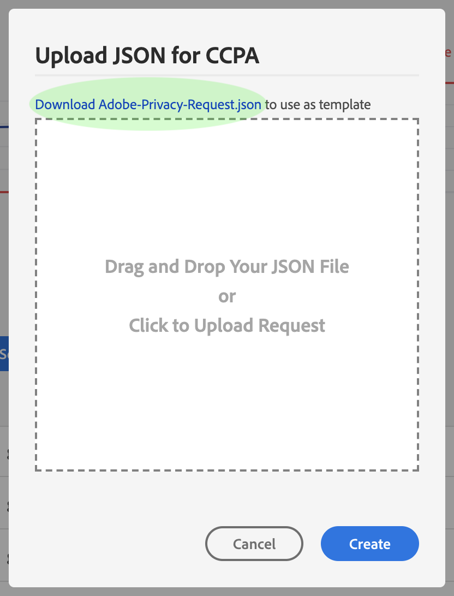

# Hantera sekretessjobb i Privacy Servicens användargränssnitt {#user-guide}

>[!CONTEXTUALHELP]
>id="platform_privacyConsole_requests_description"
>title="Följa förfrågningar om integritetsskydd för registrerade"
>abstract="<h2>Beskrivning</h2>
Med Adobe Experience Platform Privacy Service kan ni skapa och hantera sekretessförfrågningar för kunder som vill få tillgång till eller ta bort sina personuppgifter i enlighet med juridiska sekretessbestämmelser.
"

Det här dokumentet innehåller steg för att skapa och hantera sekretessförfrågningar med [!DNL Privacy Service] användargränssnitt.

>[!IMPORTANT]
>
>Privacy Service är endast avsedd för den registrerade och för förfrågningar om konsumenträttigheter. All annan användning av Privacy Service för datarensning eller underhåll stöds inte eller tillåts inte. Adobe har en rättslig skyldighet att uppfylla dem i tid. Därför är lasttestning inte tillåtet på Privacy Service eftersom det är en produktionsmiljö och skapar en onödig eftersläpning av giltiga sekretessbegäranden.
>
>Det finns nu en hög överföringsgräns per dag för att förhindra missbruk av tjänsten. Användare som råkar missbruka systemet kommer att ha åtkomst till tjänsten inaktiverad. Därefter kommer ett möte att hållas med dem för att diskutera deras åtgärder och hur Privacy Servicen kan användas.

## Sök i [!DNL Privacy Service] Kontrollpanel för användargränssnitt

Kontrollpanelen för [!DNL Privacy Service] Gränssnittet innehåller två widgetar som gör att du kan visa status för dina sekretessjobb: &quot;[!UICONTROL Status Report]och &quot;[!UICONTROL Job Requests]&quot;. Kontrollpanelen visar även den aktuella valda regeln för de visade jobben.

### Regeltyp

[!DNL Privacy Service] stöder jobbförfrågningar för flera sekretessregler. I följande tabell visas vilka regler som stöds och deras motsvarande etikett som representeras i användargränssnittet:

| Gränssnittsetikett | Förordning |
| --- | --- |
| [!UICONTROL APA_AUS] | The [!DNL Australia Privacy Act (Privacy Act)] |
| [!UICONTROL CPA] | The [!DNL Colorado Privacy Act] |
| [!UICONTROL CCPA] | The [!DNL California Consumer Privacy Act] |
| [!UICONTROL CPRA_USA] | The [!DNL California Consumer Privacy Rights Act (CPRA)] |
| [!UICONTROL CTDPA] | The [!DNL Connecticut Data Privacy Act] |
| [!UICONTROL GDPR] | Europeiska unionens [!DNL General Data Protection Regulation] |
| [!UICONTROL HIPAA_AUS] | The [!DNL Health Insurance Portability and Accountability Act] |
| [!UICONTROL LGPD_BRA] | Brasilien [!DNL Lei Geral de Proteção de Dados] |
| [!UICONTROL MHMDA] | The [!DNL Washington My Health My Data Act] |
| [!UICONTROL NZPA_NZL] | Nya Zeeland [!DNL Privacy Act] |
| [!UICONTROL PDPA_THA] | Thailand [!DNL Personal Data Protection Act] |
| [!UICONTROL UCPA] | The [!DNL Utah Consumer Privacy Act] |
| [!UICONTROL VCDPA_USA] | The [!DNL Virginia Consumer Data Protection Act] |

{style="table-layout:auto"}

<!--Not released yet:
| [!UICONTROL PDPA_VNM] | Vietnam's [!DNL Personal Data Protection Decree] |
 -->

>[!NOTE]
>
>Se översikten på [sekretessbestämmelser](../regulations/overview.md) för mer information om den rättsliga ramen för varje förordning.

Jobb för varje regeltyp spåras separat. Om du vill växla mellan olika regeltyper väljer du **[!UICONTROL Regulation Type]** och välj önskad regel i listan.

När du ändrar regeltypen uppdateras instrumentpanelen så att alla åtgärder, filter, widgetar och dialogrutor för att skapa jobb som gäller för den valda förordningen visas.

### Statusrapport

I diagrammet till vänster i widgeten Statusrapport spåras skickade jobb mot jobb som kan ha rapporterats tillbaka med fel. I diagrammet till höger spåras jobb som närmar sig slutet av det 30 dagar långa kompatibilitetsfönstret.

Välj en av de två växlingsknapparna ovanför diagrammet för att visa eller dölja deras respektive mätvärden.

Du kan visa det exakta antalet jobb som är kopplade till en datapunkt i diagrammen genom att hålla muspekaren över datapunkten i fråga.

Om du vill visa mer information om en viss datapunkt markerar du datapunkten i fråga så att de associerade jobben visas i widgeten Jobbförfrågningar. Observera filtret som används precis ovanför jobblistan.

>[!NOTE]
>
>När ett filter har tillämpats på widgeten Jobbförfrågningar kan du ta bort filtret genom att välja **X** på filterpillret. Jobbförfrågningar återgår sedan till standardspårningslistan.

### Jobbförfrågningar {#job-requests}

The [!UICONTROL Job Requests] arbetsytan innehåller information om de senaste jobbförfrågningarna i din organisation. Informationen innehåller typ av begäran, aktuell status, förfallodatum, e-postadress till begärande och så vidare. Uppsättningar om 100 poster läses in samtidigt. Som standard visas de senast skapade jobben överst med fler uppsättningar poster inlästa när du bläddrar nedåt.

>[!NOTE]
>
>Data för tidigare skapade jobb är bara tillgängliga i 30 dagar efter slutförandedatumet.

Du kan filtrera listan genom att skriva nyckelord i sökfältet nedanför [!UICONTROL Job Requests] titel. Listan filtreras automatiskt medan du skriver och visar begäranden som innehåller värden som matchar söktermerna. Sökfältet utför en snabbsökning som matchar sekretessposter-ID:n för de återgivna/inlästa jobben i användargränssnittet. Det är inte en omfattande sökning efter alla dina skickade jobb. Det är i stället ett filter som tillämpas på de inlästa resultaten. Använd Privacy Service-API:t för att [returnera jobb baserat på en viss regel, datumintervall eller ett enskilt jobb](../api/privacy-jobs.md#list).

>[!TIP]
>
>Om du vill läsa in poster i användargränssnittet från de senaste 30 dagarna måste du rulla nedåt i tabellen och läsa in fler grupper med poster.

Du kan också använda sökknappen för att utföra en sekretessjobbfråga som sträcker sig över ett visst datumintervall. Den här åtgärden returnerar alla sekretessjobb som skickats in av organisationen under den angivna tidsramen. Välj **[!UICONTROL Requested on]** i listrutan för att välja ett start- och avslutsdatum för frågan. De tillgängliga alternativen omfattar [!UICONTROL Today], [!UICONTROL Last 7 Days], [!UICONTROL Last 2 Weeks], [!UICONTROL Last 30 Days], eller [!UICONTROL Custom]. Vid användning med [!UICONTROL Requested on] om du vill att sökfunktionen bara ska visa jobbförfrågningar som har skickats mellan de datumintervall du har valt.

Om du vill visa information om en viss jobbförfrågan väljer du begärans jobb-ID i listan för att öppna **[!UICONTROL Job Details]** sida.

Den här dialogrutan innehåller statusinformation om varje [!DNL Experience Cloud] lösningen och dess nuvarande status i förhållande till det övergripande jobbet. Eftersom alla sekretessjobb är asynkrona visar sidan det senaste datumet och den senaste tiden (GMT) för varje lösning, eftersom vissa kräver mer tid än andra för att behandla begäran.

Om en lösning har tillhandahållit ytterligare data kan den visas i den här dialogrutan. Du kan visa dessa data genom att markera enskilda produktrader.

Om du vill hämta alla jobbdata som en CSV-fil väljer du **[!UICONTROL Export to CSV]** längst upp till höger i dialogrutan.

## Skapa en ny begäran om sekretessjobb {#create-a-new-privacy-job-request}

>[!CONTEXTUALHELP]
>id="platform_privacyConsole_requests_instructions"
>title="Instruktioner"
>abstract="<ul><li>Välj <a href="https://experienceleague.adobe.com/docs/experience-platform/privacy/ui/overview.html#logging-in-from-experience-platform">Begäranden</a> i den vänstra navigeringen för att öppna sekretesspolicyn och välj sedan <b>Skapa förfrågan</b>.</li><li>Härifrån kan du antingen använda begärandeverktyget eller överföra en JSON-fil med registrerade.</li><li>Om du använder begärandebyggaren väljer du jobbtyp (åtkomst och/eller borttagning) och sedan den typ av identitet som du anger (e-post, ECID eller AAID) eller anger ett anpassat ID-namnutrymme. Ange lämpliga identitetsvärden för kunderna och välj <b>Skapa</b> när du är klar.</li><li>Om du överför en JSON-fil markerar du pilen bredvid Skapa begäran. Välj i listan med alternativ <b>Överför JSON</b> och ladda upp filen. Om du inte har någon JSON-fil att överföra väljer du <b>Ladda ned Adobe-GDPR-Request.json</b> om du vill hämta en mall som du kan fylla i. Överför JSON och välj <b>Skapa</b> när du är klar.</li><li>Mer hjälp om den här funktionen finns i <a href="https://experienceleague.adobe.com/docs/experience-platform/privacy/ui/user-guide.html">Användarhandbok för Privacy Service</a> på Experience League.</li></ul>"

>[!NOTE]
>
>För att kunna skapa en begäran om ett sekretessjobb måste du ange identitetsinformation för de specifika kunder vars data ska nås eller tas bort. Granska dokumentet den [identitetsdata för sekretessförfrågningar](../identity-data.md) innan du fortsätter med det här avsnittet.

The [!DNL Privacy Service] Det finns två metoder i gränssnittet för att skapa nya jobbbegäranden:

* [Använda Request Builder](#request-builder)
* [Överföra en JSON-fil](#json)

Steg för att använda dessa metoder finns i följande avsnitt.

### Använda Request Builder {#request-builder}

Med hjälp av Request Builder kan du manuellt skapa en ny begäran om sekretessjobb i användargränssnittet. Request Builder är bäst att använda för enklare och mindre uppsättningar av begäranden eftersom Request Builder begränsar antalet begäranden som bara har ID-typ per användare. För mer komplicerade förfrågningar kan det vara bättre att [ladda upp en JSON-fil](#json) i stället.

Om du vill börja använda Request Builder väljer du **[!UICONTROL Create Request]** nedanför widgeten Statusrapport till höger på skärmen.

The **[!UICONTROL Create Request]** öppnas och visar tillgängliga alternativ för att skicka en begäran om sekretessjobb för den valda regeltypen.

 

Välj **[!UICONTROL Job Type]** av begäran (&quot;Ta bort&quot; eller&quot;Åtkomst&quot;) och en eller flera tillgängliga produkter i listan.

Privacy Servicen stöder två typer av arbetsförfrågningar för personuppgifter: [!UICONTROL Access] (läs) och/eller [!UICONTROL Delete]. Du kan antingen skicka in en begäran om att få alla uppgifter som finns i produkten och som rör ämnet för förfrågan, eller begära att få ta bort alla uppgifter som rör ämnet för förfrågan.

 

Under **[!UICONTROL Namespace type]** väljer du lämplig namnområdestyp för de kund-ID:n som skickas till [!DNL Privacy Service].

 

När du använder standardtypen av namnutrymme väljer du ett namnutrymme på den nedrullningsbara menyn (e-post, ECID eller AAID), skriver sedan ID-värdena i textrutan till höger och trycker på **\&lt;enter>** för varje ID att lägga till det i listan.

 

När du använder den anpassade namnområdestypen måste du skriva in namnutrymmet manuellt innan du anger ID-värdena nedan.

 

När du är klar väljer du **[!UICONTROL Create]**.

 

Dialogrutan försvinner och det nya jobbet (eller de nya jobben) visas i widgeten Jobbförfrågningar tillsammans med deras aktuella bearbetningsstatus.

### Överföra en JSON-fil {#json}

När du skapar mer komplicerade begäranden, till exempel sådana som använder flera ID-typer för varje registrerade som behandlas, kan du skapa en begäran genom att överföra en JSON-fil.

Välj pilen bredvid **[!UICONTROL Create Request]**, under widgeten Statusrapport till höger på skärmen. Välj **[!UICONTROL Upload JSON]**.

The **[!UICONTROL Upload JSON]** visas med ett fönster där du kan dra och släppa JSON-filen i.

 

Om du inte har någon JSON-fil att överföra väljer du **[!UICONTROL Download Adobe-GDPR-Request.json]** om du vill hämta en mall som du kan fylla i enligt de värden som du har samlat in från dina registrerade.

 

Leta reda på JSON-filen på datorn och dra den till dialogfönstret. Om överföringen lyckas visas filnamnet i dialogrutan. Du kan fortsätta lägga till fler JSON-filer om det behövs genom att dra och släppa dem i dialogrutan.

När du är klar väljer du **[!UICONTROL Create]**. Dialogrutan försvinner och det nya jobbet (eller de nya jobben) visas i widgeten Jobbförfrågningar tillsammans med deras aktuella bearbetningsstatus.

### Nästa steg

Genom att läsa det här dokumentet har du lärt dig hur du använder [!DNL Privacy Service] Gränssnitt för att skapa ett sekretessjobb, visa information om ett jobb och övervaka dess bearbetningsstatus, och ladda ned resultaten när det är klart.

För steg om hur du utför dessa åtgärder programmatiskt med [!DNL Privacy Service] API, se [API-guide](../api/overview.md).
