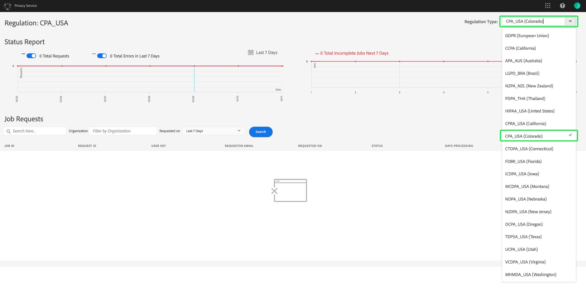

# [!DNL Privacy Service] användarhandbok

Det här dokumentet innehåller steg för att skapa och hantera sekretessförfrågningar med [!DNL Privacy Service] användargränssnittet.

## Bläddra i [!DNL Privacy Service] UI-kontrollpanelen

Kontrollpanelen för [!DNL Privacy Service] användargränssnittet innehåller två widgetar som gör att du kan visa statusen för dina sekretessjobb: **[!UICONTROL Status Report]** och **[!UICONTROL Job Requests]**. Kontrollpanelen visar även den aktuella valda regeln för de visade jobben.

### Regeltyp

[!DNL Privacy Service] stöder jobbförfrågningar för tre regeltyper:

* Europeiska unionens [!DNL General Data Protection Regulation] (GDPR)
* The [!DNL California Consumer Privacy Act] (CCPA)
* Thailand [!DNL Personal Data Protection Act] (PDPA_THA)

Jobb för varje regel spåras separat. Om du vill växla mellan olika regeltyper klickar du på **[!UICONTROL Regulation Type]** listrutan och väljer önskad regel i listan.

När du ändrar regeltypen uppdateras instrumentpanelen så att alla åtgärder, filter, widgetar och dialogrutor för att skapa jobb som gäller för den valda förordningen visas.

### Statusrapport

I diagrammet till vänster i widgeten Statusrapport spåras skickade jobb mot jobb som kan ha rapporterats tillbaka med fel. I diagrammet till höger spåras jobb som närmar sig slutet av det 30 dagar långa kompatibilitetsfönstret.

Klicka på en av de två växlingsknapparna ovanför diagrammet för att visa eller dölja deras respektive mätvärden.

Du kan visa det exakta antalet jobb som är kopplade till en datapunkt i diagrammen genom att hålla muspekaren över datapunkten i fråga.

Om du vill visa mer information om en viss datapunkt klickar du på datapunkten i fråga för att visa de associerade jobben i widgeten Jobbförfrågningar. Observera filtret som används precis ovanför jobblistan.

>[!NOTE]
>
>När ett filter har tillämpats på widgeten Jobbförfrågningar kan du ta bort filtret genom att klicka på **[!UICONTROL X]** filterfliken. Jobbförfrågningar återgår sedan till standardspårningslistan.

### Jobbförfrågningar

Widgeten Jobbförfrågningar visar alla tillgängliga jobbförfrågningar i din organisation, inklusive information som typ av förfrågan, aktuell status, förfallodatum och e-postadress till begärande.

>[!NOTE]
>
>Data för tidigare skapade jobb är bara tillgängliga i 30 dagar efter slutförandedatumet.

Du kan filtrera listan genom att skriva nyckelord i sökfältet under rubriken Jobbförfrågningar. Listan filtreras automatiskt medan du skriver och visar begäranden som innehåller värden som matchar söktermerna. Du kan också använda **[!UICONTROL Requested on]** listrutan för att välja ett tidsintervall för de listade jobben.

Om du vill visa information om en viss jobbförfrågan klickar du på begärans jobb-ID i listan för att öppna **[!UICONTROL Job Details]** sidan.

Den här dialogrutan innehåller statusinformation om varje [!DNL Experience Cloud] lösning och dess aktuella tillstånd i relation till det övergripande jobbet. Eftersom alla sekretessjobb är asynkrona visar sidan det senaste datumet och den senaste tiden (GMT) för varje lösning, eftersom vissa kräver mer tid än andra för att behandla begäran.

Om en lösning har tillhandahållit ytterligare data kan den visas i den här dialogrutan. Du kan visa dessa data genom att klicka på enskilda produktrader.

Om du vill hämta alla jobbdata som en CSV-fil klickar du på **[!UICONTROL Export to CSV]** längst upp till höger i dialogrutan.

## Skapa en ny begäran om sekretessjobb

>[!NOTE]
>
>För att kunna skapa en begäran om ett sekretessjobb måste du ange identitetsinformation för de specifika kunder vars data ska nås eller tas bort. Granska dokumentet om [identitetsdata för att se om det finns några sekretessförfrågningar](../identity-data.md) innan du fortsätter med det här avsnittet.

I [!DNL Privacy Service] gränssnittet finns två metoder för att skapa nya jobbbegäranden:

* [Använda Request Builder](#request-builder)
* [Överföra en JSON-fil](#json)

Steg för att använda dessa metoder finns i följande avsnitt.

### Använda Request Builder {#request-builder}

Med hjälp av Request Builder kan du manuellt skapa en ny begäran om sekretessjobb i användargränssnittet. Request Builder är bäst att använda för enklare och mindre uppsättningar av begäranden eftersom Request Builder begränsar antalet begäranden som bara har ID-typ per användare. För mer komplicerade begäranden kan det vara bättre att [överföra en JSON-fil](#json) i stället.

Om du vill börja använda Request Builder klickar du **[!UICONTROL Create Request]** under widgeten Statusrapport till höger på skärmen.

Dialogrutan öppnas och visar tillgängliga alternativ för att skicka en begäran om sekretessjobb för den valda regeltypen. **[!UICONTROL Create Request]**

 

Markera **[!UICONTROL Job Type]** begäran (&quot;Ta bort&quot; eller&quot;Åtkomst&quot;) och en eller flera tillgängliga **[!UICONTROL Products]** i listan.

 

Under **[!UICONTROL Namespace type]** väljer du lämplig namnområdestyp för de kund-ID som skickas till [!DNL Privacy Service].

 

När du använder _standardtypen_ av namnutrymme väljer du ett namnutrymme på den nedrullningsbara menyn (e-post, ECID eller AAID), skriver sedan ID-värdena i textrutan till höger och trycker på **\&lt;enter>** för varje ID för att lägga till det i listan.

 

När du använder den _anpassade_ namnområdestypen måste du skriva in namnutrymmet manuellt innan du anger ID-värdena nedan.

 

Klicka på **[!UICONTROL Create]** när du är klar.

 

Dialogrutan försvinner och det nya jobbet (eller de nya jobben) visas i widgeten Jobbförfrågningar tillsammans med deras aktuella bearbetningsstatus.

### Överföra en JSON-fil {#json}

När du skapar mer komplicerade begäranden, till exempel sådana som använder flera ID-typer för varje registrerade som behandlas, kan du skapa en begäran genom att överföra en JSON-fil.

Klicka på pilen bredvid **[!UICONTROL Create Request]**, under widgeten Statusrapport till höger på skärmen. Välj i listan med alternativ som visas **[!UICONTROL Upload JSON]**.

Dialogrutan visas. Där finns ett fönster där du kan dra och släppa JSON-filen i. **[!UICONTROL Upload JSON]**

 

Om du inte har någon JSON-fil att överföra klickar du för **[!UICONTROL Download Adobe-GDPR-Request.json]** att hämta en mall som du kan fylla i enligt de värden som du har samlat in från de registrerade.

 

Leta reda på JSON-filen på datorn och dra den till dialogfönstret. Om överföringen lyckas visas filnamnet i dialogrutan. Du kan fortsätta lägga till fler JSON-filer om det behövs genom att dra och släppa dem i dialogrutan.

Klicka på **[!UICONTROL Create]** när du är klar. Dialogrutan försvinner och det nya jobbet (eller de nya jobben) visas i widgeten _Jobbförfrågningar_ tillsammans med deras aktuella bearbetningsstatus.

### Nästa steg

Genom att läsa det här dokumentet har du lärt dig att använda [!DNL Privacy Service] gränssnittet för att skapa ett sekretessjobb, visa information om ett jobb och övervaka dess bearbetningsstatus samt hämta resultaten när det är klart.

Anvisningar om hur du utför dessa åtgärder programmatiskt med [!DNL Privacy Service] API:t finns i [utvecklarhandboken](../api/getting-started.md).