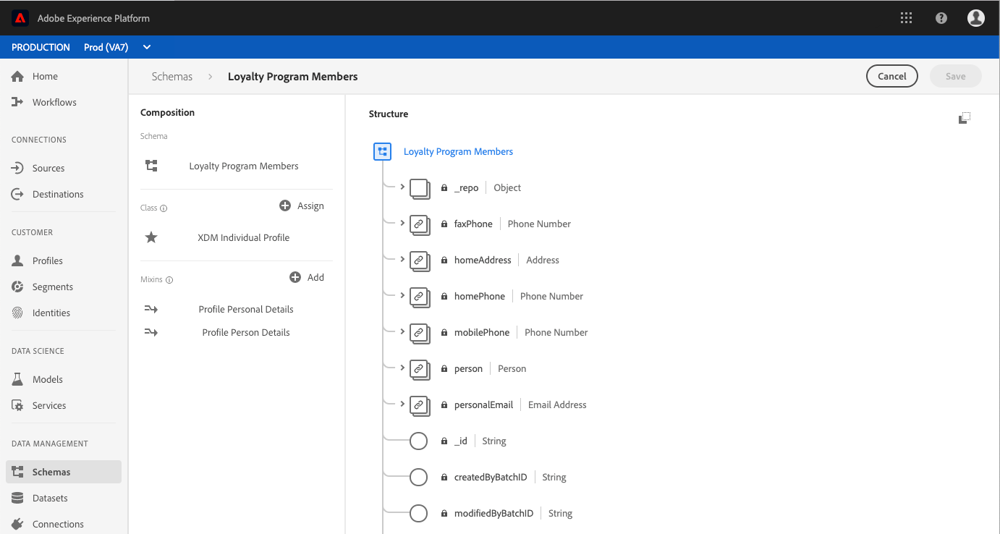

# (Alfa) Slutpunkt för beräknade attribut

>[!IMPORTANT]
>Den beräknade attributfunktionen som beskrivs i det här dokumentet är för närvarande alfavärden och är inte tillgänglig för alla användare. Dokumentationen och funktionaliteten kan komma att ändras.

Med beräknade attribut kan du automatiskt beräkna fältvärden baserat på andra värden, beräkningar och uttryck. Beräknade attribut fungerar på profilnivån, vilket innebär att du kan samla värden för alla poster och händelser.

Varje beräknat attribut innehåller ett uttryck, eller &quot;rule&quot;, som utvärderar inkommande data och lagrar resultatvärdet i ett profilattribut eller i en händelse. Med hjälp av dessa beräkningar kan du enkelt besvara frågor som rör inköpstid, tid mellan köp eller antal programöppningar, utan att behöva utföra komplexa beräkningar manuellt varje gång informationen behövs.

Den här guiden hjälper dig att bättre förstå beräknade attribut i Adobe Experience Platform och innehåller exempel på API-anrop för att utföra grundläggande CRUD-åtgärder med `/config/computedAttributes` slutpunkten.

## Komma igång

API-slutpunkten som används i den här guiden ingår i [kundprofils-API](https://www.adobe.io/apis/experienceplatform/home/api-reference.html#!acpdr/swagger-specs/real-time-customer-profile.yaml)i realtid. Innan du fortsätter bör du läsa [Komma igång-guiden](getting-started.md) för länkar till relaterad dokumentation, en guide till hur du läser exempelanrop till API:er i det här dokumentet och viktig information om vilka huvuden som behövs för att kunna anropa ett Experience Platform-API.

## Förstå beräknade attribut

Med Adobe Experience Platform kan ni enkelt importera och sammanfoga data från flera källor för att generera kundprofiler i realtid. Varje profil innehåller viktig information om en individ, t.ex. kontaktinformation, inställningar och inköpshistorik, vilket ger en helhetsbild av kunden.

En del av den information som samlas in i profilen är lätt att förstå när datafälten läses direkt (t.ex.&quot;förnamn&quot;) medan andra data kräver att man utför flera beräkningar eller använder andra fält och värden för att kunna generera informationen (t.ex.&quot;köpsumma för livstid&quot;). För att göra dessa data lättare att förstå snabbt kan du med Platform skapa **beräknade attribut** som automatiskt utför dessa referenser och beräkningar och returnerar värdet i rätt fält.

Beräknade attribut inkluderar att skapa ett uttryck, eller &quot;rule&quot;, som fungerar på inkommande data och lagrar resultatvärdet i ett profilattribut eller en händelse. Uttryck kan definieras på flera olika sätt, så att du kan ange att en regel endast utvärderar inkommande händelser, inkommande händelse- och profildata eller inkommande händelse, profildata och historiska händelser.

### Användningsexempel

Användningsexempel för beräknade attribut kan omfatta allt från enkla beräkningar till mycket komplexa referenser. Här följer några exempel på hur du kan använda beräknade attribut:

1. **Procenttal:** Ett enkelt beräknat attribut kan inkludera att ta två numeriska fält på en post och dela dem för att skapa en procentsats. Du kan t.ex. ta det totala antalet e-postmeddelanden som skickas till en individ och dividera det med antalet e-postmeddelanden personen öppnar. Om du tittar på det resulterande attributfältet visar det snabbt hur många procent av det totala antalet e-postmeddelanden som öppnats av den enskilda personen.
1. **Användning av program:** Ett annat exempel är möjligheten att samla det antal gånger en användare öppnar ditt program. Genom att spåra det totala antalet öppna applikationer, baserat på enskilda öppna händelser, kan ni leverera specialerbjudanden eller meddelanden till användarna på deras 100:e öppna sida, vilket främjar ett djupare engagemang i ert varumärke.
1. **Livstidsvärden:** Det kan vara svårt att samla in löpande summor, t.ex. ett livstidsvärde för en kund. Detta kräver att historiksumman uppdateras varje gång en ny köphändelse inträffar. Med ett beräknat attribut kan ni göra detta mycket enklare genom att behålla livstidsvärdet i ett enda fält som uppdateras automatiskt efter varje lyckad köphändelse som gäller kunden.

## Konfigurera ett beräknat attribut

För att kunna konfigurera ett beräknat attribut måste du först identifiera fältet som innehåller det beräknade attributvärdet. Det här fältet kan skapas med hjälp av en mixin för att lägga till fältet i ett befintligt schema, eller genom att markera ett fält som du redan har definierat i ett schema.

>[!NOTE]
>Beräknade attribut kan inte läggas till i fält i Adobe-definierade blandningar. Fältet måste finnas i `tenant` namnutrymmet, vilket innebär att det måste vara ett fält som du definierar och lägger till i ett schema.

För att kunna definiera ett beräknat attributfält måste schemat aktiveras för profilen och visas som en del av det unionsschema för klassen som schemat baseras på. Mer information om profilaktiverade scheman och fackföreningar finns i avsnittet om att [aktivera ett schema för profiler och visa fackscheman](../../xdm/api/getting-started.md)i guiden för schemautvecklare. Vi rekommenderar även att du läser [avsnittet om fackföreningar](../../xdm/schema/composition.md) i dokumentationen för schemakomposition.

Arbetsflödet i den här självstudien använder ett profilaktiverat schema och följer stegen för att definiera en ny blandning som innehåller det beräknade attributfältet och säkerställa att det är rätt namnutrymme. Om du redan har ett fält i rätt namnutrymme i ett profilaktiverat schema kan du fortsätta direkt till steget för att [skapa ett beräknat attribut](#create-a-computed-attribute).

### Visa ett schema

Stegen som följer använder användargränssnittet i Adobe Experience Platform för att hitta ett schema, lägga till en blandning och definiera ett fält. Om du föredrar att använda API:t för schemaregister läser du i utvecklarhandboken [för](../../xdm/api/getting-started.md) schemaregister om hur du skapar en blandning, lägger till en blandning i ett schema och aktiverar ett schema för användning med kundprofilen i realtid.

I användargränssnittet klickar du på **Scheman** i den vänstra listen och använder sökfältet på fliken *Bläddra* för att snabbt hitta det schema du vill uppdatera.


När du har hittat schemat klickar du på dess namn för att öppna Schemaredigeraren där du kan redigera schemat.



### Skapa en blandning

Om du vill skapa en ny blandning klickar du på **Lägg till** bredvid *Blandningar* i *dispositionsdelen* till vänster i redigeraren. Då öppnas dialogrutan **Lägg till mixin** där du kan se befintliga mixar. Klicka på alternativknappen för **Skapa ny blandning** för att definiera din nya blandning.

Ge blandningen ett namn och en beskrivning och klicka på **Lägg till blandning** när det är klart.


### Lägg till ett beräknat attributfält i schemat

Din nya blandning ska nu visas i avsnittet *Blandningar* under *Disposition*. Klicka på namnet på blandningen och flera **Lägg till-fältknappar** visas i *strukturdelen* i redigeraren.

Välj **Lägg till fält** bredvid schemats namn om du vill lägga till ett fält på den översta nivån. Du kan också välja att lägga till fältet var som helst i schemat.

När du klickat på **Lägg till fält** öppnas ett nytt objekt med namnet för ditt klient-ID, som visar att fältet finns i rätt namnutrymme. I det objektet visas ett *nytt fält* . Detta gäller fältet där du definierar det beräknade attributet.


### Konfigurera fältet

Använd avsnittet *Fältegenskaper* till höger om redigeraren för att ange den information som behövs för det nya fältet, inklusive namn, visningsnamn och typ.

>[!NOTE]
>Fälttypen måste vara av samma typ som det beräknade attributvärdet. Om det beräknade attributvärdet till exempel är en sträng måste fältet som definieras i schemat vara en sträng.

När du är klar klickar du på **Använd** och fältets namn, liksom dess typ, visas under *Struktur* i redigeraren.


### Aktivera schema för profil

Kontrollera att schemat har aktiverats för profilen innan du fortsätter. Klicka på schemanamnet i *strukturdelen* i redigeraren så att fliken *Schemaegenskaper* visas. Om **profilreglaget** är blått har schemat aktiverats för profil.

>[!NOTE]
>Det går inte att ångra aktiveringen av ett schema för profilen, så om du klickar på skjutreglaget när det har aktiverats behöver du inte riskera att det inaktiveras.


Du kan nu klicka på **Spara** för att spara det uppdaterade schemat och fortsätta med resten av självstudiekursen med API:t.

### Skapa ett beräknat attribut {#create-a-computed-attribute}

När ditt beräknade attributfält har identifierats och du har bekräftat att schemat har aktiverats för profilen kan du nu konfigurera ett beräknat attribut.

Börja med att göra en POST-begäran till `/config/computedAttributes` slutpunkten med en begärandebrödtext som innehåller information om det beräknade attributet som du vill skapa.

**API-format**

```http
POST /config/computedAttributes
```

**Begäran**

```shell
curl -X POST \
  https://platform.adobe.io/data/core/ups/config/computedAttributes \
  -H 'Authorization: Bearer {ACCESS_TOKEN}' \
  -H 'Content-Type: application/json' \
  -H 'x-api-key: {API_KEY}'\
  -H 'x-gw-ims-org-id: {IMS_ORG}' \
  -H 'x-sandbox-name: {SANDBOX_NAME}' \
  -d '{
        "name" : "birthdayCurrentMonth",
        "path" : "_{TENANT_ID}",
        "description" : "Computed attribute to capture if the customer birthday is in the current month.",
        "expression" : {
            "type" : "PQL", 
            "format" : "pql/text", 
            "value":  "person.birthDate.getMonth() = currentMonth()"
        },
        "schema": 
          {
            "name":"_xdm.context.profile"
          }
          
      }'
```

| Egenskap | Beskrivning |
|---|---|
| `name` | Namnet på det beräknade attributfältet, som en sträng. |
| `path` | Sökvägen till fältet som innehåller det beräknade attributet. Sökvägen finns i schemats attribut och ska INTE innehålla fältnamnet i sökvägen. Sökvägen är `properties` tom. När du skriver banan utelämnar du de olika attributnivåerna `properties` . |
| `{TENANT_ID}` | Om du inte känner till ditt klientorganisations-ID kan du läsa stegen för att hitta ditt klientorganisations-ID i [utvecklarhandboken](../../xdm/api/getting-started.md#know-your-tenant_id)för schemaregister. |
| `description` | En beskrivning av det beräknade attributet. Detta är särskilt användbart när flera beräknade attribut har definierats, eftersom det kommer att hjälpa andra inom IMS-organisationen att fastställa rätt beräknat attribut att använda. |
| `expression.value` | Ett giltigt PQL-uttryck (Profile Query Language). Mer information om PQL och länkar till frågor som stöds finns i [PQL-översikten](../../segmentation/pql/overview.md). |
| `schema.name` | Den klass som schemat som innehåller det beräknade attributfältet baseras på. Exempel: `_xdm.context.experienceevent` för ett schema baserat på klassen XDM ExperienceEvent. |

**Svar**

Ett beräknat attribut som skapats returnerar HTTP-status 200 (OK) och en svarstext som innehåller information om det nya beräknade attributet. Dessa uppgifter innehåller en unik, skrivskyddad, systemgenererad `id` som kan användas för att referera till det beräknade attributet under andra API-åtgärder.

```json
{
    "id": "2afcf410-450e-4a39-984d-2de99ab58877",
    "imsOrgId": "{IMS_ORG}",
    "sandbox": {
        "sandboxId": "ff0f6870-c46d-11e9-8ca3-036939a64204",
        "sandboxName": "prod",
        "type": "production",
        "default": true
    },
    "name": "birthdayCurrentMonth",
    "path": "_{TENANT_ID}",
    "positionPath": [
        "_{TENANT_ID}"
    ],
    "description": "Computed attribute to capture if the customer birthday is in the current month.",
    "expression": {
        "type": "PQL",
        "format": "pql/text",
        "value": "person.birthDate.getMonth() = currentMonth()"
    },
    "schema": {
        "name": "_xdm.context.profile"
    },
    "returnSchema": {
        "meta:xdmType": "string"
    },
    "definedOn": [
        {
            "meta:resourceType": "unions",
            "meta:containerId": "tenant",
            "$ref": "https://ns.adobe.com/xdm/context/profile__union"
        }
    ],
    "encodedDefinedOn":"?\b?VR)JMS?R?())(????+?KL?OJ?K???H??O??+I?(?/(?O??I??/????S?8{?E:",
    "dependencies": [],
    "dependents": [],
    "active": true,
    "type": "ComputedAttribute",
    "createEpoch": 1572555223,
    "updateEpoch": 1572555225
}
```

| Egenskap | Beskrivning |
|---|---|
| `id` | Ett unikt, skrivskyddat, systemgenererat ID som kan användas för att referera till det beräknade attributet under andra API-åtgärder. |
| `imsOrgId` | IMS-organisationen som är relaterad till det beräknade attributet ska matcha värdet som skickades i begäran. |
| `sandbox` | Sandlådeobjektet innehåller information om den sandlåda som det beräknade attributet konfigurerades i. Den här informationen hämtas från sandlådehuvudet som skickas i begäran. Mer information finns i Översikt över [sandlådor](../../sandboxes/home.md). |
| `positionPath` | En array som innehåller det dekonstruerade fältet `path` som skickades i begäran. |
| `returnSchema.meta:xdmType` | Den typ av fält där det beräknade attributet ska lagras. |
| `definedOn` | En array som visar de föreningsscheman som det beräknade attributet har definierats på. Innehåller ett objekt per union-schema, vilket innebär att det kan finnas flera objekt i arrayen om det beräknade attributet har lagts till i flera scheman baserade på olika klasser. |
| `active` | Ett booleskt värde som visar om det beräknade attributet är aktivt eller inte. Som standard är värdet `true`. |
| `type` | Den typ av resurs som skapas, i det här fallet är &quot;ComputedAttribute&quot; standardvärdet. |
| `createEpoch` och `updateEpoch` | Den tidpunkt då det beräknade attributet skapades och senast uppdaterades. |


## Få åtkomst till beräknade attribut

När du arbetar med beräknade attribut med API:t finns det två alternativ för att komma åt beräknade attribut som har definierats av din organisation. Det första är att lista alla beräknade attribut, det andra är att visa ett specifikt beräknat attribut utifrån dess unika `id`.

Steg för att både visa alla beräknade attribut och visa ett specifikt beräknat attribut beskrivs i följande avsnitt.

### Visa beräknade attribut {#list-computed-attributes}

IMS-organisationen kan skapa flera beräknade attribut, och om du utför en GET-begäran till `/config/computedAttributes` slutpunkten kan du visa alla befintliga beräknade attribut för din organisation.

**API-format**

```http
GET /config/computedAttributes
```

**Begäran**

```shell
curl -X GET \
  https://platform.adobe.io/data/core/ups/config/computedAttributes/ \
  -H 'Authorization: Bearer {ACCESS_TOKEN}' \
  -H 'x-api-key: {API_KEY}' \
  -H 'x-gw-ims-org-id: {IMS_ORG}' \ 
  -H 'x-sandbox-name: {SANDBOX_NAME}' \
```

**Svar**

Ett godkänt svar innehåller ett `_page` attribut som anger det totala antalet beräknade attribut (`totalCount`) och antalet beräknade attribut på sidan (`pageSize`).

Svaret innehåller också en `children` array som består av ett eller flera objekt, där vart och ett innehåller detaljerna för ett beräknat attribut. Om din organisation inte har några beräknade attribut, kommer `totalCount` och `pageSize` att vara 0 (noll) och arrayen kommer att vara tom `children` .

```json
{
    "_page": {
        "totalCount": 2,
        "pageSize": 2
    },
    "children": [
        {
            "id": "2afcf410-450e-4a39-984d-2de99ab58877",
            "imsOrgId": "{IMS_ORG}",
            "sandbox": {
                "sandboxId": "ff0f6870-c46d-11e9-8ca3-036939a64204",
                "sandboxName": "prod",
                "type": "production",
                "default": true
            },
            "name": "birthdayCurrentMonth",
            "path": "person._{TENANT_ID}",
            "positionPath": [
                "person",
                "_{TENANT_ID}"
            ],
            "description": "Computed attribute to capture if the customer birthday is in the current month.",
            "expression": {
                "type": "PQL",
                "format": "pql/text",
                "value": "person.birthDate.getMonth() = currentMonth()"
            },
            "schema": {
                "name": "_xdm.context.profile"
            },
            "returnSchema": {
                "meta:xdmType": "string"
            },
            "definedOn": [
                {
                    "meta:resourceType": "unions",
                    "meta:containerId": "tenant",
                    "$ref": "https://ns.adobe.com/xdm/context/profile__union"
                }
            ],
            "encodedDefinedOn":"?\b?VR)JMS?R?())(????+?KL?OJ?K???H??O??+I?(?/(?O??I??/????S?8{?E:",
            "dependencies": [],
            "dependents": [],
            "active": true,
            "type": "ComputedAttribute",
            "createEpoch": 1572555223,
            "updateEpoch": 1572555225
        },
        {
            "id": "ae0c6552-cf49-4725-8979-116366e8e8d3",
            "imsOrgId": "{IMS_ORG}",
            "sandbox": {
                "sandboxId": "",
                "sandboxName": "",
                "type": "production",
                "default": true
            },
            "name": "productDownloads",
            "path": "_{TENANT_ID}",
            "positionPath": [
                "_{TENANT_ID}"
            ],
            "description": "Calculate total product downloads.",
            "expression": {
                "type" : "PQL", 
                "format" : "pql/text", 
                "value":  "let Y = xEvent[_coresvc.event.subType = \"DOWNLOAD\"].groupBy(_coresvc.attributes[name = \"product\"].value).map({
                  \"downloaded\": this.head()._coresvc.attributes[name = \"product\"].head().value,
                  \"downloadsSum\": this.count(),
                  \"downloadsToday\": this[timestamp occurs today].count(),
                  \"downloadsPast30Days\": this[timestamp occurs < 30 days before now].count(),
                  \"downloadsPast60Days\": this[timestamp occurs < 60 days before now].count(),
                  \"downloadsPast90Days\": this[timestamp occurs < 90 days before now].count() }) in { \"uniqueProductDownloadSum\": Y.count(), \"products\": Y }"
            },
            "returnSchema": {
                "meta:xdmType": "string"
            },
            "definedOn": [
                {
                    "meta:resourceType": "unions",
                    "meta:containerId": "tenant",
                    "$ref": "https://ns.adobe.com/xdm/context/profile__union"
                }
            ],
            "schema": {
                "name": "_xdm.context.profile"
            },
            "encodedDefinedOn": "\u001f?\b\u0000\u0000\u0000\u0000\u0000\u0000\u0000?VR)JMS?R?())(????+?KL?OJ?K???H??O??+I?(?/(?O??I??/????S?\u0005\u00008{?E:\u0000\u0000\u0000",
            "dependencies": [],
            "dependents": [],
            "active": true,
            "type": "ComputedAttribute",
            "createEpoch": 1571945277,
            "updateEpoch": 1571945280
        }
    ],
    "_links": {
        "next": {}
    }
}
```

| Egenskap | Beskrivning |
|---|---|
| `_page.totalCount` | Det totala antalet beräknade attribut som definieras av IMS-organisationen. |
| `_page.pageSize` | Antalet beräknade attribut som returneras på den här resultatsidan. Om `pageSize` är lika med `totalCount`betyder det att det bara finns en resultatsida och att alla beräknade attribut har returnerats. Om de inte är lika finns det ytterligare resultatsidor som du kan komma åt. Mer information finns `_links.next` i. |
| `children` | En array som består av ett eller flera objekt, där vart och ett innehåller detaljerna för ett enskilt beräknat attribut. Om inga beräknade attribut har definierats är `children` arrayen tom. |
| `id` | Ett unikt, skrivskyddat, systemgenererat värde som automatiskt tilldelas ett beräknat attribut när det skapas. Mer information om komponenterna i ett beräknat attributobjekt finns i avsnittet om att [skapa ett beräknat attribut](#create-a-computed-attribute) tidigare i den här självstudiekursen. |
| `_links.next` | Om en enda sida med beräknade attribut returneras `_links.next` är ett tomt objekt, vilket visas i exempelsvaret ovan. Om din organisation har många beräknade attribut returneras de på flera sidor som du kan komma åt genom att göra en GET-begäran till `_links.next` värdet. |

### Visa ett beräknat attribut {#view-a-computed-attribute}

Du kan också visa ett specifikt beräknat attribut genom att göra en GET-begäran till `/config/computedAttributes` slutpunkten och inkludera det beräknade attribut-ID:t i sökvägen för begäran.

**API-format**

```http
GET /config/computedAttributes/{ATTRIBUTE_ID}
```

| Parameter | Beskrivning |
|---|---|
| `{ATTRIBUTE_ID}` | ID:t för det beräknade attribut som du vill visa. |

**Begäran**

```shell
curl -X GET \
  https://platform.adobe.io/data/core/ups/config/computedAttributes/2afcf410-450e-4a39-984d-2de99ab58877 \
  -H 'Authorization: Bearer {ACCESS_TOKEN}' \
  -H 'x-api-key: {API_KEY}' \
  -H 'x-gw-ims-org-id: {IMS_ORG}' \ 
  -H 'x-sandbox-name: {SANDBOX_NAME}' \
```

**Svar**

```json
{
    "id": "2afcf410-450e-4a39-984d-2de99ab58877",
    "imsOrgId": "{IMS_ORG}",
    "sandbox": {
        "sandboxId": "ff0f6870-c46d-11e9-8ca3-036939a64204",
        "sandboxName": "prod",
        "type": "production",
        "default": true
    },
    "name": "birthdayCurrentMonth",
    "path": "_{TENANT_ID}",
    "positionPath": [
        "_{TENANT_ID}"
    ],
    "description": "Computed attribute to capture if the customer birthday is in the current month.",
    "expression": {
        "type": "PQL",
        "format": "pql/text",
        "value": "person.birthDate.getMonth() = currentMonth()"
    },
    "schema": {
        "name": "_xdm.context.profile"
    },
    "returnSchema": {
        "meta:xdmType": "string"
    },
    "definedOn": [
        {
            "meta:resourceType": "unions",
            "meta:containerId": "tenant",
            "$ref": "https://ns.adobe.com/xdm/context/profile__union"
        }
    ],
    "encodedDefinedOn":"?\b?VR)JMS?R?())(????+?KL?OJ?K???H??O??+I?(?/(?O??I??/????S?8{?E:",
    "dependencies": [],
    "dependents": [],
    "active": true,
    "type": "ComputedAttribute",
    "createEpoch": 1572555223,
    "updateEpoch": 1572555225
}
```

## Uppdatera ett beräknat attribut

Om du upptäcker att du behöver uppdatera ett befintligt beräknat attribut kan du göra det genom att göra en PATCH-begäran till `/config/computedAttributes` slutpunkten och inkludera ID:t för det beräknade attributet som du vill uppdatera i sökvägen till begäran.

**API-format**

```http
PATCH /config/computedAttributes/{ATTRIBUTE_ID}
```

| Parameter | Beskrivning |
|---|---|
| `{ATTRIBUTE_ID}` | ID:t för det beräknade attribut som du vill uppdatera. |

**Begäran**

Denna begäran använder [JSON Patch-formatering](http://jsonpatch.com/) för att uppdatera &quot;värdet&quot; i &quot;expression&quot;-fältet.

```shell
curl -X PATCH \
  https://platform.adobe.io/data/core/ups/config/computedAttributes/ae0c6552-cf49-4725-8979-116366e8e8d3 \
  -H 'Authorization: Bearer {ACCESS_TOKEN}'\
  -H 'Content-Type: application/json' \
  -H 'x-api-key: {API_KEY}' \
  -H 'x-gw-ims-org-id: {IMS_ORG}' \
  -H 'x-sandbox-name: {SANDBOX_NAME}' \  
  -d '[
        {
          "op": "add",
          "path": "/expression",
          "value": 
          {
            "type" : "PQL", 
            "format" : "pql/text", 
            "value":  "{NEW_EXPRESSION_VALUE}"
          }
        }
      ]'
```

| Egenskap | Beskrivning |
|---|---|
| `{NEW_EXPRESSION_VALUE}` | Ett giltigt PQL-uttryck (Profile Query Language). Mer information om PQL och länkar till frågor som stöds finns i [PQL-översikten](../../segmentation/pql/overview.md). |

**Svar**

En lyckad uppdatering returnerar HTTP-status 204 (inget innehåll) och en tom svarstext. Om du vill bekräfta att uppdateringen lyckades kan du utföra en GET-begäran för att visa det beräknade attributet med dess ID.

## Ta bort ett beräknat attribut

Det går också att ta bort ett beräknat attribut med API:t. Detta gör du genom att göra en DELETE-begäran till `/config/computedAttributes` slutpunkten och inkludera ID:t för det beräknade attributet som du vill ta bort i sökvägen för begäran.

>[!Note]
>
>
>Var försiktig när du tar bort ett beräknat attribut eftersom det kan användas i mer än ett schema och åtgärden DELETE inte kan ångras.

**API-format**

```http
DELETE /config/computedAttributes/{ATTRIBUTE_ID}
```

| Parameter | Beskrivning |
|---|---|
| `{ATTRIBUTE_ID}` | ID:t för det beräknade attribut som du vill ta bort. |

**Begäran**

```shell
curl -X DELETE \
  https://platform.adobe.io/data/core/ups/config/computedAttributes/ae0c6552-cf49-4725-8979-116366e8e8d3 \
  -H 'Authorization: Bearer {ACCESS_TOKEN}' \
  -H 'x-api-key: {API_KEY}' \
  -H 'x-gw-ims-org-id: {IMS_ORG}'
  -H 'x-sandbox-name: {SANDBOX_NAME}' \ 
```

**Svar**

En slutförd borttagningsbegäran returnerar HTTP-status 200 (OK) och en tom svarstext. För att bekräfta att borttagningen lyckades kan du utföra en GET-begäran för att söka efter det beräknade attributet med dess ID. Om attributet har tagits bort får du ett HTTP Status 404-fel (Hittades inte).

## Nästa steg

Nu när du har lärt dig grunderna i beräknade attribut kan du börja definiera dem för din organisation.