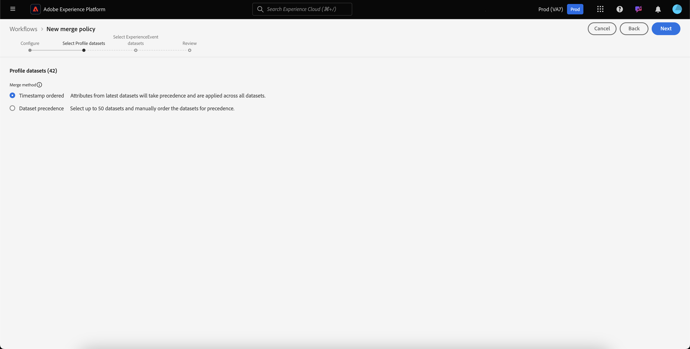

# Användargränssnittshandbok för sammanslagningsprinciper

Med Adobe Experience Platform kan ni sammanföra datafragment från flera olika källor och kombinera dem för att få en fullständig bild av varje enskild kund. När du sammanfogar dessa data är sammanfogningsprinciper de regler som [!DNL Platform] använder för att avgöra hur data ska prioriteras och vilka data som ska kombineras för att skapa en enhetlig vy.

Om en kund till exempel interagerar med ert varumärke i flera kanaler kommer organisationen att ha flera profilfragment som är kopplade till den enskilda kunden som visas i flera datauppsättningar. När de här fragmenten hämtas till Platform sammanfogas de för att skapa en enda profil för kunden. När data från flera källor står i konflikt (t.ex. ett fragment listar kunden som&quot;enkel&quot; medan det andra listar kunden som&quot;gift&quot;) avgör sammanfogningspolicyn vilken information som ska inkluderas i profilen för den enskilda personen.

Med RESTful API:er eller användargränssnittet kan du skapa nya kopplingsprofiler, hantera befintliga profiler och ange en standardkopplingsprofil för organisationen. Den här handboken innehåller stegvisa instruktioner för hur du arbetar med sammanfogningsprinciper med hjälp av användargränssnittet i Adobe Experience Platform.

Om du föredrar att arbeta med sammanfogningsprinciper med hjälp av API:t [!DNL Real-time Customer Profile] följer du instruktionerna i [API-handboken för sammanfogningsprinciper](../api/merge-policies.md).

## Komma igång

Den här handboken kräver en fungerande förståelse av flera viktiga [!DNL Experience Platform]-funktioner. Innan du följer den här guiden eller använder profil-API:er bör du läsa dokumentationen för följande tjänster:

* [Kundprofil](../home.md) i realtid: Ger en enhetlig konsumentprofil i realtid baserad på aggregerade data från flera källor.
* [Adobe Experience Platform Identity Service](../../identity-service/home.md): Möjliggör kundprofil i realtid genom att överbrygga identiteter från olika datakällor som hämtas in  [!DNL Platform].
* [Experience Data Model (XDM)](../../xdm/home.md): Det standardiserade ramverket som  [!DNL Platform] organiserar kundupplevelsedata.

## Sammanfogningsmetoder {#merge-methods}

Varje profilfragment innehåller information för endast en identitet av det totala antalet identiteter som kan finnas för en individ. När data sammanfogas till en kundprofil finns det en risk för att informationen hamnar i konflikt och prioriteten måste anges. Om du väljer en sammanfogningsmetod kan du ange vilka datauppsättningsattribut som ska prioriteras om en sammanfogningskonflikt uppstår mellan datauppsättningar.

Det finns två möjliga sammanfogningsmetoder för sammanfogningsprinciper. Var och en av dessa metoder sammanfattas nedan med ytterligare information i följande avsnitt:

* **[!UICONTROL Timestamp ordered]:** I händelse av en konflikt prioriteras profilfragmentet som uppdaterades senast.
   * **Anpassade tidsstämplar:** [!UICONTROL Timestamp ordered] stöder även anpassade tidsstämplar som har högre prioritet än systemtidsstämplar när data sammanfogas inom samma datauppsättning (flera identiteter) eller mellan datauppsättningar. Mer information finns i avsnittet [Använda anpassade tidsstämplar](#custom-timestamps).
* **[!UICONTROL Dataset precedence]:** I händelse av en konflikt ska du prioritera profilfragment baserat på den datauppsättning som de kommer från. När du väljer det här alternativet måste du välja relaterade datauppsättningar och deras prioritetsordning.

### Tidsstämpeln har ordnats {#timestamp-ordered}

När profilposter hämtas till Experience Platform hämtas en systemtidsstämpel vid tidpunkten för inmatningen och läggs till i posten. När **[!UICONTROL Timestamp ordered]** har valts som sammanfogningsmetod för en sammanfogningsprincip sammanfogas profiler baserat på systemets tidsstämpel. Sammanfogningen görs med andra ord baserat på den tidsstämpel som användes när posten hämtades till Platform.

#### Använda anpassade tidsstämplar {#custom-timestamps}

Ibland kan det finnas situationer där det är nödvändigt att ange en anpassad tidsstämpel och låta sammanfogningsprincipen använda den anpassade tidsstämpeln i stället för systemtidsstämpeln. Exempel på detta är att fylla i data baklänges eller att säkerställa rätt ordning för händelser om posterna är inlästa i fel ordning.

Om du vill använda en anpassad tidsstämpel måste **[!UICONTROL External Source System Audit Details Mixin]** läggas till i ditt profilschema. När du har lagt till den anpassade tidsstämpeln kan du fylla i den med fältet `lastUpdatedDate`. När en post hämtas med fältet `lastUpdatedDate` ifyllt, använder Experience Platform det fältet för att sammanfoga poster mellan datauppsättningar. Om `lastUpdatedDate` inte finns, eller inte är ifylld, kommer plattformen att fortsätta använda systemets tidsstämpel.

>[!NOTE]
>
>Du måste se till att tidsstämpeln `lastUpdatedDate` fylls i när du importerar en uppdatering för samma post.

På följande skärmbild visas fälten i [!UICONTROL External Source System Audit Details Mixin]. Stegvisa instruktioner om hur du arbetar med scheman med hjälp av användargränssnittet för plattformen, inklusive hur du lägger till mixiner i scheman, finns i [självstudiekursen för att skapa ett schema med användargränssnittet](../../xdm/tutorials/create-schema-ui.md).

Om du vill arbeta med anpassade tidsstämplar med API:t läser du avsnittet [slutpunktshandbok för sammanfogningsprinciper om hur du använder anpassade tidsstämplar](../api/merge-policies.md#custom-timestamps).

### Datauppsättningens prioritet {#dataset-precedence}

När **[!UICONTROL Dataset precedence]** har valts som sammanfogningsmetod för en sammanfogningsprincip kan du prioritera profilfragment baserat på den datauppsättning som de kommer från. Ett exempel är om din organisation har information i en datauppsättning som är att föredra eller lita på framför data i en annan datauppsättning.

Om du vill skapa en sammanfogningsprincip med **[!UICONTROL Dataset precedence]** måste du markera de profil- och ExperienceEvent-datauppsättningar som ingår och sedan manuellt beställa profildatamängderna. När datauppsättningarna har valts och beställts får den översta datauppsättningen högsta prioritet, den andra datauppsättningen den näst högsta och så vidare.

## [!UICONTROL ID stitching] {#id-stitching}

Identitetssammanfogning ([!UICONTROL ID stitching]) är processen att identifiera databragment och kombinera dem till en fullständig profilpost. För att illustrera de olika sammanfogningsbeteendena bör du överväga en enskild kund som interagerar med ett varumärke med två olika e-postadresser.

* **[!UICONTROL None]:** När det här alternativet är markerat sammanfogas inte ID:n. När segmentering sker kommer identiteter som kan tillhöra samma person inte att sammanfogas och segmentering kommer endast att beakta de attribut som är kopplade till varje enskilt ID när man avgör om en kund är berättigad till ett segmentmedlemskap. Detta kan leda till att en enskild kund har flera profiler och att varje profil kan kvalificera sig för olika segment, vilket resulterar i att flera marknadsföringsmeddelanden skickas till samma kund.
* **[!UICONTROL Private graph]:** När det privata diagrammet är markerat sammanfogas flera identiteter som hör till samma individ. Detta leder till att kunden har en enda profil och möjliggör segmentering för att ta hänsyn till flera attribut från flera relaterade identiteter när man fastställer segmentens kvalifikationer. I det här scenariot har kunden sannolikt en enda profil, kvalificerar sig för ett segment baserat på en kombination av attribut mellan identiteter och får bara ett marknadsföringsmeddelande.

Om du vill veta mer om identiteter och deras roll när det gäller att generera profiler och segment börjar du med att läsa översikten över identitetstjänsten](../../identity-service/home.md).[

## Standardprincip för sammanslagning {#default-merge-policy}

En organisation kan skapa en standardsammanfogningsprincip som används i organisationen när profilfragment sammanfogas. På så sätt kan användarna enkelt välja standardpolicy när de utför åtgärder i Experience Platform, t.ex. att visa kundprofiler eller skapa segment. I de flesta fall används standardprincipen för sammanfogning om inte en annan princip anges.

Varje organisation kan skapa flera sammanfogningsprinciper som är relaterade till en enda XDM-schemaklass, men de kan bara ha en standardsammanfogningsprincip deklarerad för varje klass. Din organisation kan till exempel ha en standardprincip för sammanslagning som är relaterad till klassen [!DNL XDM Individual Profile] och en annan standardprincip för sammanslagning för en anpassad produktinventeringsklass.

Om du skapar en ny sammanfogningsprincip och anger den som standard, uppdateras den tidigare standardprincipen automatiskt av systemet till att inte längre vara standard.

>[!WARNING]
>
>Profilantal och segment med en befintlig associerad standardsammanfogningsprincip kan påverkas. Alla segment som har en standardprincip för sammanslagning kommer att uppdateras till den nya standardprincipen för sammanslagning.

## Visa kopplingsprinciper {#view-merge-policies}

I gränssnittet för [!DNL Experience Platform] kan du börja arbeta med sammanfogningsprinciper genom att välja **[!UICONTROL Profiles]** i den vänstra navigeringen och sedan välja fliken **[!UICONTROL Merge Policies]**. På den här fliken finns en lista med alla befintliga sammanfogningsprinciper för din organisation, samt information för varje sammanfogningsprincip, inklusive principnamnet, oavsett om sammanfogningsprincipen är standardprincipen för sammanfogning eller inte, samt schemaklassen som sammanfogningsprincipen gäller.

Om du vill välja vilken information som ska visas, eller om du vill lägga till fler kolumner till visningen, markerar du **[!UICONTROL Configure columns]** och klickar på ett kolumnnamn för att lägga till eller ta bort det från vyn.

## Skapa en sammanfogningsprincip {#create-a-merge-policy}

Om du vill skapa en ny sammanfogningsprincip väljer du **[!UICONTROL Create merge policy]** på fliken Sammanfogningsprinciper.

På skärmen **[!UICONTROL New merge policy]** för arbetsflöde kan du ange viktig information för din nya sammanfogningsprincip genom en serie guidade steg.

### [!UICONTROL Configure] {#configure}

I det första steget i arbetsflödet kan du konfigurera sammanfogningsprincipen genom att ange grundläggande information. Denna information omfattar

* **[!UICONTROL Name]**: Namnet på sammanfogningsprincipen ska vara beskrivande men koncist.
* **[!UICONTROL Schema class]**: Den XDM-schemaklass som är associerad med sammanfogningsprincipen. Detta anger schemaklassen som sammanfogningsprincipen skapas för. Organisationer kan skapa flera sammanfogningsprinciper per per schemaklass. För närvarande är endast klassen [!UICONTROL XDM Individual Profile] tillgänglig i användargränssnittet. Du kan förhandsgranska det sammanslagna schemat för schemaklassen genom att välja **[!UICONTROL View Union Schema]**. Mer information finns i följande avsnitt om [att visa unionsschemat](#view-union-schema).
* **[!UICONTROL ID stitching]**: I det här fältet definieras hur en kunds relaterade identiteter ska fastställas. Mer information finns i avsnittet [ID stitching](#id-stitching) tidigare i den här guiden. Det finns två möjliga värden:
   * **[!UICONTROL None]**: Utför ingen identitetssammanfogning.
   * **[!UICONTROL Private Graph]**: Utför identitetssammanfogning baserat på ditt privata identitetsdiagram.
* **[!UICONTROL Default merge policy]**: En växlingsknapp som gör att du kan välja om sammanfogningsprincipen ska vara standard för din organisation eller inte. Om väljaren är aktiverad visas en varning om att du vill ändra organisationens standardpolicy för sammanslagning. Mer information finns i avsnittet [standardprinciper för sammanfogning](#default-merge-policy) tidigare i den här guiden.
   

När de obligatoriska fälten har slutförts kan du välja **[!UICONTROL Next]** för att fortsätta med arbetsflödet.

#### [!UICONTROL View Union Schema] {#view-union-schema}

När du skapar eller redigerar en sammanfogningsprincip kan du visa det kombinerade schemat för den valda schemaklassen genom att välja **[!UICONTROL View Union Schema]**.

Dialogrutan [!UICONTROL View Union Schema] öppnas med alla scheman, identiteter och relationer som är kopplade till unionsschemat. Du kan använda dialogrutan för att utforska unionsschemat på samma sätt som du gör genom att gå till fliken [!UICONTROL Union Schema] i avsnittet [!UICONTROL Profiles] i plattformsgränssnittet.

Detaljerad information om unionsscheman, inklusive hur du interagerar med dem på fliken [!UICONTROL Union Schema] eller i dialogrutan [!UICONTROL View Union Schema] som visas i arbetsflödet för sammanslagningsprinciper finns i användargränssnittsguiden för [unionsschemat](union-schema.md).

### [!UICONTROL Select Profile datasets] {#select-profile-datasets}

På skärmen **[!UICONTROL Select Profile datasets]** måste du välja **[!UICONTROL Merge method]** som du vill använda för sammanfogningsprincipen. På skärmen visas även det totala antalet [!UICONTROL Profile datasets] i organisationen som relaterar till schemaklassen som valdes på föregående skärm.

Beroende på vilken sammanfogningsmetod du väljer sammanfogas alla profildatauppsättningar i den ordning som de senast uppdaterades (tidsstämpelsortering) eller så måste du välja vilka profildatauppsättningar som ska inkluderas i sammanfogningsprincipen och i vilken ordning de ska sammanfogas (datauppsättningsprioritet). Mer information om metoder för sammanslagning finns i avsnittet [metoder](#merge-methods) som fanns tidigare i det här dokumentet.

#### Tidsstämpeln har ordnats {#timestamp-ordered-profile}

Om du väljer **[!UICONTROL Timestamp ordered]** som sammanfogningsmetod får attribut från de senast uppdaterade datauppsättningarna företräde. Detta gäller för alla profildatauppsättningar.

#### Datauppsättningens prioritet {#dataset-precedence-profile}

Om du väljer **[!UICONTROL Dataset precedence]** som sammanfogningsmetod måste du välja Profildatauppsättningar och manuellt prioritera dem. Varje datamängd som visas innehåller också status för den senaste batchimporten eller visar ett meddelande om att inga batchar har importerats till den datauppsättningen.

Du kan välja upp till 50 datauppsättningar från datauppsättningslistan som ska ingå i sammanfogningsprincipen. När du väljer datauppsättningar läggs de till i **[!UICONTROL Select datasets]**-avsnittet, så att du kan dra och släppa datauppsättningarna och ordna dem enligt dina önskemål. När datauppsättningarna justeras i listan uppdateras ordningstalet (1, 2, 3 osv.) bredvid datauppsättningen och prioriteten visas (1 ges den högsta prioriteten, 2 och framåt).

Om du väljer en datauppsättning uppdateras även avsnittet **[!UICONTROL Union schema]**, som visar fälten i det unionsschema som varje datauppsättning bidrar med data till. Mer information om unionsscheman, inklusive hur du interagerar med visualiseringar i användargränssnittet, finns i [gränssnittshandboken för unionsschemat](union-schema.md)

### [!UICONTROL Select ExperienceEvent datasets] {#select-experienceevent-datasets}

Nästa steg i arbetsflödet kräver att du väljer ExperienceEvent-datamängder. Skärmen påverkas av den sammanslagningsmetod som du valde på skärmen [[!UICONTROL Select Profile datasets]](#select-profile-datasets).

På den här skärmen visas även det totala antalet **[!UICONTROL ExperienceEvent datasets]** som din organisation har skapat och som är relaterat till den schemaklass som du valde på konfigurationsskärmen för sammanfogningsprincipen.

#### Tidsstämpeln har ordnats {#timestamp-ordered-experienceevent}

Om du valde **[!UICONTROL Timestamp ordered]** som sammanfogningsmetod för profildatauppsättningar prioriteras även attributen från de senast uppdaterade ExperienceEvent-datauppsättningarna här.

#### Datauppsättningens prioritet {#dataset-precedence-experienceevent}

Om du valde **[!UICONTROL Dataset precedence]** som sammanfogningsmetod för profildatamängder måste du välja ExperienceEvent-datamängder som ska inkluderas. Du kan välja upp till 50 ExperienceEvent-datamängder i datauppsättningslistan. När du väljer datauppsättningar visas de i [!UICONTROL Select datasets]-avsnittet.

ExperienceEvent-datamängder kan inte ordnas manuellt, i stället läggs attributen i ExperienceEvent-datamängderna till i profildatamängderna om de ingår i samma profilfragment.

På samma sätt som när du väljer profildatamängder uppdateras även avsnittet **[!UICONTROL Union schema]** när du väljer en ExperienceEvent-datamängd. Fälten i det unionsschema som varje datamängd bidrar med data till visas. Mer information om unionsscheman, inklusive hur du interagerar med visualiseringar i användargränssnittet, finns i [gränssnittshandboken för unionsschemat](union-schema.md)

### [!UICONTROL Review] {#review}

Det sista steget i arbetsflödet är att granska din kopplingsprofil. Skärmen **[!UICONTROL Review]** visar namnet på den nya sammanfogningsprincipen, den schemaklass som den baseras på, det [!UICONTROL ID stitching]-alternativ som du valde samt sammanfogningsmetoden och de datamängder som ingår i sammanfogningsprincipen. Om du vill visa alla profildata eller ExperienceEvent-datamängder som ingår väljer du antalet datamängder som du vill expandera listrutan.

Kontrollera att du noggrant granskar din kopplingsprofil innan du väljer **[!UICONTROL Finish]** för att slutföra arbetsflödet.

#### Tidsstämpeln har ordnats {#timestamp-ordered-review}

Om du valde **[!UICONTROL Timestamp ordered]** som sammanfogningsmetod för din sammanfogningsprincip innehåller listan med profildatauppsättningar alla datauppsättningar som har skapats av din organisation relaterade till schemaklassen, i tidsstämpelordning. Listan med ExperienceEvent-datamängder innehåller alla datauppsättningar som din organisation har skapat för den valda schemaklassen och som kommer att läggas till i profildatamängderna.

#### Datauppsättningens prioritet {#dataset-precedence-review}

Om du valde **[!UICONTROL Dataset precedence]** som sammanfogningsmetod för din sammanfogningsprincip innehåller listorna med datauppsättningarna Profile och ExperienceEvent endast de data för profil och ExperienceEvent som du valde när du skapade arbetsflödet. Ordningen på profildatauppsättningarna ska matcha den prioritet som du angav när du skapade dem. Om så inte är fallet använder du knappen [!UICONTROL Back] för att återgå till föregående arbetsflödessteg och justera prioriteten.

### Uppdaterad lista över sammanfogningsprinciper {#updated-list}

När du har slutfört arbetsflödet för att skapa en ny sammanfogningsprincip återgår du till fliken **[!UICONTROL Merge Policies]**. Listan över samkörningsprinciper för din organisation bör nu innehålla den samkörningsprincip som du just har skapat.

## Redigera en kopplingsprofil

På fliken [!UICONTROL Merge Policies] kan du ändra en befintlig sammanfogningsprincip som har skapats för klassen [!DNL XDM Individual Profile] genom att välja **[!UICONTROL Policy name]** för den sammanfogningsprincip som du vill redigera.

När skärmen **[!UICONTROL Edit merge policy]** visas kan du ändra namnet och [!UICONTROL ID stitching] samt ändra om den här principen är standardprincipen för sammanfogning för din organisation eller inte.

Välj **[!UICONTROL Next]** om du vill fortsätta genom sammanfogningsprinciparbetsflödet för att uppdatera sammanfogningsmetoden och de dataset som ingår i sammanfogningsprincipen.

När du har gjort de ändringar du behöver granskar du sammanfogningsprincipen och väljer **[!UICONTROL Finish]** för att gå tillbaka till fliken **[!UICONTROL Merge policies]**.

>[!WARNING]
>
>Om du ändrar en sammanfogningsprincip kan det påverka segmenterings- och profilresultaten, eftersom det ändrar det sätt på vilket datakonflikter löses.

## Policyöverträdelser för datastyrning

När du skapar eller uppdaterar en sammanfogningsprincip görs en kontroll för att avgöra om sammanfogningsprincipen bryter mot någon av de dataanvändningsprinciper som din organisation har definierat. Dataanvändningspolicyer är en del av Adobe Experience Platform [!DNL Data Governance] och är regler som beskriver den typ av marknadsföringsåtgärder som du tillåts eller begränsas från att utföra på specifika [!DNL Platform]-data. Om en sammanfogningsprincip till exempel användes för att skapa ett segment som aktiverats för ett tredjepartsmål, och din organisation har en dataanvändningsprincip som förhindrar export av specifika data till tredje part, får du ett **[!UICONTROL Data governance policy violation detected]**-meddelande när du försöker spara sammanfogningsprincipen.

Det här meddelandet innehåller en lista över dataanvändningsprinciper som har överträtts och gör att du kan visa information om överträdelsen genom att välja en princip i listan. När du har valt en princip som inte följs anger fliken **[!UICONTROL Data lineage]** orsaken till överträdelsen och de aktiveringar som påverkas, där var och en ger mer information om hur dataanvändningsprincipen har brutits.

Om du vill veta mer om hur datastyrning utförs inom Adobe Experience Platform kan du börja med att läsa [översikten över datastyrning](../../data-governance/home.md).

## Nästa steg

Nu när ni har skapat och konfigurerat sammanfogningsprinciper för er organisation kan ni använda dem för att justera visningen av kundprofiler inom Platform och för att skapa målgruppssegment utifrån era profildata. Se [Segmenteringsöversikt](../../segmentation/home.md) för mer information om hur du skapar och arbetar med segment med hjälp av användargränssnittet och API:erna i [!DNL Experience Platform].