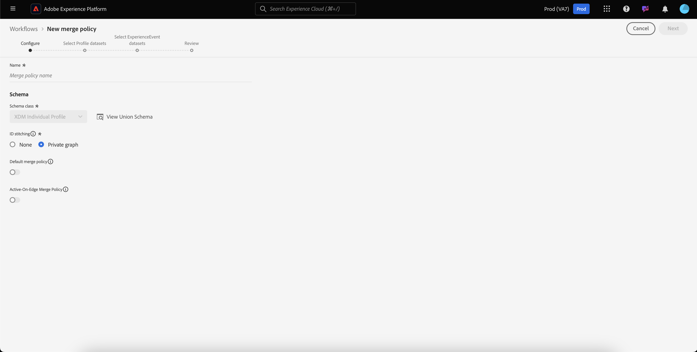

# Användarhandbok för sammanslagningsprinciper

Med Adobe Experience Platform kan ni samla data från flera olika källor och kombinera dem för att få en fullständig bild av varje enskild kund. När du sammanför dessa data är sammanslagningsprinciper de regler som [!DNL Platform] använder för att avgöra hur data ska prioriteras och vilka data som ska kombineras för att skapa den enhetliga vyn.

Med RESTful API:er eller användargränssnittet kan du skapa nya kopplingsprofiler, hantera befintliga profiler och ange en standardkopplingsprofil för organisationen. I den här handboken finns stegvisa instruktioner för hur du arbetar med sammanfogningsprinciper i Adobe Experience Platform användargränssnitt.

Om du föredrar att arbeta med sammanfogningsprinciper med hjälp av [!DNL Real-time Customer Profile] API:t följer du instruktionerna i API-självstudiekursen för [sammanfogningsprinciper](../api/merge-policies.md).

## Komma igång

Den här guiden kräver en fungerande förståelse av de olika [!DNL Experience Platform] tjänsterna som är kopplade till sammanslagningsprinciper. Innan du börjar med den här självstudiekursen bör du läsa dokumentationen för följande tjänster:

* [[!DNL Real-time Customer Profile]](../home.md): Ger en enhetlig konsumentprofil i realtid baserad på aggregerade data från flera källor.
* [[!DNL Identity Service]](../../identity-service/home.md): Möjliggör [!DNL Real-time Customer Profile] genom att överbrygga identiteter från olika datakällor som inhämtas till [!DNL Platform].
* [[!DNL Experience Data Model (XDM)]](../../xdm/home.md): Det standardiserade ramverket som [!DNL Platform] organiserar kundupplevelsedata.

## Visa kopplingsprinciper

I användargränssnittet kan du börja arbeta med sammanfogningsprinciper och se en lista över organisationens befintliga sammanfogningsprinciper genom att välja [!DNL Experience Platform] i den vänstra listen och sedan välja **[!UICONTROL Profiles]** **[!UICONTROL Merge policies]** fliken.

Information om alla kopplingsregler som är tillgängliga för din organisation finns på landningssidan, inklusive [!UICONTROL Policy Name], [!UICONTROL Default merge policy]och [!UICONTROL Schema].

Om du vill välja vilka detaljer som ska visas, eller om du vill lägga till fler kolumner till visningen, markerar du ikonen för kolumnväljaren och klickar på ett kolumnnamn för att lägga till eller ta bort den från vyn.

## Skapa en kopplingsprofil

Om du vill skapa en ny sammanfogningsprincip väljer du **[!UICONTROL Create merge policy]**.

Skärmen visas så att du kan ange viktig information för den nya sammanfogningsprincipen **[!UICONTROL Create merge policy]** .

* **[!UICONTROL Name]**: Namnet på sammanfogningsprincipen ska vara beskrivande men koncist.
* **[!UICONTROL Schema]**: Schemat som är associerat med sammanfogningsprincipen. Detta anger XDM-schemat som sammanfogningsprincipen skapas för. Organisationer kan skapa flera sammanfogningsprinciper per per schema.
* **[!UICONTROL ID stitching]**: I det här fältet definieras hur en kunds relaterade identiteter ska fastställas. Det finns två möjliga värden:
   * **[!UICONTROL None]**: Utför ingen identitetssammanfogning.
   * **[!UICONTROL Private Graph]**: Utför identitetssammanfogning baserat på ditt privata identitetsdiagram.
* **[!UICONTROL Attribute merge]**: Ett profilfragment är profilinformationen för endast en identitet från listan över identiteter som finns för en enskild kund. När typen av identitetsdiagram som används resulterar i mer än en identitet, finns det en risk för att profilattribut som står i konflikt med varandra, och prioritet måste anges. Med [!UICONTROL Attribute merge] kan du ange vilka datamängdsprofilvärden som ska prioriteras om en sammanslagningskonflikt inträffar mellan datamängder av typen nyckelvärde (postdata). Det finns två möjliga värden:
   * **[!UICONTROL Timestamp ordered]**: Om det uppstår en konflikt ska du prioritera profilen som uppdaterades senast. [!UICONTROL Timestamp ordered] stöder också anpassade tidsstämplar som får högre prioritet än systemtidsstämplar när data sammanfogas inom samma datauppsättning (flera identiteter) eller mellan datauppsättningar. Mer information finns i avsnittet [Tidsstämpelordning](#timestamp-ordered) som följer.
   * **[!UICONTROL Dataset precedence]** : Prioritera profilfragment baserat på den datauppsättning som de kommer från. När du väljer det här alternativet måste du välja relaterade datauppsättningar och deras prioritetsordning. Mer information finns i informationen om [datauppsättningsprioritet](#dataset-precedence) nedan.
* **[!UICONTROL Default merge policy]**: En växlingsknapp som gör att du kan välja om sammanfogningsprincipen ska vara standard för din organisation eller inte. Om väljaren är aktiverad och den nya profilen sparas, uppdateras din tidigare standardprincip automatiskt till att inte längre vara standard.

### Tidsstämpel beställd {#timestamp-ordered}

När profilposter hämtas till Experience Platform hämtas en systemtidsstämpel vid tidpunkten för inmatningen och läggs till i posten. När [!UICONTROL Timestamp ordered] är valt som [!UICONTROL Attribute merge] typ för en sammanfogningsprincip sammanfogas profiler baserat på systemets tidsstämpel. Sammanfogningen görs med andra ord baserat på den tidsstämpel som användes när posten hämtades till Platform.

Ibland kan det finnas användningsfall, t.ex. för att fylla i data baklänges eller för att säkerställa rätt ordning på händelser om posterna är inlästa i fel ordning, där det är nödvändigt att ange en anpassad tidsstämpel och att sammanfogningsprincipen följer den anpassade tidsstämpeln i stället för systemtidsstämpeln.

>[!NOTE]
>
>Den här funktionen är bara tillgänglig för konsumtion i alla datauppsättningar. Om posterna importeras med samma datauppsättning, utförs standardersättningsbeteendet.

### Använda egna tidsstämplar {#custom-timestamps}

Om du vill använda en anpassad tidsstämpel måste den [!UICONTROL External Source System Audit Details Mixin] läggas till i ditt profilschema. När du har lagt till den anpassade tidsstämpeln kan du fylla i den med hjälp av `lastUpdatedDate` fältet.

När en post hämtas med fältet ifyllt, kommer Experience Platform att använda det fältet för att sammanfoga poster mellan datauppsättningar. `lastUpdatedDate` Om `lastUpdatedDate` inte finns, eller inte är ifylld, fortsätter Platform att använda systemtidsstämpeln.

>[!NOTE]
>
>Du måste se till att `lastUpdatedDate` tidsstämpeln fylls i när du hämtar en uppdatering för samma post.

På följande skärmbild visas fälten i [!UICONTROL External Source System Audit Details Mixin]. Stegvisa instruktioner om hur du arbetar med scheman med användargränssnittet, inklusive hur du lägger till mixar i scheman, finns i [självstudiekursen för att skapa ett schema med användargränssnittet](../../xdm/tutorials/create-schema-ui.md).

Om du vill arbeta med anpassade tidsstämplar med API:t läser du bilagan till slutpunktshandboken för [sammanfogningsprinciper](../api/merge-policies.md) och sedan avsnittet om [att använda anpassade tidsstämplar](../api/merge-policies.md#custom-timestamps).

### Datauppsättningsprioritet {#dataset-precedence}

När du väljer ett [!UICONTROL Attribute merge] värde kan du välja [!UICONTROL Dataset precedence] vilket gör att du kan prioritera profilfragment baserat på den datauppsättning som de kommer från.

Ett exempel är om din organisation har information i en datauppsättning som är att föredra eller lita på framför data i en annan datauppsättning.

När du markerar [!UICONTROL Dataset precedence]öppnas en separat panel där du måste välja [!UICONTROL Available datasets] (eller markera alla) vilka datauppsättningar som ska inkluderas. Du kan sedan dra och släppa datauppsättningarna på [!UICONTROL Selected Datasets] panelen och dra dem till rätt prioritetsordning. Den översta datauppsättningen får högsta prioritet, den andra datauppsättningen får näst högsta prioritet och så vidare.

När du är klar med sammanfogningsprincipen väljer du **[!UICONTROL Save]** att återgå till den [!UICONTROL Merge policies] flik där den nya sammanfogningsprincipen nu visas i listan med profiler.

## Redigera en kopplingsprofil

Du kan ändra en befintlig kopplingsprofil på fliken [!UICONTROL Merge policies] genom att klicka på [!UICONTROL Policy name]* för den kopplingsprofil som du vill redigera.

När [!UICONTROL Edit merge policy] skärmen visas kan du ändra [!UICONTROL Name], [!UICONTROL Schema], [!UICONTROL ID stitching] typ och [!UICONTROL Attribute merge] typ samt välja om profilen ska användas [!UICONTROL Default merge policy] för din organisation eller inte.

>[!NOTE]
>
>Du kan inte redigera sammanfogningsprincip-ID:t, som visas högst upp på redigeringsskärmen. Detta är ett skrivskyddat, systemgenererat ID som inte kan ändras.

När du har gjort de nödvändiga ändringarna väljer du **[!UICONTROL Save]** att gå tillbaka till den [!UICONTROL Merge policies] flik där den uppdaterade informationen om sammanfogningsprincipen visas.

## Policyöverträdelser för datastyrning

När du skapar eller uppdaterar en sammanfogningsprincip görs en kontroll för att avgöra om sammanfogningsprincipen bryter mot någon av de dataanvändningsprinciper som din organisation har definierat. Dataanvändningspolicyer är en del av Adobe Experience Platform [!DNL Data Governance] och är regler som beskriver den typ av marknadsföringsåtgärder som du tillåts eller begränsas från för att utföra på specifika [!DNL Platform] data. Om en sammanfogningsprincip till exempel användes för att skapa ett segment som aktiverats för ett tredjepartsmål, och din organisation har en dataanvändningsprincip som förhindrar export av specifika data till tredje part, får du ett&quot;[!UICONTROL Data governance policy violation detected]&quot;-meddelande när du försöker spara sammanfogningsprincipen.

Det här meddelandet innehåller en lista över dataanvändningsprinciper som har överträtts och gör att du kan visa information om överträdelsen genom att välja en princip i listan. När du har valt en obehörig princip anger fliken orsaken till överträdelsen och [!UICONTROL Data lineage] [!UICONTROL Affected activations]de två, där de ger mer information om hur dataanvändningsprincipen har överträtts.

Om du vill veta mer om hur datastyrning utförs inom Adobe Experience Platform börjar du med att läsa översikten över [datastyrning](../../data-governance/home.md).

## Nästa steg

Nu när du har skapat och konfigurerat sammanfogningsprinciper för din IMS-organisation kan du använda dem för att skapa målgruppssegment utifrån dina profildata. Mer information om hur du skapar och arbetar med segment med finns i [Segmenteringsöversikten](../../segmentation/home.md) [!DNL Experience Platform].