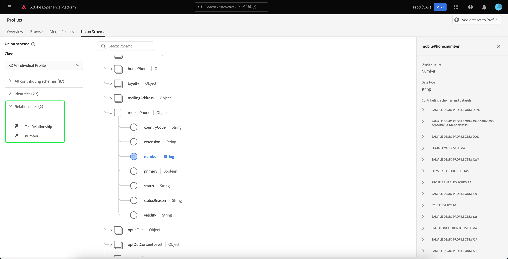

# [!UICONTROL Union schema] Användargränssnittsguide

I Adobe Experience Platform användargränssnitt kan du enkelt visa vilket unionsschema som helst i organisationen och förhandsgranska fält, identiteter, relationer och bidragande scheman för en viss klass. Den här guiden ger detaljerad information om hur du visar och utforskar unionens scheman med hjälp av plattformsgränssnittet.

## Komma igång

Användargränssnittshandboken kräver förståelse för de olika [!DNL Experience Platform] tjänster som används för att hantera kundprofildata i realtid. Innan du läser den här handboken eller arbetar i användargränssnittet bör du läsa dokumentationen för följande tjänster:

* [[!DNL Real-time Customer Profile]](../home.md): Ger en enhetlig konsumentprofil i realtid baserad på aggregerade data från flera källor.
* [[!DNL Identity Service]](../../identity-service/home.md): Aktiverar [!DNL Real-time Customer Profile] genom att överbrygga identiteter från olika datakällor när de hämtas in till [!DNL Platform].
* [[!DNL Experience Data Model (XDM)]](../../xdm/home.md): Det standardiserade ramverk som [!DNL Platform] organiserar kundupplevelsedata.

## Förstå fackscheman

Med kundprofilen i realtid kan ni skapa robusta, centraliserade profiler med kundattribut och tidsstämplade händelser för varje kundinteraktion i alla system som är integrerade med Adobe Experience Platform. Format och struktur för dessa data tillhandahålls av XDM-scheman (Experience Data Model), där varje schema baseras på en XDM-klass och innehåller fält som är kompatibla med den klassen.

Du kan skapa scheman för flera användningsfall, som refererar till samma klass men som innehåller fält som är specifika för deras användning. När ett schema aktiveras för profilen blir det en del av ett unionsschema. Unionsscheman består med andra ord av flera scheman som delar samma klass och har aktiverats för profilen. Med unionsschemat kan du se en sammanslagning av alla fält i scheman som delar samma klass. Kundprofilen i realtid använder unionsschemat för att skapa en helhetsbild av varje enskild kund.

Att arbeta med fackliga scheman kräver en djupgående förståelse av XDM-scheman. Mer information finns här: [grunderna för schemakomposition](../../xdm/schema/composition.md).

## Visa unionskartor

Om du vill navigera till unionsscheman i plattformsgränssnittet väljer du **[!UICONTROL Profiles]** i den vänstra navigeringen väljer du **[!UICONTROL Union Schema]** -fliken. The [!UICONTROL Union Schema] öppnas för att visa unionsschemat för den valda klassen.

## Välj en klass

Om du vill visa unionsschemat för en viss XDM-klass väljer du klassen i **[!UICONTROL Class]** listruta. På grund av att inte alla klasser har union-scheman är bara klasser med union-scheman (dvs. klasser med scheman som har aktiverats för profil) tillgängliga i listrutan.

När en klass har valts uppdateras det schema som visas så att det återspeglar unionsschemat för den valda klassen. Du kan till exempel välja **[!UICONTROL XDM Individual Profile]** om du vill visa unionsschemat för den klassen.

## Utforska fackscheman

Du kan utforska unionsschemat genom att rulla uppåt och nedåt för att visa hela schemastrukturen och genom att välja en höger vinkelparentes (`>`) för att expandera kapslade fält.

Markera ett fält om du vill visa information om det, inklusive visningsnamn, datatyp, beskrivning, sökväg, datum när det skapades och senaste ändringsdatum. Du kan även visa en lista med medverkande scheman som innehåller det fält du har markerat.

När du väljer namnet på ett bidragsgivande schema visas namnen på de datauppsättningar som är relaterade till det schemat som samlar in data i det valda fältet. Varje datauppsättningsnamn visas som en länk. Om du väljer ett datauppsättningsnamn öppnas aktivitetsfliken för den datauppsättningen i ett nytt fönster.

Mer information om datauppsättningar, inklusive att visa datauppsättningsaktivitet och förhandsgranska datauppsättningsdata i användargränssnittet, finns på [gränssnittshandbok för datauppsättningar](../../catalog/datasets/user-guide.md).

## Visa bidragande scheman

Du kan också visa vilka specifika scheman som bidrar till unionsschemat genom att välja **[!UICONTROL All contributing schemas]** om du vill expandera listan med scheman. Beroende på vilken klass du har valt och hur många scheman din organisation har skapat inom Platform kan det vara en kort lista som innehåller ett enda schema eller en lång lista med många scheman.

Om du väljer namnet på ett specifikt schema markeras de fält i det föreningsschema som är en del av det schema du valde. När ett schema har valts visas unionsschemat nedtonat med svarta fält som anger vilka fält som är en del av det medverkande schemat.

## Visa identiteter

Genom användargränssnittet kan du visa en lista över identiteter som ingår i unionsschemat genom att välja **[!UICONTROL Identities]** för att utöka listan.

Om du väljer en enskild identitet från listan uppdateras det visade schemat automatiskt efter behov för att visa identitetsfältet. Detta kan inkludera att utöka flera fält om identitetsfältet är kapslat.

Identitetsfältet markeras i unionsschemat och informationen om identiteten visas till höger på skärmen. Detaljerna innehåller en lista med scheman som innehåller identitetsfältet och du kan gå nedåt för att hitta länkar till datauppsättningar relaterade till det schemat som samlar in data i det valda identitetsfältet.

## Visa relationer

Med unionsschemats användargränssnitt kan du även se relationer som har definierats för scheman baserat på den valda schemaklassen. Att definiera en relation är ett sätt att koppla samman två scheman som tillhör olika klasser för att få mer komplexa insikter i kunddata.

Om relationer har etablerats för den valda klassen väljer du **[!UICONTROL Relationships]** visar en lista med fält som används för att skapa relationer. Alla scheman använder inte eller behöver definierade relationer, så det är vanligt att avsnittet Relationer inte innehåller några fält.

Om du vill veta mer om schemarelationer, inklusive hur du definierar dem med användargränssnittet, går du till [det här dokumentet om schemarelationer](../../xdm/tutorials/relationship-ui.md).

Om du väljer ett relationsfält från listan uppdateras det visade schemat efter behov för att visa det markerade relationsfältet. Detta kan inkludera att expandera flera fält om relationsfältet är kapslat.

## Nästa steg

Genom att läsa den här guiden kan du nu visa och navigera i fackliga scheman med [!DNL Experience Platform] Gränssnitt. Mer information om scheman, inklusive hur de används i hela plattformen, får du om du börjar med att läsa [XDM - systemöversikt](../../xdm/home.md).
