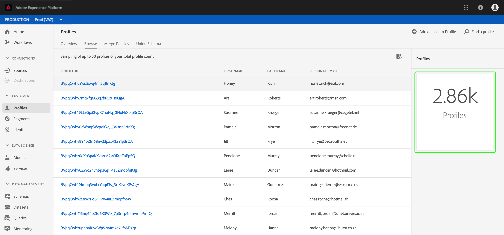
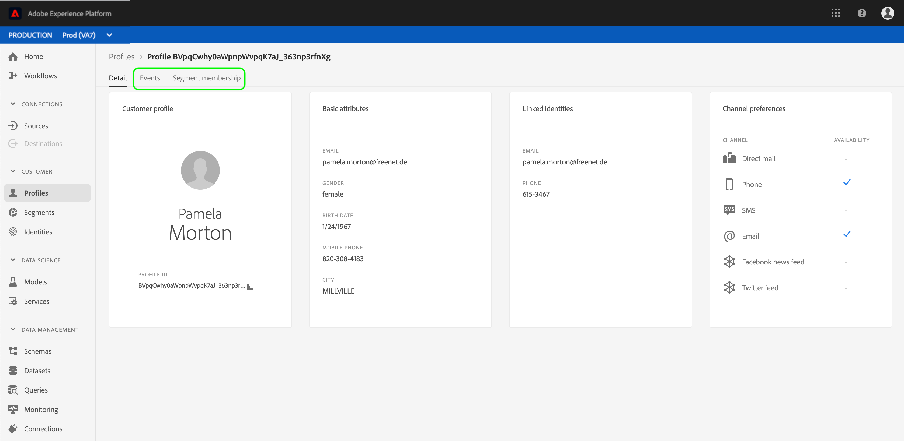

# Användarhandbok för kundprofil i realtid

Kundprofilen i realtid skapar en helhetsbild av varje enskild kund och kombinerar data från flera kanaler, inklusive online-, offline-, CRM- och tredjepartsdata.

Det här dokumentet är en guide för interaktion med kundprofiler i realtid i användargränssnittet för Adobe Experience Platform.

## Komma igång

Den här användarhandboken kräver förståelse för de olika Experience Platform-tjänster som används för att hantera kundprofilen i realtid. Innan du läser den här användarhandboken bör du läsa dokumentationen för följande tjänster:

* [Kundprofil](../home.md)i realtid: Ger en enhetlig konsumentprofil i realtid baserad på aggregerade data från flera källor.
* [Identitetstjänst](../../identity-service/home.md): Möjliggör kundprofil i realtid genom att överbrygga identiteter från olika datakällor som hämtas in till Platform.
* [Experience Data Model (XDM)](../../xdm/home.md): Det standardiserade ramverk som Platform använder för att organisera kundupplevelsedata.

## Profilöversikt

Klicka på [Profiler](http://platform.adobe.com)i den vänstra navigeringen i **Experience Platform-gränssnittet** för att öppna fliken _Översikt_ på arbetsytan _Profiler_ . På den här fliken visas flera widgetar med högnivåinformation om profilarkivet, inklusive den totala adresserbara målgruppen, antalet profilposter som har importerats under den senaste veckan samt statistik över framgångsrika och misslyckade poster under samma tidsperiod.

## Visa profilexempel

Klicka på **Bläddra** för att visa en exempellista över tillgängliga profiler. Det här exemplet innehåller upp till 50 profiler från det totala [profilantalet](#profile-count). Exemplen uppdateras av ett automatiskt jobb som hämtar nya profildata när de importeras. Varje listad profil visar sitt ID, förnamn, efternamn och personlig e-post. Om du klickar på ID:t för en listad profil visas information om profilen i [profilvisningsprogrammet](#profile-viewer).

Du kan anpassa de attribut som visas i listan genom att klicka på ikonen för kolumnväljaren. Då visas en listruta med gemensamma profilattribut som du kan lägga till eller ta bort.

### Profilantal {#profile-count}

Profilantalet visar det totala antalet profiler din organisation har inom Experience Platform, efter att organisationens standardpolicy för sammanfogning har sammanfogats med profilfragment för att utgöra en enda profil för varje enskild kund. Med andra ord kan din organisation ha flera profilfragment kopplade till en enskild kund som interagerar med ert varumärke i olika kanaler, men dessa fragment skulle slås samman (enligt standardprincipen för sammanslagning) och skulle returnera antalet&quot;1&quot;-profil eftersom de alla är kopplade till samma individ.

Profilantalet omfattar även både profiler med attribut (postdata) och profiler (till exempel Adobe Analytics-profiler) som endast innehåller data för tidsserier (händelse). Antalet uppdateras regelbundet för att ge ett aktuellt totalt antal profiler inom plattformen. Varje gång ett antal profiler ökar eller minskar med mer än 5 %, utlöses ett jobb automatiskt för att uppdatera antalet. Om din organisation använder direktuppspelningsinmatning schemaläggs jobb att köras varje timme för att hämta nya inmatade data.

### Profilsökning

Om du känner till en länkad identitet för en viss profil (till exempel dess e-postadress) kan du slå upp den profilen genom att klicka på **Sök efter en profil**. Det här är det mest tillförlitliga sättet att komma åt en viss profil, oavsett om den visas i listan med exempel eller inte.

I den dialogruta som visas väljer du ett lämpligt ID-namnutrymme i listrutan (&quot;E-post&quot; i det här exemplet) och anger ID-värdet nedan innan du klickar på **OK**. Om det hittas visas information om målprofilen i profilvisningsprogrammet, vilket beskrivs i nästa avsnitt.

### Profilvisningsprogram {#profile-viewer}

När du väljer eller söker efter en viss profil öppnas skärmen _Detalj_ i profilvisningsprogrammet. På den här sidan visas information om den valda profilen, t.ex. profilens grundläggande attribut, länkade identiteter och tillgängliga kontaktkanaler. Profilinformationen som visas har sammanfogats från flera profilfragment till en enda vy över den enskilda kunden.

Profilvisningsprogrammet innehåller även flikar som gör att du kan visa händelser och segmentmedlemskap som är kopplade till den här profilen, om det finns några.

## Sammanfoga profiler

Klicka på **Sammanfoga profiler** för att visa en lista över sammanfogningsprinciper som tillhör din organisation. Varje listad princip visar sitt namn, oavsett om det är standardprincipen för sammanslagning eller inte, och det schema som den gäller för.

Mer information om hur du arbetar med sammanfogningsprinciper i användargränssnittet finns i [Användarhandboken](merge-policies.md)för sammanfogningsprinciper.

## Unionsschema

Klicka på **unionsschema** för att visa föreningsscheman för ditt profildatalager. Ett unionsschema är en kombination av alla XDM-fält (Experience Data Model) under samma klass, vars scheman har aktiverats för användning i kundprofilen i realtid. Klicka på en klass i den vänstra listan för att visa strukturen för dess unionsschema på arbetsytan.

Mer information om fackliga scheman och deras roll i kundprofilen i realtid finns i avsnittet om fackliga scheman i guiden [för](../../xdm/schema/composition.md) schemakomposition.

## Nästa steg

Genom att läsa den här guiden kan du nu visa och hantera dina profildata med Experience Platform-gränssnittet. Mer information om hur du använder kundprofildata i realtid för att generera målgruppssegment finns i [segmenteringsdokumentationen](../../segmentation/home.md).