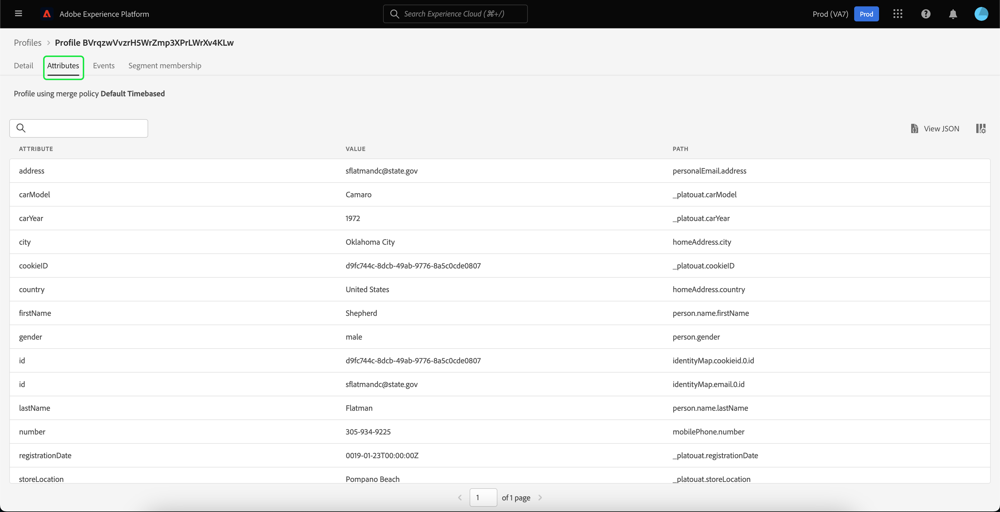

# [!DNL Real-Time Customer Profile] Användargränssnittsguide

[!DNL Real-Time Customer Profile] skapar en helhetsbild av var och en av era enskilda kunder och kombinerar data från flera kanaler, inklusive online-, offline-, CRM- och tredjepartsdata. Det här dokumentet är en guide till interaktion med [!DNL Real-Time Customer Profile] data i Adobe Experience Platform användargränssnitt.

## Komma igång

Användargränssnittshandboken kräver förståelse för de olika [!DNL Experience Platform] tjänster som ingår i hantering av [!DNL Real-Time Customer Profiles]. Innan du läser den här handboken eller arbetar i användargränssnittet bör du läsa dokumentationen för följande tjänster:

* [[!DNL Real-Time Customer Profile] översikt](../home.md): Ger en enhetlig konsumentprofil i realtid baserad på aggregerade data från flera källor.
* [[!DNL Identity Service]](../../identity-service/home.md): Aktiverar [!DNL Real-Time Customer Profile] genom att överbrygga identiteter från olika datakällor när de hämtas in till [!DNL Platform].
* [[!DNL Experience Data Model (XDM)]](../../xdm/home.md): Det standardiserade ramverk som [!DNL Platform] organiserar kundupplevelsedata.

## [!UICONTROL Overview]

I användargränssnittet för Experience Platform väljer du **[!UICONTROL Profiles]** i den vänstra navigeringen för att öppna **[!UICONTROL Overview]** -fliken som visar profilkontrollpanelen.

>[!NOTE]
>
>Om din organisation inte har använt Platform tidigare och ännu inte har några aktiva profildatauppsättningar eller sammanfogningsprinciper har skapats kan [!UICONTROL Profiles] Kontrollpanelen visas inte. I stället [!UICONTROL Overview] På fliken visas länkar och dokumentation som hjälper dig att komma igång med kundprofilen i realtid.

### Kontrollpanel för profil {#profile-dashboard}

På profilkontrollpanelen visas viktiga mätvärden för din organisations profildata.

Mer information finns på [guide för profilkontrollpanel](../../dashboards/guides/profiles.md).

## [!UICONTROL Browse] tabbvärden

Välj **[!UICONTROL Browse]** om du vill visa flera mätvärden som är relaterade till organisationens profildata. Du kan även använda den här fliken för att bläddra i profilarkivet med hjälp av en sammanfogningsprincip eller en identitet, vilket beskrivs i nästa avsnitt i den här handboken.

Till höger på sidan **[!UICONTROL Browse]** -fliken är [antal profiler](#profile-count) samt en förteckning över [profiler efter namnutrymme](#profiles-by-namespace).

>[!NOTE]
>
>Profilmåtten kan skilja sig från måtten på [profilkontrollpanel](#profile-dashboard) eftersom de utvärderas med din organisations standardpolicy för sammanfogning. Mer information om hur du arbetar med sammanfogningsprinciper, inklusive hur du definierar en standardsammanfogningsprincip, finns i [sammanfogningsprinciper - översikt](../merge-policies/overview.md).

Förutom dessa mått innehåller det här avsnittet ett senaste uppdaterat datum och tid som visar när mätvärdena senast utvärderades.

### Profilantal {#profile-count}

Profilantalet visar det totala antalet profiler som din organisation har i Experience Platform, efter att organisationens standardpolicy för sammanfogning har sammanfogats med profilfragment för att bilda en enda profil för varje enskild kund. Med andra ord kan din organisation ha flera profilfragment kopplade till en enskild kund som interagerar med ert varumärke i olika kanaler, men dessa fragment skulle slås samman (enligt standardprincipen för sammanslagning) och skulle returnera antalet&quot;1&quot;-profil eftersom de alla är kopplade till samma individ.

Profilantalet omfattar även både profiler med attribut (postdata) och profiler som endast innehåller tidsseriedata (händelsedata), t.ex. Adobe Analytics-profiler. Profilantalet uppdateras regelbundet för att ge ett aktuellt totalt antal profiler inom plattformen.

#### Uppdaterar måttet för antal profiler

När man får in uppgifter i [!DNL Profile] butik ökar eller minskar antalet med mer än 5 %, ett jobb utlöses för att uppdatera antalet. För arbetsflöden med direktuppspelningsdata görs en timkontroll för att avgöra om tröskelvärdet på 5 % har uppnåtts eller ej. Om så är fallet utlöses ett jobb automatiskt för att uppdatera antalet profiler. Om tröskelvärdet på 5 % ökning eller minskning är uppfyllt, körs ett jobb för att uppdatera profilantalet för batchintag inom 15 minuter efter att en batch har importerats till profilbutiken.

### [!UICONTROL Profiles by namespace] {#profiles-by-namespace}

The **[!UICONTROL Profiles by namespace]** med mätvärden visas det totala antalet och uppdelningen av namnutrymmen för alla sammanfogade profiler i din profilbutik. Det totala antalet profiler per namnutrymme (med andra ord, om de värden som visas för varje namnutrymme läggs ihop) kommer alltid att vara högre än det för antalet profiler, eftersom en profil kan ha flera namnutrymmen kopplade till sig. Om en kund till exempel interagerar med varumärket i mer än en kanal kommer flera namnutrymmen att kopplas till den enskilda kunden.

#### Uppdaterar [!UICONTROL Profiles by namespace] mått

Liknar [antal profiler](#profile-count) mätvärden, när man får in data i [!DNL Profile] butik ökar eller minskar antalet med mer än 5 %, ett jobb utlöses för att uppdatera namnutrymmesmåtten. För arbetsflöden med direktuppspelningsdata görs en timkontroll för att avgöra om tröskelvärdet på 5 % har uppnåtts eller ej. Om så är fallet utlöses ett jobb automatiskt för att uppdatera antalet profiler. För batchförtäring, inom 15 minuter efter lyckat intag av en sats i [!DNL Profile] om tröskelvärdet på 5 % för ökning eller minskning uppnås, körs ett jobb för att uppdatera måtten.

## Använd [!UICONTROL Browse] flik för att visa profiler

På **[!UICONTROL Browse]** kan du visa exempelprofiler med hjälp av en sammanfogningsprincip eller leta upp specifika profiler med hjälp av ett identitetsnamnutrymme och värde.

### Bläddra efter [!UICONTROL Merge policy]

The **[!UICONTROL Browse]** är som standard inställd på standardprincipen för sammanfogning för din organisation. Om du vill välja en annan sammanfogningsprincip väljer du `X` bredvid sammanfogningsprincipnamnet och använd sedan väljaren för att öppna **[!UICONTROL Select merge policy]** -dialogrutan.

>[!NOTE]
>
>Om ingen sammanfogningsprincip är vald använder du väljarknappen bredvid **[!UICONTROL Merge policy]** för att öppna urvalsdialogrutan.

Välj en sammanfogningsprincip på **[!UICONTROL Select merge policy]** markerar du alternativknappen bredvid principnamnet och använder sedan **[!UICONTROL Select]** för att gå tillbaka till [!UICONTROL Browse] -fliken. Du kan sedan välja **[!UICONTROL View]** om du vill uppdatera exempelprofilerna och se ett exempel på profiler med den nya sammanfogningsprincipen.

Profilerna som visas representerar ett urval på upp till 20 profiler från din organisations profilbutik efter att den valda sammanfogningsprincipen har tillämpats. Exempelprofilerna för den valda sammanfogningsprincipen uppdateras när nya data läggs till i din organisations profilarkiv.

Om du vill visa information om en av exempelprofilerna väljer du **[!UICONTROL Profile ID]**. Mer information finns i avsnittet senare i den här guiden på [visa profilinformation](#profile-detail).

Mer information om kopplingsprofiler och deras roll inom plattformen finns i [sammanfogningsprinciper - översikt](../merge-policies/overview.md).

### Bläddra efter [!UICONTROL Identity] {#browse-identity}

På **[!UICONTROL Browse]** kan du använda ett ID-namnutrymme för att leta upp en viss profil med hjälp av ett identitetsvärde. Om du bläddrar efter en identitet måste du ange en sammanfogningsprincip, ett identitetsnamnutrymme och ett identitetsvärde.

Om det behövs använder du **[!UICONTROL Merge policy]** för att öppna **[!UICONTROL Select merge policy]** och välj den sammanfogningsprincip som du vill använda.

Använd sedan **[!UICONTROL Identity namespace]** för att öppna **[!UICONTROL Select identity namespace]** och välj det namnutrymme som du vill söka efter. Om din organisation har många namnutrymmen kan du använda sökfältet i dialogrutan för att börja skriva namnet på ett namnutrymme.

Du kan markera ett namnutrymme om du vill visa mer information eller välja ett namnutrymme genom att markera alternativknappen. Du kan sedan använda **[!UICONTROL Select]** för att fortsätta.

När du har valt en [!UICONTROL Identity namespace] och återgå till [!UICONTROL Browse] kan du ange en **[!UICONTROL Identity value]** relaterat till det namnutrymme som du valde.

>[!NOTE]
>
>Det här värdet är specifikt för en enskild kundprofil och måste vara en giltig post för det angivna namnutrymmet. Om du t.ex. väljer identitetsnamnet&quot;E-post&quot; krävs ett identitetsvärde i form av en giltig e-postadress.

När ett värde har angetts väljer du **[!UICONTROL View]** och en enda profil som matchar värdet returneras. Välj **[!UICONTROL Profile ID]** om du vill visa profilinformationen.

## Visa profilinformation {#profile-detail}

När du har valt en **[!UICONTROL Profile ID]**, **[!UICONTROL Detail]** -fliken öppnas. Profilinformationen som visas på **[!UICONTROL Detail]** har sammanfogats från flera profilfragment till en enda vy över den enskilda kunden. Detta inkluderar kundinformation som grundläggande attribut, länkade identiteter och kanalinställningar.

Standardfälten som visas kan också ändras på organisationsnivå för att visa de önskade profilattributen. Läs mer om hur du anpassar dessa fält, inklusive steg-för-steg-instruktioner om hur du lägger till och tar bort attribut och ändrar storlek på kontrollpaneler i [guide för anpassning av profildetaljer](profile-customization.md).

Du kan visa ytterligare information om den enskilda kundprofilen genom att välja en annan av de tillgängliga flikarna. Dessa flikar innehåller attribut, händelser och fliken för segmentmedlemskap som visar de segment som profilen är kvalificerad för just nu.

### Fliken Attribut

The **[!UICONTROL Attributes]** I finns en listvy där du kan sammanfatta alla attribut som hör till en enskild profil, efter att den angivna sammanfogningsprincipen har tillämpats.

Dessa attribut kan också visas som ett JSON-objekt genom att välja **[!UICONTROL View JSON]**. Detta är praktiskt för alla användare som bättre vill förstå hur profilattributen hämtas till Platform.

### Fliken Händelser

The **[!UICONTROL Events]** -fliken innehåller data från de 100 senaste ExperienceEvents som är associerade med kunden. Dessa data kan inkludera öppning av e-post, kundvagnsaktiviteter och sidvyer. Markera **[!UICONTROL View all]** för varje enskild händelse innehåller ytterligare fält och värden som hämtas som en del av händelsen.

Händelser kan också visas som ett JSON-objekt genom att välja att **[!UICONTROL View JSON]**. Detta är praktiskt när du vill veta hur händelser hämtas i Platform.

### Fliken Segmentmedlemskap

The **[!UICONTROL Segment membership]** I visas en lista med namn och beskrivning av segment som den enskilda kundprofilen för närvarande tillhör. Listan uppdateras automatiskt när profilen kvalificerar sig eller utgår från segment. Det totala antalet segment som profilen är kvalificerad för visas till höger på fliken.

Mer information om segmentering i Experience Platform finns i [Adobe Experience Platform segmenteringstjänstens dokumentation](../../segmentation/home.md).

## Sammanfoga profiler

Från huvudsidan **[!UICONTROL Profiles]** väljer du **[!UICONTROL Merge Policies]** om du vill visa en lista med sammanfogningsprinciper som tillhör din organisation. Varje listad princip visar sitt namn, oavsett om det är standardprincipen för sammanslagning eller inte, och schemaklassen som den gäller för.

Mer information om sammanfogningsprinciper finns i [sammanfogningsprinciper - översikt](../merge-policies/overview.md).

## Unionsschema {#union-schema}

Från huvudsidan **[!UICONTROL Profiles]** väljer du **[!UICONTROL Union Schema]** om du vill visa tillgängliga unionsscheman för dina inkapslade data. Ett unionsschema är en kombination av alla [!DNL Experience Data Model] (XDM) fält under samma klass, vars scheman har aktiverats för användning i [!DNL Real-Time Customer Profile].

Mer information om fackliga scheman finns på [gränssnittshandbok för union av schema](union-schema.md).

## Nästa steg

Genom att läsa den här guiden kan du visa och hantera din organisations profildata med hjälp av användargränssnittet i Experience Platform. Mer information om hur du arbetar med profildata med Experience Platform API:er finns i [API-guide för kundprofil i realtid](../api/overview.md).
