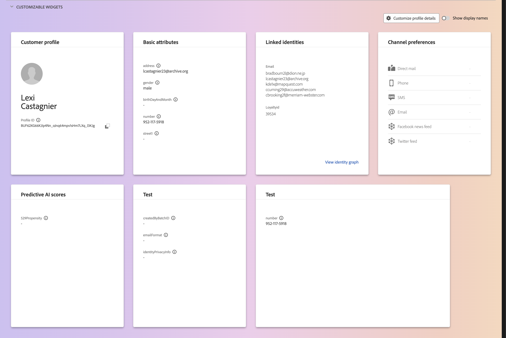

# Användargränssnittshandbok för [!DNL Real-Time Customer Profile]

[!DNL Real-Time Customer Profile] skapar en helhetsbild av varje enskild kund och kombinerar data från flera kanaler, inklusive online-, offline-, CRM- och tredjepartsdata. Det här dokumentet fungerar som en guide för interaktion med [!DNL Real-Time Customer Profile]-data i Adobe Experience Platform användargränssnitt.

## Komma igång

Den här gränssnittshandboken kräver förståelse för de olika [!DNL Experience Platform]-tjänsterna som används för att hantera [!DNL Real-Time Customer Profiles]. Innan du läser den här handboken eller arbetar i användargränssnittet bör du läsa dokumentationen för följande tjänster:

* [[!DNL Real-Time Customer Profile] översikt](../home.md): Tillhandahåller en enhetlig konsumentprofil i realtid baserad på aggregerade data från flera källor.
* [[!DNL Identity Service]](../../identity-service/home.md): Aktiverar [!DNL Real-Time Customer Profile] genom att brygga identiteter från olika datakällor när de hämtas till [!DNL Experience Platform].
* [[!DNL Experience Data Model (XDM)]](../../xdm/home.md): Det standardiserade ramverket som [!DNL Experience Platform] organiserar kundupplevelsedata med.

## [!UICONTROL Overview]

I Experience Platform-gränssnittet väljer du **[!UICONTROL Profiles]** i den vänstra navigeringen för att öppna fliken **[!UICONTROL Overview]** med profilkontrollpanelen.

>[!NOTE]
>
>Om din organisation inte har använt Experience Platform tidigare och ännu inte har några aktiva profildatauppsättningar eller sammanslagningsprinciper skapade, visas inte instrumentpanelen [!UICONTROL Profiles]. Istället visar fliken [!UICONTROL Overview] länkar och dokumentation som hjälper dig att komma igång med kundprofilen i realtid.

### Kontrollpanel för profil {#profile-dashboard}

På profilkontrollpanelen visas viktiga mätvärden för din organisations profildata.

Mer information finns i [profilkontrollpanelsguiden](../../dashboards/guides/profiles.md).

## Fliken [!UICONTROL Browse]

På fliken **[!UICONTROL Browse]** kan du visa dina profiler antingen i vyn **kort** eller i vyn **diagram** genom att välja växlingsknappen.

Dessutom kan du bläddra bland dina profiler med hjälp av en sammanfogningsprincip eller leta upp specifika profiler med hjälp av ett identitetsnamnutrymme och värde.

### Bläddra efter [!UICONTROL Merge policy]

Fliken **[!UICONTROL Browse]** är som standard inställd på en sammanfogningsprincip för din organisation. Om du vill välja en annan sammanfogningsprincip markerar du `X` bredvid sammanfogningsprincipnamnet och använder sedan väljaren för att öppna dialogrutan **[!UICONTROL Select merge policy]**.

>[!NOTE]
>
>Om ingen sammanfogningsprincip är markerad använder du väljarknappen bredvid fältet **[!UICONTROL Merge policy]** för att öppna markeringsdialogrutan.

Om du vill välja en sammanfogningsprincip i dialogrutan **[!UICONTROL Select merge policy]** markerar du alternativknappen bredvid principnamnet och använder sedan **[!UICONTROL Select]** för att gå tillbaka till fliken [!UICONTROL Browse]. Du kan sedan välja **[!UICONTROL View]** om du vill uppdatera exempelprofilerna och se ett exempel på profiler med den nya sammanfogningsprincipen.

Profilerna som visas representerar ett urval på upp till 20 profiler från din organisations profilbutik efter att den valda sammanfogningsprincipen har tillämpats. Exempelprofilerna för den valda sammanfogningsprincipen uppdateras när nya data läggs till i organisationens profilarkiv.

Om du vill visa information om en av exempelprofilerna väljer du **[!UICONTROL Profile ID]**. Mer information finns i avsnittet om att [visa profilinformation](#profile-detail) senare i den här handboken.

Mer information om sammanfogningsprinciper och deras roll i Experience Platform finns i [översikten över sammanfogningsprinciper](../merge-policies/overview.md).

### Bläddra efter [!UICONTROL Identity] {#browse-identity}

På fliken **[!UICONTROL Browse]** kan du använda ett ID-namnutrymme för att söka efter en viss profil med hjälp av ett identitetsvärde. Om du bläddrar efter en identitet måste du ange en sammanfogningsprincip, ett identitetsnamnutrymme och ett identitetsvärde.

Om det behövs kan du använda väljaren **[!UICONTROL Merge policy]** för att öppna dialogrutan **[!UICONTROL Select merge policy]** och välja den sammanfogningsprincip som du vill använda.

Använd sedan väljaren **[!UICONTROL Identity namespace]** för att öppna dialogrutan **[!UICONTROL Select identity namespace]** och välj det namnutrymme som du vill söka efter. Om din organisation har många namnutrymmen kan du använda sökfältet i dialogrutan för att börja skriva namnet på ett namnutrymme.

Du kan markera ett namnutrymme om du vill visa mer information eller välja ett namnutrymme genom att markera alternativknappen. Du kan sedan använda **[!UICONTROL Select]** för att fortsätta.

När du har valt en [!UICONTROL Identity namespace] och återgår till fliken [!UICONTROL Browse] kan du ange en **[!UICONTROL Identity value]** som är relaterad till det markerade namnutrymmet.

>[!NOTE]
>
>Det här värdet är specifikt för en enskild kundprofil och måste vara en giltig post för det angivna namnutrymmet. Om du t.ex. väljer identitetsnamnet&quot;E-post&quot; krävs ett identitetsvärde i form av en giltig e-postadress.

När ett värde har angetts väljer du **[!UICONTROL View]** och en enda profil som matchar värdet returneras. Välj **[!UICONTROL Profile ID]** om du vill visa en profil.

## Visa profil {#view-profile}

>[!CONTEXTUALHELP]
>id="platform_errors_uplib_201001_404"
>title="Enheten hittades inte"
>abstract="Detta innebär att Experience Platform inte kunde hitta den begärda entiteten. Försök med någon av följande lösningar för att åtgärda felet:<ul><li>Kontrollera att rätt profil-ID finns i URL:en för den entitet du försöker få åtkomst till.</li><li>Kontrollera att du har rätt kombination av organisation och sandlåda för den enhet du försöker få åtkomst till.</li></ul>"

När du har valt **[!UICONTROL Profile ID]** öppnas fliken **[!UICONTROL Detail]**. Profilinformationen som visas på fliken **[!UICONTROL Detail]** har sammanfogats från flera profilfragment till en enda vy över den enskilda kunden. Detta inkluderar kundinformation som grundläggande attribut, länkade identiteter och kanalinställningar.

Dessutom kan du visa annan information om profiler, till exempel dess [attribut](#attributes), [händelser](#events) och [målgruppsmedlemskap](#audience-membership).

### Fliken Detaljer {#profile-detail}

Fliken **[!UICONTROL Details]** innehåller mer detaljerad information om den valda profilen och är indelad i fyra avsnitt: Kundprofilsinsikter, AI-insikter, anpassningsbara widgetar och automatiskt klassificerade widgetar.

Dessutom kan du växla om de AI-genererade insikterna ska visas, visa information för nav jämfört med kant samt visa informationen i diagramvyn.

#### Kundprofilsinsikter {#customer-profile-insights}

I avsnittet **[!UICONTROL Customer profile insights]** visas en kort introduktion till profilens attribut. Detta inkluderar profil-ID, e-post, telefonnummer, kön, födelsedatum samt identiteten och målgruppsmedlemskap för profilen.

#### AI insight-widgetar {#ai-insight-widgets}

Avsnittet **[!UICONTROL AI insight widgets]** visar widgetar som genereras av AI. Dessa widgetar ger snabba insikter om profilen, baserat på profildata som demografi (till exempel ålder, kön eller plats), användarbeteenden (till exempel inköpshistorik, webbplatsaktivitet eller engagemang i sociala medier) samt psykografi (till exempel intressen, preferenser eller livsstilar). Alla AI-widgetar använder data som **redan** finns i profilen.

#### Anpassningsbara widgetar {#customizable-widgets}

I avsnittet **[!UICONTROL Customizable widgets]** visas widgetar som du kan anpassa efter dina affärsbehov. Du kan gruppera attribut i separata widgetar, ta bort oönskade widgetar eller justera widgetarnas layout.

Standardfälten som visas kan också ändras på organisationsnivå för att visa de önskade profilattributen. Om du vill veta mer om hur du anpassar de här fälten, inklusive steg-för-steg-instruktioner om hur du lägger till och tar bort attribut och ändrar storlek på kontrollpaneler, kan du läsa [anpassningsguiden för profildetaljer](profile-customization.md).

Du kan också växla mellan att visa attributnamnen som visningsnamn och fältsökvägsnamn. Om du vill växla mellan dessa två skärmar väljer du alternativet **[!UICONTROL Show display names]**.

#### Automatiskt klassificerade widgetar {#auto-classified-widgets}

Avsnittet **[!UICONTROL Auto-classified widgets]** visar widgetar som utnyttjar unionsschemat för att avgöra vilka källfältsgrupper ett attribut tillhör, vilket ger en tydligare kontext om varifrån data kommer. Du kan använda sökfältet för att enklare söka efter nyckelord i dina widgetar.

Dessa widgetar kombinerar både händelsedata (med Experience-händelsewidgeten) och attributdata, så att du får en enhetlig vy över din profil. Du kan använda de här widgetarna för att utforska strukturen för din profils data för att bättre strukturera dina [anpassningsbara widgetar](#customizable-widgets).

>[!NOTE]
>
>Om det finns flera källfältsgrupper kommer widgetarna endast att använda **ett** av de tillgängliga alternativen.

### Fliken Attribut {#attributes}

Fliken **[!UICONTROL Attributes]** innehåller en listvy med en sammanfattning av alla attribut som hör till en enskild profil, efter att den angivna sammanfogningsprincipen har tillämpats.

Dessa attribut kan också visas som ett JSON-objekt genom att välja till **[!UICONTROL View JSON]**. Detta är praktiskt för alla som vill förstå hur profilattributen importeras till Experience Platform.

Om du vill visa de attribut som är tillgängliga på Edge väljer du **[!UICONTROL Edge]** i dataplatsväljaren.

Mer information om kantprofiler finns i [dokumentationen för kantprofiler](../edge-profiles.md).

### Fliken Händelser {#events}

Fliken **[!UICONTROL Events]** innehåller data från de 100 senaste ExperienceEvents som är associerade med kunden. Dessa data kan inkludera öppning av e-post, kundvagnsaktiviteter och sidvyer. Om du väljer **[!UICONTROL View all]** för en enskild händelse hämtas ytterligare fält och värden som en del av händelsen.

Händelser kan också visas som ett JSON-objekt genom att välja till **[!UICONTROL View JSON]**. Detta är praktiskt när du vill veta hur händelser spelas in i Experience Platform.

### Fliken Målgruppsmedlemskap {#audience-membership}

Fliken **[!UICONTROL Audience membership]** visar en lista med namn och beskrivning av målgrupper som den enskilda kundprofilen för närvarande tillhör. Listan uppdateras automatiskt när profilen kvalificerar sig eller upphör att gälla. Det totala antalet målgrupper som profilen är kvalificerad för visas till höger på fliken.

Mer information om segmentering i Experience Platform finns i [dokumentationen för Experience Platform segmenteringstjänst](../../segmentation/home.md).

Om du vill visa målgruppsmedlemskapet för de profiler som är tillgängliga på Edge väljer du **[!UICONTROL Edge]** i dataplatsväljaren. Mer information om kantsegmentering finns i [kantsegmenteringsguiden](../../segmentation/methods/edge-segmentation.md).

## Sammanfoga profiler

På huvudmenyn **[!UICONTROL Profiles]** väljer du fliken **[!UICONTROL Merge Policies]** för att visa en lista över sammanfogningsprinciper som tillhör din organisation. Varje listad princip visar sitt namn, oavsett om det är standardprincipen för sammanslagning eller inte, och schemaklassen som den gäller för.

Mer information om sammanfogningsprinciper finns i [översikten över sammanfogningsprinciper](../merge-policies/overview.md).

## Unionsschema {#union-schema}

På huvudmenyn **[!UICONTROL Profiles]** väljer du fliken **[!UICONTROL Union Schema]** för att visa tillgängliga unionsscheman för dina inkapslade data. Ett unionsschema är en sammanslagning av alla [!DNL Experience Data Model] (XDM)-fält under samma klass, vars scheman har aktiverats för användning i [!DNL Real-Time Customer Profile].

Mer information om unionsscheman finns i [gränssnittsguiden för unionsscheman](union-schema.md).

## Beräknade attribut {#computed-attributes}

På huvudmenyn **[!UICONTROL Profiles]** väljer du fliken **[!UICONTROL Computed attributes]** för att visa en lista över beräknade attribut som tillhör din organisation.

Mer information om beräknade attribut finns i [översikten över beräknade attribut](../computed-attributes/overview.md). Mer information om hur du använder beräknade attribut i Experience Platform-gränssnittet finns i [användargränssnittshandboken för beräknade attribut](../computed-attributes/ui.md).

## Nästa steg

Genom att läsa den här guiden kan du visa och hantera din organisations profildata med hjälp av Experience Platform användargränssnitt. Mer information om hur du arbetar med profildata med Experience Platform API:er finns i [API-handboken för kundprofiler i realtid](../api/overview.md).
