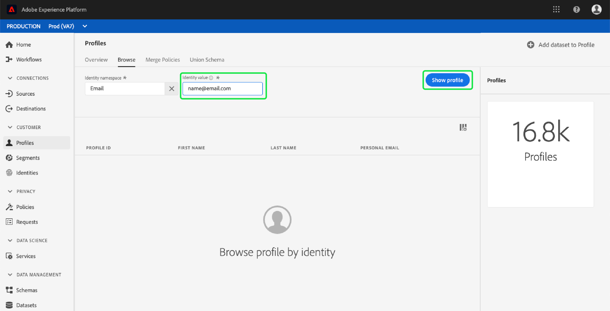

# [!DNL Real-time Customer Profile] användarhandbok

[!DNL Real-time Customer Profile] skapar en helhetsbild av var och en av era enskilda kunder och kombinerar data från flera kanaler, inklusive online-, offline-, CRM- och tredjepartsdata.

Det här dokumentet fungerar som en guide för interaktion med [!DNL Real-time Customer Profile] i Adobe Experience Platform användargränssnitt.

## Komma igång

Den här användarhandboken kräver förståelse för de olika [!DNL Experience Platform] tjänsterna som är kopplade till hantering [!DNL Real-time Customer Profiles]. Innan du läser den här användarhandboken bör du läsa dokumentationen för följande tjänster:

* [!DNL Real-time Customer Profile](../home.md): Ger en enhetlig konsumentprofil i realtid baserad på aggregerade data från flera källor.
* [!DNL Identity Service](../../identity-service/home.md): Möjliggör [!DNL Real-time Customer Profile] genom att överbrygga identiteter från olika datakällor när de hämtas till [!DNL Platform].
* [!DNL Experience Data Model (XDM)](../../xdm/home.md): Det standardiserade ramverket som [!DNL Platform] organiserar kundupplevelsedata.

## Översikt

Klicka i [!DNL Experience Platform UI](http://platform.adobe.com)den vänstra navigeringen **[!UICONTROL Profiles]** för att öppna _[!UICONTROL Overview]_fliken. På den här fliken finns länkar till dokumentation och videoklipp som hjälper dig att förstå och börja arbeta med profiler.

## Bläddra

Välj fliken för att bläddra bland profiler efter identitet. *[!UICONTROL Browse]*

### Profilmått {#profile-metrics}

Till höger på *[!UICONTROL Browse]* fliken finns flera viktiga mätvärden för dina profildata, inklusive det totala [profilantalet](#profile-count) samt en lista över [profiler per namnutrymme](#profiles-by-namespace).

Dessa profilvärden utvärderas med organisationens standardpolicy för sammanfogning. Mer information om hur du arbetar med sammanfogningsprinciper, inklusive hur du definierar en standardsammanfogningsprincip, finns i användarhandboken för [sammanfogningsprinciper](merge-policies.md).

Förutom dessa mått innehåller avsnittet Profilmått även ett *senast uppdaterat* datum och tid som visar när mätvärdena senast utvärderades.

### Profilantal {#profile-count}

Profilantalet visar det totala antalet profiler som din organisation har i [!DNL Experience Platform], efter att din organisations standardpolicy för sammanfogning har sammanfogat profilfragment till en enda profil för varje enskild kund. Med andra ord kan din organisation ha flera profilfragment kopplade till en enskild kund som interagerar med ert varumärke i olika kanaler, men dessa fragment skulle slås samman (enligt standardprincipen för sammanslagning) och skulle returnera antalet&quot;1&quot;-profil eftersom de alla är kopplade till samma individ.

Profilantalet omfattar även både profiler med attribut (postdata) och profiler som endast innehåller tidsseriedata (händelsedata), t.ex. Adobe Analytics-profiler. Profilantalet uppdateras regelbundet för att ge ett aktuellt totalt antal profiler inom plattformen.

När inmatningen av poster i [!DNL Profile Store] ökar eller minskar antalet med mer än 5 %, utlöses ett jobb för att uppdatera antalet. För arbetsflöden med direktuppspelningsdata görs en timkontroll för att avgöra om tröskelvärdet på 5 % har uppnåtts eller ej. Om så är fallet utlöses ett jobb automatiskt för att uppdatera antalet profiler. Om tröskelvärdet på 5 % ökning eller minskning uppnås, körs ett jobb för att uppdatera profilantalet för batchintag inom 15 minuter efter att en batch har importerats till profilarkivet.

### Profiler efter namnområde {#profiles-by-namespace}

I måttet visas det totala antalet och den totala uppdelningen av namnutrymmen för alla sammanfogade profiler i din profilbutik. *[!UICONTROL Profiles by namespace]* Det totala antalet profiler per namnutrymme (med andra ord, om de värden som visas för varje namnutrymme läggs ihop) kommer alltid att vara högre än det för antalet profiler, eftersom en profil kan ha flera namnutrymmen kopplade till sig. Om en kund till exempel interagerar med varumärket i mer än en kanal kommer flera namnutrymmen att kopplas till den enskilda kunden.

På samma sätt som för [profilräknemeterialet](#profile-count) , när inmatningen av poster i [!DNL Profile Store] ökar eller minskar antalet med mer än 5 %, utlöses ett jobb för att uppdatera namnområdesmåtten. För arbetsflöden med direktuppspelningsdata görs en timkontroll för att avgöra om tröskelvärdet på 5 % har uppnåtts eller ej. Om så är fallet utlöses ett jobb automatiskt för att uppdatera antalet profiler. Om tröskelvärdet på 5 % ökning eller minskning uppnås, körs ett jobb för att uppdatera mätvärdena för batchintag inom 15 minuter efter att en sats har importerats till [!DNL Profile Store].

### Kopplingsprincip

Väljaren väljer automatiskt **[!UICONTROL Merge policy]** standardprincip för sammanslagning för din organisation. Om du inte vill använda den sammanfogningsprincipen kan du välja `X` bredvid standardsammanfogningsprincipen för att öppna en *[!UICONTROL Select merge policy]* dialogruta där du kan välja en annan sammanfogningsprincip. Mer information om sammanfogningsprinciper finns i [användarhandboken](merge-policies.md)för sammanfogningsprinciper.

### Namnutrymme för identitet

Väljaren öppnar en dialogruta där du kan välja det identitetsnamnutrymme som du vill söka efter, och du kan anpassa de attribut som visas i sökningen genom att markera filterikonen och välja vilka attribut du vill lägga till eller ta bort. **[!UICONTROL Identity namespace]**

I *[!UICONTROL Select identity namespace]* dialogrutan väljer du det namnutrymme som du vill söka efter, eller använder **[!UICONTROL Search]** fältet i dialogrutan för att skriva namnet på ett namnutrymme. Du kan markera ett namnutrymme om du vill visa mer information, och när du har hittat namnutrymmet kan du markera alternativknappen och trycka på **[!UICONTROL Select]** för att fortsätta.

### Identitetsvärde

När du har valt ett **[!UICONTROL Identity namespace]** alternativ återgår du till den *[!UICONTROL Browse]* flik där du kan ange ett **[!UICONTROL Identity value]**. Det här värdet är specifikt för en enskild kundprofil och måste vara en giltig post för det angivna namnutrymmet. Om du till exempel väljer **[!UICONTROL Identity namespace]** &quot;E-post&quot; måste du ange en giltig e-postadress **[!UICONTROL Identity value]** i form av en giltig e-postadress.

När ett värde har angetts, väljer du **[!UICONTROL Show profile]** och returnerar en enda profil som matchar värdet. Välj det här alternativet om du **[!UICONTROL Profile ID]** vill visa profilinformationen.

### Profilinformation {#profile-detail}

När du väljer **[!UICONTROL Profile ID]**&#x200B;öppnas _[!UICONTROL Detail]_fliken. På den här sidan visas information om den valda profilen, inklusive grundläggande attribut, länkade identiteter och tillgängliga kontaktkanaler. Profilinformationen som visas har sammanfogats från flera profilfragment till en enda vy över den enskilda kunden.

Du kan visa ytterligare information om profilen inklusive *[!UICONTROL Attributes]*, *[!UICONTROL Events]* och *[!UICONTROL Segments]* till vilken profilen är medlem.

## Sammanfoga profiler

Välj fliken *[!UICONTROL Merge Policies]* om du vill visa en lista över sammanfogningsprinciper som tillhör din organisation. Varje listad princip visar sitt namn, oavsett om det är standardprincipen för sammanslagning eller inte, och det schema som den gäller för.

Mer information om sammanfogningsprinciper finns i [användarhandboken](merge-policies.md)för sammanfogningsprinciper.

## Unionsschema

Välj fliken *Unionsschema* för att visa föreningsscheman för din [!DNL Profile Store]. Ett unionsschema är en kombination av alla [!DNL Experience Data Model] (XDM) fält under samma klass, vars scheman har aktiverats för användning i [!DNL Real-time Customer Profile]. Välj en klass i den vänstra listan för att visa strukturen för dess unionsschema på arbetsytan.

Om du t.ex. väljer &quot;[!DNL XDM Profile]&quot; visas föreningsschemat för [!DNL XDM Individual Profile] klassen.

Mer information om unionsscheman och deras roll i [schemakompositionsguiden](../../xdm/schema/composition.md) finns i avsnittet om unionsscheman [!DNL Real-time Customer Profile].

## Nästa steg

Genom att läsa den här guiden kan du nu visa och hantera dina [!DNL Profile] data med hjälp av [!DNL Experience Platform] användargränssnittet. Mer information om hur du använder [!DNL Real-time Customer Profile] data för att generera målgruppssegment finns i [Segmenteringsdokumentationen](../../segmentation/home.md).